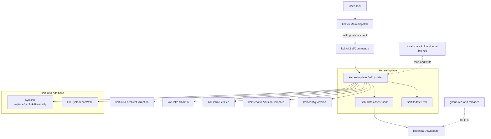
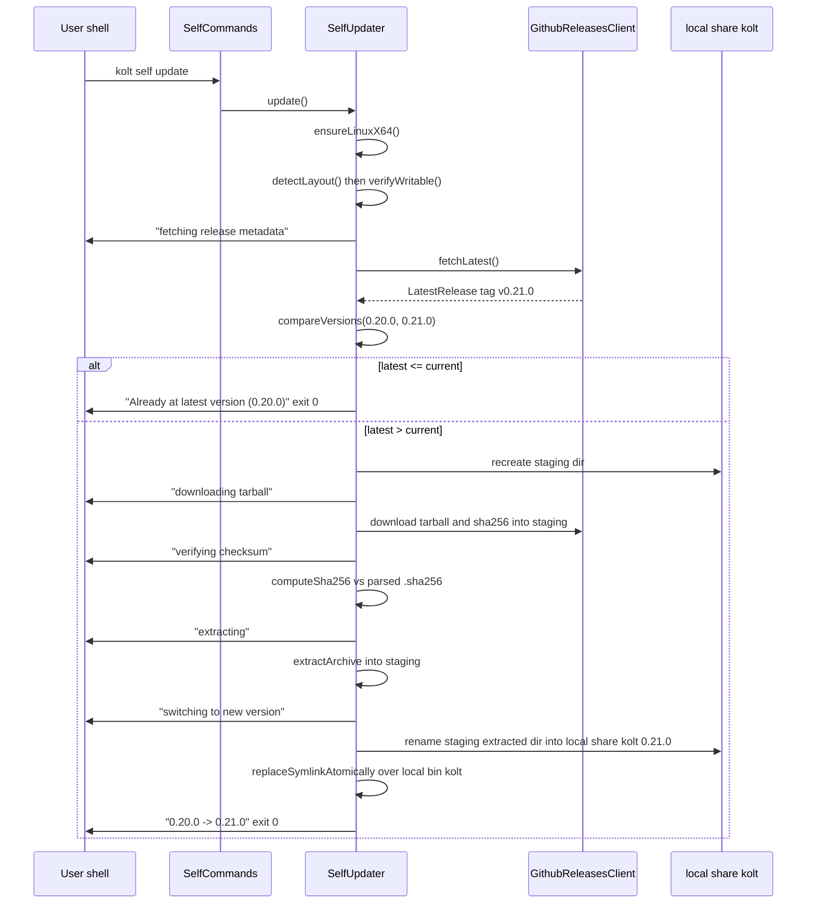
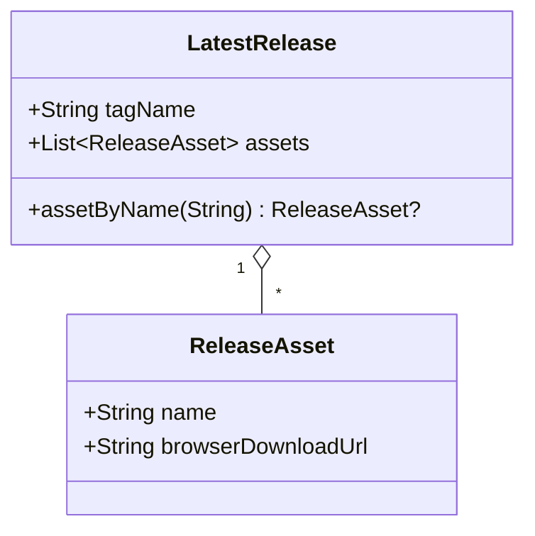

# Technical Design — 27-self-update (圧縮版)

## Overview

`kolt self update` および `kolt self update --check` を追加し、 installer spec が確立した `~/.local/share/kolt/<ver>/bin/kolt` + `~/.local/bin/kolt` symlink のレイアウト上で kolt 単一バイナリを GitHub Releases の最新安定版に自己置換する。 本 spec は **install.sh が POSIX sh で持つのと同等のスコープ** を Kotlin/Native に実装する。 install.sh wrapper にしないのは macOS / linuxArm64 対応時に platform 分岐をネイティブ側で一元管理するため。 install.sh が持たない防衛機構 (並行 advisory lock / SIGINT 中断回復 / layout 網羅分類) は priority: nice の本機能には過剰として scope 外。

Users: installer 経由で kolt を入れた個人開発者・小規模チーム。 Impact: kolt CLI に新規サブコマンド群 `kolt self` を導入し、 新規 package `kolt.selfupdate` を切る (5 ファイル)。 daemon thin jar は release tarball の `libexec/` に同梱されるため、 symlink 切替 1 回でバイナリと daemon が同期更新される。 daemon ↔ binary 版整合性は既存 socket fingerprint が自動隔離するため self-update 側に daemon 専用ロジックは持たない。

### Goals
- 1 コマンドで最新安定版を取得・検証・配置し `~/.local/bin/kolt` を切り替える。
- `releases/latest` の prerelease 自動除外 + `vX.Y.Z` regex で「安定版のみ」を契約化。
- 失敗を Requirement 7 の 3 カテゴリ + 包括 catch にマッピングし、 メッセージなしの非ゼロ終了をしない。

### Non-Goals
- macOS / linuxArm64 (runtime gate で「未対応」と判定し即抜ける。 `expect-actual` 差し替えは macOS port 時の別 spec)。
- 任意バージョン指定 / ダウングレード / プレリリース追従。
- 旧バージョン dir の自動削除 / rollback。
- 並行 `kolt self update` の advisory lock。
- SIGINT / kill 中断からの専用回復ロジック (中断で残った staging dir は、 その pid が生存していなければ次回実行が best-effort で掃除する。 中断検出機構そのものは持たない)。
- layout 非一致の網羅的分類 (単一判定に留める)。
- `XDG_DATA_HOME` honor (`$HOME` のみ、 installer 整合)。

## Boundary Commitments

### This Spec Owns
- `kolt self update` / `kolt self update --check` の CLI surface (dispatch、 usage、 不明フラグ拒否、 終了コード規約)。
- `releases/latest` の参照、 `tag_name` の `vX.Y.Z` 形式検証、 現バージョンとの semver 比較。
- 対応リリース成果物 (`kolt-<ver>-linux-x64.tar.gz` + 同 `.sha256`) の取得・SHA-256 検証・展開。
- 自プロセス専用の一時ディレクトリ `~/.local/share/kolt/.staging-<pid>/` の使用 (自 pid dir を作り直す → download → verify → extract → rename)。 生存 pid の `.staging-*` には触れず、 死んだ pid のものは best-effort 掃除。
- `~/.local/bin/kolt` の symlink 切替 (`symlink(2)` で一時 symlink → `rename(2)` で上書き、 1 回)。
- installer layout の単一判定 (`~/.local/bin/kolt` が `~/.local/share/kolt/<ver>/bin/kolt` 配下を指す symlink か) + 書き込み権限プローブ + 非対応の拒否。
- 自己更新固有のエラーカテゴリ (`SelfUpdateError` sealed ADT、 粗粒度)。

### Out of Boundary
- installer spec が所有する disk layout / tarball 内部構造 / `~/.local/bin/kolt` 初期作成。
- release workflow が所有する成果物 publish と prerelease マーキング。
- 既存 `kolt.infra.Downloader` の HTTPS GET 機構そのもの。
- daemon ↔ binary 版整合性 (既存 socket fingerprint が自動解決)。
- 並行排他 / 中断回復 / 旧 dir cleanup / layout 細分類 / 進捗 % 表示。

### Allowed Dependencies
- `kolt.infra.Downloader.downloadFile(url, destPath, headers)` — テンポラリパスへの HTTPS ストリーミング書き込み。
- `kolt.infra.Sha256.computeSha256(filePath)` — SHA-256 計算。
- `kolt.infra.ArchiveExtraction.extractArchive(archivePath, destDir)` — `ARCHIVE_EXTRACT_PERM` 保持、 absolute path / `..` は libarchive が reject。
- `kolt.infra.FileSystem` 既存操作 + 本 spec で追加する `canWrite(path): Boolean` (`access(path, W_OK)`)。
- `kolt.infra.SelfExe.readSelfExe()` — 実行中バイナリの解決パス。
- 本 spec で追加する `kolt.infra.Symlink.replaceSymlinkAtomically(linkPath, newTarget): Result<Unit, SymlinkError>`。
- `kolt.config.homeDirectory()` / `KOLT_VERSION` / `versionString()`。
- `kolt.resolve.VersionCompare.compareVersions(a, b)` — semver 比較。
- `kotlinx.serialization.json.Json` — `releases/latest` デコード (nativeMain では `GradleMetadata` / `Lockfile` が前例)。
- `kolt.infra` の `readFileAsString` / `deleteRecursively` 相当 (staging の作り直しと `.sha256` 読み取り)。

### Revalidation Triggers
- installer spec が disk layout を変更 → `InstallerLayout` 判定と path 組み立てを再検証。
- release workflow が成果物命名 / `.sha256` 形式 / prerelease マーキングを変更 → `GithubReleasesClient` と検証ロジックを再検証。
- `KOLT_VERSION` の出力形式が `kolt <semver>` から変化 → 比較対象抽出を再検証。
- `Downloader` の API (特に `headers`) が変化 → User-Agent 送出経路を再検証。

## Architecture

### Existing Architecture Analysis
- CLI dispatch は `Main.kt` の `when (filteredArgs[0])` + `KNOWN_SUBCOMMANDS_SORTED`。 ネストは `doTool` / `doToolchain` が `args.drop(1)` で再 dispatch する前例。
- infra primitives (Downloader / Sha256 / ArchiveExtraction / SelfExe) はすべて既存。
- package direction は `cli → build → resolve / infra`。 本 spec は `cli → selfupdate → infra` のノードを足す。
- daemon は `daemonInputsFingerprint` でソケットを版隔離するため、 self-update が daemon を stop する必要なし。

### Architecture Pattern & Boundary Map



**Key decisions**:
- 新規 package `kolt.selfupdate` は `SelfUpdater` / `SelfUpdateError` / `GithubReleasesClient` の 3 ファイルのみ。 platform gate・layout 検出・staging lifecycle は `SelfUpdater` 内の `internal` 関数に内包し、 専用クラスにしない (圧縮判断)。 `SelfUpdateError` を `kolt.cli` に置かない package direction 整合のため package は分離する。
- HTTPS API 取得は既存 `Downloader.downloadFile` を temp path に対して呼び、 `readFileAsString` で読み直す。 GET-to-memory variant は追加しない。
- **Gating order**: `--check` は `ensureLinuxX64() → fetchLatest() → compare → 表示` (layout 判定なし・書き込みゼロ)。 `update` は `ensureLinuxX64() → detectLayout() → verifyWritable() → fetchLatest() → compare → (necessaryなら) download/verify/extract/swap`。 platform を最初に置くのは Requirement 6.2 の制約。 layout gate は書き込みを伴う `update` 経路のみ (Requirement 5.1、 `--check` は layout 非依存で version だけ答える)。 advisory lock は持たないため lock 起因の順序制約はない。
- staging は `SelfUpdater` 内で「自 pid の `~/.local/share/kolt/.staging-<pid>/` を `deleteRecursively` してから `mkdir` → download → verify → extract → `rename` で確定」。 lock も cleanup 専用クラスも持たないが、 (1) pid 別ディレクトリで並行プロセスの相互破壊を防ぎ、 (2) 起動時に死んだ pid の `.staging-*` を `kill(pid, 0)` 判定で best-effort 削除して残骸累積を防ぐ (Requirement 4.5)。
- platform gate は現状 linuxX64 単系統ビルドのため `uname(2)` の `sysname == "Linux"` && `machine in {x86_64, amd64}` の wide assertion。 macOS port 時に `expect-actual` へ差し替える seam としてのみ存在。

### Technology Stack

| Layer | Choice / Version | Role in Feature | Notes |
|-------|------------------|-----------------|-------|
| CLI | `kolt.cli.Main` + 新規 `kolt.cli.SelfCommands` | `kolt self ...` の dispatch + usage | `KNOWN_SUBCOMMANDS_SORTED` に `"self"` 追加。 `doTool` パターン踏襲。 |
| Domain | 新規 `kolt.selfupdate` (3 ファイル) | self-update オーケストレーション | `SelfUpdater` / `SelfUpdateError` / `GithubReleasesClient` |
| HTTP | 既存 `kolt.infra.Downloader` (libcurl) | HTTPS GET (API + asset + .sha256) | `headers` に `User-Agent: kolt/<KOLT_VERSION>` を載せる。 UA 未指定だと GitHub API は 403。 |
| JSON | `kotlinx-serialization-json` 1.7.3 | `releases/latest` デコード | `Json { ignoreUnknownKeys = true }`。 `GradleMetadata` / `Lockfile` が nativeMain 前例。 |
| Hash | 既存 `kolt.infra.Sha256` (`kotlincrypto.hash.sha2-256` 0.2.7) | tarball SHA-256 | `.sha256` パースは 1 行目を whitespace split (`ToolchainManager` パターン)。 |
| Archive | 既存 `kolt.infra.ArchiveExtraction` (libarchive) | tarball 展開 | `ARCHIVE_EXTRACT_PERM` で +x 保持、 SECURE フラグで逸脱パス reject。 |
| Symlink swap | 新規 `kolt.infra.Symlink.replaceSymlinkAtomically` | symlink 原子置換 | `symlink(newTarget, tmp)` + `rename(tmp, link)`。 `rename(2)` は newpath が既存 symlink でも atomic 置換 (Linux man-page)。 |
| FS probe | 新規 `kolt.infra.FileSystem.canWrite(path)` | 書き込み権限プローブ | `access(path, W_OK) == 0`。 |
| Path | 既存 `kolt.infra.FileSystem.homeDirectory()` | `$HOME` 解決 | `~/.local/share/kolt/`、 `~/.local/bin/` を組み立てる。 XDG は honor しない。 |

## File Structure Plan

### Directory Structure
```
src/nativeMain/kotlin/kolt/
├── cli/
│   ├── Main.kt                  # MODIFIED: "self" dispatch + KNOWN_SUBCOMMANDS_SORTED entry + usage line
│   └── SelfCommands.kt          # NEW: doSelf(args) - parse subcommand/flags, route to SelfUpdater, format出力
├── selfupdate/                  # NEW package (3 files)
│   ├── SelfUpdater.kt           # check() / update() orchestration + internal: ensureLinuxX64 / detectLayout / verifyWritable / runStaged
│   ├── SelfUpdateError.kt       # sealed ADT (粗粒度: Network / Metadata / Asset / Extract / Layout / Platform / Home)
│   └── GithubReleasesClient.kt  # API GET + @Serializable LatestRelease / ReleaseAsset
└── infra/
    ├── Symlink.kt               # NEW: replaceSymlinkAtomically(linkPath, newTarget): Result<Unit, SymlinkError>
    └── FileSystem.kt            # MODIFIED: add canWrite(path: String): Boolean

src/nativeTest/kotlin/kolt/
├── selfupdate/
│   ├── SelfUpdaterCheckTest.kt          # --check: update available / already latest / older / platform (layout は見ない)
│   ├── SelfUpdaterUpdateTest.kt         # update happy path + checksum mismatch + staging recreate (LoopbackHttpServer + tmp HOME)
│   ├── GithubReleasesClientTest.kt      # JSON decode + tag regex + UA header
│   └── testfixture/GithubReleasesFixture.kt   # canned JSON + tarball builder
└── infra/SymlinkTest.kt                 # replace over existing/absent/regular file
```

### Modified Files
- `src/nativeMain/kotlin/kolt/cli/Main.kt` — `when` に `"self" -> doSelf(args.drop(1))` を追加 (アルファベット順で `run` の前)、 `KNOWN_SUBCOMMANDS_SORTED` に `"self"` 挿入、 `usageLines()` に `kolt self update` 行を追加。
- `src/nativeMain/kotlin/kolt/infra/FileSystem.kt` — `fun canWrite(path: String): Boolean = access(path, W_OK) == 0` を `fileExists` の隣に追加 (`@OptIn(ExperimentalForeignApi::class)`)。

## System Flows

### Flow: `kolt self update` (`--check` は download 以降を省略した部分集合)



update の Gate 順序は `ensureLinuxX64 → detectLayout → verifyWritable → fetchLatest` で固定 (Requirement 6.2)。 自 pid の staging dir は処理開始時に `deleteRecursively` で作り直すが生存 pid の `.staging-*` には触れないため、 並行プロセスと相互干渉せず、 死んだ pid の残骸は起動時 best-effort 掃除で累積しない (Requirement 4.5)。 `replaceSymlinkAtomically` は `rename(2)` 1 回なので中断は「旧か新か」の二値以外取らない (Requirement 3.6)。 `--check` は `ensureLinuxX64 → fetchLatest → compare → 表示` で終わり、 layout 判定も staging も symlink も触らない (Requirement 2.5; 5.1 は update 限定)。

## Requirements Traceability

| Requirement | Summary | Components | Interfaces |
|-------------|---------|------------|------------|
| 1.1 | `kolt self update` 開始 | SelfCommands, SelfUpdater | `doSelf` / `update()` |
| 1.2 | `--check` モード | SelfCommands, SelfUpdater | `check()` |
| 1.3 | `kolt self` 引数なし → usage + 0 | SelfCommands | `doSelf([])` |
| 1.4 | `--help` で usage + 0 | SelfCommands | `doSelf` |
| 1.5 | 未知フラグ拒否 | SelfCommands | `doSelf` arg parser |
| 2.1 | tag `vX.Y.Z` 検証 | GithubReleasesClient | `validateTag(tag): Result<String, SelfUpdateError>` |
| 2.2 | semver 比較 | SelfUpdater | `compareVersions` |
| 2.3 | update available + 0 | SelfCommands, SelfUpdater | `CheckOutcome.UpdateAvailable` |
| 2.4 | already latest + 0 | SelfCommands, SelfUpdater | `CheckOutcome.AlreadyLatest` |
| 2.5 | `--check` 書き込みなし | SelfUpdater | `check()` read-only path |
| 2.6 | `--check` 常に exit 0 | SelfCommands | exit code mapping |
| 3.1 | update の段階順 | SelfUpdater | `update()` state machine |
| 3.2 | latest <= current で no-op + 0 | SelfUpdater | `update()` compare branch |
| 3.3 | 成功時 `<old> -> <new>` | SelfCommands | exit message formatter |
| 3.4 | 5 ステージ進捗行 | SelfUpdater | `onStage` callback |
| 3.5 | 既存 dir 削除しない | SelfUpdater | staging は自 pid `.staging-<pid>/` のみ触る |
| 3.6 | symlink を rename 1 回で切替 | Symlink.replaceSymlinkAtomically | `rename(2)` atomic |
| 4.1 | tarball + .sha256 取得 | SelfUpdater, GithubReleasesClient | `download(...)` |
| 4.2 | SHA-256 比較 | SelfUpdater, Sha256 | `verifyChecksum(...)` |
| 4.3 | 不一致で install せず非ゼロ | SelfUpdateError.Asset | error envelope |
| 4.4 | アセット欠落の名前付きエラー | SelfUpdateError.Asset | error envelope |
| 4.5 | 一時 dir 経由 + 無条件再作成 | SelfUpdater | `runStaged()` |
| 5.1 | layout 単一判定 (update のみ) | SelfUpdater | `detectLayout()` (update 経路のみ呼ぶ) |
| 5.2 | 非一致 → 案内付き拒否 (update のみ) | SelfUpdater, SelfUpdateError.Layout | `detectLayout()` |
| 5.3 | 書き込み権限なし拒否 (update のみ) | SelfUpdater, FileSystem.canWrite | `verifyWritable()` |
| 6.1 | 非対応プラットフォーム拒否 | SelfUpdater | `ensureLinuxX64()` |
| 6.2 | platform 判定が最初、 update では layout より前 | SelfUpdater | gating order |
| 7.1 | network/metadata 失敗の識別 | SelfUpdateError.Network / .Metadata | error envelope |
| 7.2 | asset 失敗の識別 | SelfUpdateError.Asset | error envelope |
| 7.3 | extract 失敗の識別 | SelfUpdateError.Extract | error envelope (symlink 不変) |
| 7.4 | 全失敗経路で人間可読メッセージ | SelfCommands | exit error formatter |

## Components and Interfaces

| Component | Domain/Layer | Intent | Req Coverage | Key Dependencies | Contracts |
|-----------|--------------|--------|--------------|------------------|-----------|
| `SelfCommands` | cli | parse + dispatch + 出力整形 | 1.1–1.5, 2.3, 2.4, 2.6, 3.3, 3.4, 7.4 | SelfUpdater (P0) | Service |
| `SelfUpdater` | selfupdate | check / update orchestration + gate 順序 + staging | 2.*, 3.*, 4.5, 5.*, 6.* | GithubReleasesClient (P0), infra primitives (P0) | Service |
| `GithubReleasesClient` | selfupdate | API GET + JSON decode + asset URL 解決 | 2.1, 4.1, 4.4, 7.1 | Downloader (P0), kotlinx.serialization (P0) | API |
| `SelfUpdateError` | selfupdate | 粗粒度 sealed ADT | 4.3, 4.4, 5.2, 5.3, 6.1, 7.* | — | State |
| `Symlink.replaceSymlinkAtomically` | infra | symlink 原子置換 | 3.6 | platform.posix.symlink/rename (P0) | Service |
| `FileSystem.canWrite` | infra | 書き込み権限プローブ | 5.3 | platform.posix.access (P0) | Service |

### selfupdate

#### SelfUpdater

| Field | Detail |
|-------|--------|
| Intent | check / update のオーケストレーション。 gate 順序・staging lifecycle を内包 |
| Requirements | 2.*, 3.*, 4.5, 5.*, 6.* |

**Responsibilities & Constraints**
- `update()` は `ensureLinuxX64()` → `detectLayout()` → `verifyWritable()` の順に gate。 `check()` は `ensureLinuxX64()` のみで `detectLayout()` / `verifyWritable()` を省略 (書き込みゼロ + layout 非依存; Requirement 2.5 / 5.1 は update 限定)。
- 進捗 5 ステージ (Requirement 3.4) は `out` lambda 経由で直接 println。
- staging (`~/.local/share/kolt/.staging-<pid>/`) は `runStaged()` 内で 自 pid dir を `deleteRecursively` → `mkdir` → download → verify → extract → `rename` 確定。 専用クラス・lock なし。 起動時に死んだ pid の `.staging-*` を `kill(pid, 0)` で best-effort 掃除 (生存 pid のものには触れない)。
- `detectLayout()` / `ensureLinuxX64()` は副作用なしの `internal` 関数として export し、 unit test から直接叩く。

**Contracts**: Service [x]

##### Service Interface
```kotlin
class SelfUpdater(
    private val releases: GithubReleasesClient,
    private val home: String,
    private val currentVersion: String = KOLT_VERSION,
    private val readSelfExe: () -> Result<String, SelfExeError> = ::readSelfExe,
    private val canWrite: (String) -> Boolean = FileSystem::canWrite,
    private val replaceSymlink: (String, String) -> Result<Unit, SymlinkError> =
        ::replaceSymlinkAtomically,
    private val out: (String) -> Unit = ::println,
) {
    fun check(): Result<CheckOutcome, SelfUpdateError>
    fun update(): Result<UpdateOutcome, SelfUpdateError>

    internal fun ensureLinuxX64(): Result<Unit, SelfUpdateError>
    internal fun detectLayout(): Result<Layout, SelfUpdateError>
    internal fun verifyWritable(layout: Layout): Result<Unit, SelfUpdateError>

    data class Layout(
        val binSymlink: String,        // ~/.local/bin/kolt
        val currentInstallDir: String, // ~/.local/share/kolt/<ver>/
        val shareRoot: String,         // ~/.local/share/kolt/
    )
}

sealed interface CheckOutcome {
    val current: String
    data class UpdateAvailable(override val current: String, val latest: String) : CheckOutcome
    data class AlreadyLatest(override val current: String) : CheckOutcome
}

sealed interface UpdateOutcome {
    data class Switched(val from: String, val to: String) : UpdateOutcome
    data class NoOp(val current: String) : UpdateOutcome
}
```

**Implementation Notes**
- Integration: `home` / `currentVersion` / `out` / 各 syscall 系を DI して unit test で観測可能化。
- Validation: gate 順序は hard-code。 `detectLayout()` は `lstat` → `readlink` → target が `<shareRoot><X.Y.Z>/bin/kolt` の文字列 prefix にマッチ、 の単一判定 (Requirement 5.1)。 非一致はすべて `SelfUpdateError.Layout` 1 種に丸め、 メッセージに実体パスと「install.sh で入れ直してください」を載せる (Requirement 5.2)。
- Risks: progress 5 行は test でスナップショット assert する。

#### GithubReleasesClient

| Field | Detail |
|-------|--------|
| Intent | `releases/latest` GET + JSON decode + asset/sha256 URL 抽出 + tag 検証 |
| Requirements | 2.1, 4.1, 4.4, 7.1 |

**Responsibilities & Constraints**
- `User-Agent: kolt/<currentVersion>` を `Downloader.headers` で必ず送出。
- `downloadFile` を kolt の既存 temp ディレクトリ規約に従った一時パス (例 `~/.local/share/kolt/.staging-<pid>/releases.json`、 staging dir を流用すれば `/tmp` 非依存) に呼び、 `readFileAsString` → `Json.decodeFromString<LatestRelease>`。 `--check` は staging を作らないので、 その場合のみ `homeDirectory()` 配下の一時パスを使う。
- `validateTag(tag)`: `^v(\d+)\.(\d+)\.(\d+)$` にマッチしなければ `SelfUpdateError.Metadata`。 マッチ時は先頭 `v` を除いた `X.Y.Z` を返す。
- アセット名で `kolt-<ver>-linux-x64.tar.gz` と `.sha256` を look up、 欠落は `SelfUpdateError.Asset` (名前付き)。
- 通信失敗 (timeout / connect / 5xx) は `SelfUpdateError.Network`、 4xx/decode 失敗は `SelfUpdateError.Metadata`。

**Contracts**: API [x]

##### Service Interface
```kotlin
class GithubReleasesClient(
    private val downloader: Downloader,
    private val userAgent: String,
    private val tempPathFactory: () -> String,
) {
    fun fetchLatest(): Result<LatestRelease, SelfUpdateError>
    fun validateTag(tagName: String): Result<String, SelfUpdateError>
}

@Serializable
data class LatestRelease(
    @SerialName("tag_name") val tagName: String,
    val assets: List<ReleaseAsset>,
) {
    fun assetByName(name: String): ReleaseAsset? = assets.firstOrNull { it.name == name }
}

@Serializable
data class ReleaseAsset(
    val name: String,
    @SerialName("browser_download_url") val browserDownloadUrl: String,
)
```

##### API Contract
| Method | Endpoint | Request | Response | Errors |
|--------|----------|---------|----------|--------|
| GET | `https://api.github.com/repos/snicmakino/kolt/releases/latest` | `User-Agent: kolt/<ver>` | `200 LatestRelease` | 403 (UA欠落), 404 (release不在), 5xx, timeout |

**Implementation Notes**
- Integration: `tempPathFactory` DI でテスト予測可能化。
- Validation: `Json { ignoreUnknownKeys = true }`。 `tag_name` 不在の decode 例外は `SelfUpdateError.Metadata` に変換。
- Risks: 非認証レート制限 (60/hr/IP) は MVP では untouched。 CI で `--check` 連打する運用は呼び出し側で間引く。

### infra

#### Symlink.replaceSymlinkAtomically

##### Service Interface
```kotlin
fun replaceSymlinkAtomically(
    linkPath: String,
    newTarget: String,
): Result<Unit, SymlinkError>

sealed interface SymlinkError {
    data class CreateFailed(val tmp: String, val errno: Int) : SymlinkError
    data class RenameFailed(val link: String, val errno: Int) : SymlinkError
}
```
**Implementation Notes**
- (a) `tmp = "${linkPath}.tmp.<pid>"`、 (b) `symlink(newTarget, tmp)`、 (c) `rename(tmp, link)`。 (c) 失敗時は (a) を `unlink` してから error。
- `rename(2)` は newpath が既存 symlink でも atomic 置換 (Linux man-page)。 ext4 / 9p (WSL2) の挙動差は実装時に 1 度実機確認。

#### FileSystem.canWrite

##### Service Interface
```kotlin
fun canWrite(path: String): Boolean = access(path, W_OK) == 0
```
- 既存 `fileExists` の隣、 `@OptIn(ExperimentalForeignApi::class)`。 TOCTOU は許容 (rename 時の EACCES と二重 gate)。

### cli

#### SelfCommands

| Field | Detail |
|-------|--------|
| Intent | `kolt self ...` の引数 parse + SelfUpdater 呼び出し + 出力フォーマット + exit code |
| Requirements | 1.1–1.5, 2.3, 2.4, 2.6, 3.3, 3.4, 7.4 |

##### Service Interface
```kotlin
fun doSelf(args: List<String>): ExitCode

sealed interface SelfInvocation {
    data object EmptyHelp : SelfInvocation       // `kolt self` 引数なし → usage, exit 0
    data object Help : SelfInvocation            // --help → usage, exit 0
    data class Update(val checkOnly: Boolean) : SelfInvocation
    data class UnknownFlag(val flag: String) : SelfInvocation
    data class UnknownSubcommand(val sub: String) : SelfInvocation
}
```
**Implementation Notes**
- `Main.kt` の `when` から `"self" -> doSelf(args.drop(1))`。
- `args.isEmpty()` → `EmptyHelp` (exit 0)。 `args[0] != "update"` → `UnknownSubcommand` (非ゼロ)。
- `SelfUpdateError` の各トップ variant を 1 行人間可読メッセージにマップ (Requirement 7.4)。

## Data Models



タグ検証は `GithubReleasesClient.validateTag` の regex (`^v(\d+)\.(\d+)\.(\d+)$`) で完結。 `compareVersions` は String を取るため独立した `SemVer` 型は持たない。

**`.sha256` format**: `<64-hex>  <filename>`。 1 行目を whitespace split して先頭採用。
**GitHub API**: `Json { ignoreUnknownKeys = true }`、 `tag_name` + `assets[].name` + `assets[].browser_download_url` のみ使用。

## Error Handling

```kotlin
sealed interface SelfUpdateError {
    data class Network(val url: String, val detail: String) : SelfUpdateError
    data class Metadata(val detail: String) : SelfUpdateError
    data class Asset(val name: String, val detail: String) : SelfUpdateError
    data class Extract(val detail: String) : SelfUpdateError
    data class Layout(val detectedPath: String, val detail: String) : SelfUpdateError
    data class Platform(val sysname: String, val machine: String) : SelfUpdateError
    data class Home(val detail: String) : SelfUpdateError
}
```

| ADT | Requirement | User-visible message (例) | Exit |
|-----|-------------|---------------------------|------|
| `Network` | 7.1 | `error: failed to reach api.github.com: <detail>` | 非ゼロ |
| `Metadata` | 7.1 | `error: GitHub releases/latest response was invalid: <detail>` | 非ゼロ |
| `Asset` | 4.3, 4.4, 7.2 | `error: release asset '<name>': <detail>` | 非ゼロ |
| `Extract` | 7.3 | `error: failed to extract update package: <detail>` (symlink 未変更) | 非ゼロ |
| `Layout` | 5.2 | `error: kolt at <detectedPath> is not an installer-managed symlink; reinstall with install.sh` | 非ゼロ |
| `Layout` (writable) | 5.3 | `error: missing write permission on <path>` | 非ゼロ |
| `Platform` | 6.1 | `error: kolt self update supports linuxX64 only (detected <sysname>/<machine>)` | 非ゼロ |
| `Home` | 7.4 | `error: $HOME is not set` | 非ゼロ |

`SelfCommands` がすべての variant を空でない人間可読文字列にマップする (Requirement 7.4)。 書き込み権限不足は `Layout` に `detail` で畳む (粗粒度方針)。

### Monitoring
CLI 単発実行のため runtime monitoring 対象外。 失敗時 stderr メッセージ + 進捗ステージの last-printed line が唯一の観測経路。

## Testing Strategy

steering tech.md の慣行 (`nativeTest/kotlin/`、 `*Test.kt`)。 subprocess CLI test の前例がないため導入しない (`doSelf` を直接呼ぶ unit test で覆う)。

### Unit Tests
- `SelfUpdaterCheckTest`: GithubReleasesClient を mock し `check()` の (a) update available、 (b) already latest (equal)、 (c) already latest (current > latest)、 (d) Platform 不一致を最初に返し fetch しない、 (e) layout 不一致でも check は version を返す (layout gate なし; Requirement 5.1 は update 限定)、 (f) 進捗・書き込み 0 (Requirement 2.5) を assert。
- `GithubReleasesClientTest`: LoopbackHttpServer で (a) 正常 decode、 (b) `tag_name` 不在 → Metadata、 (c) tag が `vX.Y.Z` 違反 → Metadata、 (d) UA が `kolt/<ver>` で送出 (`awaitAccessLog`)、 (e) アセット欠落 → Asset(name)。
- `SymlinkTest`: tmp dir で (a) linkPath 不在 → 新規、 (b) 既存 symlink → atomic 置換 (前後を `lstat`+`readlink` 観測)、 (c) newTarget 不在でも `symlink(2)` 成功、 (d) linkPath が regular file → `rename(2)` 上書き挙動を pin。
- `SelfCommandsTest`: `doSelf` の `["update"]` / `["update","--check"]` / `[]` / `["--help"]` / `["update","--x"]` / `["foo"]` を ExitCode + 出力で観測 (Requirement 1.*)。
- `SelfUpdaterLayoutTest`: tmp HOME で `update()` 経由の layout gate を検証。 (a) installer 通り → 通過、 (b) regular file / (c) dangling / (d) 外部 target は単一 `Layout`、 (e) `~/.local/share/kolt/` が `canWrite=false` は writable 系 `Layout` に落ちる (Requirement 5.1–5.3)。

### Integration Tests
- `SelfUpdaterUpdateTest`: tmp HOME + LoopbackHttpServer で end-to-end。 既存 `~/.local/share/kolt/0.20.0/bin/kolt` を fake バイナリ、 `~/.local/bin/kolt` を symlink で揃え、 `update()` 実行。 (a) 5 ステージ進捗行が順に出る、 (b) `0.21.0/bin/kolt` 作成、 (c) symlink 新 target、 (d) `0.20.0/` 残存、 (e) 自 pid `.staging-<pid>/` が成功後に削除 (Requirement 3.*, 4.*, 5.*)。
- `SelfUpdaterUpdateChecksumMismatchTest`: `.sha256` を不正値に。 `Asset` で `0.21.0/` 未作成 + symlink 未変更 (Requirement 4.3, 7.3)。
- `SelfUpdaterStagingIsolationTest`: 事前に他 pid を模した `~/.local/share/kolt/.staging-99999/` (生存しない pid) と、 別途生存 pid を模した dir を置く。 `update()` 後、 死んだ pid 分は best-effort 掃除で消え、 生存 pid 分は残存、 自 pid dir は新規作成→成功後に削除 (Requirement 4.5、 並行隔離 + 残骸非累積)。

### Performance / Load
単発 CLI 実行のため scaling 制約なし。

## Optional Sections

### Security Considerations
- SHA-256 で tarball 完全性を検証。 `.sha256` 自体の改竄 (同一 HTTPS 経路) は検出不能 — 署名検証 (TUF / Sigstore) は scope 外、 follow-up issue 候補。
- TLS は既存 `Downloader` (libcurl + openssl) に依存。
- `sudo` 自動昇格は scope 外 (Requirement 5.3 で不足を通知のみ)。
- tarball 内 `..` / absolute path は libarchive SECURE フラグが reject (memory `reference_libarchive_cinterop`)。
- 並行排他なし: 並行 `kolt self update` は install.sh を 2 つ手動実行したのと同等のベストエフォート (Out of Boundary に明記)。

### Migration Strategy
不要 (新規追加、 初回 `kolt self update` 実行時から有効)。

## Supporting References
詳細な調査経緯 (代替案、 effort 試算、 圧縮判断の rationale) は `research.md` を参照。
