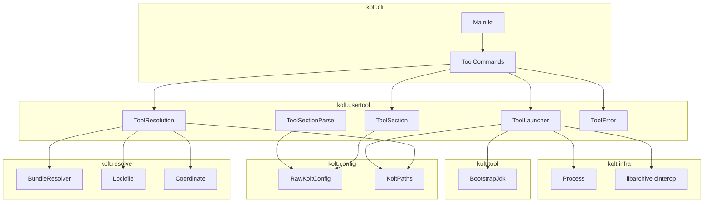
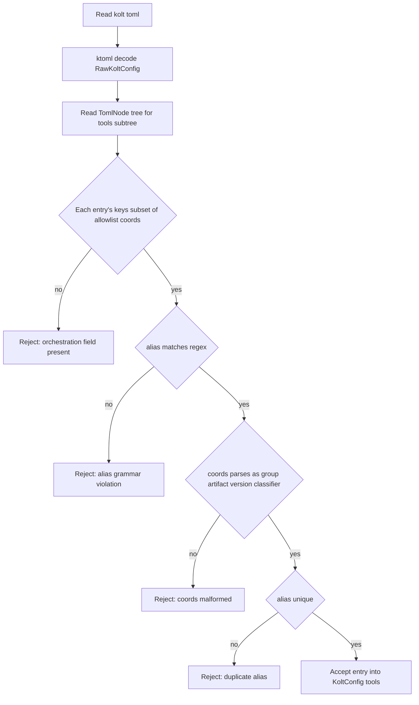

# Design Document — `[tools]` Section for Project-Pinned Executable Jars

## Overview

`[tools]` セクションは「プロジェクトに紐付くが、 プロジェクト本体の依存ではない」 runnable jar (ktlint / detekt 等) を kolt.toml に alias + Maven coordinates で宣言できるようにする機能である。 kolt は jar を **アプリの classpath とは隔離された** per-alias cache に解決し、 SHA-256 を含む形で kolt.lock に pin し、 ユーザーの呼び出し時に bootstrap JDK で `java -jar` 起動して引数を verbatim 透過する。

**Purpose**: This feature delivers per-project runnable-jar tooling to kolt users, avoiding both `[dependencies]` の classpath 汚染 と global install の版 drift。

**Users**: Kotlin 開発者で、 ktlint / detekt のような jar ツールをチームで共通 pin したいケース。

**Impact**: kolt.toml schema に新セクション、 kolt.lock format に additive な `tools_bundles` field、 CLI に `kolt tool run` subcommand を追加する。 ADR 0028 §3 凍結面が拡張される (本設計の commit と同時に ADR 改訂を land させる)。

### Goals

- alias + coordinates の `[tools]` 宣言を kolt.toml で受理し、 alias 文法と orchestration ガードレールを parse-time に loud reject する
- `kolt tool run <alias> [args]` で per-alias cache に解決した runnable jar を `java -jar` で起動、 引数 verbatim 透過、 exit code そのまま伝播
- 解決済 coordinates と SHA-256 を kolt.lock に pin し、 lockfile と kolt.toml の矛盾は loud reject (silent overwrite しない)
- jar 起動失敗を **resolve / Main-Class / launch** の 3 系統に cause-distinguishable に surface する (kolt 自身の exit code で識別可能)
- bootstrap JDK 経路で起動 (host PATH の `java` には依存しない)

### Non-Goals

- `[hooks]` (#119) との連携。 `[hooks]` が landing したら別 spec で扱う
- distribution-zip / launcher-script 形式のツール (kotlinc-style)
- 短縮構文 (`ktlint = "1.3.1"`) と組み込み name → coords レジストリ
- グローバルインストール (`~/.kolt/bin/`)
- ツールごとに別 JDK version を要求する schema (将来 v1.1 以降の additive 拡張対象)
- 依存性のある jar (transitive を必要とするツール) のサポート — fat-jar / runnable jar のみ

## Boundary Commitments

### This Spec Owns

- kolt.toml の `[tools.<alias>]` schema 定義と parse・validation
- alias 文法 (regex) と orchestration field 拒否ルール
- `~/.kolt/tools/bundles/<alias>/<version>/` 配下の per-alias cache layout
- kolt.lock の `tools_bundles` field 形と round-trip serialization
- `kolt tool run <alias> [-- args...]` CLI surface とその dispatch
- jar 起動失敗の cause-distinguishable な exit code mapping (`ToolError` sealed)
- `META-INF/MANIFEST.MF` からの Main-Class 抽出 (libarchive cinterop)
- 起動 JDK の選択 (v1 は bootstrap JDK 固定)

### Out of Boundary

- `[dependencies]` / `[test-dependencies]` / `[classpaths]` 配下の解決経路 (本 spec は触らない)
- daemon (JVM / native) 関連の挙動 (本 spec のツール起動は subprocess、 daemon は使わない)
- bootstrap JDK 自体の provisioning (`ensureBootstrapJavaBin` を adopt するだけで、 install logic 変更なし)
- Maven repo の URL 構築・SHA-256 検証 primitives (`kolt.resolve` 既存 API を adopt)
- 既存 `~/.kolt/tools/<filename>` flat layout (kolt-internal 用 ktfmt / junit-console。 本 spec は別 layout `~/.kolt/tools/bundles/` を新設して衝突回避)
- `[hooks]` (#119) integration、 lifecycle event 自動連携
- ツールごと JDK pin / native ツール起動 / Windows 対応

### Allowed Dependencies

- **Upstream (この spec が依存)**:
  - `kolt.config` (RawKoltConfig 拡張、 KoltPaths 拡張)
  - `kolt.resolve` (`BundleResolver` の transitive-skip 起動経路、 `Lockfile` field 拡張、 `Coordinate`、 path/URL builder、 SHA-256 verify)
  - `kolt.tool` (toolchain JDK provisioning — `ensureBootstrapJavaBin`)
  - `kolt.infra` (`Process.executeCommand`、 file I/O)
  - libarchive cinterop (zip read for MANIFEST.MF)
- **Downstream (この spec を消費)**:
  - `kolt.cli.ToolCommands` (本 spec が新設、 `Main.kt` から dispatch)
- 違反禁止: `kolt.usertool` から `kolt.cli` への依存 (cli → build → resolve の方向逆転)、 `kolt.usertool` から daemon backend への依存

### Revalidation Triggers

ADR 0028 §3 凍結面に同時に複数 surface を加えるため、 以下のいずれかが変わったら依存 spec / consumer を revalidate する必要がある:

- alias 文法 regex の変更 (現在の宣言を無効化する narrow は不可)
- `tools_bundles` lockfile field 形の変更 (additive 以外)
- `~/.kolt/tools/bundles/<alias>/<version>/` cache layout の変更
- `kolt tool run` CLI surface の変更 (subcommand 形 / `--`-passthrough 規約)
- `ToolError` exit code mapping の変更 (user 契約)
- bootstrap JDK fallback ポリシー変更 (例: ツールごと JDK pin 導入)

## Architecture

### Existing Architecture Analysis

kolt は **native-first CLI + JVM sidecar daemon** 構成。 user-facing binary は `kolt.kexe` (Kotlin/Native linuxX64)。 既存依存解決 (`kolt.resolve`) は POM + Gradle metadata + transitive fixpoint + SHA-256 verify を備え、 `BundleResolver` は `[classpaths.<name>]` 用に bundle isolation 経路 (子 graph を独立 fixpoint 化) を提供している。 lockfile (`kolt.lock`) は v4 JSON で、 nested map (`classpathBundles: Map<String, Map<String, LockEntry>>`) の precedent を持つ。 JDK 取り扱いは `kolt.tool` で `ensureBootstrapJavaBin` (固定 version 25) と `ensureJdkBins(version)` の 2 経路。 jar 起動は既に `executeCommand(args, extraEnv)` で subprocess fork、 引数 verbatim、 exit code propagation が確立済 (ktfmt / junit-console / daemon jar 起動で再利用中)。

`kolt.tool` package 名は既存で **toolchain provisioning 専用** (kotlinc / JDK / konanc / kolt-internal 用 `ensureTool`)。 本 spec の新コードは package `kolt.usertool` に置き、 命名衝突を避ける (`[tools]` config section 名と package 名は直交、 内部実装で混同しない)。

### Architecture Pattern & Boundary Map



**Architecture Integration**:

- **Selected pattern**: layered native-first CLI、 cli → usertool → (config / resolve / tool / infra)。 既存の cli → build → resolve 方向と整合
- **Domain boundaries**: `kolt.usertool` は jar 取得 + 起動 のみ。 orchestration / lifecycle 連携は明示的に持たず、 R7 の境界をパッケージ境界として表現
- **Existing patterns preserved**: `BundleResolver` の bundle-isolation 経路、 `LockEntry(version, sha256, ...)` schema、 `executeCommand(args, env)` launch、 `Result<V, E>` error handling
- **New components rationale**: ToolSectionParse は ktoml AST レベルの strict-key 検証が必要 (R7.1/R7.2)、 ToolLauncher は libarchive 経路での MANIFEST.MF 読みが新規 (R5.2)
- **Steering compliance**: ADR 0001 (Result-based error handling)、 ADR 0017 (bootstrap JDK)、 ADR 0028 §3 (凍結面追加)、 ADR 0031 (libarchive 採用) に準拠

### Technology Stack

| Layer | Choice / Version | Role in Feature | Notes |
|---|---|---|---|
| CLI | `kolt.kexe` Kotlin/Native linuxX64 | `kolt tool run <alias>` dispatch | `Main.kt` の `when` に case 追加 |
| Config schema | ktoml-core 0.7.x | `[tools]` table parse | `ignoreUnknownNames=true` 既定。 strict-key validation は AST scan で別経路 |
| Resolution | `kolt.resolve.BundleResolver` (kotlin-result 2.x) | transitive-skip mode で単一 jar 解決 + SHA-256 verify | 既存 fixpointResolve に childLookup={emptyList} を渡して transitive 抑止 |
| Lockfile | kotlinx.serialization JSON v4 | `tools_bundles` field 追加 | additive。 `classpathBundles` と同 nested 形 |
| Cache | `~/.kolt/tools/bundles/<alias>/<version>/<filename>` | per-alias 隔離 layout | 既存 `~/.kolt/tools/<filename>` flat (kolt-internal 用) と分離 |
| JDK | bootstrap JDK 25 (`ensureBootstrapJavaBin`) | jar 起動の `java` 解決 | v1 は固定。 ツールごと JDK pin は将来 |
| Process | `kolt.infra.Process.executeCommand` | fork/execvp + 引数 verbatim + exit code 透過 | 既存 |
| Manifest read | libarchive cinterop (ADR 0031) | jar 内 `META-INF/MANIFEST.MF` から Main-Class 抽出 | zip read API を utility 関数に薄く wrap |

## File Structure Plan

### Directory Structure

```
src/nativeMain/kotlin/kolt/usertool/
├── ToolSection.kt              # KoltConfig.tools の公開型 (ToolSection, ToolEntry)
├── ToolSectionParse.kt         # ktoml deserialize + AST strict-key check + alias regex
├── ToolResolution.kt           # BundleResolver 連携 (transitive-skip) + cache layout + lockfile pin/read
├── ToolLauncher.kt             # libarchive で MANIFEST 読 + bootstrap JDK 解決 + executeCommand
└── ToolError.kt                # sealed class、 cause-distinguishable な exit code mapping

src/nativeMain/kotlin/kolt/cli/
└── ToolCommands.kt             # `doTool(args)` 関数: `kolt tool run <alias> [-- args...]` dispatch

src/nativeTest/kotlin/kolt/usertool/
├── ToolSectionParseTest.kt     # alias 文法 / orchestration field reject / coords 形 round-trip
├── ToolResolutionTest.kt       # cache hit / miss / SHA-256 mismatch / lockfile round-trip
├── ToolLauncherTest.kt         # MANIFEST 読 / Main-Class missing / non-runnable jar / JDK missing
└── ToolErrorTest.kt            # exit code mapping coverage

src/nativeTest/kotlin/kolt/cli/
└── ToolCommandsTest.kt         # `--`-passthrough / unknown alias / 引数 verbatim
```

### Modified Files

- `src/nativeMain/kotlin/kolt/config/Config.kt`
  - `RawKoltConfig` に `tools: Map<String, RawToolEntry>?` field 追加 (ktoml deserialize)
  - `KoltConfig` に `tools: Map<String, ToolEntry>` field 追加 (validated)
  - `validateConfig` chain に `validateToolSection` 呼び出しを追加
- `src/nativeMain/kotlin/kolt/config/KoltPaths.kt`
  - `fun toolsBundleDir(alias: String, version: String): String`
  - `fun toolsBundleJarPath(alias: String, version: String, fileName: String): String`
- `src/nativeMain/kotlin/kolt/resolve/Lockfile.kt`
  - `Lockfile` data class に `toolsBundles: Map<String, Map<String, LockEntry>> = emptyMap()` 追加
  - `LockfileJson` 拡張、 `parseLockfile` / `serializeLockfile` round-trip 対応
- `src/nativeMain/kotlin/kolt/resolve/BundleResolver.kt`
  - transitive-skip 起動経路を export (内部関数 `resolveSingleArtifact` か、 既存 `resolveBundle` に `transitive: Boolean = true` flag を追加)
- `src/nativeMain/kotlin/kolt/cli/Main.kt`
  - `when (filteredArgs[0])` に `"tool"` case 追加
  - `printUsage()` に `kolt tool run <alias> [-- args...]` の help text 追加
- `src/nativeMain/kotlin/kolt/cli/DependencyCommands.kt`
  - `doUpdateInner` を [tools] にも対応するよう拡張 (`config.tools` を seed として `BundleResolver.resolveSingleArtifact` を回し、 `Lockfile.toolsBundles` を rewrite)。 R4.3 の唯一の更新経路
- `src/nativeMain/kotlin/kolt/cli/ExitCode.kt`
  - `EXIT_TOOL_ERROR = 7` の追加 (jar 起動の失敗系 — Main-Class missing / non-runnable / JDK unavailable)
- `src/nativeTest/kotlin/kolt/resolve/LockfileTest.kt`
  - `toolsBundles` round-trip テストを既存 `classpathBundles` テスト構造に揃えて追加

### New Tests Outside `usertool/`

- `src/nativeTest/kotlin/kolt/config/ToolSectionConfigTest.kt`
  - `KoltConfig.tools` が parse 結果に正しく反映されること、 重複 alias の reject

## System Flows

### `kolt tool run <alias>` 起動フロー

```mermaid
sequenceDiagram
    autonumber
    participant U as User
    participant Main as Main
    participant TC as ToolCommands
    participant TR as ToolResolution
    participant BR as BundleResolver
    participant TL as ToolLauncher
    participant LA as libarchive
    participant BJ as BootstrapJdk
    participant P as Process

    U->>Main: kolt tool run ktlint --reporter plain
    Main->>TC: doTool(args)
    TC->>TC: parse alias and passthrough args
    TC->>TR: ensureTool(alias)
    alt cache hit and lockfile pin matches
        TR-->>TC: jarPath
    else miss or first run
        TR->>BR: resolveSingleArtifact(coords)
        BR->>BR: download and verify SHA-256
        BR-->>TR: artifact
        TR->>TR: write tools_bundles to lockfile
        TR-->>TC: jarPath
    end
    TC->>TL: launch(jarPath, args)
    TL->>LA: readManifest(jarPath)
    LA-->>TL: Main-Class
    alt Main-Class found
        TL->>BJ: ensureBootstrapJavaBin
        BJ-->>TL: javaBin
        TL->>P: executeCommand java -jar jarPath args
        P-->>TL: exitCode
        TL-->>TC: ExitCode of tool
        TC-->>U: stdout and stderr passthrough; exit
    else Main-Class missing
        TL-->>TC: ToolError MainClassMissing
        TC-->>U: stderr message; exit non-zero
    end
```

**Key decisions**:
- cache hit / miss の分岐は `ToolResolution.ensureTool` 内で完結。 lockfile が pin を持っていてかつ cache に jar があれば fully offline
- `MainClassMissing` は libarchive で MANIFEST 読了後の synchronous な失敗 — JVM 起動前に検出するため、 「JVM が起動して 1 で死ぬ」 brittle path に依存しない
- 起動失敗 (TR / TL) 系の kolt-side exit code は `ToolError` enum で識別可能。 ツール実行成功時の exit code はツール自身の値をそのまま透過 (kolt は overlay しない)

### kolt.toml load 時の `[tools]` validation



**Key decisions**:
- ktoml の global `ignoreUnknownNames=true` を維持しつつ、 `[tools]` subtree だけ AST scan で strict-key check する 2 段構え
- 失敗箇所はすべて kolt.toml load の早期で検出され、 build / resolve に進む前に loud reject される

## Requirements Traceability

| Req | Summary | Components | Interfaces | Flows |
|---|---|---|---|---|
| 1.1 | `[tools.<alias>]` parse | RawKoltConfig, ToolSection, ToolSectionParse | `parseToolSection(raw): Result<Map<String, ToolEntry>, ToolError>` | toml load |
| 1.2 | coords 形 (`group:artifact:version[:classifier]`) parse | ToolSectionParse, Coordinate | `parseCoordsString(s): Result<(Coordinate, Classifier?), ToolError>` | toml load |
| 1.3 | alias 文法違反 reject | ToolSectionParse | alias regex `^[a-z][a-z0-9_-]{0,63}$` | toml load |
| 1.4 | coords 不正 reject | ToolSectionParse | `parseCoordsString` 失敗を ToolError.MalformedCoords | toml load |
| 1.5 | alias 重複 reject | ToolSectionParse | RawToolEntry deserialize 後の alias key 衝突 detect | toml load |
| 2.1 | alias 起動 + 引数 verbatim | ToolCommands, ToolLauncher | `doTool(args)`, `launch(jarPath, args, env)` | invoke |
| 2.2 | exit code propagation | ToolLauncher, Process | `executeCommand` の戻り value をそのまま return | invoke |
| 2.3 | 未知 alias reject | ToolCommands | `KoltConfig.tools.lookup(alias)` 失敗 → ToolError.UnknownAlias | invoke |
| 2.4 | app classpath 非汚染 | ToolResolution | per-alias cache + 独立 BundleResolver pass、 [dependencies] 経路非経由 | invoke |
| 3.1 | 初回 fetch + cache 格納 | ToolResolution, BundleResolver | `ensureTool(alias)` 内 cache miss 経路 | invoke |
| 3.2 | cache hit でネット skip | ToolResolution | jar path 存在 + lockfile pin match で download skip | invoke |
| 3.3 | integrity 失敗 → 停止 | ToolResolution, BundleResolver | `ResolveError.Sha256Mismatch` を `ToolError.IntegrityMismatch` に lift | invoke |
| 3.4 | 取得不能 → 停止 | ToolResolution, BundleResolver | `downloadFromRepositories` 失敗を `ToolError.ResolveFailed` に lift | invoke |
| 4.1 | lockfile 記録 | ToolResolution, Lockfile | `Lockfile.toolsBundles` write | invoke (cache miss) |
| 4.2 | lockfile pin 優先 | ToolResolution | lockfile load 時 pinned coords を取り、 toml の宣言と独立に jar 取得 | invoke |
| 4.3 | toml/lock 矛盾 → loud | ToolResolution | 宣言 coords ≠ pinned coords ≠ user 明示更新 → ToolError.LockfileMismatch (kolt update 案内) | invoke |
| 4.4 | 再現情報 | Lockfile | `LockEntry(version, sha256, ...)` 既存形 | invoke |
| 5.1 | Main-Class で起動 | ToolLauncher | libarchive で MANIFEST.MF を読み Main-Class を抽出、 `java -jar` 起動 | invoke |
| 5.2 | Main-Class missing → loud | ToolLauncher | MANIFEST 不在 / Main-Class attribute 不在 → ToolError.MainClassMissing | invoke |
| 5.3 | 非 runnable 形 reject | ToolLauncher | jar の zip magic bytes 検査 + libarchive open 失敗 → ToolError.NotRunnableJar | invoke |
| 5.4 | cause-distinguishable surface | ToolError | sealed class + 各 variant に固有 exit code (10..14) | invoke |
| 6.1 | JDK 決定論 | ToolLauncher, BootstrapJdk | `ensureBootstrapJavaBin` 固定経路、 host PATH 非依存 | invoke |
| 6.2 | JDK 不在 → loud | ToolLauncher, BootstrapJdk | `BootstrapJdkInstallFailed` を `ToolError.JdkUnavailable` に lift | invoke |
| 6.3 | JDK 出所の事後確認 | ToolLauncher | verbose flag (`KOLT_VERBOSE=1` 等) で起動時に JDK path を stderr 1 行出力、 失敗 message にも含める | invoke |
| 7.1 | depends-on reject | ToolSectionParse | strict-key check (allowlist `{coords}`) | toml load |
| 7.2 | args = [...] reject | ToolSectionParse | strict-key check (allowlist `{coords}`) | toml load |
| 7.3 | tool 固有 subcommand 非生成 | ToolCommands | dispatch は `tool run` のみ。 alias 名は subcommand に昇格しない | (設計上の不在) |
| 7.4 | lifecycle 連携なし | ToolResolution, ToolLauncher | `kolt build` / `kolt test` の経路から `[tools]` を呼ばない (本 spec はそのコードを書かない) | (設計上の不在) |

## Components and Interfaces

| Component | Domain | Intent | Req Coverage | Key Dependencies (P0/P1) | Contracts |
|---|---|---|---|---|---|
| ToolSection | usertool / config | KoltConfig 内の `[tools]` 公開型 | 1.1, 1.2 | RawKoltConfig (P0) | State |
| ToolSectionParse | usertool / config | strict-key + alias regex + coords parse | 1.1〜1.5, 7.1, 7.2 | ktoml-core (P0), Coordinate (P0) | Service |
| ToolResolution | usertool / resolve | per-alias jar 解決 + cache + lockfile pin | 2.4, 3.1〜3.4, 4.1〜4.4 | BundleResolver (P0), Lockfile (P0), KoltPaths (P0) | Service, State |
| ToolLauncher | usertool / launch | MANIFEST 読 + JDK 解決 + jar 起動 | 2.1, 2.2, 5.1〜5.4, 6.1〜6.3 | libarchive cinterop (P0), BootstrapJdk (P0), Process (P0) | Service |
| ToolError | usertool / error | cause-distinguishable な失敗 sealed type | 3.3, 3.4, 4.3, 5.2, 5.3, 5.4, 6.2 | (既存型のみ参照) | State |
| ToolCommands | cli | `kolt tool run` dispatch | 2.1〜2.3, 7.3 | KoltConfig (P0), ToolResolution (P0), ToolLauncher (P0) | Service |

### usertool / config

#### ToolSection

| Field | Detail |
|---|---|
| Intent | KoltConfig 内の `[tools]` 公開型 (validated、 immutable) |
| Requirements | 1.1, 1.2 |

**Responsibilities & Constraints**

- `KoltConfig.tools: Map<String, ToolEntry>` を保持 (alias → entry)
- `ToolEntry(coords: Coordinate, classifier: String?)` の不変性
- 重複 alias は parse 段階で排除済 — このコンポーネントには到達しない
- 空 `[tools]` テーブルは empty map として表現 (`[tools]` 自体未宣言と区別不要)

**Dependencies**

- Inbound: `KoltConfig`、 `ToolCommands` (lookup)、 `ToolResolution` (coords 取得)
- External: なし

**Contracts**: State [x]

##### State Management

```kotlin
data class ToolEntry(
    val coords: Coordinate,
    val classifier: String?,
)

// KoltConfig 拡張: val tools: Map<String, ToolEntry>
```

- State model: immutable map、 KoltConfig インスタンスごとに固定
- Persistence: kolt.toml に source-of-truth、 lockfile に pin 情報
- Concurrency: read-only

**Implementation Notes**

- Integration: `Config.kt` の `KoltConfig` と `RawKoltConfig` 両方に additive、 既存 field の順序は保つ
- Validation: 本コンポーネントは validated 結果を保持するだけ。 validation logic は `ToolSectionParse` 側
- Risks: なし

#### ToolSectionParse

| Field | Detail |
|---|---|
| Intent | `[tools]` の strict-key 検証、 alias 文法、 coords 形検証 |
| Requirements | 1.1, 1.2, 1.3, 1.4, 1.5, 7.1, 7.2 |

**Responsibilities & Constraints**

- ktoml で deserialize した `RawKoltConfig.tools: Map<String, RawToolEntry>?` を受け取り、 validated `Map<String, ToolEntry>` を返す
- alias regex `^[a-z][a-z0-9_-]{0,63}$` で照合 (lowercase 始まり、 文字種制限、 64 字以下)
- `RawToolEntry` には `coords` のほか、 既知 orchestration field (`dependsOn` / `args` / `main`) を **明示的に nullable で宣言**しておき、 deserialize 後に「いずれかが non-null なら reject」する。 R7 が要求するのは「**例:** depends-on / **例:** args = [...] のような orchestration field の reject」であり、 unknown field 全般の strict reject まで要求しないので、 ktoml の global `ignoreUnknownNames=true` をそのまま使う既存 pattern と整合
- coords 文字列を `parseCoordsString` で `(Coordinate, classifier?)` に分解
- 重複 alias は ktoml が detect (TOML spec で table key 重複は parse error)、 ここではすでに表面化していない前提

**Dependencies**

- Inbound: `Config.parseConfig` の validation chain
- Outbound: `ToolSection` (validated 結果を返す)
- External: ktoml-core (TomlNode AST scan)、 `kolt.resolve.Coordinate` (parse 補助)

**Contracts**: Service [x]

##### Service Interface

```kotlin
sealed class ToolSectionParseError {
    data class ForbiddenField(val alias: String, val field: String) : ToolSectionParseError()
    data class InvalidAlias(val alias: String, val reason: String) : ToolSectionParseError()
    data class MalformedCoords(val alias: String, val coords: String, val reason: String) : ToolSectionParseError()
    data class DuplicateAlias(val alias: String) : ToolSectionParseError()
    data class MissingCoords(val alias: String) : ToolSectionParseError()
}

@Serializable
data class RawToolEntry(
    val coords: String? = null,
    @SerialName("depends-on") val dependsOn: String? = null,
    val args: List<String>? = null,
    val main: String? = null,
)

fun parseToolSection(
    rawTools: Map<String, RawToolEntry>?,
): Result<Map<String, ToolEntry>, ToolSectionParseError>

private val ALIAS_REGEX = Regex("""^[a-z][a-z0-9_-]{0,63}$""")

fun parseCoordsString(s: String): Result<Pair<Coordinate, String?>, String>
```

- Preconditions: `rawTools` は ktoml で `tools` table を deserialize した中間表現
- Postconditions: 成功時、 alias 重複なし・全 entry が validated・forbidden field 不在・coords parse 済
- Invariants: 失敗時の error は alias と field を pinpoint できる (debug 容易性)

**Implementation Notes**

- Integration: `Config.parseConfig()` の validation chain で `validateToolSection` を呼ぶ。 既存 `validateBundleReferences` の隣に並べる pattern。 `Config.parseConfig` の signature は touch せず、 既存 `RawKoltConfig` deserialize 結果のみで完結する
- Validation: `RawToolEntry` の forbidden field (`dependsOn`, `args`, `main`) を post-deserialize で逐次 nullability check、 non-null なら `ForbiddenField` を返す。 `coords` 不在は `MissingCoords`、 alias regex は `ALIAS_REGEX.matchEntire(alias)` で照合
- Risks: 将来的に新 orchestration field (`hooks`, `before`, `after` 等) が追加されるシナリオで、 declared でない field は ktoml の `ignoreUnknownNames=true` で silently strip される。 ADR 0028 §3 の additive-only 制約により、 そのリスクは limited (新 field の意図的 reject は新 PR で `RawToolEntry` に nullable 追加で対応可能)

### usertool / resolve

#### ToolResolution

| Field | Detail |
|---|---|
| Intent | per-alias jar 解決・cache・lockfile pin の orchestration |
| Requirements | 2.4, 3.1, 3.2, 3.3, 3.4, 4.1, 4.2, 4.3, 4.4 |

**Responsibilities & Constraints**

- alias から coords を取り、 cache (`~/.kolt/tools/bundles/<alias>/<version>/<filename>`) に jar が存在しかつ lockfile の pin と SHA-256 一致なら **そのまま path を返す** (network skip)
- cache miss だが lockfile に pin がある場合、 pin の coords / SHA-256 に従って jar を取得 (transitive-skip 経路)、 SHA-256 verify、 cache に格納
- lockfile に pin あり、 toml に宣言なし (orphan) は本 spec では起動時 lookup miss として扱い、 R2.3 の UnknownAlias path に乗る (orphan pin の cleanup は別 spec)
- **`kolt tool run` 経路では新規 lockfile 書き込みを行わない**。 toml の coords と lockfile pin が **不一致 (group:artifact:version[:classifier] のいずれかが異なる)** の場合、 R4.3 に従い **loud reject**。 stderr message は `tool '<alias>': lockfile pin '<pinned-coords>' differs from kolt.toml '<toml-coords>'. Run \`kolt update\` to refresh tool pins.` で固定
- 初回 (lockfile に該当 alias の pin が存在しない) の場合は `kolt update` を打つことなく `kolt tool run` 経路でも write-through を許可 (lockfile が育つ初回と「明示的 update を求められる更新」は区別)
- 既存 `kolt update` (`DependencyCommands.kt` `doUpdateInner`) を本 spec で **拡張**し、 `[dependencies]` と `[tools]` の両方を re-resolve・lockfile 更新する。 ユーザーが `[tools]` の coords を編集した場合の正規 update path はこの単一 command に集約する

**Dependencies**

- Inbound: `ToolCommands.doTool`
- Outbound: `BundleResolver` (resolveSingleArtifact transitive=skip)、 `Lockfile` (read/write)、 `KoltPaths` (cache layout)
- External: file I/O (`kolt.infra`)

**Contracts**: Service [x], State [x]

##### Service Interface

```kotlin
sealed class ToolResolutionError {
    data class ResolveFailed(val alias: String, val coords: Coordinate, val attempts: List<String>) : ToolResolutionError()
    data class IntegrityMismatch(val alias: String, val coords: Coordinate, val expected: String, val actual: String) : ToolResolutionError()
    data class LockfileMismatch(val alias: String, val tomlCoords: Coordinate, val lockedCoords: Coordinate) : ToolResolutionError()
    data class CachePathFailed(val alias: String, val cause: String) : ToolResolutionError()
}

fun ensureTool(
    alias: String,
    entry: ToolEntry,
    paths: KoltPaths,
    lockfile: Lockfile,
    netDeps: ResolverDeps,
): Result<ToolJarHandle, ToolResolutionError>

data class ToolJarHandle(
    val jarPath: String,
    val resolvedCoords: Coordinate,
    val classifier: String?,
    val lockfileChanged: Boolean,
)
```

- Preconditions: `entry` は validated、 `paths.toolsBundleDir(alias, version)` は computable
- Postconditions: 成功時 `jarPath` は存在し SHA-256 検証済。 `lockfileChanged=true` なら呼び出し側が `serializeLockfile` で再 persist する責務を持つ
- Invariants: cache hit path では network 一切叩かない。 SHA-256 mismatch で auto-refetch しない (loud fail)

##### State Management

- State model: immutable per call、 cache file system が事実上の state
- Persistence: `~/.kolt/tools/bundles/<alias>/<version>/<filename>`、 `kolt.lock` の `tools_bundles`
- Concurrency: 並列 alias 起動は cache file レベルで idempotent (同一 SHA-256 を書き込むだけ)。 同一 alias の並列 first-fetch は temp file + atomic rename pattern を踏襲 (`BundleResolver.materialiseBundleJarsFromLock` 既存)

**Implementation Notes**

- Integration: 既存 `BundleResolver.resolveBundle` に transitive-skip mode を expose (内部関数を `internal` から `public` に上げる、 もしくは新 `resolveSingleArtifact` ラッパー追加)。 `Lockfile.toolsBundles` field 拡張は additive、 既存 round-trip テストを extend
- Validation: SHA-256 verify は `ResolverDeps.computeSha256(filePath)` を adopt
- Risks: lockfile の atomic write は `[dependencies]` 経路と共有 — `[tools]` だけ別 write 経路にすると競合が起きる。 既存 `serializeLockfile` 単一経路に集約する

### usertool / launch

#### ToolLauncher

| Field | Detail |
|---|---|
| Intent | jar の MANIFEST 読 + bootstrap JDK 解決 + `java -jar` 起動 |
| Requirements | 2.1, 2.2, 5.1, 5.2, 5.3, 5.4, 6.1, 6.2, 6.3 |

**Responsibilities & Constraints**

- jar (zip) を libarchive で open、 `META-INF/MANIFEST.MF` entry を read、 `Main-Class:` 行を抽出
- libarchive open 失敗 (zip magic mismatch、 truncated 等) は `NotRunnableJar` (R5.3)
- MANIFEST.MF 不在、 もしくは `Main-Class:` 行不在は `MainClassMissing` (R5.2)
- `ensureBootstrapJavaBin(paths)` で `java` path を取得、 `BootstrapJdkInstallFailed` を `JdkUnavailable` に lift (R6.2)
- `executeCommand(listOf(javaBin, "-jar", jarPath, *args), env)` で起動、 exit code をそのまま return (R2.2)
- `KOLT_VERBOSE=1` 等の env で起動時に「`tool=<alias> jdk=<javaBin> jar=<jarPath>`」を stderr に 1 行出力 (R6.3)

**Dependencies**

- Inbound: `ToolCommands.doTool`
- Outbound: `kolt.infra.Process.executeCommand`
- External: libarchive cinterop (zip read)、 `kolt.tool.BootstrapJdk.ensureBootstrapJavaBin`

**Contracts**: Service [x]

##### Service Interface

```kotlin
sealed class ToolLaunchError {
    data class NotRunnableJar(val alias: String, val jarPath: String, val reason: String) : ToolLaunchError()
    data class MainClassMissing(val alias: String, val jarPath: String) : ToolLaunchError()
    data class JdkUnavailable(val cause: String) : ToolLaunchError()
    data class LaunchFailed(val alias: String, val cause: String) : ToolLaunchError()
}

fun launch(
    alias: String,
    jarHandle: ToolJarHandle,
    args: List<String>,
    paths: KoltPaths,
    env: Map<String, String>,
): Result<Int, ToolLaunchError>

internal fun readMainClassFromJar(jarPath: String): Result<String, ToolLaunchError>
```

- Preconditions: `jarHandle.jarPath` は存在しかつ SHA-256 検証済 (`ToolResolution` 完了後)
- Postconditions: 成功時 exit code はツール自身の値 (kolt は overlay しない)。 失敗時は loud かつ identifiable
- Invariants: stdout / stderr は子プロセスから直接 inherit (kolt は buffer しない)。 SIGINT / SIGTERM はツールに伝播

**Implementation Notes**

- Integration: libarchive read API は `ADR 0031` の archive_read_open_filename + iterate header pattern を踏襲 — 既存 `kolt.infra` 内に zip read utility を追加 (新 file `kolt/infra/JarManifest.kt` か `ToolLauncher.kt` 内 internal 関数)。 設計上は ToolLauncher 内 internal で十分
- Validation: pre-launch で zip open + MANIFEST 読了するため、 `java -jar` 起動後の brittle stderr scrape に頼らない
- Risks:
  - jar が **valid zip だが MANIFEST.MF が空 / 改行混乱**: `Main-Class:` 行抽出は spec 準拠の line-folded format (RFC) を簡易対応、 fold/continuation handling は将来拡張余地として認識
  - SIGINT propagation は `executeCommand` の fork/execvp で標準的に動くはず — 既存 ktfmt / junit-console 経路で動作実績あり

### usertool / error

#### ToolError

| Field | Detail |
|---|---|
| Intent | resolve / launch / parse 失敗を 1 系統に集約、 cause-distinguishable な exit code mapping |
| Requirements | 3.3, 3.4, 4.3, 5.2, 5.3, 5.4, 6.2 |

**Responsibilities & Constraints**

- `ToolSectionParseError` / `ToolResolutionError` / `ToolLaunchError` を 1 つの top-level sealed class `ToolError` に lift (互いに直交)
- `toExitCode(): Int` で kolt 既存の `ExitCode.kt` の semantic 分類 (`EXIT_CONFIG_ERROR=2`, `EXIT_DEPENDENCY_ERROR=3`, 新設 `EXIT_TOOL_ERROR=7`) に揃えて返す。 R5.4 の cause-distinguishable は **stderr の構造化メッセージ** で担保 (`tool <alias>: <variant>: <detail>` の prefix を variant ごとに固定) — exit code が変種ごとに異なる必要はない
- ツール自身の exit code (jarHandle launch 成功時) は `Result.Ok(Int)` で別経路に流れる — `ToolError` には乗らない

**Dependencies**

- Inbound: `ToolCommands` (top-level error handler)
- Outbound: なし

**Contracts**: State [x]

##### State Management

```kotlin
sealed class ToolError {
    abstract val message: String
    abstract fun toExitCode(): Int

    data class Parse(val cause: ToolSectionParseError) : ToolError()
    data class Resolve(val cause: ToolResolutionError) : ToolError()
    data class Launch(val cause: ToolLaunchError) : ToolError()
    data class UnknownAlias(val alias: String, val knownAliases: List<String>) : ToolError()
}
```

| variant | exit code (`ExitCode.kt`) | stderr prefix | trigger |
|---|---|---|---|
| Parse.\* | `EXIT_CONFIG_ERROR = 2` | `tool '<alias>': parse error: ...` | toml load 段階 (R1.3〜1.5, R7.1〜7.2) |
| Resolve.ResolveFailed | `EXIT_DEPENDENCY_ERROR = 3` | `tool '<alias>': resolve failed: ...` | network 取得不能 (R3.4) |
| Resolve.IntegrityMismatch | `EXIT_DEPENDENCY_ERROR = 3` | `tool '<alias>': integrity mismatch: expected <sha> got <sha>` | SHA-256 mismatch (R3.3) |
| Resolve.LockfileMismatch | `EXIT_DEPENDENCY_ERROR = 3` | `tool '<alias>': lockfile pin '<pinned>' differs from kolt.toml '<toml>'. Run \`kolt update\` to refresh tool pins.` | toml/lock 矛盾 (R4.3) |
| Launch.NotRunnableJar | `EXIT_TOOL_ERROR = 7` (新設) | `tool '<alias>': not a runnable jar (<reason>)` | 非 runnable 形 (R5.3) |
| Launch.MainClassMissing | `EXIT_TOOL_ERROR = 7` | `tool '<alias>': Main-Class missing in MANIFEST.MF` | Main-Class 不在 (R5.2) |
| Launch.JdkUnavailable | `EXIT_TOOL_ERROR = 7` | `tool '<alias>': JDK unavailable: ...` | JDK 不在 (R6.2) |
| UnknownAlias | `EXIT_CONFIG_ERROR = 2` | `tool '<alias>': not declared in [tools]. Known aliases: ...` | alias not in `[tools]` (R2.3) |

- `EXIT_TOOL_ERROR = 7` は `ExitCode.kt` 既存の `EXIT_LOCK_TIMEOUT = 6` の次の slot に追加 (`EXIT_COMMAND_NOT_FOUND = 127` とは衝突しない)
- R5.4 の cause-distinguishable surface は **stderr prefix が variant ごとに固定** であることで担保。 exit code は kolt 全体の semantic 分類 (config / dep / tool) を維持し、 「resolver 失敗なら 3」「launch 失敗なら 7」 の既存 user mental model を壊さない
- ADR 0028 §3 凍結面追加は `EXIT_TOOL_ERROR = 7` の 1 行のみ (10..16 を新規予約しない)

### cli

#### ToolCommands

| Field | Detail |
|---|---|
| Intent | `kolt tool run <alias> [-- args...]` の dispatch |
| Requirements | 2.1, 2.2, 2.3, 7.3 |

**Responsibilities & Constraints**

- subcommand 第 2 引数が `run` でなければ usage 表示 + non-zero (R7.3 — `tool` に他の subcommand を作らない、 ただし v1 後の `tool list` 等は将来 follow-up)
- 第 3 引数を alias として lookup、 KoltConfig.tools にあれば ensureTool → launch、 なければ UnknownAlias
- alias 後の引数は verbatim 透過 — `--` 区切りは optional (`kolt tool run ktlint -F` も `kolt tool run ktlint -- -F` も等価)。 既存 `doTest` の precedent と整合
- exit code は launch 成功時はツール自身の値、 ToolError 系は `toExitCode()`

**Dependencies**

- Inbound: `Main.kt` の `when` dispatch
- Outbound: `KoltConfig.tools`、 `ToolResolution`、 `ToolLauncher`、 `ToolError`

**Contracts**: Service [x]

##### Service Interface

```kotlin
fun doTool(args: List<String>): Result<Int, Int>
```

- Preconditions: `args` は `Main.kt` で `tool` case に dispatch された残りの引数列
- Postconditions: 成功時 `Result.Ok(toolExitCode)`、 失敗時 `Result.Err(toolErrorExitCode)`
- Invariants: stdout / stderr は子プロセスから inherit、 kolt 自身は ToolError 時のみ stderr に 1 行 message を書く

**Implementation Notes**

- Integration: `Main.kt` の `when (filteredArgs[0]) { ... "tool" -> doTool(filteredArgs.drop(1)) }` で接続
- Validation: alias lookup miss は kolt-known alias 一覧を stderr に出して helpful にする (`Did you mean: ktfmt`)
- Risks: `kolt tool run --version` のような奇妙な alias (regex で reject されるが、 user が `--version` を alias と prtend したい場合) は alias-as-flag という unusual case。 alias regex の lowercase letter 始まり制約で自然に弾かれる

## Data Models

### kolt.toml schema (`[tools]`)

```toml
[tools.ktlint]
coords = "com.pinterest.ktlint:ktlint-cli:1.3.1:all"

[tools.detekt]
coords = "io.gitlab.arturbosch.detekt:detekt-cli:1.23.6"
```

**Validation rules**:

- `[tools]` は空 table 可 (entry なし) — `[tools]` 自体不在と等価扱い (R1 の最低 acceptance criteria は entry がある場合の振る舞い)
- 各 entry は **`coords` のみ** (allowlist)。 他 key (`depends-on`, `args`, `main`, `version` 単独など) は loud reject (R7.1, R7.2)
- alias は `^[a-z][a-z0-9_-]{0,63}$` (R1.3)
- `coords` 文字列 grammar: `<group>:<artifact>:<version>[:<classifier>]`
  - `<group>`、 `<artifact>` は 1 字以上、 ASCII letters / digits / `-` / `_` / `.`
  - `<version>` は 1 字以上、 任意の non-empty (Maven version は厳密 grammar を持たないため、 kolt は基本的に opaque 扱い)
  - `<classifier>` は optional、 同上の charset
  - 構文逸脱は `MalformedCoords` (R1.4)

### kolt.lock schema 拡張

```json
{
  "version": 4,
  "kotlin": "2.3.0",
  "jvm_target": "25",
  "dependencies": { ... },
  "classpath_bundles": { ... },
  "tools_bundles": {
    "ktlint": {
      "com.pinterest.ktlint:ktlint-cli:all": {
        "version": "1.3.1",
        "sha256": "..."
      }
    },
    "detekt": {
      "io.gitlab.arturbosch.detekt:detekt-cli": {
        "version": "1.23.6",
        "sha256": "..."
      }
    }
  }
}
```

- `tools_bundles` は `Map<alias, Map<group:artifact[:classifier], LockEntry>>` (R4.1, R4.4)
- inner key 形は `classpath_bundles` の precedent と整合 (`group:artifact` で transitive=false 固定、 classifier は suffix で含める)
- 既存 v4 lockfile に対し additive — version bump 不要。 既存 lockfile を読むときは `tools_bundles` 不在 = empty map (R4 backward compatible)
- ADR 0028 §3 lockfile-format-stable の **additive 規則** に準拠

### Cache layout

```
~/.kolt/tools/bundles/
├── ktlint/
│   └── 1.3.1/
│       └── ktlint-cli-1.3.1-all.jar
└── detekt/
    └── 1.23.6/
        └── detekt-cli-1.23.6.jar
```

- 既存 `~/.kolt/tools/<filename>` flat layout (kolt-internal 用 ktfmt / junit-console 等) と分離 — `bundles/` subdir で衝突回避
- jar filename は `<artifact>-<version>[-<classifier>].jar` (Maven Central path 規則そのまま)
- 削除は `kolt cache clean` 等 (現状 `[dependencies]` 経路に同名 command 既存) と統合可能だが、 本 spec は cache 削除 UX を扱わない (out of boundary)

## Error Handling

### Error Strategy

- すべての failable path は `Result<V, E>` を返す。 例外を throw しない (ADR 0001 準拠)
- `ToolError` sealed が top-level error envelope。 各 sub-error type は cause を保持し、 `toExitCode()` で kolt 自身の exit code を返す
- ツール自身の exit code は `ToolError` には乗せず、 `Result.Ok(Int)` の Int として propagate

### Error Categories and Responses

- **Parse** (R1, R7): exit 10、 stderr に「`kolt.toml [tools.<alias>] error: <reason>`」を 1 行
- **Resolve** (R3, R4): exit 11/12/13、 stderr に「`tool <alias>: resolve failed`」+ 詳細 (試行 repo 一覧 / SHA mismatch)
- **Launch** (R5, R6): exit 14/15、 stderr に「`tool <alias>: <reason>`」+ jar path / JDK path
- **UnknownAlias** (R2.3): exit 16、 stderr に「`tool <alias>: not declared in [tools]`」+ 既知 alias 一覧
- **ツール自身の non-zero exit**: kolt は overlay しない、 ツールの値そのまま

### Monitoring

- `KOLT_VERBOSE=1` で起動時に「`tool=<alias> jdk=<javaBin> jar=<jarPath>`」を stderr に 1 行 (R6.3)
- 失敗時 message は ADR 0001 の「actionable error」原則に従い、 修復手順 (例: 「run `kolt update --tools` to refresh lockfile」) を提示

## Testing Strategy

### Unit Tests (`src/nativeTest/kotlin/kolt/usertool/`)

- `ToolSectionParseTest`:
  - alias regex 適合 / 不適合 (1.3) — lowercase 始まり、 64 字超過、 special char
  - coords 形 valid / invalid (1.2, 1.4) — classifier 有無、 group 欠落、 version 欠落
  - strict-key reject (7.1, 7.2) — `depends-on`、 `args`、 `main` 等の不正 field 検出
  - 重複 alias は ktoml が parse error として上げることを assert (1.5)
- `ToolErrorTest`:
  - 各 variant の `toExitCode()` 値が固定 (5.4 の cause-distinguishable surface)
- `ToolLauncherTest`:
  - libarchive で MANIFEST.MF 抽出 OK の jar fixture (5.1)
  - MANIFEST 不在の zip fixture → `MainClassMissing` (5.2)
  - 非 zip ファイル → `NotRunnableJar` (5.3)

### Integration Tests

- `ToolResolutionTest`:
  - cache miss で BundleResolver 経路に分岐 (3.1)
  - cache hit + lockfile pin match で download skip (3.2)
  - SHA-256 mismatch で `IntegrityMismatch` (3.3)
  - 取得不能 (mock 404) で `ResolveFailed` (3.4)
  - lockfile 書き込み round-trip (4.1, 4.4) — `LockfileTest` の `classpathBundles` round-trip と同 pattern
  - toml/lock 矛盾の loud reject (4.3)
- `ToolCommandsTest`:
  - `kolt tool run <alias> --foo bar` で alias 後の引数が verbatim (2.1)
  - `kolt tool run <alias> -- --opt val` (`--`-passthrough) (2.1)
  - 未知 alias で `UnknownAlias` exit code 16 (2.3)
  - exit code 透過 (2.2) — モック jar が exit 42 → kolt も 42

### E2E (`src/nativeTest/kotlin/kolt/cli/` または `kolt-toml` fixture)

- 実 jar (例: 小さな `printArgs.jar` を test fixture に commit) を `[tools]` に宣言、 引数透過と exit code 透過を end-to-end 確認 (2.1, 2.2, 5.1)

### CI integration

- `kolt test` で全 nativeTest が走る既存パターンに乗せる
- self-host smoke (existing `self-host-post` job) には影響なし — `[tools]` を kolt 自身は宣言しない (kolt の dogfood 対象は別 issue で検討)

## Migration Strategy

ADR 0028 §3 に従い、 lockfile schema は additive (`tools_bundles` 不在時は empty map として読む) — 既存 lockfile は無修正で動作する。

kolt.toml も additive — `[tools]` 不在時は `KoltConfig.tools = emptyMap()` として動く。

ADR 改訂 (本 design と同 PR で land):
- §3 に「`[tools]` toml section の additive 規則」「`tools_bundles` lockfile field の additive 規則」「`kolt tool run` CLI surface の凍結」「`~/.kolt/tools/bundles/<alias>/<version>/` cache layout の凍結」「`EXIT_TOOL_ERROR = 7` の凍結」を 1 セクションで追記
- `kolt update` の scope 拡張 ([dependencies] + [tools] 双方を扱う) も §3 の同セクションに記載
- §3 既存の `~/.kolt/toolchains/{jdk|kotlinc|konanc}/` 凍結に並べる形

## Open Questions / Risks

- libarchive cinterop の zip read 経路 (header iterate + entry data read) が ADR 0031 の extraction 経路と reuse できるか — 採用前に 30 分 spike で確認、 必要なら `kolt.infra` に薄い `readJarManifest(path: String): Result<String, JarReadError>` utility を切り出す。 spike 不可なら fallback として bootstrap JDK の `<javaBin>../jar -tf` ＋ `unzip`-via-libarchive 既存経路でも実装可能
- alias と既存 kolt subcommand 名 (`build`, `test`, `run`, ...) の衝突防止 — alias regex が lowercase letter 始まり 64 字以下を許すため、 user が `build` を alias にすることは可能。 これは `kolt build` ではなく `kolt tool run build` で起動するため衝突しない設計だが、 confusion 回避のため alias 文法 doc に注意書き
- `kolt tool` の sub-action として `run` 以外 (`list`、 `clear-cache`) を将来追加するときの surface freeze — 本 spec は `run` のみ ship、 他 sub-action は ADR 0028 §3 凍結対象外として後続 spec で扱う
- forbidden field 一覧 (`dependsOn`, `args`, `main`) は v1 時点の orchestration ガードレール。 将来 R7 の意図に反する新 field 名が現れたら、 PR で `RawToolEntry` に nullable 追加して reject 範囲を広げる運用 (additive)
