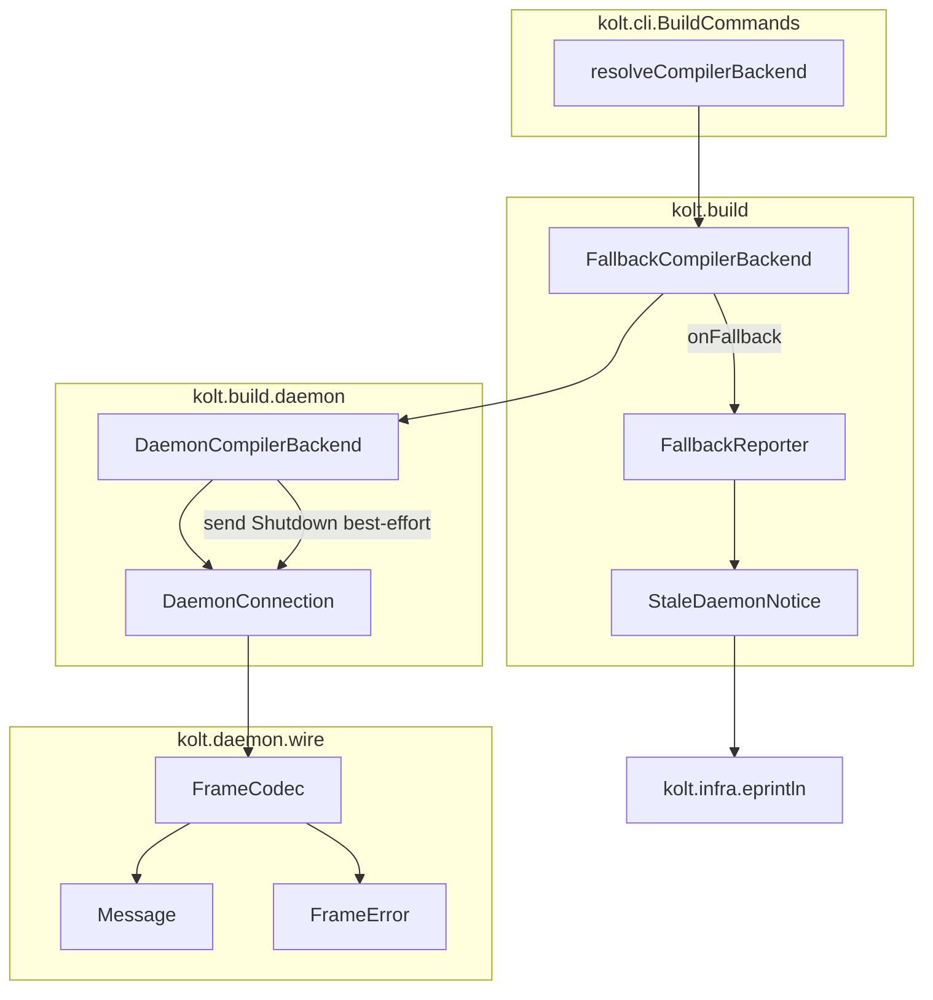
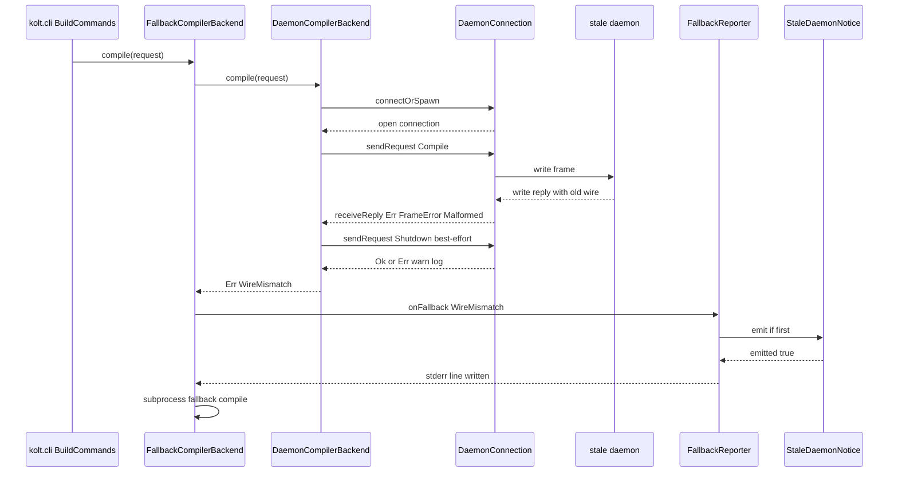
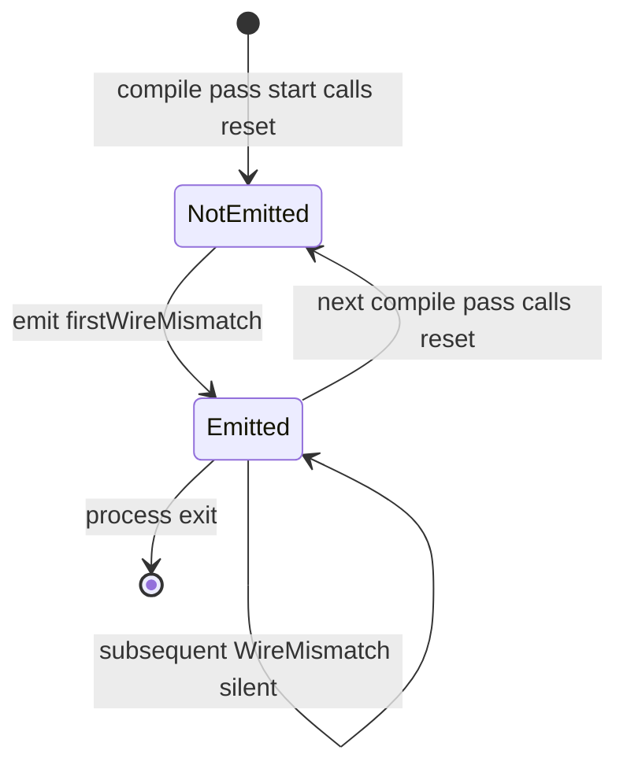

# Design Document — Auto-Restart Stale Daemon on Wire-Deserialize Fail

## Overview

#376 の wire 拡張後に旧版 daemon プロセスが UNIX socket を握ったまま生き残ると、 新しい kolt クライアントは reply を decode できず subprocess fallback に落ちるが、 旧 daemon はそのまま生き続けるため以降の build も毎回 fallback してしまう。 ユーザは `kolt daemon stop` を手動で叩かない限り daemon の利得を失い続ける。

本設計では、 native client が daemon reply を「wire レベルで解釈不能」と判定したとき、 同じ open connection 上で best-effort に `Message.Shutdown` を送り、 stderr に 1 行通知し、 当該 build を既存の subprocess fallback で完走させる。 これにより次回 invocation は通常通り fresh daemon を spawn できる。 JVM compiler daemon backend と native compiler daemon backend に対称的に適用する。

### Goals

- 「wire レベルで解釈不能な daemon reply」を新しいエラー variant として表面化し、 検出を Result chain に乗せる
- daemon-side のコード変更なしに stale daemon を実質 1 build で退場させる
- ユーザに「何が起きたか」を 1 行で伝える（沈黙 fallback の解消）

### Non-Goals

- daemon-side コードの変更（`Message.Shutdown` 受信処理は既存）
- daemon の一般的なヘルス監視（hang / OOM / 応答遅延などは対象外）
- in-flight build を fresh daemon に対して再試行すること
- JVM 以外のクライアント経路（本機能は `kolt.kexe` のみ）
- `kolt daemon stop` / `kolt daemon reap` 既存コマンドの挙動変更

## Boundary Commitments

### This Spec Owns

- `CompileError.BackendUnavailable.WireMismatch(detail)` と `NativeCompileError.BackendUnavailable.WireMismatch(detail)` の追加
- `DaemonCompilerBackend.compile()` / `NativeDaemonBackend.compile()` 内の wire-mismatch 検出 + Shutdown 送信ステップ
- `mapFrameErrorToReceiveError` / `mapReplyToOutcome`（両 backend）の WireMismatch 振替
- `StaleDaemonNotice` モジュール — compile-pass スコープ 1 回限りの stderr 通知制御
- `reportFallback` / `reportNativeFallback` の WireMismatch 分岐
- `BuildCommands` の compile pass entry に挿入する `StaleDaemonNotice.reset()` 呼び出し（単発 + watch 両対応）

### Out of Boundary

- `Message` / `FrameCodec` / `FrameError` の API 変更（既存定義を流用）
- `FallbackCompilerBackend` / `FallbackNativeCompilerBackend` wrapper 自体の挙動変更
- `connectOrSpawn` の retry policy（既存の 10..200ms / 10s budget のまま）
- `DaemonCommands.kt` の `sendShutdown` / `sendNativeShutdown` ヘルパー（path 経由再接続のため別目的）
- daemon-side 実装（`kolt-jvm-compiler-daemon/`, `kolt-native-compiler-daemon/`）
- precondition 失敗（`DaemonPreconditionError` / `NativeDaemonPreconditionError`）経路

### Allowed Dependencies

- `kolt.daemon.wire.{Message, FrameCodec, FrameError}` — JVM daemon wire 型
- `kolt.nativedaemon.wire.{Message, FrameCodec, FrameError}` — native daemon wire 型
- `kolt.infra.eprintln` — 既存 stderr 書き出し
- `kotlin-result` — 既存の `Result<V, E>` パターン
- `DaemonConnection` / `NativeDaemonConnection` interface — 既存
- `BackendUnavailable` / `isFallbackEligible` — 既存

依存方向は **cli → build → resolve / infra**（structure.md §`Package Organization`）を踏襲する。 本設計の追加コンポーネントはすべて `kolt.build` 配下で完結する。

### Revalidation Triggers

以下の変更は依存先 spec/consumer の整合確認が必要：

- `Message` sealed type の variant 追加（JVM/native どちらでも） — `mapReplyToOutcome` の網羅性が崩れる
- `FrameError` variant 追加 — `mapFrameErrorToReceiveError` の網羅性が崩れる
- `CompilerBackend` / `NativeCompilerBackend` の `compile` 戻り値型変更 — エラー sealed 階層の派生先全箇所
- `FallbackCompilerBackend` / `FallbackNativeCompilerBackend` の `onFallback` callback signature 変更 — `reportFallback` / `reportNativeFallback` 含む全 caller
- `BackendUnavailable` 配下の variant 追加 — `isFallbackEligible` / `formatCompileError` / `reportFallback` 全般

## Architecture

### Existing Architecture Analysis

JVM daemon backend と native daemon backend は **完全並行構造**（research.md §1.1 参照）。 共通パターン：

- `DaemonCompilerBackend` 系： `connectOrSpawn` → `connection.use { sendRequest → receiveReply → mapReplyToOutcome }`
- 失敗時はすべて `Result<_, *CompileError>` で返し、 `FallbackCompilerBackend` 系 wrapper が `isFallbackEligible(err)` で分岐
- `BackendUnavailable.*` 配下が fallback 対象、 `CompilationFailed` は素通り

既存パターンの遵守事項：

- ADR 0001：例外を投げない、 すべて `Result<V, E>`
- ADR 0016 §3：`BackendUnavailable` は warning、 `InternalMisuse` は error
- ADR 0024 §1：JVM daemon と native daemon の wire 型は別 sealed family を維持（並行で進化しうる）
- structure.md §`Code Organization Principles` "Explicit fallback policy"：fallback policy は明示的に上層に集約

### Architecture Pattern & Boundary Map



native 側 (`kolt.build.nativedaemon` + `kolt.nativedaemon.wire` + `NativeFallbackReporter`) も同形。 `StaleDaemonNotice` は **JVM/native 共有** の単一 module（一度の invocation で JVM 由来と native 由来の WireMismatch がそれぞれ起きても、 そのどちらかで 1 回だけ通知が出るよう統一する）。

**Architecture Integration**:

- Selected pattern: 既存の sealed-error + fallback-wrapper パターンを WireMismatch 変位の追加で延長
- Domain boundaries: 検出 = backend、 ユーザ通知 policy = reporter (経由 `StaleDaemonNotice`)、 invocation 状態 = `StaleDaemonNotice`
- Existing patterns preserved: JVM/native 並行ミラー、 Result<V, E>、 ADR 0001 / 0016 / 0024 既存方針
- New components rationale: `StaleDaemonNotice` は once-per-invocation policy の単一 source of truth として独立化（JVM reporter と native reporter で共有される唯一のクロスカット）
- Steering compliance: 例外なし（ADR 0001）、 fallback policy 上層集約（structure.md）、 ADR 番号コメント挿入規約（structure.md §`Code Organization Principles`）

### Technology Stack

| Layer | Choice / Version | Role in Feature | Notes |
|-------|------------------|-----------------|-------|
| CLI / Native binary | Kotlin/Native 2.3.x (linuxX64) | 全変更が `kolt.kexe` 内 | 新規依存なし |
| Error model | `kotlin-result 2.3.x` | `WireMismatch` を含む `Result<V, E>` 表現 | 既存の `getOrElse` / `isErr` を踏襲 |
| Wire protocol | `kotlinx.serialization` + 既存 `FrameCodec` | `Message.Shutdown` 送信に流用 | 変更なし |

新規依存・version up はなし。 既存ライブラリのみで完結。

## File Structure Plan

### Directory Structure

```
src/nativeMain/kotlin/kolt/build/
├── CompilerBackend.kt              # MODIFIED: BackendUnavailable.WireMismatch
├── NativeCompilerBackend.kt        # MODIFIED: BackendUnavailable.WireMismatch
├── FallbackReporter.kt             # MODIFIED: WireMismatch 分岐
├── NativeFallbackReporter.kt       # MODIFIED: WireMismatch 分岐
├── StaleDaemonNotice.kt            # NEW: once-per-compile-pass guard + emit + reset
├── daemon/
│   └── DaemonCompilerBackend.kt    # MODIFIED: receiveErr/replyVariant → WireMismatch、 Shutdown 送信
└── nativedaemon/
    └── NativeDaemonBackend.kt      # MODIFIED: 上記 native ミラー

src/nativeMain/kotlin/kolt/cli/
└── BuildCommands.kt                # MODIFIED: 各 compile pass entry で StaleDaemonNotice.reset() を呼ぶ（単発 + watch 両対応）

src/nativeTest/kotlin/kolt/build/
├── StaleDaemonNoticeTest.kt        # NEW
├── FallbackReporterTest.kt         # MODIFIED: WireMismatch ケース追加
├── NativeFallbackReporterTest.kt   # MODIFIED: 同上
├── daemon/
│   └── DaemonCompilerBackendTest.kt    # MODIFIED: WireMismatch + Shutdown 送信検証
└── nativedaemon/
    └── NativeDaemonBackendTest.kt      # MODIFIED: 同上 native

src/nativeTest/kotlin/kolt/cli/
└── StaleDaemonRecycleIT.kt         # NEW: 古い daemon 模擬 → 1 build 目に WireMismatch 通知 → 2 build 目で fresh spawn (initial PR scope)
```

### Modified Files

- `src/nativeMain/kotlin/kolt/build/CompilerBackend.kt` — `BackendUnavailable` sealed に `data class WireMismatch(val detail: String) : BackendUnavailable` を追加。 `isFallbackEligible` は既に `is BackendUnavailable -> true` で網羅しているので分岐は不要、 ただしコメントで意図を明示。 `formatCompileError` に新分岐を追加（`"error: $context wire mismatch: ${error.detail}"` ）
- `src/nativeMain/kotlin/kolt/build/NativeCompilerBackend.kt` — 上記 native ミラー
- `src/nativeMain/kotlin/kolt/build/daemon/DaemonCompilerBackend.kt`：
  - `mapFrameErrorToReceiveError(err)`：`Eof` / `Truncated` / `Malformed` / `Transport` の receive 側 4 変位を `WireMismatch(detail)` に振替（既存の `Other(detail)` を置換）
  - `mapReplyToOutcome(reply)`：`Compile` / `Ping` / `Pong` / `Shutdown` 受信を `WireMismatch("unexpected reply type: ${reply::class.simpleName}")` に振替
  - `compile(request)` フロー：`receiveReply()` から `WireMismatch` を生成すると判定したら、 **`Err(...)` を返す前に** `connection.sendRequest(Message.Shutdown)` を呼ぶ。 戻り値の `Err(FrameError.*)` は warn-log（`eprintln("warning: failed to send Shutdown to stale daemon: ...")`）してそのまま続行。 `mapReplyToOutcome` 由来の variant mismatch のときも同様に Shutdown を送る
  - `mapFrameErrorToSendError` は **不変**（送信側エラーは別経路、 R1 の対象外）
- `src/nativeMain/kotlin/kolt/build/nativedaemon/NativeDaemonBackend.kt` — 上記 native ミラー
- `src/nativeMain/kotlin/kolt/build/FallbackReporter.kt`：`when (err)` に `is CompileError.BackendUnavailable.WireMismatch` を追加し、 `StaleDaemonNotice.emit("compiler daemon", err.detail, sink)` を呼ぶ。 既存の generic `BackendUnavailable.Other` warning は WireMismatch には流れない
- `src/nativeMain/kotlin/kolt/build/NativeFallbackReporter.kt` — 上記 native ミラー（`StaleDaemonNotice.emit("native compiler daemon", ...)`）
- `src/nativeMain/kotlin/kolt/cli/BuildCommands.kt` — 各 compile pass entry の直前で `StaleDaemonNotice.reset()` を 1 行呼ぶ（単発 build entry と `--watch` ループの各 cycle 両方）

### New Files

- `src/nativeMain/kotlin/kolt/build/StaleDaemonNotice.kt` — process-global once-per-invocation flag 1 つと、 `emit(label, detail, sink)` ヘルパー、 およびテスト用の `internal fun reset()`。 単一 module で JVM/native 両 reporter から呼ばれる
- 新規テストは `src/nativeTest/kotlin/kolt/build/...` 配下に対応の package で配置

## System Flows

### Wire-mismatch detection and recycle (sequence)



主要な分岐点：

- `receiveReply` が `Err(FrameError.*)` または `mapReplyToOutcome` が「期待外 variant」を返した時点で WireMismatch 経路に入る
- `connection.sendRequest(Message.Shutdown)` は **best-effort**：`Err(FrameError.*)` でも build は止めない（R2.2）
- `StaleDaemonNotice.emit` は flag をチェックしてから 1 行書く。 既に true なら何もしない（R3.2 / R4.3）

### Once-per-compile-pass guard (state)



`StaleDaemonNotice` のスコープは「1 compile pass」。 `BuildCommands` の build entry が compile 開始直前に `reset()` を呼ぶため、 単発 invocation でも `--watch` の各 cycle でも最大 1 行の通知に統一される。 Single-process な watch セッションでも各 cycle が独立して 1 通知を許容する設計。

### Subsequent invocation (R5)

R5 は既存の `connectOrSpawn` 経路で自動的に成立する：

1. 旧 daemon が `Message.Shutdown` を受けて socket を解放 → 次回 `connector(socketPath)` が ENOENT → retry → spawn → 新 daemon
2. 旧 daemon がまだ socket を握っている → `connector` 成功 → wire 不整合再発 → WireMismatch 経路 → recycle 再起動
3. 既存 `connectOrSpawn` の retry budget（10..200ms within 10s）はそのまま

このフローには **新規コードは不要**。 重要なのは「Shutdown を送ったので daemon は退場の意思表示を受けた」という事実だけ。

## Requirements Traceability

| Requirement | Summary | Components | Interfaces | Flows |
|-------------|---------|------------|------------|-------|
| 1.1 | frame 読み失敗を incompatibility 扱い | `DaemonCompilerBackend.mapFrameErrorToReceiveError`, `NativeDaemonBackend.mapFrameErrorToReceiveError` | `FrameError.{Eof,Truncated,Malformed,Transport}` → `WireMismatch` | wire-mismatch sequence |
| 1.2 | payload deserialize 失敗 | 同上（`Malformed` に集約済） | 同上 | 同上 |
| 1.3 | reply variant mismatch | `mapReplyToOutcome` 両 backend | 期待外 `Message` variant → `WireMismatch` | 同上 |
| 1.4 | JVM/native 両 backend で同一 | `DaemonCompilerBackend` ＋ `NativeDaemonBackend` の対称改修 | `CompileError` / `NativeCompileError` どちらにも `WireMismatch` | – |
| 1.5 | 他 daemon error は対象外 | `mapFatalConnectError` / `formatDaemonPreconditionWarning` 経路は不変 | precondition / connect-fatal は `WireMismatch` に振らない | – |
| 2.1 | Shutdown を still-open connection で送信 | `DaemonCompilerBackend.compile`, `NativeDaemonBackend.compile` | `connection.sendRequest(Message.Shutdown)` | wire-mismatch sequence (`sendRequest Shutdown best-effort`) |
| 2.2 | Shutdown 送信失敗時は warn-log し続行 | 両 backend `compile` 内 | `eprintln("warning: failed to send Shutdown to stale daemon: ...")` | 同上 (`Ok or Err warn log`) |
| 2.3 | Shutdown 同期待ちなし | 両 backend `compile` 内 | 戻り値を待たず `Err(WireMismatch)` を返す | 同上 |
| 3.1 | stderr 1 行通知 | `StaleDaemonNotice.emit`, `reportFallback`, `reportNativeFallback` | `eprintln(<dedicated message>)` | wire-mismatch sequence (`emit if first`) |
| 3.2 | 1 compile pass あたり 1 回 | `StaleDaemonNotice` flag, `BuildCommands` reset 呼び出し | `emit` は 2 回目以降 no-op、 各 compile pass 開始時に `reset()` | once-per-compile-pass state |
| 3.3 | verbosity 設定によらず出力 | `StaleDaemonNotice.emit` | `eprintln` 直呼び（既存 `reportFallback` も同様） | – |
| 4.1 | in-flight build を fallback で完走 | `FallbackCompilerBackend` 既存 | `isFallbackEligible(WireMismatch) == true` | wire-mismatch sequence (`subprocess fallback compile`) |
| 4.2 | fresh daemon で再試行しない | `FallbackCompilerBackend` 既存（subprocess 1 回のみ） | – | – |
| 4.3 | invocation 中 1 回限り | `StaleDaemonNotice` flag が `emit` 抑止、 backend は 2 回目以降も WireMismatch を返すが silent fallback | – | once-per-compile-pass state |
| 5.1 | 次回 invocation は fresh daemon | 既存 `connectOrSpawn` | – | subsequent invocation flow |
| 5.2 | socket-occupied 時は既存挙動 | 既存 `connectOrSpawn` の retry budget | – | – |

## Components and Interfaces

| Component | Domain/Layer | Intent | Req Coverage | Key Dependencies (P0/P1) | Contracts |
|-----------|--------------|--------|--------------|--------------------------|-----------|
| `CompileError.BackendUnavailable.WireMismatch` | build (sealed error) | wire 不整合の表面化 | 1.1, 1.2, 1.3, 1.5 | `kolt.build.CompileError` (P0) | State (sealed variant) |
| `NativeCompileError.BackendUnavailable.WireMismatch` | build (sealed error) | 同上 native | 1.4 | `kolt.build.NativeCompileError` (P0) | State (sealed variant) |
| `DaemonCompilerBackend` (modified) | build/daemon | wire-mismatch 検出と Shutdown 送信 | 1.1, 1.2, 1.3, 2.1, 2.2, 2.3 | `DaemonConnection` (P0), `Message.Shutdown` (P0) | Service |
| `NativeDaemonBackend` (modified) | build/nativedaemon | 同上 native | 1.4, 2.1, 2.2, 2.3 | `NativeDaemonConnection` (P0) | Service |
| `StaleDaemonNotice` (new) | build | once-per-compile-pass 通知制御 | 3.1, 3.2, 3.3, 4.3 | `kolt.infra.eprintln` (P0) | Service / State |
| `reportFallback` (modified) | build | WireMismatch を `StaleDaemonNotice` に分岐 | 3.1 | `StaleDaemonNotice` (P0) | Service |
| `reportNativeFallback` (modified) | build | 同上 native | 3.1 | `StaleDaemonNotice` (P0) | Service |

### kolt.build (sealed errors)

#### `CompileError.BackendUnavailable.WireMismatch`

| Field | Detail |
|-------|--------|
| Intent | JVM compiler daemon が wire レベルで解釈不能な reply を返したことを表す sealed variant |
| Requirements | 1.1, 1.2, 1.3, 1.5 |

**Responsibilities & Constraints**

- `BackendUnavailable` の sub-variant として **fallback-eligible** の性質を継承
- `detail: String` には判定根拠（"malformed reply: ..."、 "truncated reply: wanted=X got=Y"、 "unexpected reply type: ..." など、 既存 detail 文と互換）を保持
- 旧 `BackendUnavailable.Other` から **置き換え** て使う（receive 側の wire-related 失敗のみ。 send-side や connect-fatal は引き続き `Other`）

**Dependencies**

- Inbound: `mapFrameErrorToReceiveError` / `mapReplyToOutcome` (P0)
- Outbound: `isFallbackEligible`, `formatCompileError`, `reportFallback` (P0)

**Contracts**: State [x]

##### State Management

- 不変 data class、 `detail` のみ
- 既存の `BackendUnavailable.Other` と同じ fallback eligibility（`isFallbackEligible` は `BackendUnavailable` 一括で true）

#### `NativeCompileError.BackendUnavailable.WireMismatch`

JVM 側と field/契約完全同形。 詳細省略。

### kolt.build.daemon / kolt.build.nativedaemon (backends)

#### `DaemonCompilerBackend.compile` (modified)

| Field | Detail |
|-------|--------|
| Intent | wire-mismatch 検出時に `Message.Shutdown` を best-effort 送信してから WireMismatch を返す |
| Requirements | 1.1, 1.2, 1.3, 2.1, 2.2, 2.3 |

**Responsibilities & Constraints**

- 既存の `connectOrSpawn` → `sendRequest` → `receiveReply` → `mapReplyToOutcome` フローは維持
- `receiveReply` の `Err(FrameError.*)`、 または `mapReplyToOutcome` が WireMismatch を返すと判明した時点で **Err を返す前に** `connection.sendRequest(Message.Shutdown)` を呼ぶ（戻り値は warn-log するだけ）
- Shutdown 送信は connection が閉じられる前に行う（`connection.use { ... }` の中で）
- 同期待ちしない（Shutdown 送信完了即 return）

**Dependencies**

- Inbound: `FallbackCompilerBackend.compile` (P0)
- Outbound: `DaemonConnection.sendRequest(Message.Shutdown)` (P0), `eprintln` warn (P1)
- External: なし

**Contracts**: Service [x]

##### Service Interface

```kotlin
override fun compile(request: CompileRequest): Result<CompileOutcome, CompileError>
```

- Preconditions: 既存どおり（`connectOrSpawn` が成功するか failover）
- Postconditions:
  - 戻り値が `Err(BackendUnavailable.WireMismatch)` のとき、 同じ open connection 上で `Message.Shutdown` 送信が試行されている（成功/失敗は問わず）
  - Shutdown 送信失敗時は stderr に 1 行 warn が出る
- Invariants: connection が `use` ブロック内でクローズされる（既存どおり）

##### Implementation Notes

- Integration: 既存 `mapFrameErrorToReceiveError` / `mapReplyToOutcome` の変位振替で十分。 `compile` 本体での新規分岐は最小限
- Code shape：既存の早期 return パターンを保ったまま Shutdown 送信を `connection.use { ... }` 内で挟むため、 戻り値計算と Shutdown 送信を分離する。 擬似コード：

  ```kotlin
  connection.use {
    val sendErr = it.sendRequest(wire).getError()
    if (sendErr != null) return Err(mapFrameErrorToSendError(sendErr))

    val reply = it.receiveReply()
    val replyErr = reply.getError()
    val mapped: Result<CompileOutcome, CompileError> =
      if (replyErr != null) Err(mapFrameErrorToReceiveError(replyErr))
      else mapReplyToOutcome(reply.get()!!)

    // Shutdown 送信は use ブロックを抜ける前、 戻り値確定後に実施
    val errored = mapped.getError()
    if (errored is CompileError.BackendUnavailable.WireMismatch) {
      it.sendRequest(Message.Shutdown).getError()?.let { sendErr ->
        eprintln("warning: failed to send Shutdown to stale daemon: $sendErr")
      }
    }
    return mapped
  }
  ```

- Validation: `FakeConnection` を拡張し、 `lastSent` リスト化または `sentShutdown: Boolean` フラグで Shutdown 送信を観測
- Risks:
  - daemon が Shutdown 受信後すぐ socket を閉じない可能性 → 次回 `connectOrSpawn` の既存 retry budget が吸収（design §System Flows 参照）
  - send 自体が即時失敗するケース（broken pipe）→ 既に R2.2 で warn + 続行を規定
  - early return を残したまま Shutdown を `use` 外に書く実装ミス → 上記 pseudocode の構造を pin して防ぐ

#### `NativeDaemonBackend.compile` (modified)

JVM 側と完全同形。 wire 型のみ `kolt.nativedaemon.wire.Message.Shutdown` に差し替え。 詳細省略。

### kolt.build (StaleDaemonNotice)

#### `StaleDaemonNotice` (new)

| Field | Detail |
|-------|--------|
| Intent | 1 process（= 1 invocation）あたり最大 1 回だけ stale-daemon 通知を stderr に出す |
| Requirements | 3.1, 3.2, 3.3, 4.3 |

**Responsibilities & Constraints**

- mutable flag を保持し、 最初の `emit` 呼び出しでのみ stderr 1 行書き出し
- 同一 compile pass 内で JVM 由来 / native 由来どちらの WireMismatch も区別なく 1 回でカウント
- スコープは「1 compile pass」。 `kolt build --watch` / `kolt test --watch` のように 1 process が複数 compile pass を回すケースに備え、 各 compile pass の開始時点で `reset()` を呼ぶ責務を caller (`BuildCommands` の watch loop / 単発 build entry) に持たせる
- 単発 build (`kolt build` / `kolt test` の non-watch) でも各 compile entry 開始時に `reset()` を呼んで OK（process が新しいので flag は false 始まりだが、 idempotent な reset で実装の単純性を優先）
- 通知メッセージのテンプレート：`"warning: stale {label} detected ({detail}); recycling — this build runs as subprocess, the next build will spawn a fresh daemon"`
  - `label`：`"compiler daemon"`（JVM）または `"native compiler daemon"`（native）
  - `detail`：`WireMismatch.detail` をそのまま埋め込み

**Dependencies**

- Inbound: `reportFallback`, `reportNativeFallback` (P0)
- Outbound: `kolt.infra.eprintln` (P0)

**Contracts**: Service [x] / State [x]

##### Service Interface

```kotlin
object StaleDaemonNotice {
  fun emit(label: String, detail: String, sink: (String) -> Unit = ::eprintln): Boolean
  fun reset()
}
```

- Preconditions: なし
- Postconditions:
  - 初回呼び出し時：`sink` に 1 行書き出し、 flag を立て、 `true` を返す
  - 同 compile pass 内 2 回目以降（`reset` を挟まない）：何も書かず `false` を返す
- Invariants: `emit` 呼び出し間で `reset` がない限り、 flag は単調に true へ遷移

##### State Management

- State model: `private var emitted: Boolean = false`
- Lifecycle: 各 compile pass entry が `reset()` を呼んでから compile を開始する。 process exit でも当然リセットされる
- Persistence & consistency: in-memory only
- Concurrency strategy: kolt CLI は単一スレッドの compile orchestration のため synchronization 不要。 将来並列化が入る場合は `atomicfu` 等で保護を検討（現状は不要）

**Caller integration**

- `BuildCommands` の build entry（`doBuild` / `doTest` 等）が compile invocation の **直前** に `StaleDaemonNotice.reset()` を呼ぶ
- `--watch` ループでは「ファイル変更検知 → compile 1 回」の各サイクルで reset を 1 回呼ぶ。 これにより watch セッション中の各 compile pass で最大 1 行の通知が出る
- 単発 build entry でも同じ呼び出しを統一的に行う（idempotent）

### kolt.build (reporters, modified)

#### `reportFallback` (modified)

| Field | Detail |
|-------|--------|
| Intent | WireMismatch を `StaleDaemonNotice` に分岐し、 既存 generic warning と二重出力させない |
| Requirements | 3.1 |

**Responsibilities & Constraints**

- `when (err)` に `is CompileError.BackendUnavailable.WireMismatch -> StaleDaemonNotice.emit("compiler daemon", err.detail, sink)` を **`BackendUnavailable.Other` より前に** 配置
- `BackendUnavailable.Other` 既存分岐は変更なし（precondition 失敗等の他経路に残る）

##### Implementation Notes

- Integration: sink 引数を `StaleDaemonNotice.emit` に渡せば、 既存の `eprintln` デフォルトとテスト時の collector 注入が両立
- Validation: `FallbackReporterTest` に WireMismatch ケースと、 既存 Other ケースが従来どおり出ることのアサート両方を追加
- Risks: なし

#### `reportNativeFallback` (modified)

JVM 側と同形。 `StaleDaemonNotice.emit("native compiler daemon", ...)` を呼ぶ。

## Error Handling

### Error Strategy

- **wire レベルの不整合**：新 variant `BackendUnavailable.WireMismatch` で表面化、 backend が Shutdown を送り、 reporter が 1 行通知、 fallback wrapper が subprocess へ
- **Shutdown 送信失敗**：warn-log のみ、 build は継続。 `BackendUnavailable.WireMismatch` 戻り値は変えない
- **既存の `BackendUnavailable.Other`**：precondition 失敗、 connect 失敗、 send 失敗等は **WireMismatch 経路には乗らない**（R1.5 の境界）
- **`CompilationFailed` / `NoCommand`**：これまで通り fallback 対象外、 影響なし

### Error Categories and Responses

| カテゴリ | 該当 | 振る舞い |
|----|----|----|
| wire incompatibility | `FrameError.*` on receive、 unexpected reply variant | `WireMismatch(detail)` → Shutdown 送信 → reporter → 1 行 stderr → fallback |
| Shutdown send failure | `connection.sendRequest(Shutdown)` の `Err(FrameError.*)` | `eprintln("warning: failed to send Shutdown to stale daemon: ...")` のみ、 build 続行 |
| 他の `BackendUnavailable` | precondition / connect / send 既存 | 既存 `reportFallback` の generic warning |
| `InternalMisuse` | sealed family の incoming variant 不整合等 | 既存どおり error-level log（kolt 自身のバグ） |

### Monitoring

- 観測可能性は stderr の通知 1 行のみ。 構造化ログ・テレメトリは対象外（kolt は CLI ツールで daemon ヘルス telemetry を持たない）
- 同 invocation で 2 回目以降の WireMismatch が **silent** になるため、 デバッグ時のため backend 側で `eprintln` の trace を追加することは検討可（design 段階では追加しない、 必要なら follow-up issue）

## Testing Strategy

要件の AC を直接テスト項目に落とす。 既存の `DaemonCompilerBackendTest` 系統と `FallbackReporterTest` 系統に追加する形で書く（new file の必要は最小限）。

### Unit Tests

1. **`DaemonCompilerBackendTest`：FrameError.Malformed → WireMismatch + Shutdown 送信**（R1.1 / 1.2 / 2.1）
   - `FakeConnection` の `reply = Err(FrameError.Malformed("..."))`
   - 戻り値が `Err(BackendUnavailable.WireMismatch(...))` であること
   - `FakeConnection.lastSent`（または専用フラグ）に `Message.Shutdown` が記録されていること
2. **`DaemonCompilerBackendTest`：FrameError.{Eof,Truncated,Transport} → WireMismatch**（R1.1）
   - 各 variant ごとに reply を Err にして上記同様
3. **`DaemonCompilerBackendTest`：unexpected reply variant → WireMismatch + Shutdown**（R1.3 / 2.1）
   - `reply = Ok(Message.Pong)` 等
4. **`DaemonCompilerBackendTest`：Shutdown send failure → warn-log + 戻り値 WireMismatch**（R2.2）
   - `FakeConnection.sendResult` を 2 回目だけ Err にする工夫、 stderr collector で warn-line 検証
5. **`NativeDaemonBackendTest`：上記 4 項目の native ミラー**（R1.4）
6. **`StaleDaemonNoticeTest`：emit は初回 true, 2 回目以降 false**（R3.2 / R4.3）
   - reset 後再度 true になること
7. **`FallbackReporterTest`：WireMismatch → 専用文言、 generic warning は出ない**（R3.1）
8. **`NativeFallbackReporterTest`：上記 native ミラー**

### Integration Tests

9. **`StaleDaemonRecycleIT`：古い wire を返す fake daemon → 1 build 目で WireMismatch 通知 → 2 build 目で fresh spawn**（R5.1 end-to-end、 initial PR scope）
   - ハーネスは既存 `MultiShapeDaemonTestCoverageIT` の env-gated パターンを踏襲し、 false-RED を回避
   - fake daemon は `kolt.infra.net` の UnixSocket primitive を使い、 期待外 reply（例：JSON `{"type":"Pong"}` を `Compile` リクエストに返す）を書き戻す軽量 server を test fixture として実装
   - assertion 観点：(1) 1 build 目の stderr に stale-daemon 通知 1 行が出ること、 (2) 1 build 目が subprocess fallback で正常完了すること、 (3) 2 build 目（fake server を停止した後の通常 daemon 起動）が fresh daemon 経路を通ること
   - 親 kolt との実行時 path 切り分けは memory `feedback_bootstrap_gated_test.md` の bootstrap-gated パターンに従う

### E2E / Manual

10. dogfood：v0.18.0 の daemon を立てた状態で kolt を v0.18.1 に上げ、 `kolt build` を実行。 stderr 1 行出ること、 2 回目で daemon が新しく立つことを `kolt daemon stop` 経由で目視確認

## Optional Sections

### Migration Strategy

破壊的変更なし。 `BackendUnavailable.WireMismatch` 追加は既存 caller（`isFallbackEligible`、 `formatCompileError`、 `reportFallback`、 `reportNativeFallback`）の when 網羅性を高めるための **追加** であり、 既存挙動を変えない。 ADR 0016 §5 / ADR 0024 §7 にこの新 variant の意味を 1〜2 行で追記する（task 内で実施）。

### Performance & Scalability

性能影響なし。 wire-mismatch は古い daemon が残っているときだけ発生する希少パスで、 通常時の compile flow には 1 行たりとも追加されない。 通知メッセージは `eprintln` 1 回で sub-millisecond。

## Supporting References

- gap analysis：`research.md` §3 (Option C) と §5 (Key decisions / Research items) を参照
- 関連 ADR：ADR 0001 (Result vs exceptions)、 ADR 0016 §3/§5 (JVM daemon fallback policy)、 ADR 0024 §1/§7 (native daemon symmetry, fallback)
- 関連 issue：#379 (本機能)、 #376 (precursor wire change)
