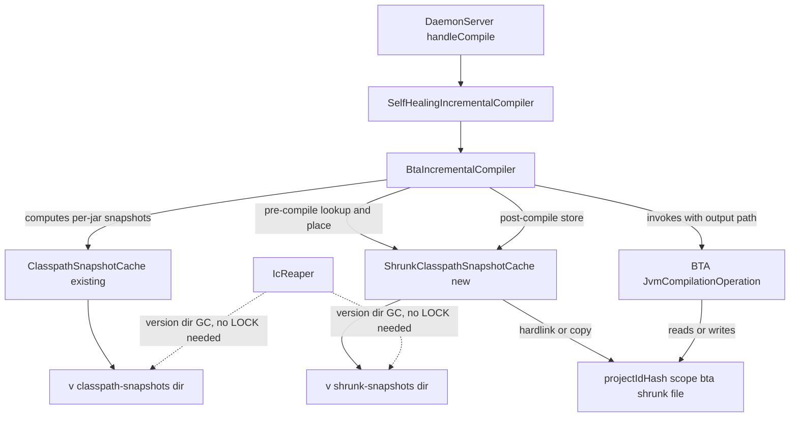
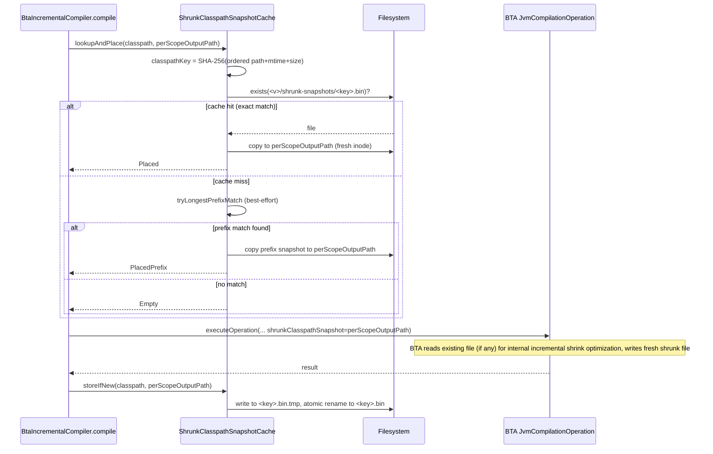
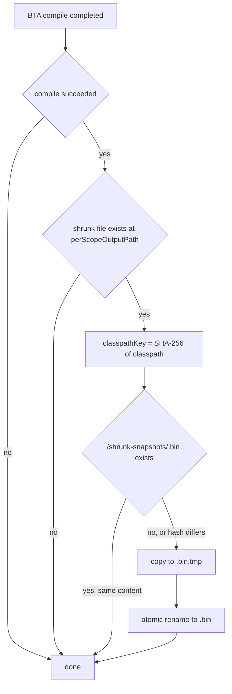

# Technical Design — 380-share-classpath-snapshots

## Overview

#376 で `kolt test` の test compile が JVM compile daemon 経路に乗ったことで、`shrunk-classpath-snapshot.bin` が `<projectIdHash>/<scope>/bta/` 配下に scope ごとに独立保管される構造になった。本 spec は、同一 classpath を持つ compile 間でこの shrunk snapshot を再利用する **global cache 層** (`~/.kolt/daemon/ic/<kotlinVersion>/shrunk-snapshots/<classpathHash>.bin`) を BTA Incremental Compiler の前後フックとして導入する。

**Users**: `kolt build` 直後に `kolt test` を打つ kolt 利用者、および同じ依存セットを共有する複数の kolt サブプロジェクト（例：本リポジトリの `kolt-jvm-compiler-daemon` と `kolt-native-compiler-daemon`）。

**Impact**: BTA の compile 経路に pre-compile / post-compile フックを追加し、daemon の IC ステートディレクトリに新しい `<v>/shrunk-snapshots/` ディレクトリを追加する。wire protocol、`CompileScope` enum、`IcStateLayout` の per-scope path 規約は変更しない。

### Goals

- 同一 classpath で複数回 compile されるとき shrunk snapshot を一度だけ計算する（Req 1.1）
- main → test の cold-path で BTA 内部の incremental shrink optimization が発火する経路を提供する（Req 1.2 の best-effort 解釈）
- `kolt-jvm-compiler-daemon` ベンチで cold-path test compile wall-time の測定可能な短縮を示す（Req 2）
- warm rebuild 計測値（~490 ms）と up-to-date short-circuit（~0.019 s）を維持する（Req 3）
- 新規 cache 状態が IcReaper と並行 compile で安全に扱われる（Req 4）

### Non-Goals

- BTA wire protocol（`Message.Compile` / `CompileResult` 等）への変更（Req 5 が固定）
- Native compile (konanc) 側の snapshot 共有
- multi-module / multi-project 横断の shrunk snapshot 計算
- daemon 起動時間 / classloader / JVM warmup の改善
- shrunk snapshot cache 内の LRU / size 上限 GC（v1 では reaper の version-dir 単位 wipe に委ねる）

## Boundary Commitments

### This Spec Owns

- 新クラス `ShrunkClasspathSnapshotCache` の implement と、その永続パス `~/.kolt/daemon/ic/<kotlinVersion>/shrunk-snapshots/<classpathHash>.bin`
- `BtaIncrementalCompiler.compile(...)` の compile 前 (cache lookup + place) / compile 後 (cache store) フック
- `IcStateLayout` への path helper 追加（`shrunkSnapshotsDirFor`, `shrunkSnapshotPathFor`）と cache dir 名定数 `SHRUNK_SNAPSHOTS_SUBDIR`
- `IcReaper` の version-dir 走査ロジックに **cache subdir skip list** を導入する小修正（既存 `classpath-snapshots/` も同じ穴を埋める副次効果あり、§Reaper Modification 参照）
- 新 cache が reaper safe であることを担保するファイル配置とアトミック書き込み規約
- spike 1 件（`spike/bta-shrunk-portability/`）と、`MultiShapeDaemonTestCoverageIT` への cold-path 計測アサーション追加

### Out of Boundary

- BTA 内部 (`ClasspathSnapshotShrinker`) の挙動を改変・拡張する work
- `Message.Compile` / `friendPaths` / per-scope `inputs/` segregation など #376 で固定された daemon 契約
- per-jar `~/.kolt/daemon/ic/<v>/classpath-snapshots/` の構造変更
- `IcReaper` のメイン GC ロジック改修（新 cache を reaper rule に「除外しない」という消極的整合のみ）
- daemon wire の version negotiation 変更（cache の存在は client 不可視）

### Allowed Dependencies

- `kolt.daemon.ic.IcStateLayout`, `BtaIncrementalCompiler`, `ClasspathSnapshotCache`, `SelfHealingIncrementalCompiler`（既存、同モジュール内）
- `kotlin-build-tools-api` 2.3.x の公開シグネチャ（pin 済み）
- `java.nio.file` （atomic rename, hardlink, file locking）
- 既存の `<projectIdHash>/LOCK` / breadcrumb 規約（read-only での認知）

依存方向：`kolt.daemon.server` → `kolt.daemon.ic` → (新) `ShrunkClasspathSnapshotCache` → `IcStateLayout`。逆方向は禁止。

### Revalidation Triggers

以下の変更は本 spec の前提を崩すため、依存 spec / consumer の再検証が必要：

- BTA 公開 API（`snapshotBasedIcConfigurationBuilder` の signature, `JvmSnapshotBasedIncrementalCompilationConfiguration`）の version 変更
- `IcStateLayout.workingDirFor(...)` の path schema 変更（特に `<projectIdHash>/<scope>/` 構造）
- `IcReaper` の GC スコープ拡大（特に `<v>/` 配下を全 wipe するような変更）
- BTA shrunk-classpath-snapshot.bin の binary format 変更（Kotlin minor 版間で発生する可能性、`<v>` partition で隔離するが要監視）
- daemon と client の wire protocol への compile-scope 関連フィールド追加

## Architecture

### Existing Architecture Analysis

- BTA 経路：`DaemonServer.handleCompile` → `SelfHealingIncrementalCompiler.compile` → `BtaIncrementalCompiler.compile` → BTA `JvmCompilationOperation.executeOperation`
- per-jar snapshot：`ClasspathSnapshotCache` がグローバルキャッシュ（`<v>/classpath-snapshots/<basename>-<key>.snapshot`）として機能
- shrunk snapshot：従来は per-scope path にのみ存在（`<projectIdHash>/<scope>/bta/shrunk-classpath-snapshot.bin`）、scope 間共有なし
- LOCK / breadcrumb：`<projectIdHash>/LOCK` で同一 project のすべての scope をカバー、reaper はこれを生死シグナルとして使う
- self-heal：BTA failure 時に `workingDir`（per-scope）を wipe して retry。`<projectIdHash>/LOCK` は parent dir なので残る

### Architecture Pattern & Boundary Map



**Selected pattern**: 既存 `ClasspathSnapshotCache` と並列の global content-keyed cache。projectId 横断、scope 横断。

**Domain/feature boundaries**:
- `kolt.daemon.ic.ShrunkClasspathSnapshotCache` が cache の永続化と lookup を所有
- `kolt.daemon.ic.BtaIncrementalCompiler` が BTA call の前後で cache を呼ぶ
- `kolt.daemon.ic.IcStateLayout` が path 計算を所有

**Existing patterns preserved**:
- per-jar cache の `(path|mtime|size)` keying
- `ConcurrentHashMap.compute` パターンで per-key 排他
- atomic rename での書き込み
- `<v>` 単位の version partitioning

**New components rationale**:
- `ShrunkClasspathSnapshotCache`：classpath 単位のキャッシュは既存 per-jar cache とは key 粒度（per-jar vs whole-classpath）と内部含意（BTA 出力ファイル vs 入力ファイル）が異なるため独立クラスとして設計

**Steering compliance**:
- ADR 0019 §5 の per-scope segregation を維持（`inputs/` は scope ごとのまま）
- ADR 0019 §7 の self-heal で `workingDir` wipe しても global cache は無事
- ADR 0001 の Result 規約：cache 操作は `Result<T, ShrunkSnapshotCacheError>` を返す
- ADR 0029 の concurrent build safety：cache write は atomic rename、read は best-effort

### Technology Stack

| Layer | Choice / Version | Role | Notes |
|---|---|---|---|
| Backend / Daemon | Kotlin 2.3.x / JDK 25 | 既存 daemon module 内に追加 | 新規依存ゼロ |
| BTA | kotlin-build-tools-api 2.3.20 (pinned) | `JvmCompilationOperation` 経由の compile を維持 | shrunk file の portability を spike T1 で検証 |
| Storage | local filesystem | `~/.kolt/daemon/ic/<v>/shrunk-snapshots/` | atomic rename, hardlink for placement |

外部依存追加なし。既存 `kotlinx.serialization` / `kotlin-result` をそのまま使う。

## File Structure Plan

### Directory Structure

```
kolt-jvm-compiler-daemon/ic/src/
├── main/kotlin/kolt/daemon/ic/
│   ├── ShrunkClasspathSnapshotCache.kt     # NEW: global cache layer
│   ├── BtaIncrementalCompiler.kt            # MODIFIED: pre/post hooks
│   ├── IcStateLayout.kt                     # MODIFIED: path helpers
│   └── (other existing files unchanged)
└── test/kotlin/kolt/daemon/ic/
    └── ShrunkClasspathSnapshotCacheTest.kt  # NEW: unit tests

kolt-jvm-compiler-daemon/src/
└── main/kotlin/kolt/daemon/Main.kt          # MODIFIED: wire cache into BtaIncrementalCompiler.create

src/nativeTest/kotlin/kolt/cli/
└── MultiShapeDaemonTestCoverageIT.kt        # MODIFIED: cold-path measurement assertion

spike/
└── bta-shrunk-portability/                  # NEW: T1 spike
    ├── README.md                             # spike question + result
    ├── kolt.toml
    └── src/main/kotlin/Main.kt               # portability + extension probe

docs/
└── dogfood.md                                # MODIFIED: record measurements
```

### Modified Files

- `kolt-jvm-compiler-daemon/ic/src/main/kotlin/kolt/daemon/ic/IcStateLayout.kt` — add `SHRUNK_SNAPSHOTS_SUBDIR` const, `CACHE_SUBDIRS_AT_VERSION_LEVEL` set, `shrunkSnapshotsDirFor(...)`, `shrunkSnapshotPathFor(...)` helpers
- `kolt-jvm-compiler-daemon/ic/src/main/kotlin/kolt/daemon/ic/BtaIncrementalCompiler.kt` — inject `ShrunkClasspathSnapshotCache`; pre-compile lookup + place; post-compile cache store
- `kolt-jvm-compiler-daemon/src/main/kotlin/kolt/daemon/Main.kt` — construct `ShrunkClasspathSnapshotCache` at daemon startup, pass to `BtaIncrementalCompiler.create`
- `kolt-jvm-compiler-daemon/src/main/kotlin/kolt/daemon/reaper/IcReaper.kt` — current-version 分岐の child 走査で `CACHE_SUBDIRS_AT_VERSION_LEVEL` を skip（既存 per-jar cache の wipe 暗黙 bug の併修）
- `src/nativeTest/kotlin/kolt/cli/MultiShapeDaemonTestCoverageIT.kt` — add assertion that `<v>/shrunk-snapshots/` is populated after `kolt build && kolt test` cold path、 daemon 再起動後 cache が survive することの assertion

## System Flows

### Pre-compile cache lookup



**Decision notes**:
- 配置は **`copy` を恒久的に使用**（per-scope path に fresh inode を作る）。few-KB ファイルの copy は wall-time 的に無視できる規模、かつ BTA が pre-placed file を in-place 上書きしても cache file の inode が共有されないので汚染リスクなし
- `hardlink` 最適化は **採用しない**（Spike T1 Q3 で BTA が in-place write することを確認済み — `spike/bta-shrunk-portability/REPORT.md`）。hardlink にすると per-scope BTA write が cache file 自体を上書きして他 compile に汚染を伝播するため、永続的に unsafe
- `lookupAndPlace` の戻り値（Placed / PlacedPrefix / Empty）は metrics 用、compile 制御には使わない（BTA に判断を委ねる）
- prefix match は best-effort：cache miss でも問題なく BTA は compute する

### Cache store after compile



**Decision notes**:
- post-compile store は失敗してもユーザ可視の影響なし（次回 compile で再 cache 試行）→ `Result` で error を握りつぶさず log する
- **同 key の concurrent write の安全性**：BTA の shrunk snapshot は「これまで参照された classpath classes の集合」として monotonically grow する性質を持ち、cache file の content は厳密には source set の lookup 履歴依存で非決定的。ただし任意の cache file は **真に必要な集合の subset** であり、後続 compile に対して有効な starting point として機能する（BTA が不足分を内部で extend する）。したがって last-writer-wins は torn write を防げば correctness 上安全（誤った `.class` 出力には繋がらない）。compiler flag (`-Xfriend-paths`, language version, plugin args) は shrunk content の semantic identity に影響しないことを spike T1 §4 で確認する

### Reaper Modification

`IcReaper.run` (kolt-jvm-compiler-daemon/src/main/kotlin/kolt/daemon/reaper/IcReaper.kt:71-79) は current-version dir 配下の **すべての child を `projectIdDir` 扱い**で `tryDelete` 候補にする。新 `<v>/shrunk-snapshots/` は breadcrumb / LOCK を持たない recomputable cache なので、現状ロジックでは daemon 起動毎に削除される。**既存 `<v>/classpath-snapshots/`（per-jar cache）も同じ穴**を踏んでいる（運用上気付かれていないが daemon 再起動毎に regen している）。

修正：`IcReaper.run` の current-version 分岐に **cache subdir skip set** を導入する。

```kotlin
private val CACHE_SUBDIRS_AT_VERSION_LEVEL: Set<String> = setOf(
    IcStateLayout.CLASSPATH_SNAPSHOTS_SUBDIR,   // existing per-jar cache
    IcStateLayout.SHRUNK_SNAPSHOTS_SUBDIR,      // new shrunk cache
)

// in run(...) current-version branch:
directoryChildren(versionDir).forEach { projectIdDir ->
    if (projectIdDir.fileName.toString() in CACHE_SUBDIRS_AT_VERSION_LEVEL) return@forEach
    scanned++
    if (breadcrumbPointsToExistingPath(projectIdDir)) return@forEach
    when (val outcome = tryDelete(projectIdDir)) {
        ...
    }
}
```

**Decision notes**:
- non-current `<v>` 分岐 (IcReaper.kt:60-67) では cache dir を skip する必要なし — kotlin version が変わっていれば cache 自体が version 不整合で無効、丸ごと wipe で正しい
- skip set は `IcStateLayout` の constant を参照して **single source of truth** を維持
- これにより既存 per-jar cache の暗黙の wipe が解消される副次効果（observability 向上、daemon 再起動後の cold path 改善）。これは bug fix なので別 issue 起票よりも本 spec で同梱が妥当（design 段階の発見）

## Requirements Traceability

| Requirement | Summary | Components | Interfaces | Flows |
|---|---|---|---|---|
| 1.1 | 同一 classpath で snapshot 再利用 | `ShrunkClasspathSnapshotCache`, `BtaIncrementalCompiler` | `lookupAndPlace`, `storeIfNew` | Pre-compile cache lookup |
| 1.2 | strict prefix で増分拡張 (best-effort 再解釈) | `ShrunkClasspathSnapshotCache`, BTA 内部 incremental shrink | `tryLongestPrefixMatch` | Pre-compile cache lookup |
| 1.3 | fallback to from-scratch | `BtaIncrementalCompiler` | 既存 BTA 経路 | Pre-compile cache lookup (Empty branch) |
| 1.4 | stale 検出 | `ShrunkClasspathSnapshotCache` | `classpathKey` の `(path,mtime,size)` 計算 | Pre-compile cache lookup |
| 1.5 | per-scope inputs segregation 維持 | `BtaIncrementalCompiler` (既存)、`IcStateLayout` 不変 | `IcStateLayout.workingDirFor` | — |
| 2.1, 2.2 | 計測可能な cold-path 改善 | `MultiShapeDaemonTestCoverageIT`, spike harness | `bench` スクリプト + assertion | — |
| 2.3 | bench harness の synthetic epoch | `spike/bench-scaling/` | `gen.sh` 既存規約 | — |
| 3.1, 3.2 | warm 不変 | `MultiShapeDaemonTestCoverageIT` (既存 + 追加 assertion) | warm path wall-time check | — |
| 4.1, 4.2 | reaper safe な shared cache | `IcReaper` (cache subdir skip 追加)、cache 配置場所 | `CACHE_SUBDIRS_AT_VERSION_LEVEL` skip set | §Reaper Modification |
| 4.3 | stale dir GC 継続 | `IcReaper` 既存ロジック (non-current version 分岐) | unchanged for projectIdDirs | §Reaper Modification |
| 4.4 | 並行 write 安全 | `ShrunkClasspathSnapshotCache.storeIfNew` | atomic rename + content-deterministic | Cache store after compile |
| 5.1 | wire 不変 | `DaemonServer`, `Message` | unchanged | — |
| 5.2 | friendPaths セマンティクス不変 | `BtaIncrementalCompiler` | unchanged | — |
| 5.3 | per-scope IC layout 観測上不変 | `IcStateLayout` | unchanged | — |
| 6.1, 6.2 | multi-shape regression coverage | `MultiShapeDaemonTestCoverageIT` | 追加 assertion | — |
| 6.3 | bootstrap-gated env override 互換 | 既存 `KOLT_DAEMON_JAR` 経路 | unchanged | — |

**Req 1.2 の取り扱い注記**：BTA 公開 API には shrunk snapshot を外部から extend する操作がない。設計は「longest prefix match cache file を pre-place して BTA 内部の incremental shrink optimization に乗せる」best-effort 解釈で 1.2 をカバーする。spike T1 で実際の wall-time 改善を測定した上で、効果が確認できなければ requirements.md の 1.2 を「同一 classpath 完全再利用に縮小」に back-port することを `validate-design` で再評価する。

## Components and Interfaces

| Component | Domain/Layer | Intent | Req Coverage | Key Dependencies (P0/P1) | Contracts |
|---|---|---|---|---|---|
| `ShrunkClasspathSnapshotCache` | daemon.ic | Global content-keyed cache for shrunk classpath snapshots | 1.1, 1.2, 1.4, 4.1, 4.4 | `IcStateLayout` (P0), Filesystem (P0) | Service, State |
| `BtaIncrementalCompiler` (modified) | daemon.ic | Wire cache into BTA compile lifecycle | 1.1, 1.2, 1.3, 1.5 | `ShrunkClasspathSnapshotCache` (P0), BTA (P0) | Service |
| `IcStateLayout` (modified) | daemon.ic | Path schema and constants for cache | 1.1, 5.3 | — | State |
| `IcReaper` (modified) | daemon.reaper | Skip cache subdirs at version-dir scan | 4.1, 4.2 | `IcStateLayout.CACHE_SUBDIRS_AT_VERSION_LEVEL` (P0) | Service |

### daemon.ic

#### ShrunkClasspathSnapshotCache

| Field | Detail |
|---|---|
| Intent | Content-keyed cache for `shrunk-classpath-snapshot.bin` shared across projects and scopes |
| Requirements | 1.1, 1.2, 1.4, 4.1, 4.4 |

**Responsibilities & Constraints**
- Compute deterministic key from ordered classpath entries' `(path|mtime|size)`
- Look up cache hits (exact and longest-prefix) and place file at the per-scope output path via hardlink (with copy fallback)
- Store post-compile shrunk file back to cache via atomic rename
- Bound prefix-match search to a max depth (constant, e.g. 8 entries) so cache lookup remains O(1) per attempt
- Cache files are recomputable; no LOCK held; no breadcrumb required

**Dependencies**
- Outbound: `IcStateLayout.shrunkSnapshotsDirFor` — path resolution (P0)
- External: `java.nio.file.Files` — hardlink, atomic rename, exists (P0)

**Contracts**: Service [x] / State [x]

##### Service Interface

```kotlin
class ShrunkClasspathSnapshotCache(
    private val cacheDir: Path,
    private val metrics: Metrics? = null,
) {
    sealed interface PlacementOutcome {
        data object Empty : PlacementOutcome
        data class Placed(val sourceKey: ClasspathKey) : PlacementOutcome
        data class PlacedPrefix(val sourceKey: ClasspathKey, val prefixLen: Int) : PlacementOutcome
    }

    sealed interface CacheError {
        data class IoFailure(val cause: IOException) : CacheError
    }

    fun lookupAndPlace(
        classpath: List<Path>,
        destination: Path,
    ): Result<PlacementOutcome, CacheError>

    fun storeIfNew(
        classpath: List<Path>,
        producedSnapshot: Path,
    ): Result<Unit, CacheError>

    @JvmInline
    value class ClasspathKey(val hex: String)
}
```

- **Preconditions** (`lookupAndPlace`): `destination`'s parent directory exists; `classpath` entries exist on disk
- **Postconditions** (`lookupAndPlace`): on `Placed` / `PlacedPrefix`, `destination` is a regular file; on `Empty`, `destination` is unchanged
- **Postconditions** (`storeIfNew`): cache directory contains `<key>.bin` with content equal to `producedSnapshot`
- **Invariants**: cache file writes are atomic (write to `.tmp`, rename); cache reads tolerate concurrent writes (snapshot semantics from filesystem)

##### State Management

- **State model**: pure filesystem, no in-memory cache (per-classpath-key compute is O(N) hash, sub-millisecond for typical N=20-50 entries; in-memory cache adds invalidation complexity for marginal benefit — skip)
- **Persistence**: `<cacheDir>/<key>.bin` files; `<cacheDir>` = `~/.kolt/daemon/ic/<kotlinVersion>/shrunk-snapshots/`
- **Concurrency**: rely on filesystem atomicity (POSIX `rename(2)`); no application-level lock needed for store; lookup is read-only

**Implementation Notes**
- Integration: constructed in `Main.kt` at daemon startup (alongside `ClasspathSnapshotCache`); injected into `BtaIncrementalCompiler.create`
- Validation: `ShrunkClasspathSnapshotCacheTest` covers (a) hash determinism, (b) hit/miss/prefix outcomes, (c) atomic rename store, (d) hardlink fallback to copy
- Risks:
  - **Silent .class corruption** if BTA mishandles a pre-placed file from a different compile session — mitigated by spike T1 (portability check) + Multi-shape IT byte-identity assertion
  - **Disk fill** without LRU GC — accepted for v1 (reaper wipes on Kotlin version change); follow-up issue if observed

#### BtaIncrementalCompiler (modified)

| Field | Detail |
|---|---|
| Intent | Add pre/post hooks around BTA compile to leverage shared shrunk snapshot cache |
| Requirements | 1.1, 1.2, 1.3, 1.5 |

**Modifications**:
- Constructor adds `shrunkSnapshotCache: ShrunkClasspathSnapshotCache` parameter
- `compile(...)` body: before line 197 (`shrunkClasspathSnapshot = btaWorkingDir.resolve(SHRUNK_CLASSPATH_SNAPSHOT)`), call `shrunkSnapshotCache.lookupAndPlace(request.classpath, shrunkClasspathSnapshot)` and log outcome
- `compile(...)` body: after BTA `executeOperation` returns success, call `shrunkSnapshotCache.storeIfNew(request.classpath, shrunkClasspathSnapshot)`
- Errors from cache hooks are logged but never propagated (cache is best-effort optimization)
- per-scope `inputs/` segregation untouched (preserves Req 1.5 from #376)

**Contracts**: Service [x] (existing `IncrementalCompiler` interface unchanged)

#### IcStateLayout (modified)

| Field | Detail |
|---|---|
| Intent | Add path helpers for the new cache directory |
| Requirements | 1.1 (path consistency), 5.3 (existing per-scope schema preserved) |

**Additions**:
```kotlin
fun shrunkSnapshotsDirFor(icRoot: Path, kotlinVersion: String): Path =
    icRoot.resolve(kotlinVersion).resolve(SHRUNK_SNAPSHOTS_DIR_NAME)

fun shrunkSnapshotPathFor(icRoot: Path, kotlinVersion: String, key: ShrunkClasspathSnapshotCache.ClasspathKey): Path =
    shrunkSnapshotsDirFor(icRoot, kotlinVersion).resolve("${key.hex}.bin")

private const val SHRUNK_SNAPSHOTS_DIR_NAME = "shrunk-snapshots"
```

Existing `workingDirFor` / `projectIdFor` / `CompileScope` unchanged.

## Data Models

### Cache Key Computation

`ClasspathKey` 派生：

```
for each entry in classpath (in order):
    perEntryDigest = SHA-256(utf8(entry.absolutePath + "|" + entry.lastModifiedTime.toMillis() + "|" + entry.size))
    accumulator.update(perEntryDigest.bytes)
key = SHA-256(accumulator.bytes).take(16).toHex()  // 32-char hex string
```

**Invariants**:
- 順序依存（classpath は order-significant）
- (path, mtime, size) ≡ per-jar cache の key 規約と一致 → per-jar cache 命名と意味的整合
- key は 32 文字 hex（既存 `ClasspathSnapshotCache` の規約と統一）

### Filesystem Layout

```
~/.kolt/daemon/ic/
├── <kotlinVersion>/
│   ├── classpath-snapshots/                    # existing, per-jar
│   │   └── kotlin-stdlib-2.3.20-<jarKey>.snapshot
│   ├── shrunk-snapshots/                       # NEW, per-classpath
│   │   └── <classpathKey>.bin
│   └── <projectIdHash>/
│       ├── LOCK                                # existing
│       ├── project.path                        # existing breadcrumb
│       ├── main/
│       │   └── bta/
│       │       └── shrunk-classpath-snapshot.bin   # existing per-scope (now hardlinked from cache when hit)
│       └── test/
│           └── bta/
│               └── shrunk-classpath-snapshot.bin
```

## Error Handling

### Strategy

Cache 操作の失敗は compile を止めない。`Result<T, CacheError>` で握り、`CacheError` を log（`level=warn`）して BTA 経路はそのまま続行する。

### Categories

- **`CacheError.IoFailure`**: hardlink / rename / read 失敗。例：cross-filesystem hardlink 拒否（→ copy fallback）、disk full（→ store 諦め）、permission denied（→ log + 続行）
- **データ整合性**：cache は BTA 出力の copy であり、書き込み中の partial state は atomic rename で防止。読み込み側はファイル全体が見えるか not-exists のいずれか。

### Monitoring

`Metrics` interface 経由で以下のカウンタを公開（既存 BTA metrics と並列）：
- `shrunk_cache.lookup.{hit, prefix_hit, miss}` — lookup 結果分布
- `shrunk_cache.store.{success, skip, failure}` — store 結果分布
- `shrunk_cache.placement.fallback_to_copy` — hardlink → copy fallback 回数

## Testing Strategy

### Spike T1 (Pre-Implementation Verification — tasks Phase 0)

`spike/bta-shrunk-portability/` で、impl を始める前に **判断ゲート**として以下 4 項目を測定。OQ-1 トリアージ表に従い GO / NO-GO を確定する。

1. **Portability**: workingDir A で生成した shrunk file を workingDir B に置いて BTA compile が成功するか（research §6.1 の理論的根拠を実機で確認）
2. **Internal extension activation**: main classpath で生成した shrunk file を test workingDir に pre-place、test classpath（main + 追加 jar）で compile したときの BTA wall-time vs pre-place なし → 改善幅で OQ-1 トリアージを実行
3. **BTA write semantics（OQ-3）**: pre-placed file の inode が BTA compile 後も保持されるか、それとも tmp+rename で別 inode に置き換わるか。`Files.getAttribute("unix:ino")` 観測で確認 → hardlink opt-in 可否の判断材料
4. **Compiler flag invariance（R-2）**: 同一 classpath で `-Xfriend-paths` 有無と plugin args 有無を変えた compile を実行、生成される shrunk file を `cmp -l` で diff → 差分があれば cache key に flag hash 追記が必要
5. **Output**: `spike/bta-shrunk-portability/REPORT.md` に各項目の結果を記録、OQ-1/OQ-3/R-2 の判定を明文化

### Unit Tests (`ShrunkClasspathSnapshotCacheTest`)

1. `lookupAndPlace_returnsEmpty_whenCacheCold` — 空 cache での miss
2. `lookupAndPlace_returnsPlaced_andCreatesHardlink_onExactMatch` — exact match で destination が hardlink になる
3. `lookupAndPlace_returnsPlacedPrefix_onLongestPrefixMatch` — 複数 cache file 中から longest prefix が選ばれる
4. `lookupAndPlace_fallsBackToCopy_whenHardlinkFails` — cross-fs シナリオを mock
5. `storeIfNew_writesAtomically_andIsIdempotent` — concurrent store の last-writer-wins 安全性
6. `classpathKey_isDeterministic_onSameInputs_andDiffersOnAnyChange` — key 計算の hash invariants
7. `cacheError_logsButDoesNotThrow` — disk full / permission denied 時の握りつぶし

### Integration Tests

`MultiShapeDaemonTestCoverageIT` への追加。**観測手段は file system 状態を primary、daemon log dump を secondary** に定める（native test process から daemon の in-process metrics counter を直接読む path はないため）：

1. `coldPathPopulatesShrunkSnapshotsDir` — `kolt build && kolt test` 後に `<v>/shrunk-snapshots/` に file が出現することを **FS 上で assert**（no-plugin shape）
2. `serializationPluginShapePopulatesShrunkSnapshotsDir` — 同上、serialization plugin shape
3. `cacheSurvivesDaemonRestart` — `kolt build` で cache file 群を生成 → `kolt daemon stop` → 再 build → **`<v>/shrunk-snapshots/` の既存 file が削除されていない**ことを inode/mtime で assert（B-1 reaper bug fix の regression guard、既存 `<v>/classpath-snapshots/` も同様に check）
4. `compiledClassesAreByteIdentical_acrossCacheHitAndMiss` — cache を空にして main+test build → cache を空にせず main+test build → 双方の `build/classes/**/*.class` が byte-identical（silent corruption 検出）
5. *(Optional, secondary observability)* `cacheLookupOutcomesLoggedAtInfoLevel` — daemon log に `shrunk_cache.lookup` 関連の 1 行が出ることを `kolt daemon logs` 経由で確認（log scraping でも観測可能であることを保証、metric exposure path 不要）

### Performance Benchmark

`spike/bench-scaling/` を流用し、新シナリオを追加：

1. `cold_test_after_main` — 既存 cold-path シナリオに対し、`kolt build → daemon stop → daemon start → kolt test` の連続を計測（with cache vs without cache for comparison）
2. WSL2 9p 1s mtime granularity 対策として `gen.sh` の既存 synthetic epoch 規約を継承
3. ベンチ結果は `docs/dogfood.md` の #376 baseline 隣に v0.18.1 として記録

### Performance Targets

- Cold-path test compile after `kolt build` on `kolt-jvm-compiler-daemon`: BTA wall-time が cache 有効時に cache 無効時より速いことを measurement で示す（数値は spike 結果次第で確定、Req 2.1 の testability 確保）
- Warm rebuild (single-file edit): ≤ 540 ms（#376 baseline 490 ms + 10% tolerance、Req 3.1）
- No-op test (no source change): ≤ 50 ms（#376 baseline ~19 ms + tolerance、Req 3.2）

## Migration Strategy

破壊的変更なし。新 cache directory は absent → present になるだけで、既存 daemon は新 daemon が書いた cache を読まないが害もない。逆方向（新 daemon が旧 daemon の per-scope shrunk file を読む）も発生しない（cache は新規ディレクトリのみ）。

`<kotlinVersion>` partition により Kotlin compiler 版アップ時は新ディレクトリが切られ、reaper の既存ルール（non-current `<v>` dir 削除）でクリーンアップされる。

## Open Questions / Risks

### OQ-1 Triage: spike T1 結果による Req 1.2 と impl 続行可否の決定表

spike T1（`spike/bta-shrunk-portability/`）の結果に応じて以下のいずれかを採る。impl 開始前の判断ゲートとして tasks Phase 0 で実行する。

| Spike T1 結果 | Req 1.2 扱い | impl 続行可否 | 後続アクション |
|---|---|---|---|
| BTA optimization 発火 + 計測可能改善（cold-path test wall-time 短縮 ≥ 5%） | as-designed（best-effort で keep） | **GO** | Phase 1 以降を計画通り |
| 発火するが改善 < 5% | "best-effort, no measurable target" の文言で keep、Req 2.1 は同 classpath ケースのみで満たす | **GO（warning）** | back-port 推奨、follow-up issue で Option B 検討 |
| 発火せず（cold-path 改善なし） | drop（requirements.md から 1.2 を削除）、issue #380 の主目的（main → test cold path）未達 | **NO-GO** | impl 中止、issue #380 を再評価 (Option B sibling-scope speculative reuse の独立 spec 化、または defer) |

### その他の Open Questions / Risks

| ID | Question / Risk | Mitigation |
|---|---|---|
| OQ-2 | cache 無制限増殖（特に bench iteration 中） | v1 はサイズ無制限、Kotlin version 切替時の reaper wipe に依存。observed disk usage が問題化したら follow-up issue |
| ~~OQ-3~~ | **CLOSED-NEVER (2026-05-06, Spike T1 Q3)**: BTA writes the shrunk file in-place (inode preserved across compiles per `spike/bta-shrunk-portability/REPORT.md`), so hardlink placement would corrupt the cached file via the per-scope BTA write. `Files.copy` is the permanent placement strategy; no hardlink opt-in. |
| R-1 | BTA が pre-placed file を破壊的に上書きせず壊れた状態で参照するバグ | spike T1 で portability 確認、Multi-shape IT で .class byte-identity assertion |
| R-2 | compiler flag (`-Xfriend-paths`, language version, plugin args) が shrunk content の semantic identity に影響する場合、cache key に含めないと cache hit で意味的不整合 | spike T1 §4 で flag 違いケースの shrunk content diff を測定。影響あれば cache key に flag hash 追記、影響なければ design のまま |
| R-3 | Kotlin minor 版 (2.3 → 2.4) で shrunk binary format 非互換 | `<v>` partition で物理隔離、reaper の既存 GC で自然解消 |
| R-4 | reaper modification の regression（既存 stale projectIdDir GC が壊れる） | `IcReaper` の既存テストを skip 対象 const 追加で更新、新 IT `cacheSurvivesDaemonRestart` で正シナリオを固定 |
