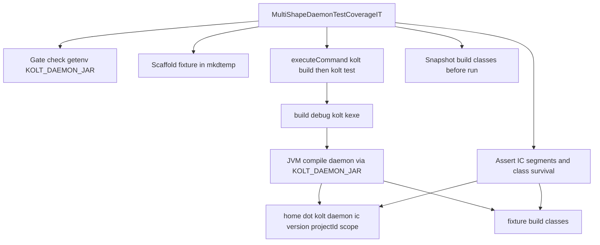

# Design Document

## Overview

**Purpose**: PR #376 で `kolt test` (JVM) が JVM compile daemon 経由化されたが、 回帰防御は `kolt-jvm-compiler-daemon` の self-host smoke (BTA layer の unit/integration test) のみで、 一つの project shape (serialization plugin あり、 多依存) に依存している。 別 shape (plugin なし最小、 plugin あり別種) で発火する regression は捕まらない。 本 spec は native integration test 集合に「複数 shape を scaffold して `kolt build && kolt test` を daemon 経由で実走させ、 daemon-side IC layout と build artifact survival を assert する」 IT を追加する。

**Users**: kolt メンテナーが PR レビュー / CI 確認時に「daemon 経由 `kolt test` が複数 shape で壊れていないこと」 を mechanical に確認できる。

**Impact**: Production code は変更しない。 テスト集合に 1 ファイル (新規 IT) と関連 fixture content が追加される。 CI default の `kolt test` は変化しない (gate 条件なし時 skip)。

### Goals
- JVM プロジェクト 2 種類 (plugin なし、 serialization plugin あり) に対する end-to-end IT の追加
- Daemon-side IC state の `main/` / `test/` segment populate を mechanical に検証
- `kolt build` 後の main `.class` artifact が `kolt test` 通過後も残ることを mechanical に検証
- Bootstrap-gated 実行 (`KOLT_DAEMON_JAR` env 必須) で parent kolt の通常 `kolt test` を汚染しない

### Non-Goals
- Multi-module shape のカバレッジ (#322 系)
- Scripts-only / no-main shape のカバレッジ (DoD 外)
- Native-compiler daemon (`kolt-native-compiler-daemon`) のカバレッジ拡張
- 既存 `BtaSerializationPluginTest` 等 daemon 内 unit/integration test の構造変更
- Production code (kolt resolver, daemon, build pipeline) への変更

## Boundary Commitments

### This Spec Owns
- 新規 IT ファイル `MultiShapeDaemonTestCoverageIT.kt` (`src/nativeTest/kotlin/kolt/cli/`) の追加
- Fixture content (kolt.toml + Kotlin sources) を IT 内に embedded literal として持つ
- IT 内で完結する gate / scaffold / subprocess 実行 / IC path 観察 / artifact survival 観察 helper
- IT が前提とする `KOLT_DAEMON_JAR` env の解釈 (set + valid path = 実行、 unset = silent skip、 set + invalid = fail)

### Out of Boundary
- Daemon (`kolt-jvm-compiler-daemon`) 側の IC layout 実装 / wire protocol / fallback policy
- `KOLT_DAEMON_JAR` resolver (`DaemonJarResolver.kt`) の挙動変更
- `kolt.cli.testfixture` package への helper 外出し (将来別 IT で再利用が必要になった時点で別 spec)
- CI workflow の env 設定変更 (どこで `KOLT_DAEMON_JAR` を set するかは運用判断、 本 spec は「set されている前提で動く」のみ規定)
- `BtaIncrementalCorruptionSmokeTest` 等既存 daemon-side smoke の置き換え

### Allowed Dependencies
- `src/nativeMain/kotlin/kolt/infra/Process.kt` の `executeCommand`
- `src/nativeMain/kotlin/kolt/infra/Sha256.kt` の `sha256Hex`
- `src/nativeMain/kotlin/kolt/build/daemon/IcStateCleanup.kt` の `daemonIcProjectIdOf` (公開 API である前提)
- POSIX cinterop (`platform.posix`): `mkdtemp`, `getenv`, `getcwd` 系
- `JvmTestSysPropIT.kt` 内 helper のうち、 同パッケージから可視なもの (例: `locateKoltKexe`、 `currentWorkingDir`、 `printOnceSkipNotice`)。 可視性が `private` ならば本 IT 内に同等関数を再定義する

### Revalidation Triggers
- `IcStateLayout` の path 規約変更 (`<icRoot>/<kotlinVersion>/<projectId>/<scope>/` の構造変更)
- `daemonIcProjectIdOf` の sha256 算式変更 (`take(32)` の桁数変更含む)
- Build artifact 出力先の変更 (`build/classes/` → `build/<profile>/classes/` 等)
- `KOLT_DAEMON_JAR` env semantics の変更 (例: 廃止、 名称変更)
- `JvmTestSysPropIT` から借用した helper の signature 変更

## Architecture

### Existing Architecture Analysis

本 spec は production architecture には触らず、 既存 native test layer に試験ファイルを 1 件追加するのみ:

- `src/nativeTest/kotlin/kolt/cli/` には既に `JvmTestSysPropIT.kt` が同形パターン (mkdtemp + kolt.toml emit + `executeCommand` で `kolt build && kolt test` を呼ぶ + 結果 assert) で存在し、 そのまま rolemodel として参照できる
- Daemon-side IC layout は JVM 側 (`IcStateLayout.kt`) で定義されているが、 native 側にも `IcStateCleanup.daemonIcProjectIdOf` という同算式の復元式が存在する。 本 IT はそれを呼び出して expected `<projectId>` を組み立てる
- 既存 `BtaSerializationPluginTest` の fixture content (kolt.toml + `@Serializable` Kotlin source) を serialization shape のテンプレートとして参考

### Architecture Pattern & Boundary Map



**Architecture Integration**:
- Selected pattern: file-private helper + 2 `@Test` methods (一つの shape あたり一つの test)
- Domain/feature boundaries: IT は production code を import しない (test fixture content は文字列リテラル)。 ただし IC path 算式と subprocess API は production code から借用する (`daemonIcProjectIdOf`、 `executeCommand`、 `sha256Hex`)
- Existing patterns preserved: `JvmTestSysPropIT` の scaffold + subprocess + assert 構造、 `BtaSerializationPluginTest` の serialization fixture
- New components rationale: 既存 IT に shape 追加するのではなく独立ファイルにする → assertion 軸 (IC segment + artifact survival) が異なるため

### Technology Stack

| Layer | Choice / Version | Role in Feature | Notes |
|-------|------------------|-----------------|-------|
| Test framework | kotlin.test (既存) | `@Test` annotation, `assertEquals`, `assertTrue` | nativeTest デフォルト |
| Subprocess | `kolt.infra.executeCommand` | child kolt build/test の実走 | POSIX fork+execvp wrap |
| Filesystem | POSIX cinterop (`mkdtemp`, `stat`) | fixture dir, file 存在 / 列挙 | 既存 native test と同じ |
| Hashing | `kolt.infra.sha256Hex` + `daemonIcProjectIdOf` | expected projectId 算出 | 既存 production helper を借用 |
| Fixture Kotlin version | `2.3.20` (literal) | fixture kolt.toml と IC path 計算で共通 | drift 抑止のため IT 内 `const val` で 1 か所定義 |

## File Structure Plan

### Directory Structure
```
src/nativeTest/kotlin/kolt/cli/
└── MultiShapeDaemonTestCoverageIT.kt    # 新規: 2 shape の IT + file-private helpers
```

### Modified Files
- なし (既存 production / test code は変更しない)

### File 内構造 (`MultiShapeDaemonTestCoverageIT.kt`)
- Top-level `const val FIXTURE_KOTLIN_VERSION = "2.3.20"`
- `class MultiShapeDaemonTestCoverageIT` containing:
  - `@Test fun runs daemon-routed test on JVM project without plugins()`
  - `@Test fun runs daemon-routed test on JVM project with serialization plugin()`
- File-private helpers:
  - `private fun ensureGateOrSkip(): Boolean` — `getenv("KOLT_DAEMON_JAR")` が null なら 1 度だけ stderr に notice を出して `false` を返す。 set されているが path が存在しないなら `fail(...)`
  - `private fun scaffoldNoPluginFixture(): String` — fixture dir abs path を返す
  - `private fun scaffoldSerializationFixture(): String` — 同上
  - `private fun snapshotMainClassFiles(fixtureDir: String): Set<String>` — `<fixtureDir>/build/classes/` 配下 `.class` の abs path 集合を返す
  - `private fun runKoltBuildAndTest(fixtureDir: String): Int` — `executeCommand` で `kolt.kexe build && kolt.kexe test` を実行、 exit code を返す。 `KOLT_DAEMON_JAR` を child env に明示伝搬
  - `private fun assertIcSegmentsPopulated(fixtureDir: String)` — `~/.kolt/daemon/ic/<FIXTURE_KOTLIN_VERSION>/<daemonIcProjectIdOf(absFixture)>/{main,test}/bta/` が exist かつ non-empty
  - `private fun assertMainClassesSurvive(fixtureDir: String, before: Set<String>)` — `before` 内の各 path が現在も file として exist

## Requirements Traceability

| Requirement | Summary | Components | Interfaces / Behaviors |
|-------------|---------|------------|------------------------|
| 1.1 | Plugin なし fixture | `MultiShapeDaemonTestCoverageIT.scaffoldNoPluginFixture` | kolt.toml に `[plugins]` 不在、 `src/main/kotlin/Main.kt` + `src/test/kotlin/MainTest.kt` |
| 1.2 | Serialization plugin fixture | `MultiShapeDaemonTestCoverageIT.scaffoldSerializationFixture` | kolt.toml に `[kotlin.plugins] serialization = true`、 `@Serializable` data class + Json 往復 test |
| 1.3 | Daemon 経由 `kolt build && kolt test` 実走 | `runKoltBuildAndTest` | `executeCommand` 経由で `build/debug/kolt.kexe`、 `KOLT_DAEMON_JAR` env を child に伝搬 |
| 1.4 | 各 fixture isolated tempdir | `scaffold*Fixture` | `mkdtemp` で fixture ごとに独立 dir |
| 2.1 | `main/bta/` populate 確認 | `assertIcSegmentsPopulated` | `~/.kolt/daemon/ic/<v>/<projectId>/main/bta/` non-empty |
| 2.2 | `test/bta/` populate 確認 | 同上 | `~/.kolt/daemon/ic/<v>/<projectId>/test/bta/` non-empty |
| 2.3 | `main/` と `test/` が同じ projectId 配下 | 同上 | 2 path の親 dir (= projectId 部分) を比較 |
| 2.4 | 欠損時の identifying message | 同上 | `assertTrue(condition, message="missing $segment for fixture $fixtureName")` |
| 3.1 | Build 後 `.class` snapshot | `snapshotMainClassFiles` (build 直後呼ぶ) | `build/classes/` 配下 `.class` の abs path 集合 |
| 3.2 | Test 後 snapshot 全 path 残存 | `assertMainClassesSurvive` | `before` 集合の各 path に対し `stat` が file として成功 |
| 3.3 | 欠損時の identifying message | 同上 | `assertTrue(file exists, message="$path was deleted in fixture $fixtureName")` |
| 4.1 | Gate unset 時 silent skip | `ensureGateOrSkip` | `getenv("KOLT_DAEMON_JAR") == null` で early return |
| 4.2 | Gate set 時に全 fixture 実行 | `@Test` 2 個がそれぞれ独立に gate check + 実行 | — |
| 4.3 | env-pointed jar が daemon backend として使われる | `runKoltBuildAndTest` | `KOLT_DAEMON_JAR` を child env に明示注入 (parent inherit に依存しない) |
| 4.4 | Gate set + invalid path で fail | `ensureGateOrSkip` | env value の path が `stat` で存在しないなら `fail("KOLT_DAEMON_JAR points to non-existent path: $value")` |
| 5.1 | Default `kolt test` で fixture 実行しない | `ensureGateOrSkip` | gate unset 時に scaffold/subprocess を一切呼ばない (early return) |
| 5.2 | Skip 時の 1 行 notice | `ensureGateOrSkip` | `printOnceSkipNotice` 相当を file-private で持つ |

## Components and Interfaces

### Test Suite Layer

#### MultiShapeDaemonTestCoverageIT

| Field | Detail |
|-------|--------|
| Intent | 複数 JVM project shape に対する daemon-routed `kolt build && kolt test` の end-to-end regression test |
| Requirements | 1.1, 1.2, 1.3, 1.4, 2.1, 2.2, 2.3, 2.4, 3.1, 3.2, 3.3, 4.1, 4.2, 4.3, 4.4, 5.1, 5.2 |
| Owner / Reviewers | (kolt maintainers) |

**Responsibilities & Constraints**
- Production code を import しない (helper 借用は test 自身が import)
- Fixture content は文字列リテラル (separate resource ファイルにしない)
- 各 `@Test` は独立 fixture dir で完結。 test 間で state を共有しない
- Gate (`KOLT_DAEMON_JAR`) 未設定なら scaffold / subprocess を一切呼ばない

**Dependencies**
- Inbound: kolt.test 経由 `@Test` discovery (P0)
- Outbound: `kolt.infra.executeCommand` (P0)、 `kolt.infra.sha256Hex` (P0)、 `kolt.build.daemon.daemonIcProjectIdOf` (P0)
- External: POSIX cinterop `mkdtemp` / `getenv` / `stat` (P0)、 child process `build/debug/kolt.kexe` (P0)

**Contracts**: Service [ ] / API [ ] / Event [ ] / Batch [ ] / State [x]

##### State Management
- State model: 各 `@Test` 内で `mkdtemp` → fixture dir のローカル state。 daemon の `~/.kolt/daemon/ic/` への副作用はあるが projectId が温度 dir 由来なので test 間で衝突しない
- Persistence & consistency: 試験終了後 fixture dir も IC state も明示削除しない (parent kolt の reaper / 後続 test の独立 projectId に依存)
- Concurrency strategy: kotlin.test nativeTest はデフォルト sequential。 daemon socket は他 build/test と共有だが kolt 側の lock で吸収される

**Implementation Notes**
- Integration: `JvmTestSysPropIT.kt` 内 helper (`locateKoltKexe`, `currentWorkingDir`, `printOnceSkipNotice` 等) のうち file-public なものは再利用、 private のものは本 IT 内に同名で再実装する
- Validation:
  - `runKoltBuildAndTest` は exit code 0 を assertion (テスト失敗を `kolt test` 失敗と区別するため stderr/stdout はファイル経由でキャプチャし、 失敗時にメッセージへ含める)
  - IC path 算式 (`daemonIcProjectIdOf` + `FIXTURE_KOTLIN_VERSION`) は test 内で 1 か所だけ参照
- Risks:
  - 借用 helper (`locateKoltKexe` 等) が `private` で見えない可能性 — その場合本 IT 内に同等関数を再実装
  - `daemonIcProjectIdOf` の現行 visibility (internal / public) が不明 — impl 時に確認、 internal なら同算式を IT 内に再実装するか visibility を緩める判断が必要
  - Serialization fixture の正確な dependency 宣言 (`kotlinx-serialization-json` runtime を `[dependencies]` に明示する必要があるか、 plugin 宣言だけで足りるか) は impl 時に最小再現で確定する。 設計上の契約は「serialization plugin を使う JVM project が build/test 成功する」 のみ
  - `BtaSerializationPluginTest` の fixture と Kotlin version literal が drift する可能性 — 本 IT は `FIXTURE_KOTLIN_VERSION` 1 か所のみ。 daemon-side test との sync はメンテナンス時の手動確認

## Testing Strategy

本 spec 自身がテストの追加なので、 通常の test pyramid 配置とは異なる。 代わりに「追加された IT 自体の妥当性検証」 を記述する:

### IT 動作検証 (manual)
- IT を `KOLT_DAEMON_JAR` set + valid path で実走させ、 両 `@Test` が pass することを確認
- IT を `KOLT_DAEMON_JAR` unset で実走させ、 silent skip + 1 行 notice が出ることを確認 (parent `kolt test` 実行)
- IT を `KOLT_DAEMON_JAR=/nonexistent/path` で実走させ、 fail with clear message が出ることを確認

### 回帰防御性の確認 (manual)
- #376 が修正したバグ (BTA `inputsCache` cross-contamination で main `.class` が消える) を一時的に revert した状態で IT を回し、 Requirement 3 の assertion (`assertMainClassesSurvive`) が fail することを確認
- IC path 規約を意図的に間違えた literal (例 `<icRoot>/wrong-version/...`) で `assertIcSegmentsPopulated` を呼び、 fail することを確認

### Boundary 確認
- IT が production import を持っていないこと (test 自身の import 文を grep で確認、 借用は `kolt.infra.*` と `kolt.build.daemon.daemonIcProjectIdOf` のみ)
- Default `kolt test` の wall time が IT 追加前後で計測上ほぼ変化しないこと (gate skip path の overhead が ms 単位であること)
