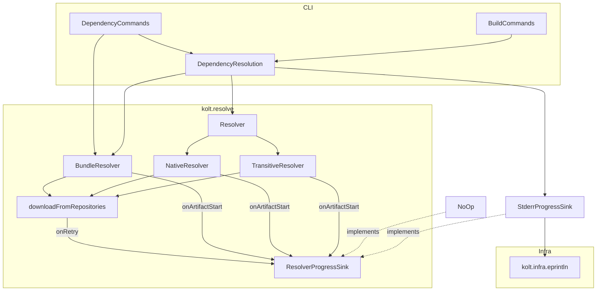
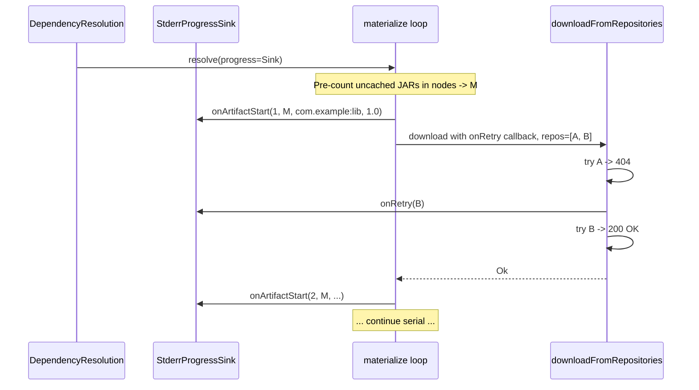

# Design — 404-resolver-progress

## Overview

**Purpose**: Surface per-artifact JAR / klib download progress and per-attempt repository retries to stderr during dependency resolution, so users running `kolt build`, `kolt add`, `kolt fetch`, and `kolt update` can tell whether kolt is fetching, blocked on a slow mirror, or hung on DNS.

**Users**: Anyone exercising the in-Kotlin resolver against an uncached or partially-cached dependency set, especially on slow / flaky networks or with multiple `[repositories]` entries.

**Impact**: The resolver kernel and its CLI entry points gain a `ResolverProgressSink` injection point (defaulted to no-op for tests and other consumers). `kolt build / add / fetch / update` wire a stderr-backed sink. The existing `resolving dependencies…` / `resolving native dependencies…` / `updating dependencies…` banners move from stdout to stderr so stdout stays clean for command output.

### Goals

- A `[N/M] <group:artifact:version>` line on stderr before each network fetch of a JAR (JVM path) or klib (Native path).
- Per-attempt retry annotation on stderr when an HTTP 404 falls through to the next configured repository.
- Identical progress contract for the JVM transitive resolver, the Kotlin/Native target resolver, and `[classpaths.<name>]` bundle resolution.
- Stdout free of progress and banners across the in-scope commands.
- An emission contract usable when concurrent fetch lands later — the sink interface must allow a buffered or serialized implementation without changing resolver signatures.

### Non-Goals

- Implementing concurrent fetch in the resolver kernels.
- A `--quiet` / `--no-progress` flag.
- Progress lines for POM, `.module`, sources, or `maven-metadata.xml` fetches.
- Changes to `formatResolveError` rendering on the failure path.
- Sink integration in `kolt outdated`, plugin-jar fetch, BTA-impl fetch, or `kolt add`'s "find latest version" metadata probe.
- Changes to `install.sh` (#405).

## Boundary Commitments

### This Spec Owns

- A `ResolverProgressSink` interface in `kolt.resolve` and its `NoOp` companion default.
- A stderr-backed sink implementation wired by the CLI for `kolt build`, `kolt add`, `kolt fetch`, `kolt update`.
- A pre-count of materialize-loop fetch targets in JVM, Native, and Bundle paths so `M` is known before the first `[N/M]` line.
- Routing the existing dependency-resolution banners (`resolving dependencies…`, `resolving native dependencies…`, `updating dependencies…`) from stdout to stderr.
- Adding an `onRetry: (String) -> Unit = {}` parameter to `downloadFromRepositories`; only the JAR / klib materialize call sites pass a non-default callback.

### Out of Boundary

- Concurrent fetch in `materialize` / `resolveNative` (kept strictly serial in this spec).
- Sink wiring in `kolt outdated` (`OutdatedCommand.kt`), `PluginJarFetcher`, `BtaImplFetcher`, and `resolveSourcesPath`.
- `[N/M]` framing for `fetchLatestVersion` (`DependencyCommands.kt:142`) — this single-artifact metadata probe gets a one-shot `fetching latest version of <ga>...` line on stderr instead (see "Modified Files" → `DependencyCommands.kt` below).
- Error-path rendering changes (covered by closed #355).
- ANSI / TTY detection — progress is plain text on stderr.
- `install.sh` progress (#405).

### Allowed Dependencies

- `kolt.infra.eprintln` for stderr writes.
- `kolt.resolve.ResolverDeps` interface (unchanged shape).
- `kolt.resolve.RepositoryDownloadFailure` / `RepositoryAttempt` (existing — unchanged).
- No new external libraries. No coroutine usage.

### Revalidation Triggers

- Adding a new top-level resolver entry that performs its own materialize-style fetch loop (must wire the sink for parity).
- Introducing concurrent fetch in any resolver path (must verify Req 3.1 by either serializing emission or buffering per-task and flushing atomically).
- Changing the `[N/M]` line format or the retry annotation wording (downstream tooling could parse stderr).
- Moving `downloadFromRepositories` away from `repos.indices`-style iteration in a way that loses the "next repo to retry against" handle needed by `onRetry`.

## Architecture

### Existing Architecture Analysis

- `kolt.cli.DependencyResolution.{resolveDependencies, resolveNativeDependencies, resolveAllBundles}` is the single CLI integration surface for every dependency-resolution path.
- The resolver kernel injects I/O through `ResolverDeps`. The same pattern is the natural seam for progress: a second injectable `ResolverProgressSink`, defaulted to NoOp.
- `downloadFromRepositories` is the single function that handles 404 fall-through across `[repositories]` entries; nine call sites use it. Adding a defaulted retry callback lets only the in-scope call sites surface retries while the others stay silent.
- Both `materialize` (JVM) and `resolveNative` already iterate `nodes` in strict serial `for` loops; Req 3 is satisfied by serialization in this spec, with the sink interface holding the contract for a future parallel rewrite.
- `kolt.infra.output` already provides stderr writers (`eprintln`, `eprintDiagnostic`) with ANSI / color policy. The stderr sink reuses `eprintln` directly — diagnostic severity rendering is not appropriate for progress (no error / warning / note label).

### Architecture Pattern & Boundary Map



**Key decisions** (not visible in the diagram):
- `ResolverProgressSink` is dependency-injected into resolver entry points and defaults to `NoOp`. Existing tests and non-CLI consumers (`BtaImplFetcher`, `DaemonPreconditions`) inherit silent behavior without code changes.
- `onArtifactStart` is emitted at the *materialize* layer, not inside `downloadFromRepositories`. Materialize knows artifact identity and the pre-counted total `M`; the inner download loop only knows URLs.
- `onRetry` is emitted from inside `downloadFromRepositories` because that is the only function that holds the per-attempt failure / retry state. The callback fires after a 404 is recorded and before the next iteration begins, with the *next* repo as argument.
- POM, `.module`, sources, and metadata-XML fetches stay silent. They go through `downloadFromRepositories` with the default `onRetry = {}`. The `resolving dependencies…` banner covers the metadata / graph-resolution phase implicitly.

### Technology Stack

| Layer | Choice | Role |
| --- | --- | --- |
| CLI | `kolt.cli` Kotlin/Native | Wires `StderrProgressSink` and relocates 3 banners from stdout to stderr |
| Resolver kernel | `kolt.resolve` Kotlin/Native | Threads sink through `resolve()` → `materialize` / `resolveNative` / `resolveBundle`; adds `onRetry` to `downloadFromRepositories` |
| Stderr writer | `kolt.infra.eprintln` (existing) | Single output primitive used by the production sink |

No new dependencies. No version bumps.

## File Structure Plan

### New Files

```
src/nativeMain/kotlin/kolt/resolve/
└── ResolverProgressSink.kt       # interface + NoOp companion (≈25 LoC)

src/nativeTest/kotlin/kolt/resolve/
└── ResolverProgressTest.kt       # recording-sink unit tests for the emission contract
```

### Modified Files

- `src/nativeMain/kotlin/kolt/resolve/Resolver.kt` — add `progress: ResolverProgressSink = ResolverProgressSink.NoOp` to `resolve()`; thread to `resolveTransitive` / `resolveNative`.
- `src/nativeMain/kotlin/kolt/resolve/TransitiveResolver.kt` — add `onRetry` param (default `{}`) to `downloadFromRepositories`; emit on 404 fall-through. Thread `progress` into `resolveTransitive` and `materialize`. In `materialize`, pre-count uncached JAR nodes for `M` and call `progress.onArtifactStart(N, M, ga, version)` before each download. `resolveSourcesPath` keeps default `onRetry = {}` (silent).
- `src/nativeMain/kotlin/kolt/resolve/NativeResolver.kt` — thread `progress` into `resolveNative`. Pre-count uncached klib nodes; emit `onArtifactStart` before each klib `downloadFromRepositories`. `fetchAndRead` (used for `.module` fetches) keeps default `onRetry = {}` (silent).
- `src/nativeMain/kotlin/kolt/resolve/BundleResolver.kt` — accept `progress` in `resolveBundle`, `resolveSingleArtifact`, and `materialiseBundleJarsFromLock`; same materialize-style pre-count and `onArtifactStart` emission for bundle-direct deps. The lock-reuse path (`materialiseBundleJarsFromLock`) is included so a stale-cache + matching-lock combination still surfaces its re-download.
- `src/nativeMain/kotlin/kolt/cli/DependencyResolution.kt`:
  - Provide an internal helper `newStderrProgressSink(): ResolverProgressSink` and use it in **both** `resolveDependencies` (passes to `resolve()` and `resolveAllBundles`) and `resolveNativeDependencies` (passes to `resolve()` at line 357). One sink instance per top-level resolver invocation.
  - Move line 124 `println("resolving dependencies...")` to `eprintln(...)`.
  - Move line 355 `println("resolving native dependencies...")` to `eprintln(...)`.
  - The sink can live as a `private class` inside `DependencyResolution.kt` (one production implementation, no need for a public type yet).
- `src/nativeMain/kotlin/kolt/cli/DependencyCommands.kt`:
  - Move line 248 `println("updating dependencies...")` to `eprintln(...)`.
  - Pass a `newStderrProgressSink()` instance to the explicit `resolve()` and `resolveAllBundles` calls in `doUpdateInner`.
  - In `fetchLatestVersion` (line 142), emit `eprintln("fetching latest version of $group:$artifact...")` once before the `downloadFromRepositories` call. No `[N/M]` framing — this is a single-artifact metadata probe, not a fetch loop. The line resolves the silent gap at the start of `kolt add com.example:lib` (no version) without expanding the sink contract.

> Files outside this list (`OutdatedCommand.kt`, `PluginJarFetcher.kt`, `BtaImplFetcher.kt`, `DaemonPreconditions.kt`, `ToolCommands.kt`) remain unchanged. They obtain `ResolverDeps` and call `resolve()` / `downloadFromRepositories` with sink defaulted to NoOp and `onRetry` defaulted to `{}` — silent by inheritance.

## System Flows

### Per-artifact emission (success after 404 retry)



### Cache-warm path (Req 1.3)

When `M = 0` after the pre-count, the materialize loop emits no `onArtifactStart` calls. The `resolving dependencies…` banner remains the user's only confirmation that resolution ran.

## Requirements Traceability

| Req | Summary | Components | Interfaces / Calls | Flows |
| --- | --- | --- | --- | --- |
| 1.1 | `[N/M] ga:v` before each network fetch | `materialize` (JVM), `resolveNative` (klib), `resolveBundle` (bundle direct) | `ResolverProgressSink.onArtifactStart` | per-artifact emission flow |
| 1.2 | cache hit silent | materialize / resolveNative — emission is inside `if (!fileExists(...))` branch | none | cache-warm path |
| 1.3 | warm cache silent | materialize / resolveNative — pre-count yields `M = 0` | none | cache-warm path |
| 1.4 | parity across JVM and Native | both materializers wire `progress` | `ResolverProgressSink` | both materialize flows |
| 2.1 | retry annotation on 404 fall-through | `downloadFromRepositories` | `onRetry: (String) -> Unit` | per-artifact emission flow |
| 2.2 | retry annotation after `[N/M]`, before next attempt | materialize emits `onArtifactStart` before calling `downloadFromRepositories`; the latter emits `onRetry` between attempts | sequential | per-artifact emission flow |
| 2.3 | non-404 errors emit no retry annotation | `downloadFromRepositories` early-returns on non-404 before calling `onRetry` | conditional | per-artifact emission flow |
| 2.4 | exactly one `[N/M]` per artifact | `onArtifactStart` is called from materialize *outside* `downloadFromRepositories`, so retries don't trigger duplicate emissions | structural | per-artifact emission flow |
| 3.1 | non-interleaving (one artifact = contiguous block) | materialize is strictly serial today; sink interface is stateless on the emitter side, allowing the caller to swap to a buffered impl later | sink contract | — |
| 3.2 | serial today, no buffering required | `StderrProgressSink` calls `eprintln` synchronously | direct dispatch | — |
| 3.3 | future parallel safe | sink methods are pure callbacks; a buffered sink can be substituted without changing resolver signatures | sink contract | — |
| 4.1 | progress on stderr | `StderrProgressSink` writes via `eprintln` | `eprintln` | — |
| 4.2 | banner on stderr | `DependencyResolution.kt:124, 355` and `DependencyCommands.kt:248` move from `println` to `eprintln` | `eprintln` | — |
| 4.3 | piped stdout clean | logical consequence of 4.1 + 4.2 | — | `kolt fetch > out.txt` keeps `fetch complete` only |
| 5.1 | sources fetch silent | `resolveSourcesPath` calls `downloadFromRepositories` with default `onRetry = {}` and is not invoked from a materialize loop that emits `onArtifactStart` for sources | structural | — |
| 5.2 | sources failure silent | `resolveSourcesPath` already returns `null` on failure; no error rendering added | structural | unchanged |

## Components and Interfaces

| Component | Domain / Layer | Intent | Req coverage | Key dependencies | Contracts |
| --- | --- | --- | --- | --- | --- |
| `ResolverProgressSink` | resolve | Two-method sink defining the progress emission contract; `NoOp` companion | 1.1, 2.1, 3.3 | none (P0) | Service |
| `StderrProgressSink` (private to CLI) | cli | Production sink that writes `[N/M] …` and `  -> retry against …` to stderr via `eprintln` | 1.1, 2.1, 4.1 | `kolt.infra.eprintln` (P0), `ResolverProgressSink` (P0) | Service |
| `materialize` (JVM) | resolve | Pre-counts uncached JARs and emits `onArtifactStart` before each network download; threads `onRetry` into `downloadFromRepositories` | 1.1, 1.2, 1.3, 1.4, 2.4 | `ResolverDeps` (P0), `downloadFromRepositories` (P0) | Service |
| `resolveNative` | resolve | Pre-counts uncached klibs and emits `onArtifactStart` before each klib download | 1.1, 1.4 | `ResolverDeps` (P0), `downloadFromRepositories` (P0) | Service |
| `resolveBundle` / `resolveSingleArtifact` / `materialiseBundleJarsFromLock` | resolve | Emits `onArtifactStart` for `[classpaths.<name>]` direct entries (including the lock-reuse re-download path) | 1.1, 1.4 | `ResolverDeps` (P0), `downloadFromRepositories` (P0) | Service |
| `downloadFromRepositories` | resolve | Adds `onRetry: (String) -> Unit = {}`; fires the callback after a 404 and before the next iteration | 2.1, 2.2, 2.3 | `ResolverDeps.downloadFile` (P0) | Service |
| `DependencyResolution` (CLI wiring) | cli | Constructs `StderrProgressSink` for **both** `resolveDependencies` (JVM transitive) and `resolveNativeDependencies` (Kotlin/Native), passes to `resolve()` and `resolveAllBundles`, relocates two banners | 1.4, 4.1, 4.2, 4.3 | `eprintln` (P0), `ResolverProgressSink` (P0) | Service |
| `DependencyCommands` (CLI wiring) | cli | Same sink wiring for `kolt update`; relocates `updating dependencies...` banner; emits `fetching latest version of <ga>...` line in `fetchLatestVersion` to close the metadata-probe silent gap before `kolt add` enters `resolveDependencies` | 1.4, 4.1, 4.2, 4.3 | `eprintln` (P0), `ResolverProgressSink` (P0) | Service |

### `ResolverProgressSink` — Service

```kotlin
package kolt.resolve

interface ResolverProgressSink {
  fun onArtifactStart(index: Int, total: Int, groupArtifact: String, version: String)
  fun onRetryAgainst(repository: String)

  companion object {
    val NoOp: ResolverProgressSink = object : ResolverProgressSink {
      override fun onArtifactStart(index: Int, total: Int, groupArtifact: String, version: String) {}
      override fun onRetryAgainst(repository: String) {}
    }
  }
}
```

**Preconditions**:
- `onArtifactStart` is called exactly once per uncached JAR / klib in a single `resolve()` invocation.
- `onArtifactStart` is called with `1 ≤ index ≤ total` and a stable `total` for the duration of one resolver invocation.
- `onRetryAgainst` is called only after `onArtifactStart` for the same artifact and only when an HTTP 404 against one repository falls through to a non-empty next repository in the configured list.

**Postconditions**:
- The sink does not throw. Implementations must swallow stderr write failures.

**Invariants**:
- Implementations are not required to be thread-safe. The current resolver is serial; if a future change introduces concurrent fetch, the calling code is responsible for serializing emission or providing a thread-safe sink (Req 3.3).

### `StderrProgressSink` — production implementation

```kotlin
private class StderrProgressSink(
  private val emit: (String) -> Unit = ::eprintln,
) : ResolverProgressSink {
  override fun onArtifactStart(index: Int, total: Int, groupArtifact: String, version: String) {
    emit("[$index/$total] $groupArtifact:$version")
  }
  override fun onRetryAgainst(repository: String) {
    emit("  -> retry against $repository")
  }
}
```

**Output examples**:

```
resolving dependencies...
[1/3] com.squareup.okio:okio-jvm:3.9.0
[2/3] com.example:flaky:1.0.0
  -> retry against https://repo.internal.example.com/maven2/
[3/3] org.jetbrains.kotlinx:kotlinx-coroutines-core:1.10.0
```

The `emit` parameter is for unit testing — production wiring uses the `eprintln` default.

### `downloadFromRepositories` — modified signature

```kotlin
internal fun downloadFromRepositories(
  repos: List<String>,
  destPath: String,
  urlBuilder: (String) -> String,
  download: (String, String) -> Result<Unit, DownloadError>,
  onRetry: (String) -> Unit = {},
): Result<Unit, RepositoryDownloadFailure>
```

Internal change: iterate `repos.indices`. After appending a 404 attempt, if the loop is about to advance to `repos[i+1]`, call `onRetry(repos[i+1])` exactly once before the next iteration begins. No callback on the final attempt that exhausts the list and on any non-404 error (preserves Req 2.3).

### `resolve()` — modified signature

```kotlin
fun resolve(
  config: KoltConfig,
  existingLock: Lockfile?,
  cacheBase: String,
  deps: ResolverDeps,
  mainSeeds: Map<String, String> = config.dependencies,
  testSeeds: Map<String, String> = emptyMap(),
  progress: ResolverProgressSink = ResolverProgressSink.NoOp,
): Result<ResolveResult, ResolveError>
```

`resolveTransitive`, `resolveNative`, `materialize`, `resolveBundle`, and `resolveSingleArtifact` gain the same defaulted parameter and forward it.

### Materialize pre-count and emission (JVM, applied analogously to Native and Bundle)

```kotlin
val toFetch = nodes.filter { node ->
  val coord = parseCoordinate(redirects[node.groupArtifact] ?: node.groupArtifact, node.version)
    .getOrElse { return@filter false }
  !deps.fileExists("$cacheBase/${buildCachePath(coord)}")
}
val total = toFetch.size
var index = 0

for (node in nodes) {
  // ... existing resolve / sha / lockfile bookkeeping ...
  if (!binaryWasCached) {
    index += 1
    progress.onArtifactStart(index, total, node.groupArtifact, node.version)
    downloadFromRepositories(
      repos,
      fullCachePath,
      { buildDownloadUrl(coord, it) },
      deps::downloadFile,
      onRetry = progress::onRetryAgainst,
    ).getOrElse { failure -> return Err(ResolveError.DownloadFailed(node.groupArtifact, failure)) }
    lockChanged = true
  }
  // ... sha + sourcesPath unchanged; resolveSourcesPath stays silent ...
}
```

**Notes**:
- Pre-count adds `O(N)` extra `fileExists` calls. `fileExists` is a `stat` — the added cost is negligible against network I/O.
- The `index` variable counts only emitted artifacts; cached nodes do not advance it.
- `resolveSourcesPath` does not call the sink, satisfying Req 5.1 / 5.2.

## Error Handling

No new error categories. The existing `ResolveError` ADT and `formatResolveError` rendering are unchanged. When a fetch fails, the user sees the existing per-repository error dump after the `[N/M]` line and any `onRetryAgainst` annotations have been printed.

## Testing Strategy

### Unit Tests (new `ResolverProgressTest.kt`)

Drives `resolveTransitive` / `resolveNative` / `resolveBundle` with a `RecordingSink` that captures `onArtifactStart` and `onRetryAgainst` calls in a list. Backed by the same anonymous `ResolverDeps` fakes already used in `TransitiveResolverTest`.

1. **Happy path, all uncached** (Req 1.1, 1.4): three direct deps, no transitives, all uncached; assert exactly three `onArtifactStart` calls with `(1,3)`, `(2,3)`, `(3,3)` and matching GA / version.
2. **Cache hit silence** (Req 1.2): two deps, one already in cache; assert one `onArtifactStart` for the uncached only and `total = 1`, not 2.
3. **Warm cache** (Req 1.3): both deps cached; assert zero `onArtifactStart` calls.
4. **Native parity** (Req 1.4): same shape as case 1 against `resolveNative` with klib fakes.
5. **404 retry annotation** (Req 2.1, 2.4): two repos, first returns 404 for the JAR, second returns 200; assert exactly one `onArtifactStart` followed by exactly one `onRetryAgainst(repo[1])`.
6. **Multi-hop retry** (Req 2.1): three repos, first two 404, third 200; assert two `onRetryAgainst` calls in order `[repo[1], repo[2]]`.
7. **Non-404 silent retry** (Req 2.3): first repo returns `NetworkError`; assert no `onRetryAgainst` and the resolver returns `DownloadFailed` (existing behavior).
8. **Sources silent** (Req 5.1, 5.2): force a sources fetch with the binary already cached; assert no `onArtifactStart` for sources.

### Integration Smoke (existing test surface, augmented)

- Reuse the existing CLI integration patterns (if a stderr-capture harness exists; otherwise this is manual). Run `kolt fetch` against a fixture project with one repo that 404s and a fallback repo that resolves; assert stderr contains `[1/1]` and `-> retry against …` lines and stdout is `fetch complete\n`.

### Manual Verification

- `rm -rf ~/.kolt/cache/<group>/...` then `kolt build` — observe the `[N/M]` count up the live download.
- `kolt fetch > out.txt 2> err.txt` — confirm `out.txt` is `fetch complete\n` only, `err.txt` carries banner + progress.
- Multi-repo fixture (`kolt.toml` with two `[repositories]` entries, second hosts a coordinate the first does not) — confirm `-> retry against …` line.

## Performance & Scalability

- Pre-count adds one extra `fileExists` per dep — `O(N)`, no I/O beyond `stat`.
- Per uncached artifact: 1 `eprintln` for `onArtifactStart`, plus 0..R `eprintln` for retry where R = number of 404 fall-throughs (typically 0).
- No effect on warm-cache `kolt build` latency: with `M = 0`, no sink methods fire and no extra `fileExists` calls happen beyond the existing ones (the pre-count short-circuits when `nodes.filter { !cached }` is empty).

## Migration / Rollout

- One-time PR. No data migration.
- No flag, no opt-in. All users see the new lines on first fetch after upgrade.
- Stdout-grep contracts: anyone parsing the previous `resolving dependencies…` line on stdout will break. The banner is informational and not in any documented contract; this is acceptable pre-v1 (per CLAUDE.md "no backward compatibility until v1.0").
- Release-note entry: brief mention in the next bump-version PR's `docs/release-notes/v<X>.md`.

## Open Questions

- **Does `kolt update` benefit from the same per-artifact emission?** The design says yes — `doUpdateInner` already calls `resolve()` directly and now passes the sink. The `updating dependencies…` banner moves to stderr alongside the other two. If the maintainer prefers `kolt update` stay silent on per-artifact lines, drop the wiring at `DependencyCommands.kt:249` and keep the banner relocation only.
- **Bundle progress vs. main resolve progress overlap**: the user sees one `[N/M]` sequence for main resolve, then independent `[N/M]` sequences per `[classpaths.<name>]` bundle. For typical projects (1–2 small bundles) this reads fine; for projects with many bundles the eye has to track resets. Aggregating into a global tally requires deferring `M` until all materialize loops have finished cache-checking — non-trivial and rejected for v1 of this feature. Revisit only if dogfood feedback warrants it.
