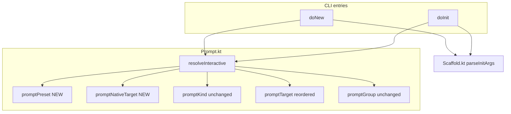
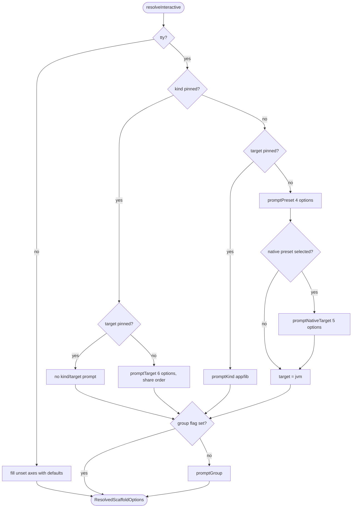

# Technical Design

## Overview

`kolt new` and `kolt init` route through `resolveInteractive` in `Prompt.kt`, which currently runs three independent axis prompts (`kind`, `target`, `group`). This design replaces the no-flag path with a combined-axis preset prompt (4 options: `jvm app` / `jvm lib` / `native app` / `native lib`) followed by a conditional native target sub-prompt, while keeping the single-axis prompts for cases where one flag is already pinned. The native target list (used both in the new sub-prompt and in the existing `--lib`-only fallback target prompt) is reordered by usage share with `macosX64` carrying a `(deprecated)` suffix.

**Purpose**: Make the preset = (kind, target-class) decision the primary axis exposed to the user, aligning `kolt new` with #411's Route A consensus.
**Users**: developers running `kolt new <name>` (or `kolt init`) interactively to scaffold a fresh project.
**Impact**: Replaces the kind→target prompt sequence with preset→optional-native-target. CLI flag semantics, scaffold output, and non-TTY behavior are unchanged for users who already pin both axes via flags.

### Goals

- Show 4 presets in a single column when neither `--lib` nor `--target=` is pinned.
- Show a 5-option native target sub-prompt only after a `native` preset is selected.
- Reorder native targets by usage share (`linuxX64`, `macosArm64`, `mingwX64`, `linuxArm64`, `macosX64`) and surface `macosX64` deprecation visually.
- Preserve existing CLI flag semantics, group prompt, non-TTY defaults, and post-scaffold next-step block.

### Non-Goals

- Expanding `NATIVE_TARGETS` (iOS / Android Native / watchOS / tvOS deferred to #411 Phase 2).
- Adding a `multiplatform lib` preset.
- Host-aware default target selection.
- Changes to `parseInitArgs`, `ScaffoldKind`, scaffold templates, or `kolt.toml` schema.
- Refactoring `Prompt.kt` into a generic list-prompt abstraction (single-call sites; premature).

## Boundary Commitments

### This Spec Owns

- The dispatch logic inside `resolveInteractive` that decides which prompts to fire.
- The new preset prompt (`promptPreset`) emitted only when neither kind nor target is pinned.
- The new native target sub-prompt (`promptNativeTarget`) emitted only after a `native` preset is selected.
- The share-ordered render and `(deprecated)` suffix used in both `promptTarget` (the `--lib`-only fallback path) and `promptNativeTarget`.
- The test coverage in `PromptTest.kt` for the above.

### Out of Boundary

- `parseInitArgs` and the `--lib` / `--app` / `--target` / `--group` flag semantics in `Scaffold.kt`.
- The `ScaffoldKind` enum (`Init.kt`) and the `NATIVE_TARGETS` / `VALID_TARGETS` sets (`Config.kt`).
- The post-scaffold next-step block (`printNextSteps` in `NewCommand.kt`).
- Scaffold template generation (`generateMainKt` / `generateLibKt` / `generateKoltToml` etc.).
- The `--group=` flag and the group prompt body (continues to render unchanged).

### Allowed Dependencies

- `kolt.config.ScaffoldKind`, `kolt.config.DEFAULT_SCAFFOLD_TARGET`, `kolt.config.NATIVE_TARGETS`.
- `kolt.cli.ParsedInitArgs` (defined in `Scaffold.kt`).
- `kolt.infra.output.AnsiCodes`, `kolt.infra.output.ColorPolicy`, `kolt.infra.output.Stream`.
- `com.github.michaelbull.result.{Result, Ok, Err, getOrElse}`.

### Revalidation Triggers

- Adding entries to `NATIVE_TARGETS` (changes the native sub-prompt option count and ordering).
- Adding a new top-level preset (e.g. `multiplatform lib`) — dispatch must grow a branch.
- Changing `parseInitArgs` to add a new pinning axis (e.g. a `--preset=` flag).
- Removing `macosX64` from `NATIVE_TARGETS` (the deprecated suffix becomes dead code).

## Architecture

### Existing Architecture Analysis

`resolveInteractive` is a thin dispatcher. Each axis (kind, target, group) is filled either by flag or by interactive prompt; non-TTY collapses unset axes to defaults. The change is purely additive at the dispatcher layer plus two new prompt helpers; no other module sees the new shape.

### Architecture Pattern & Boundary Map



**Key decisions**

- Dispatch lives entirely inside `resolveInteractive`; CLI entries (`doNew` / `doInit`) are unchanged.
- `promptPreset` and `promptNativeTarget` are new private helpers in `Prompt.kt`.
- `promptTarget` is reordered (share order) and gains the `(deprecated)` suffix; it is still used in the `--lib`-only fallback path and is not invoked from the no-flag path any more.
- No type leaks across the module boundary. The 4-preset list is a private `Prompt.kt` value.

### Technology Stack

| Layer | Choice / Version | Role in Feature | Notes |
|-------|------------------|-----------------|-------|
| CLI / UI | Kotlin/Native (existing) | New prompt helpers | Within `kolt.cli` package |
| Domain | `kolt.config.ScaffoldKind`, `NATIVE_TARGETS` (existing) | Inputs to prompt logic | No schema change |
| Error model | `kotlin-result` 2.x (existing) | `Result<T, String>` for prompt outcomes | `is Ok/is Err` not allowed (memory: kotlin-result value class) |

## File Structure Plan

### Modified Files

- `src/nativeMain/kotlin/kolt/cli/Prompt.kt` — Add `promptPreset` and `promptNativeTarget`; rewrite `resolveInteractive` dispatch; reorder native targets in `promptTarget` (share order, deprecated suffix on `macosX64`).
- `src/nativeTest/kotlin/kolt/cli/PromptTest.kt` — Update no-flag-path expectations to assert preset prompt and (when native preset selected) sub-prompt; reorder target-list assertions; add new tests for native sub-prompt and `--target=`-only path.

### Unchanged Files (referenced for traceability)

- `src/nativeMain/kotlin/kolt/cli/Scaffold.kt` — `ParsedInitArgs`, `parseInitArgs` (consumed read-only).
- `src/nativeMain/kotlin/kolt/cli/NewCommand.kt`, `InitCommand.kt` — call `resolveInteractive`; signature unchanged.
- `src/nativeMain/kotlin/kolt/cli/ScaffoldIO.kt` — IO interface unchanged.
- `src/nativeMain/kotlin/kolt/config/Init.kt`, `Config.kt` — `ScaffoldKind`, `NATIVE_TARGETS`, `DEFAULT_SCAFFOLD_TARGET` consumed read-only.

## System Flows

### Dispatch flow inside `resolveInteractive`



The flow makes the dispatch explicit: each branch maps to a requirement (R1 = no-flag → preset path; R2 = native sub-prompt; R3.1 / R3.2 / R3.3 = the three flag-pinned branches; R4 = non-TTY collapse).

## Requirements Traceability

| Requirement | Summary | Components | Interfaces / Output | Flows |
|-------------|---------|------------|---------------------|-------|
| 1.1 | Preset prompt lists 4 options in declared order | `promptPreset` | `Presets:` header + 4 numbered lines | Dispatch flow no-flag branch |
| 1.2 | Empty input selects `jvm app` | `promptPreset` | Default selection | — |
| 1.3 | Numeric N in 1..4 selects preset N | `promptPreset` | Numeric input parser | — |
| 1.4 | Invalid input → error + non-zero exit | `promptPreset` | `Result.Err` propagated to `eprintError` + `EXIT_CONFIG_ERROR` | — |
| 1.5 | Selecting `jvm app` / `jvm lib` skips native sub-prompt | `resolveInteractive` | Dispatch branch | "native preset selected? no" |
| 2.1 | Native sub-prompt lists 5 options in share order | `promptNativeTarget` | `Native target:` header + 5 numbered lines | Native sub-prompt branch |
| 2.2 | `(deprecated)` suffix on `macosX64` | `promptNativeTarget`, `promptTarget` | Render helper appends suffix to label | — |
| 2.3 | Empty input selects `linuxX64` | `promptNativeTarget` | Default selection | — |
| 2.4 | Numeric N in 1..5 selects target N | `promptNativeTarget` | Numeric input parser | — |
| 2.5 | Invalid input → error + non-zero exit | `promptNativeTarget` | `Result.Err` propagated | — |
| 3.1 | `--lib` alone → flat 6-option target prompt | `resolveInteractive`, `promptTarget` | `Targets:` prompt with share order + deprecated suffix | "kind pinned? yes / target pinned? no" branch |
| 3.2 | `--target=` alone → kind prompt only | `resolveInteractive`, `promptKind` | `Kinds:` prompt | "kind pinned? no / target pinned? yes" branch |
| 3.3 | Both flags → no kind/target prompt | `resolveInteractive` | Dispatch skips both | "no axis prompt" branch |
| 3.4 | Invalid `--target=<value>` → error before prompt | `parseInitArgs` (existing) | Existing `mergeTarget` validation | Pre-prompt fail |
| 4.1 | Non-TTY no flags → `jvm app`, no prompts | `resolveInteractive` | Default fill | "tty? no" branch |
| 4.2 | Non-TTY `--lib` → `jvm lib`, no prompts | `resolveInteractive` | Default fill | "tty? no" branch |
| 4.3 | Non-TTY `--target=<v>` → `app` for `<v>`, no prompts | `resolveInteractive` | Default fill | "tty? no" branch |
| 5.1 | Group prompt fires after preset/target/kind in TTY | `resolveInteractive` → `promptGroup` | Existing `promptGroup` invocation | Group node in flow |
| 5.2 | `--group=` suppresses group prompt | `resolveInteractive` | Existing `parsed.groupSpecified` short-circuit | — |

## Components and Interfaces

| Component | Domain/Layer | Intent | Req Coverage | Key Dependencies (P0/P1) | Contracts |
|-----------|--------------|--------|--------------|--------------------------|-----------|
| `resolveInteractive` (modified) | CLI / interactive prompt dispatch | Decide which prompts to fire and assemble `ResolvedScaffoldOptions` | 1.5, 3.1, 3.2, 3.3, 4.1, 4.2, 4.3, 5.1, 5.2 | `ScaffoldIO` (P0), `ColorPolicy` (P1), `ParsedInitArgs` (P0) | Service |
| `promptPreset` (new) | CLI / interactive prompt | Render 4 preset options and parse numeric input | 1.1, 1.2, 1.3, 1.4 | `ScaffoldIO` (P0), `ColorPolicy` (P1) | Service |
| `promptNativeTarget` (new) | CLI / interactive prompt | Render 5 native targets share-ordered with deprecated suffix and parse numeric input | 2.1, 2.2, 2.3, 2.4, 2.5 | `ScaffoldIO` (P0), `ColorPolicy` (P1), `NATIVE_TARGETS` (P1) | Service |
| `promptTarget` (modified) | CLI / interactive prompt | Render 6 target options share-ordered with deprecated suffix when `--lib` alone is set | 2.2, 3.1 | Same as `promptNativeTarget` | Service |
| `promptKind` (unchanged) | CLI / interactive prompt | Render 2 kind options | 3.2 | `ScaffoldIO`, `ColorPolicy` | Service |
| `promptGroup` (unchanged) | CLI / interactive prompt | Render group prompt | 5.1, 5.2 | `ScaffoldIO` | Service |

### CLI / interactive prompt

#### `resolveInteractive` (modified)

| Field | Detail |
|-------|--------|
| Intent | Dispatch which interactive prompts to run based on which axes are pinned via flags, then assemble `ResolvedScaffoldOptions` |
| Requirements | 1.5, 3.1, 3.2, 3.3, 4.1, 4.2, 4.3, 5.1, 5.2 |

**Responsibilities & Constraints**

- Decide kind/target dispatch based on `(parsed.kind, parsed.target)` pin state.
- Always run `promptGroup` last unless `parsed.groupSpecified == true`.
- In non-TTY mode, fill any unset axis with its hard-coded default (`ScaffoldKind.APP`, `DEFAULT_SCAFFOLD_TARGET`, `null` group).

**Dependencies**

- Inbound: `doNew`, `doInit` (Outbound from CLI entries).
- Outbound: `promptPreset`, `promptNativeTarget`, `promptKind`, `promptTarget`, `promptGroup`, `parsed.kind / target / group` consumption (Criticality P0).

**Contracts**: Service [x]

##### Service Interface

```kotlin
internal fun resolveInteractive(
  parsed: ParsedInitArgs,
  io: ScaffoldIO,
  policy: ColorPolicy = ColorPolicy.current(),
): Result<ResolvedScaffoldOptions, String>
```

- Preconditions: `parsed` is the result of a successful `parseInitArgs`.
- Postconditions: `Ok(ResolvedScaffoldOptions(kind, target, group))` with `kind ∈ {APP, LIB}`, `target ∈ VALID_TARGETS`. `Err` carries a user-facing message when an interactive prompt fails validation.
- Invariants: in non-TTY mode no prompts are emitted to `io`; in TTY mode the prompts emitted match the dispatch flow above and never include a kind/target prompt for an axis already pinned via flag.

**Implementation Notes**

- Integration: drop-in replacement; `doNew` / `doInit` signatures unchanged.
- Validation: invalid prompt input is bubbled up as `Result.Err`; CLI entries already convert that to `EXIT_CONFIG_ERROR`.
- Risks: dispatch shape regression silently — covered by full PromptTest matrix (one test per dispatch branch).

#### `promptPreset` (new)

| Field | Detail |
|-------|--------|
| Intent | Render the 4-preset prompt and return the selected (kind, isNative) pair |
| Requirements | 1.1, 1.2, 1.3, 1.4 |

**Responsibilities & Constraints**

- Emit header `Presets:` then four numbered lines in this exact order:
  1. `1) jvm app (default)`
  2. `2) jvm lib`
  3. `3) native app`
  4. `4) native lib`
- Apply existing color treatment (cyan for the default, yellow for the others) when `policy.shouldColor(Stream.Stdout)` is true.
- Print `>` on its own line (per #407 input-line convention) and read input via `io.readLine()`.
- Empty / EOF input → option 1 (`jvm app`).
- Numeric N in 1..4 → option N.
- Anything else → `Err("invalid preset '$raw' (expected 1..4)")`.

**Dependencies**

- Inbound: `resolveInteractive`.
- Outbound: `ScaffoldIO`, `ColorPolicy` (Criticality P0/P1).

**Contracts**: Service [x]

##### Service Interface

```kotlin
private fun promptPreset(io: ScaffoldIO, policy: ColorPolicy): Result<PresetChoice, String>

private data class PresetChoice(val kind: ScaffoldKind, val isNative: Boolean)
```

- Preconditions: caller has determined neither kind nor target is pinned.
- Postconditions: `Ok` returns one of the four canonical pairs; `Err` carries a single-line message naming the invalid input and the valid range.

**Implementation Notes**

- Integration: caller pairs the result with either `target = "jvm"` (for `jvm` presets) or the result of `promptNativeTarget` (for `native` presets).
- Validation: numeric-only input matches the existing `promptKind` policy; reuse the same parsing pattern.
- Risks: option labels are user-visible; tests must assert exact strings.

#### `promptNativeTarget` (new)

| Field | Detail |
|-------|--------|
| Intent | Render the 5-option native target sub-prompt and return the selected target identifier |
| Requirements | 2.1, 2.2, 2.3, 2.4, 2.5 |

**Responsibilities & Constraints**

- Emit header `Native target:` then five numbered lines in this exact order:
  1. `1) linuxX64 (default)`
  2. `2) macosArm64`
  3. `3) mingwX64`
  4. `4) linuxArm64`
  5. `5) macosX64 (deprecated)`
- Apply existing yellow color treatment to the target identifier portion when policy allows; the suffix `(deprecated)` is unwrapped (no separate color).
- Empty / EOF input → option 1 (`linuxX64`).
- Numeric N in 1..5 → option N.
- Anything else → `Err("invalid target '$raw' (expected 1..5)")`.

**Dependencies**

- Inbound: `resolveInteractive` (only in the no-flag → native preset branch).
- Outbound: `ScaffoldIO`, `ColorPolicy`, the share-ordered native list (Criticality P0/P1).

**Contracts**: Service [x]

##### Service Interface

```kotlin
private fun promptNativeTarget(io: ScaffoldIO, policy: ColorPolicy): Result<String, String>
```

- Preconditions: caller (`resolveInteractive`) has determined a native preset was selected.
- Postconditions: `Ok` returns one of `{linuxX64, macosArm64, mingwX64, linuxArm64, macosX64}`.

**Implementation Notes**

- Integration: returns a raw target identifier; caller assembles `ResolvedScaffoldOptions(kind=fromPreset, target=fromSubPrompt, group)`.
- Validation: same numeric-only policy as other prompts.
- Risks: the share-ordered list is a private constant; deprecation status is a small data record (`(name, deprecated)` tuple) so adding/removing entries is local.

#### `promptTarget` (modified)

| Field | Detail |
|-------|--------|
| Intent | Render the 6-option target prompt (jvm + 5 native) used in the `--lib`-only fallback path |
| Requirements | 2.2, 3.1 |

**Responsibilities & Constraints**

- Same shape as today (`Targets:` header, jvm option + native options with `-- native --` separator, color treatment).
- Reorder native section by share: `linuxX64, macosArm64, mingwX64, linuxArm64, macosX64`.
- Append `(deprecated)` suffix to `macosX64` (suffix is plain, not color-wrapped).

**Dependencies**

Same as today.

**Contracts**: Service [x] (signature unchanged).

**Implementation Notes**

- Integration: only call site that remains is the `--lib`-only fallback in `resolveInteractive`. The no-flag path no longer reaches this prompt.
- Risks: existing tests that assert the alphabetical order (`2) linuxArm64, 3) linuxX64, ...`) must be updated to share order; this is intentional and feature-driven.

## Testing Strategy

### Unit Tests (`PromptTest.kt`)

- **Preset prompt path (R1)**: TTY no-flags renders `Presets:` + 4 numbered lines in declared order with `(default)` on option 1; empty input selects `jvm app`; numeric `2` / `3` / `4` select `jvm lib` / `native app` / `native lib`; non-numeric input exits with `EXIT_CONFIG_ERROR`.
- **Native sub-prompt (R2)**: After selecting `3` at the preset prompt, `Native target:` header + 5 lines render in share order; `macosX64` line carries `(deprecated)` suffix; empty input selects `linuxX64`; numeric `2..5` map to `macosArm64, mingwX64, linuxArm64, macosX64`; selecting `1` (jvm app) or `2` (jvm lib) at the preset prompt does not emit the native sub-prompt.
- **Flag interaction (R3)**: `--lib` alone emits `Targets:` (6 options share-ordered with deprecated suffix) but no preset prompt; `--target=jvm` alone emits `Kinds:` but no preset prompt and no native sub-prompt; `--lib --target=linuxX64` emits no kind/target prompt; `--target=wasm` exits before any prompt.
- **Non-TTY (R4)**: no prompts emitted; `--lib` produces `kind = "lib"` with `target = "jvm"`; `--target=linuxX64` produces `app` scaffold with `target = "linuxX64"`.
- **Group continuity (R5)**: in every TTY branch the group prompt fires last; `--group=com.example` suppresses it.
- **Color rendering**: under `ColorPolicy.Always`, the default option in the preset prompt is cyan-wrapped and the others are yellow-wrapped (matches existing `promptKind` treatment); under `ColorPolicy.Never`, no ANSI codes are emitted.

### Integration / E2E

No new integration tests required. The existing `DoInitTest` and `DoNewTest` suites cover end-to-end scaffold output for fixed flag combinations and continue to apply.

## Error Handling

### Error Strategy

- All prompt-validation failures bubble up as `Result.Err(message)` from the prompt helper to `resolveInteractive`, then to the CLI entry, where `eprintError(message)` plus `Err(EXIT_CONFIG_ERROR)` is the final user-visible behavior. This matches the existing pattern; no new error path introduced.

### Error Categories and Responses

- **Invalid prompt input** (R1.4, R2.5): single-line message identifying the bad input and the valid range, then non-zero exit.
- **Invalid `--target=` flag value** (R3.4): handled by `parseInitArgs` before any prompt fires; unchanged from today.
- **EOF / closed stdin under TTY**: `io.readLine()` returns `null`; treat as blank input on every prompt and apply defaults (matches existing `ttyEofOnFirstPromptCollapsesToDefaults` behavior).

## Performance & Scalability

Not applicable. Prompt rendering is sub-millisecond and bounded by user input.

## Migration Strategy

No data or schema migration. The change is purely UX-side; the resulting `kolt.toml` content is identical for any (kind, target) pair the user could have produced before. No backward-compatibility shim is added (kolt is pre-v1).
