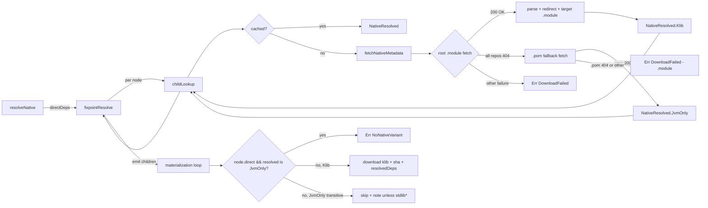

# Design Document

## Overview

Native resolver の transitive 解決経路に `.module` 404 → `.pom` 構造的フォールバックを追加し、 Gradle Module Metadata を公開していない JVM 専用 Kotlin artifact が native の transitive closure に現れた際にビルドを止めないようにする。 `.module` が 404 で `.pom` が 200 OK な artifact は構造的に native variant を持たないため、 transitive context では silent skip (stdlib 系) または stderr note 付き skip として扱い、 direct context では `NoNativeVariant` で error にする。

**Purpose**: kolt-native プロジェクトで mixed-platform library (例 `ktor-server-core`) が transitive に JVM 専用 kotlin artifact (例 `kotlin-reflect`) を引き込んでも build が継続できる。

**Users**: `target = "linuxX64"` を使う kolt user。 影響範囲は native pipeline のみで JVM 経路は不変。

**Impact**: `NativeResolver` の internal data model に sealed variant 一段追加 (`NativeResolved.Klib` / `NativeResolved.JvmOnly`)。 既存の `isKotlinStdlib` skip predicate は `kotlin-stdlib` (link-time bundling 問題) と silent-diagnostic anchor として残置。 ADR 0011 §4 (`kotlin-stdlib-common` の名前 skip) は構造的検出に subsume されるが、 silent skip ポリシーは継続。

### Goals
- `.module` の全 repository で HTTP 404 を構造的に検出し、 `.pom` 存在確認で JVM 専用と判定する fallback 経路を追加する。
- transitive で JVM-only に倒れた artifact を silent skip し (stdlib 系) または stderr 1行 note 付き skip する。
- direct dep が JVM-only に倒れたら `NoNativeVariant` で非ゼロ終了する。
- 再現ケース (`kolt add io.ktor:ktor-server-core` 相当が `kotlin-reflect` で abort しない) を決定的 fixture で regression test 化する。

### Non-Goals
- ktor-server-core の native variant が `kotlin-reflect` を含んでいる根本要因の調査 / 修正 (Layer 2, 別 issue)。
- mixed-platform library の variant 解釈 audit。
- POM ベースの transitive 解決を native context で行うこと (POM の deps を BFS に流さない)。
- JVM 経路 (`TransitiveResolver`) への変更。
- lockfile schema の変更。
- `kolt deps tree` 等の UI 表記。

## Boundary Commitments

### This Spec Owns
- `NativeResolver.fetchNativeMetadata` の root `.module` フェッチに対する 404 構造的検出と `.pom` フォールバック実装。
- `NativeResolved` の sealed variant 化 (`Klib` / `JvmOnly`) と、 それを下流の materialization / childLookup が解釈する分岐。
- transitive JVM-only skip の stderr note 出力ポリシー (silent for stdlib*, note for others)。
- 再現ケースの regression integration test と関連 fixture。

### Out of Boundary
- target `.module` (redirect 先) の 404 ハンドリング。 root `.module` で `available-at` redirect を読めた後の target `.module` が 404 の場合は構造的に「native variant あると宣言されたのに無い」状態であり、 これは Layer 2 の問題。 本仕様では既存挙動 (`DownloadFailed`) を維持する。
- `.pom` の deps を読んで native BFS に流すこと。 `.pom` は存在確認のみ。
- ADR 0011 の改訂 (本仕様完了後に follow-up として検討、 本仕様の必須範囲外)。
- `isKotlinStdlib` の predicate 名 / 場所変更。
- JVM resolver (`TransitiveResolver` 系) のロジック。

### Allowed Dependencies
- 既存 native resolver primitive: `parseCoordinate`, `fetchAndRead`, `downloadFromRepositories`, `buildModuleCachePath`, `buildModuleDownloadUrl`, `buildPomCachePath`, `buildPomDownloadUrl`, `isValidGradleModuleJson`, `parseNativeRedirect`, `parseNativeArtifact`, `isKotlinStdlib`。
- 既存 error 型: `ResolveError.DownloadFailed`, `ResolveError.NoNativeVariant`, `RepositoryDownloadFailure.AllAttemptsFailed`, `DownloadError.HttpFailed`。
- 既存 kernel: `fixpointResolve`, `DependencyNode`, `Child`。
- `kolt.infra.output` の stderr 出力 (eprintln 系)。

### Revalidation Triggers
- `NativeResolved` の sealed shape が変わる (新 variant 追加など) → childLookup / materialization / createNativeLookup を再点検。
- `RepositoryDownloadFailure` / `DownloadError` の sealed shape が変わる → 構造的 404 判定 helper を再点検。
- ADR 0011 の改訂 (本仕様後の follow-up を含む) → silent skip policy / `isKotlinStdlib` の役割を再点検。
- Layer 2 (variant 解釈 audit) の着手 → `JvmOnly` variant のセマンティクスと診断ポリシーを再点検。

## Architecture

### Existing Architecture Analysis

現状の native resolver は以下の構造で動いている (要旨)。

1. `resolveNative` が direct deps を validate し、 `fixpointResolve` に `mainSeeds` を渡す。
2. kernel は each node に対して `childLookup` を呼んで transitive children を取得し、 fixpoint まで反復。
3. `childLookup` 内部で `fetchNativeMetadata` が root `.module` → redirect → target `.module` の 2 段フェッチを行い、 結果 `NativeResolved(redirect, artifact)` を `processed` map にキャッシュ。
4. 反復終了後、 `resolveNative` の materialization loop が `processed` から各 node の klib を download / SHA verify / `resolvedDeps` に追加。
5. `.module` フェッチ失敗 (404 を含む) は `ResolveError.DownloadFailed` として `fixpointResolve` に伝播し、 `resolveNative` が即座に Err を返す = build abort。

`isKotlinStdlib` predicate は 3 か所で適用される:
- direct dep validation loop (`resolveNative` 直上)
- direct dep seeding (`directDeps` filter)
- transitive BFS enqueueing (`childLookup` 内)

### Architecture Pattern & Boundary Map

本仕様は既存の native resolver pipeline に「構造的 fallback」 を 1 段追加する extension。 sealed ADT 駆動の domain polymorphism (steering structure.md の Code Organization Principles) を維持。



**Selected pattern**: 既存 native resolver の pipeline に sealed-variant 駆動の分岐を追加。 新規 component なし。 新規 wire/contract なし。 internal data 表現の拡張のみ。

**Domain/feature boundaries**: すべて `kolt.resolve` パッケージ内部。 cli / build / infra への影響なし。

**Existing patterns preserved**:
- `Result<V, ResolveError>` 駆動の error handling (ADR 0001)。
- sealed ADT for domain polymorphism (structure.md)。
- ADR 0011 §1-§4 の silent skip ポリシー (`kotlin-stdlib` / `kotlin-stdlib-common`)。
- per-repo 404 fall-through (`downloadFromRepositories`)。

**Steering compliance**: kotlin-result `getOrElse` / `isErr` 使用、 sealed class with data variants, ADR citation in code, no wildcard import。

### Technology Stack

| Layer | Choice / Version | Role in Feature | Notes |
|-------|------------------|-----------------|-------|
| Native pipeline | `kolt.resolve.NativeResolver` (linuxX64) | 構造的 fallback 実装と materialization loop の variant 分岐 | 既存 file 改修のみ |
| Test fixture | `nativeTest` + 既存 `ResolverDeps` mock | `.module` 404 / `.pom` 200 / `.pom` 404 の決定的 fixture | live Maven Central を踏まない |
| Diagnostic | `kolt.infra.output` の stderr 経路 (eprintln) | transitive JVM-only skip の 1 行 note | ProgressSink には追加しない |

## File Structure Plan

### Modified Files
- `src/nativeMain/kotlin/kolt/resolve/NativeResolver.kt`
  - `NativeResolved` を `internal sealed class` に変更し `Klib` / `JvmOnly` の 2 variant 化 (テストから直接 variant を assert できるよう `internal`)。
  - `fetchNativeMetadata` に root `.module` 404 構造的判定と `.pom` フォールバックを追加。
  - `makeNativeChildLookup` を `NativeResolved` variant 分岐に対応 (Klib → 既存通り、 JvmOnly → 空 children)。
  - `resolveNative` の materialization loop で `node.direct && resolved is JvmOnly` を `NoNativeVariant` エラー、 transitive JvmOnly は skip + 条件付き stderr note。
  - `createNativeLookup` (deps tree 用) は JvmOnly を `NativeNodeInfo` でどう表現するかは別途 (詳細は Components 節)。
- `src/nativeTest/kotlin/kolt/resolve/NativeResolverTest.kt`
  - 既存「`.module` 404 が fatal」前提のテストを「fallback 後の挙動」に置換。
  - 新規ケース: transitive JvmOnly skip (silent: stdlib-common / note: kotlin-reflect 模擬) と direct JvmOnly が `NoNativeVariant` を返すこと。
- `src/nativeTest/kotlin/kolt/resolve/` 配下に新規 integration test 1 本
  - `NativeResolverJvmOnlyFallbackTest.kt` (仮称) — 再現ケースを決定的 fixture で再現。 `ktor-server-core` 相当の `.module` を bundle した state を持たせ、 `kotlin-reflect` 相当の coordinate は `.module` 404 / `.pom` 200 を返す。

### New Files
- なし (実装は既存 file の内部改修で完結)。

### No Changes
- `src/nativeMain/kotlin/kolt/resolve/Resolution.kt` (kernel)
- `src/nativeMain/kotlin/kolt/resolve/TransitiveResolver.kt` (JVM resolver / `downloadFromRepositories` の 404 fall-through ポリシーは reuse)
- `src/nativeMain/kotlin/kolt/resolve/PomParser.kt` (本仕様では `.pom` 存在確認のみで parse は呼ばない)
- `src/nativeMain/kotlin/kolt/resolve/Resolver.kt` (error 型は既存を再利用)

## System Flows

### Fetch decision flow

```mermaid
sequenceDiagram
    participant K as fixpointResolve
    participant L as childLookup
    participant F as fetchNativeMetadata
    participant R as downloadFromRepositories
    participant S as stderr

    K->>L: (groupArtifact, version)
    L->>F: cache miss
    F->>R: GET .module (root)
    alt root .module 200 OK
        R-->>F: bytes
        F->>F: parse, redirect, fetch target .module
        F-->>L: Ok(Klib)
        L-->>K: children from artifact.dependencies (minus stdlib*)
    else root .module all-repos 404
        F->>R: GET .pom (same root coordinate)
        alt .pom 200 OK
            R-->>F: bytes
            F-->>L: Ok(JvmOnly(coord))
            L-->>K: Ok(emptyList())
        else .pom also 404 (or other)
            F-->>L: Err(DownloadFailed for .module)
            L-->>K: Err
        end
    else root .module non-404 failure
        F-->>L: Err(DownloadFailed)
        L-->>K: Err
    end

    Note over K,S: After fixpoint, materialization decides per-node action
    K->>K: materialization loop iterates nodes
    alt node.direct && resolved is JvmOnly
        K->>K: return Err(NoNativeVariant)
    else transitive && resolved is JvmOnly
        alt isKotlinStdlib(coord)
            K->>K: silent skip
        else
            K->>S: eprintln("note: <coord> has no Gradle Module Metadata; skipping for native target")
        end
    else resolved is Klib
        K->>K: download klib, verify sha, add to resolvedDeps
    end
```

### Gating decisions

- **`all repos 404` 判定**: `RepositoryDownloadFailure.AllAttemptsFailed.attempts` のすべての要素が `DownloadError.HttpFailed(statusCode = 404)` のときのみ「真に未公開」と判定する。 1 つでも非-404 (5xx / NetworkError / WriteFailed) が混ざれば transient とみなして既存の `DownloadFailed` 経路を使う。
- **fallback 適用範囲**: root `.module` のみ。 target `.module` (redirect 後) の 404 は Out of Boundary。
- **note 抑制**: `isKotlinStdlib(coord)` が true なら silent (ADR 0011 §4 の policy 継続)。

## Requirements Traceability

| Requirement | Summary | Components | Interfaces | Flows |
|-------------|---------|------------|------------|-------|
| 1.1 | transitive `.module` 404 → `.pom` フェッチを試行 | `NativeResolver.fetchNativeMetadata` | `fetchAndRead` (内部呼び出し) | Fetch decision flow |
| 1.2 | `.pom` 200 のとき build を継続 | `NativeResolved.JvmOnly`, materialization loop | `childLookup` returns `Ok(emptyList())` for JvmOnly | Fetch decision flow |
| 1.3 | `.module` も `.pom` も unavailable なら `DownloadFailed` を surface | `fetchNativeMetadata` の `.pom` 失敗分岐 | `ResolveError.DownloadFailed` | Fetch decision flow |
| 1.4 | 5xx / network は fallback しない | `all repos 404` 判定 helper | `RepositoryDownloadFailure.AllAttemptsFailed.attempts` 走査 | Gating decisions |
| 2.1 | direct dep `.module` 404 を silent skip しない | materialization loop の direct 分岐 | `DependencyNode.direct` の参照 | Fetch decision flow |
| 2.2 | direct dep JVM-only → `NoNativeVariant` で非ゼロ | materialization loop | `ResolveError.NoNativeVariant` | Fetch decision flow |
| 2.3 | direct `kotlin-stdlib` / `kotlin-stdlib-common` は silent | `directDeps = filterKeys { !isKotlinStdlib(it) }` (既存) | 既存 `isKotlinStdlib` | (既存) |
| 3.1 | `kotlin-stdlib-common` も構造的 fallback で扱える | childLookup の variant 分岐 | `NativeResolved.JvmOnly` | Fetch decision flow |
| 3.2 | `kotlin-stdlib` は名前 skip 維持 | 既存 `isKotlinStdlib` 適用 3 点 | (既存) | (既存) |
| 3.3 | 新規 JVM-only artifact が hardcoded リスト更新不要 | 構造的検出が一般化されている | (動作要件) | Fetch decision flow |
| 4.1 | transitive JvmOnly skip 時に stderr note 1 行 | materialization loop 内 eprintln | stderr (`infra.output` 経由) | Fetch decision flow |
| 4.2 | stdlib 系は silent | `isKotlinStdlib` 先行 short-circuit | 既存 predicate | Gating decisions |
| 4.3 | direct skip は既存挙動 (note 出さない) | direct path は note 出力しない | (動作要件) | Fetch decision flow |
| 5.1 | fallback は native 経路のみ | 変更 file は `NativeResolver.kt` のみ | (動作要件) | (file plan) |
| 5.2 | JVM resolver 不変 | `TransitiveResolver.kt` 修正なし | (動作要件) | (file plan) |
| 5.3 | JVM 既存挙動 (POM-based) 不変 | 変更スコープ外 | (動作要件) | (file plan) |
| 6.1 | 再現ケース regression test | `NativeResolverJvmOnlyFallbackTest` | mock `ResolverDeps` | (test fixture) |
| 6.2 | hardcoded リスト追加に依存しない | テスト fixture が構造的 fallback を経由 | `.module` 404 + `.pom` 200 の mock | (test fixture) |
| 6.3 | 決定的 fixture | live Maven Central を踏まない | `ResolverDeps` の test double | (test fixture) |

## Components and Interfaces

| Component | Domain/Layer | Intent | Req Coverage | Key Dependencies (P0/P1) | Contracts |
|-----------|--------------|--------|--------------|--------------------------|-----------|
| `NativeResolved` sealed class | resolve / data | Klib resolved 状態と JvmOnly 状態を 1 sealed ADT で表現 | 1.2, 2.2, 3.1 | (内部のみ) | State |
| `fetchNativeMetadata` (改修) | resolve / fetch | root `.module` 404 を構造的に検出し `.pom` フォールバックして `JvmOnly` を返す | 1.1, 1.3, 1.4 | `fetchAndRead` (P0), `buildPomDownloadUrl` (P0) | Service |
| `is404OnAllAttempts` (新規 helper) | resolve / fetch | `ResolveError.DownloadFailed` が all-repos 404 か判定 | 1.4 | `RepositoryDownloadFailure` (P0), `DownloadError` (P0) | Service |
| `makeNativeChildLookup` (改修) | resolve / kernel adapter | JvmOnly に対して空 children を返し、 Klib は従来通り `artifact.dependencies` (minus stdlib*) を返す | 1.2, 3.1 | `NativeResolved` (P0) | Service |
| materialization loop in `resolveNative` (改修) | resolve / materialize | direct/transitive と Klib/JvmOnly の組み合わせで klib download / `NoNativeVariant` / silent skip / note skip を分岐 | 2.1, 2.2, 4.1, 4.2, 4.3 | `DependencyNode.direct` (P0), `isKotlinStdlib` (P0), stderr (P1) | Service |
| `createNativeLookup` (deps tree 用) (改修) | resolve / view | JvmOnly node も tree に現れる場合の表現 | 1.2 (補助) | `NativeNodeInfo` (P0) | Service |

### resolve / data

#### `NativeResolved` sealed class

| Field | Detail |
|-------|--------|
| Intent | Resolution kernel が transitive node ごとに保持する状態。 Klib (klib download 可能) と JvmOnly (skip 対象) の 2 variant |
| Requirements | 1.2, 2.2, 3.1 |

**Responsibilities & Constraints**
- 既存 `data class NativeResolved(redirect, artifact)` を sealed class 化し、 Klib variant に同じ内容を移植。 JvmOnly variant は `coordinate: Coordinate` のみ保持。
- `internal` 修飾。 native test から variant assertion できるよう resolver module 内では可視。 native resolver の他 production file からは参照しない。
- caller (childLookup / materialization / createNativeLookup) は variant ごとに分岐する。

**Dependencies**
- Inbound: `makeNativeChildLookup`, `resolveNative` materialization, `createNativeLookup`, `fetchNativeMetadata`
- Outbound: なし (data only)

**Contracts**: State [x]

##### State Management
- 値オブジェクト。 不変。 `processed: MutableMap<String, NativeResolved>` に格納される。

### resolve / fetch

#### `fetchNativeMetadata` (改修)

| Field | Detail |
|-------|--------|
| Intent | 既存の root `.module` → redirect → target `.module` の 2 段フェッチに、 root `.module` 404 を構造的に検出して `.pom` フォールバックする分岐を追加 |
| Requirements | 1.1, 1.3, 1.4 |

**Responsibilities & Constraints**
- root `.module` の fetch 失敗が `is404OnAllAttempts(error) == true` のときのみ `.pom` フォールバックを試行。
- `.pom` フェッチが Ok なら `Ok(NativeResolved.JvmOnly(rootCoord))` を返す。
- `.pom` も失敗したら **元の `.module` DownloadFailed** を返す (ユーザーには `.module` の attempt 一覧が見えるべき)。
- root `.module` が parse できて redirect が取れた以降の挙動は既存通り。 target `.module` 404 は本仕様の対象外。
- 5xx / NetworkError / WriteFailed が混ざる failure は `is404OnAllAttempts == false` なので fallback は走らず、 既存通り `DownloadFailed` を返す。

**Dependencies**
- Inbound: `makeNativeChildLookup`, `createNativeLookup`
- Outbound: `fetchAndRead` (`.module` および新規 `.pom` 呼び出し), `is404OnAllAttempts` (新規 helper), `parseNativeRedirect`, `parseNativeArtifact`

**Contracts**: Service [x]

##### Service Interface
```kotlin
// Visibility promoted to `internal` so the unit test can drive the
// fetchAndRead/fallback path directly with mocked ResolverDeps;
// signature otherwise unchanged.
internal fun fetchNativeMetadata(
  groupArtifact: String,
  version: String,
  nativeTarget: String,
  cacheBase: String,
  repos: List<String>,
  deps: ResolverDeps,
): Result<NativeResolved, ResolveError>
```
- Preconditions: `groupArtifact` is parseable; `repos` は非空 (空なら downloadFromRepositories が `NoRepositoriesConfigured` を返す)。
- Postconditions: Ok の場合、 `NativeResolved.Klib` (既存と同等) または `NativeResolved.JvmOnly(coordinate=rootCoord)` を返す。
- Invariants: `.pom` フォールバックは root `.module` のみで発火する。 target `.module` (redirect 先) では発火しない。

#### `is404OnAllAttempts` (新規 helper)

| Field | Detail |
|-------|--------|
| Intent | `ResolveError.DownloadFailed` の wrapping から「全 attempt が 404」を構造的に判定する |
| Requirements | 1.4 |

**Responsibilities & Constraints**
- `internal` / file-local。 native test の真理表 assertion 用に visible だが、 native resolver の他 production file からは参照しない。
- `RepositoryDownloadFailure.NoRepositoriesConfigured` の場合は false (リポジトリそのものが空なのは "all 404" ではない)。
- `AllAttemptsFailed.attempts` が空のケースは defensively false。

**Dependencies**
- Inbound: `fetchNativeMetadata`
- Outbound: `RepositoryDownloadFailure`, `DownloadError`

**Contracts**: Service [x]

##### Service Interface
```kotlin
internal fun is404OnAllAttempts(error: ResolveError): Boolean
```
- Preconditions: `error` は `fetchAndRead` から返る error 型のいずれか。
- Postconditions: `error is ResolveError.DownloadFailed`、 かつ `failure is AllAttemptsFailed`、 かつ `attempts` 非空、 かつすべての attempt が `DownloadError.HttpFailed(statusCode = 404)` のときのみ true。
- Invariants: side-effect なし。

### resolve / kernel adapter

#### `makeNativeChildLookup` (改修)

| Field | Detail |
|-------|--------|
| Intent | 各 transitive node の `NativeResolved` variant を見て、 Klib なら従来通り、 JvmOnly なら空 children を返す |
| Requirements | 1.2, 3.1 |

**Responsibilities & Constraints**
- variant 分岐は `when (native)` 形式。 Klib: 既存ロジック (artifact.dependencies の map + stdlib skip)。 JvmOnly: `Ok(emptyList())`。
- cache (`processed`) は変わらず GA:version をキーに `NativeResolved` を格納。

**Dependencies**
- Inbound: `resolveNative` (kernel に渡される lambda)
- Outbound: `fetchNativeMetadata`, `isKotlinStdlib`

**Contracts**: Service [x]

##### Service Interface
- 既存シグネチャ `(String, String) -> Result<List<Child>, ResolveError>` を維持。 variant 分岐は実装内部。

### resolve / materialize

#### materialization loop in `resolveNative` (改修)

| Field | Detail |
|-------|--------|
| Intent | fixpoint 終了後、 nodes を iterate しながら variant と direct/transitive を 2 軸で分岐し、 klib download / `NoNativeVariant` / silent skip / note skip を出し分け |
| Requirements | 2.1, 2.2, 4.1, 4.2, 4.3 |

**Responsibilities & Constraints**
- 分岐表:

  | `resolved` | `node.direct` | Action |
  |------------|---------------|--------|
  | `Klib` | true / false | 既存通り — klib download, SHA verify, `resolvedDeps.add` |
  | `JvmOnly` | true | `return Err(ResolveError.NoNativeVariant(node.groupArtifact, nativeTarget))` |
  | `JvmOnly` | false, `isKotlinStdlib(coord)` true | silent skip (no note, no resolvedDeps entry) |
  | `JvmOnly` | false, otherwise | `eprintln("note: <ga>:<v> has no Gradle Module Metadata; skipping for native target")`, no resolvedDeps entry |

- klib 数の pre-count (`total`) は JvmOnly node を **除外** して再計算する。 既存の filter (`fileExists` check) と並列に variant filter を追加。
- 進行 progress (`onArtifactStart`) は Klib node のみ通知。 JvmOnly は通知しない (artifact が実体として download されないため per-artifact UI に出すと不整合)。
- **Direct/transitive 衝突の corner case**: 同一 GA が direct dep (`[dependencies]`) と別 direct dep の transitive 両方に現れた場合、 kernel `fixpointResolve` の direct-wins ルールにより `DependencyNode.direct = true` で固定される。 結果として JvmOnly 判定の materialization 分岐は direct パスを取り、 `ResolveError.NoNativeVariant` で error が返る。 つまり「user が直接書いた GA は silent skip しない」 が transitive 重複時にも正しく機能する。

**Dependencies**
- Inbound: `fixpointResolve` の戻り値 `List<DependencyNode>`
- Outbound: `NativeResolved` variant, `isKotlinStdlib`, `eprintln` (stderr), 既存 klib download / sha 経路

**Contracts**: Service [x]

**Implementation Notes**
- ADR citation: skip 直前の eprintln 行に `// ADR 0011 §4 の構造的根拠を一般化` 程度の anchor を 1 行入れる (steering structure.md の "ADR citations in code" に従う)。
- silent skip ポリシーは ADR 0011 §4 の continuation。

### resolve / view

#### `createNativeLookup` (改修)

| Field | Detail |
|-------|--------|
| Intent | deps tree 表示 (`kolt deps tree`) で transitive node を walk するための lookup。 JvmOnly に対して何を返すかを決める |
| Requirements | 1.2 (補助) |

**Responsibilities & Constraints**
- 現状 `NativeNodeInfo` は `displayGroupArtifact`, `displayVersion`, `dependencies: List<Pair<String, String>>` を保持。 JvmOnly node は dependencies = emptyList で表現できる。
- displayGroupArtifact / displayVersion は redirect 後の coordinate を返すのが既存挙動だが、 JvmOnly は redirect を経由しないので root coordinate (group:artifact, version) をそのまま使う。
- tree 表示で JvmOnly node が "leaf" として現れるが、 UI 改修は本仕様の対象外なので「JVM 専用」のラベルは付けない。

**Dependencies**
- Inbound: `kolt deps tree` 経路
- Outbound: `fetchNativeMetadata`

**Contracts**: Service [x]

## Data Models

### Domain Model

`NativeResolver` sealed class (`internal` for native-test access; not consumed from any other production file in `src/nativeMain/`):
```kotlin
internal sealed class NativeResolved {
  data class Klib(val redirect: NativeRedirect, val artifact: NativeArtifact) : NativeResolved()
  data class JvmOnly(val coordinate: Coordinate) : NativeResolved()
}
```

- `Klib`: 既存 `NativeResolved(redirect, artifact)` の content を移植したもの。 native variant が公開されており klib を download できる artifact を表す。
- `JvmOnly`: `.module` が all-repos 404 で `.pom` が 200 だった artifact を表す。 `coordinate` は root coordinate (redirect は経由しない)。

`processed: MutableMap<String, NativeResolved>` の型は変わらず、 sealed parent 型でキャッシュする。

### Logical Data Model

なし (data 関係 / persistence は本仕様で増えない)。 lockfile schema 不変。

## Error Handling

### Error Strategy

- `.module` 404 + `.pom` 200 → 既存の error 型を使わず、 `NativeResolved.JvmOnly` という「成功状態」として `Result<NativeResolved, ResolveError>` の Ok 経路に流す。 これは ADR 0011 §4 の「構造的に native variant を持たない artifact は skip して継続」と同じ哲学。
- `.module` 404 + `.pom` も失敗 → 元の `.module` の `ResolveError.DownloadFailed` をそのまま return する。 ユーザーには `.module` の 404 attempts が見える。 これは「typo / 真の missing artifact」のケースを正しく拾うため。
- `.module` non-404 失敗 (5xx, NetworkError, WriteFailed) → fallback を試みず、 既存通り `ResolveError.DownloadFailed`。
- direct dep が `JvmOnly` に倒れた場合 → materialization で `ResolveError.NoNativeVariant(groupArtifact, nativeTarget)`。 既存の formatter で `<ga> has no Kotlin/Native variant for target '<target>'` というメッセージが出る。

### Error Categories and Responses

- **User Errors**: direct dep に JVM-only library を書いた → `NoNativeVariant` で非ゼロ終了、 既存メッセージで通知 (Req 2.2)。
- **System Errors**: `.module` も `.pom` も transient 5xx → 既存 `DownloadFailed`、 既存の per-repo attempt dump (#355) で診断可能 (Req 1.4)。
- **Business Logic**: transitive で JVM-only artifact を encounter → skip + 条件付き stderr note (Req 4.1, 4.2, 4.3)。

### Monitoring

- transitive skip note は stderr に出るため CI ログから grep 可能。 同じ note が複数 artifact に対して出ても 1 行ずつなので volume 制御は不要 (ADR 0011 §4 の "毎ビルド発火" は stdlib-common のみで、 そちらは silent 維持)。
- 既存の `onRetryAgainst` は repository 横断の retry を観測する。 本仕様で追加の hook は不要。
- **Note 重複ポリシー**: kernel の `processed: MutableMap<String, NativeResolved>` cache (`NativeResolver.kt:57`) によって同一 GA:version は materialization loop で 1 度しか走らないため、 1 build (cold path) あたり同一 JvmOnly artifact の note は最大 1 行に収まる。 warm rebuild は `kolt build` の up-to-date short-circuit (state file check) で resolver 自体が走らないため 0 note。 これにより ADR 0011 §4 が `kotlin-stdlib-common` で warning を拒否した rationale ("毎ビルド発火 = no actionable info") は本仕様の note には当てはまらない: 構造的 skip が発生したことを cold 1 回だけ通知し、 warm path には影響しない。

## Testing Strategy

### Unit Tests
- `is404OnAllAttempts` の判定: (a) 全 attempt 404 → true、 (b) 1 つ 5xx 混入 → false、 (c) `NoRepositoriesConfigured` → false、 (d) `AllAttemptsFailed` で attempts 空 → false、 (e) `DownloadFailed` 以外 → false。
- `fetchNativeMetadata` で root `.module` 全 repo 404 + `.pom` 200 のとき `Ok(JvmOnly(coord))` を返すこと。
- `fetchNativeMetadata` で root `.module` 全 repo 404 + `.pom` 全 repo 404 のとき **元の `.module` の `DownloadFailed`** を返すこと (`.pom` の attempt 一覧ではない)。
- `fetchNativeMetadata` で root `.module` 5xx のとき fallback を試みず既存 `DownloadFailed` を返すこと。
- `makeNativeChildLookup` で JvmOnly node が `Ok(emptyList())` を返すこと、 Klib node が従来通りの children を返すこと。

### Integration Tests
- `NativeResolverJvmOnlyFallbackTest` (新規): 決定的 fixture で `.module` 404 + `.pom` 200 の coordinate を transitive に含む resolve を回し、 (a) resolve 全体が Ok、 (b) JvmOnly artifact は `resolvedDeps` に含まれない、 (c) Klib node は klib path が `resolvedDeps` に含まれる、 (d) stderr に note 1 行 (非 stdlib coordinate の場合) が出ること。
- 既存 `NativeResolverTest` で `kotlin-stdlib-common` が transitive 上で skip される経路を、 構造的 fallback でも通ること (regression)。
- `kolt-stdlib-common` の stderr note が出ないこと (silent skip policy 維持)。
- direct dep として `.module` 404 + `.pom` 200 の coordinate を declare したとき `NoNativeVariant` で error すること。

### Performance/Load
- 本仕様では transitive あたり最大 +1 HTTP request (`.pom` フェッチ) が発生する。 ただし発火条件 (`.module` all-repos 404) は実運用で稀 (kotlin-reflect 系のみ)。 cache 経由 (`processed` map) で同一 GA:version は 1 度しかフェッチしないので、 1 build 1 artifact 最大 1 追加リクエスト。 観測すべき性能影響なし。

## Migration Strategy

なし。 backwards compatibility 要件なし (pre-v1)。 ADR 0011 改訂は本仕様完了後に follow-up として検討する (本仕様の必須範囲外)。

## Supporting References

- `research.md` (同ディレクトリ) — 各 decision の trade-off 詳細
- ADR 0010 — Gradle Module Metadata for native resolution
- ADR 0011 — Skip kotlin-stdlib for native resolution (本仕様が一般化する起点)
- issue #426 — repro
