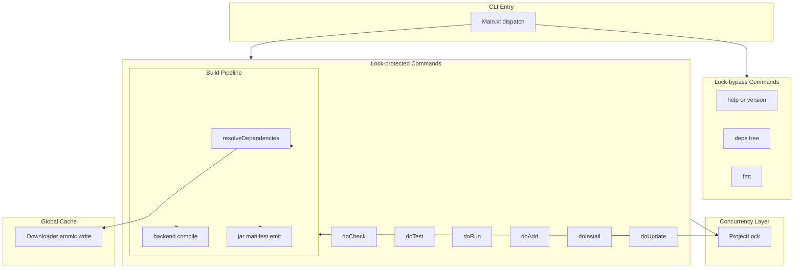
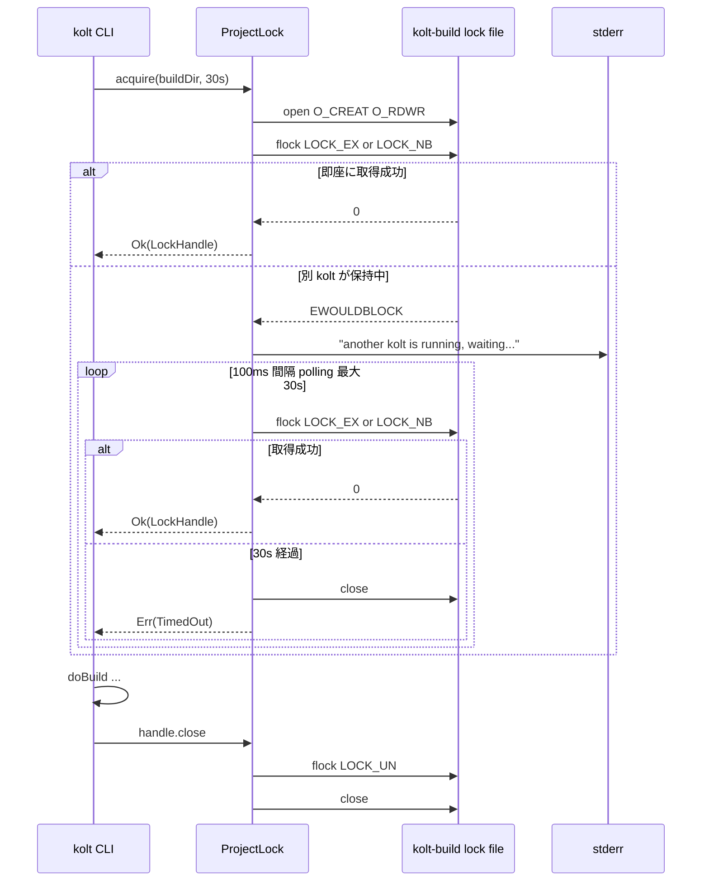
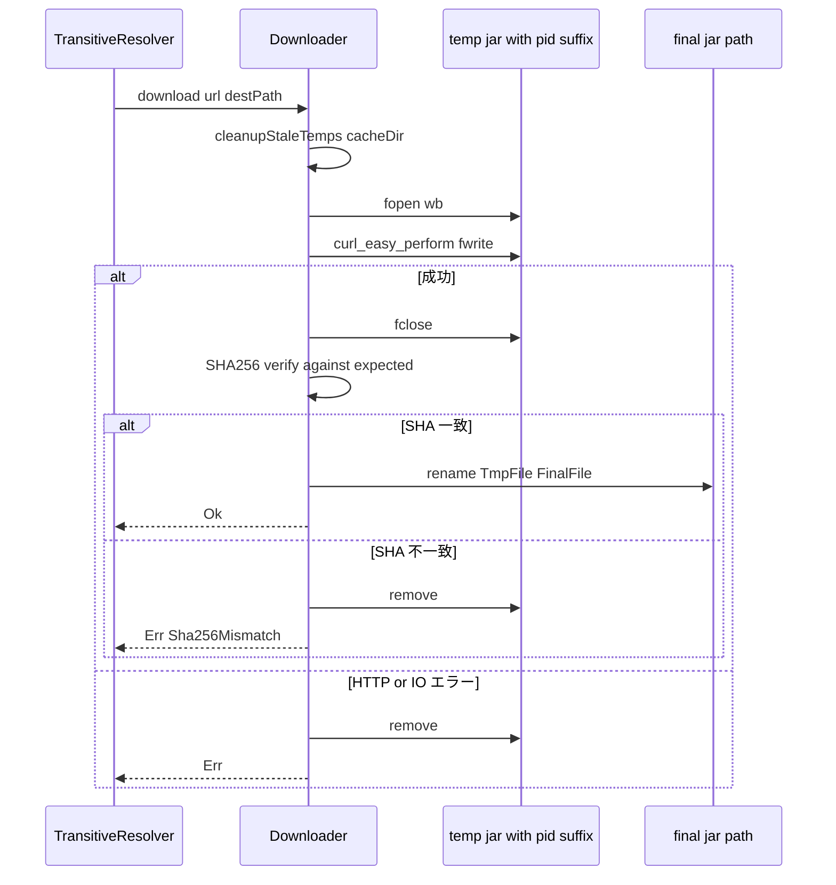

# Design Document — concurrent-build-safety

## Overview

**Purpose**: 同一 `kolt.toml` を共有する複数の `kolt` プロセスが `kolt.lock` rewrite と `build/` finalisation を相互破壊するのを防ぎ、共有 `~/.kolt/cache/` 上の JAR ダウンロードが書きかけバイト列を最終パスに露出させないようにする。

**Users**: kolt を IDE-on-save と手動 CLI 併用で使う開発者、`kolt watch` + `kolt test` を併走させるワークフロー、`~/.kolt/cache/` を共有する CI matrix ジョブ。

**Impact**: `kolt build` / `kolt deps install` / `kolt deps add` / `kolt deps update` が project-local 排他ロックを獲得する critical section を持つようになり、`~/.kolt/cache/` 配下の JAR ダウンロードが temp-then-rename 経由になる。daemon socket と CLI 起動・read-only サブコマンドは変更しない。

### Goals

- 同一プロジェクトに対する 2 プロセス目以降の `kolt build` 系コマンドを直列化し、`kolt.lock` / `build/` を破壊しない
- ロック待機を 30 秒上限で打ち切り、clean error でプロセスを exit させる (`kolt watch` ループ内含む)
- `~/.kolt/cache/<g>/<a>/<v>/*.jar` を atomic な rename で出現させ、書きかけバイト列を露出させない
- 並行性契約を ADR 0029 として明文化し、NFS 越し共有を unsupported として宣言する

### Non-Goals

- cross-machine locking (NFS-shared `~/.kolt/`) のサポート
- 非 kolt consumer (IDE 自身の indexer、並行する Gradle) との調停
- daemon socket bind の OS-level 排他に手を加えること (既に EADDRINUSE で機能している)
- `~/.kolt/cache/` 横断のグローバル lock 導入 (atomic rename だけで十分)
- `kolt fmt` / `kolt --help` / `kolt --version` / `kolt deps tree` などの読み取り専用コマンドへのロック適用

## Boundary Commitments

### This Spec Owns

- `src/nativeMain/kotlin/kolt/concurrency/ProjectLock.kt` (新設) — project-local 排他ロックの取得 / 解放 / タイムアウト
- `Downloader.kt` の出力経路 — temp path 生成、`platform.posix.rename` 呼び出し、起動時 stale `.tmp.*` sweep
- `BuildCommands.kt` / `DependencyCommands.kt` の入口での lock 獲得 / 解放
- ADR `docs/adr/0029-concurrent-build-safety-model.md` (新設)

### Out of Boundary

- daemon socket bind の排他制御 (ADR 0016 §3-§5 で既述、本 spec は依存するのみ)
- POM resolver / classpath manifest writer 内部 (lock の hold は外側からのみ、これらの内部に lock 概念は持ち込まない)
- `kolt fmt` 等の source 書き換えコマンド (本 spec の lock は build 系のみ)
- TOFU stamp / SHA-256 検証 (`PluginJarFetcher.kt` / `TransitiveResolver.kt:236`、本 spec のリファクタ対象外)
- `kolt watch` の inotify ループ自体 (本 spec はループ内側で per-rebuild lock するだけで、ループ外殻に lock を持たない)

### Allowed Dependencies

- `platform.linux.flock`, `LOCK_EX`, `LOCK_NB`, `LOCK_UN` (sys/file.h 経由、konan linux.def に同梱)
- `platform.posix.rename`, `platform.posix.getpid`, `platform.posix.open`, `platform.posix.close` (stdio.h / unistd.h 経由)
- 既存の kotlin-result `Result<V, E>` パターン
- 既存の `eprintln` / logging facility (BuildCommands.kt の stderr 出力規約に準拠)

### Revalidation Triggers

- 新しい entry-point コマンドが追加され、それが `kolt.lock` または `build/` を rewrite する場合 → 本 spec の wrap 対象に追加が必要
- linuxArm64 / macOS target 追加時 → `platform.linux.flock` の代替プリミティブ (macOS は同 API、Arm64 Linux は同 API、いずれも問題なし) の cinterop 経路再確認
- daemon が `kolt.lock` または `build/` を直接書く設計に変わった場合 → 本 spec の wrap 範囲を daemon path にも拡大

## Architecture

### Existing Architecture Analysis

`doBuild()` (`BuildCommands.kt:195-375`) と `doNativeBuild()` (同 377-523) は依存解決 → compile → 成果物 finalisation を直列で実行する。`resolveDependencies()` (`DependencyResolution.kt:107`) が `kolt.lock` 全体を 1 度の `writeFileAsString` で書き出すため、lockfile rewrite の seam は単一点。`Downloader.kt:41` が最終パスに直接 `fopen("wb")` する設計のため、temp path への切替は同関数内で完結する。

`WatchLoop.kt:42-50` は inotify event をトリガに `doBuild` / `doCheck` / `doTest` を再起動するループで、ループ外殻ではなく内側で per-rebuild に lock を取れば、watch プロセス全体が他の kolt をブロックすることはない (要件 1.7 と整合)。

DaemonReaper の probe → reap pattern (`DaemonReaper.kt:21-76`) は本 spec の lock 設計とは独立だが、stale 検出による self-heal の参考として ADR で言及する。

### Architecture Pattern & Boundary Map



**Architecture Integration**

- **Selected pattern**: 単一の advisory file lock (BSD `flock(2)` 経由) で critical section を直列化する coarse-grained mutex + atomic rename による lockless write。
- **Domain boundaries**: `concurrency/ProjectLock.kt` がロックの lifecycle を独占所有。CLI 入口は `lock.use { ... }` で資源管理を委譲。Downloader は cache 出力の atomicity を独占所有。
- **Existing patterns preserved**: kotlin-result `Result<V, E>`、`AutoCloseable` ベースのリソース管理 (`UnixSocket.kt` 等の既存例に倣う)、`eprintln` による stderr 出力規約。
- **New components rationale**: `ProjectLock` は真に新規の syncronisation primitive で既存ファイルに同居させると単体テストが汚染されるため別ファイル。`AtomicWrite` は `Downloader` 内 5-10 行の差分なので関数内に閉じ込め、新規ファイル化はオーバーキル。
- **Steering compliance**: 例外を throw せず `Result` を返す (CLAUDE.md)、新規 ADR は `## Summary` 5-7 bullet 規約 (memory) を遵守。

### Technology Stack

| Layer | Choice / Version | Role in Feature | Notes |
|-------|------------------|-----------------|-------|
| Concurrency primitive | `platform.linux.flock` (kotlin-native 2.3.20 同梱) | project-local advisory lock | sys/file.h 経由、konan linux.def に既収録 (新規 cinterop 不要) |
| Atomic rename | `platform.posix.rename` (kotlin-native 2.3.20 同梱) | global cache 書き出し原子化 | stdio.h 経由、konan posix.def に既収録 |
| PID 取得 | `platform.posix.getpid` | temp path uniqueness | 既収録 |
| Error model | kotlin-result 2.3.1 (既存) | `Result<Lock, LockError>` | 既存パターン延長 |

## File Structure Plan

### Directory Structure

```
src/
├── nativeMain/kotlin/kolt/
│   ├── concurrency/                       # 新規ディレクトリ
│   │   └── ProjectLock.kt                 # 新規: flock wrapper + timeout
│   ├── infra/
│   │   └── Downloader.kt                  # 修正: temp+rename 化、stale sweep
│   ├── cli/
│   │   ├── BuildCommands.kt               # 修正: doBuild/doNativeBuild/doCheck/doTest/doRun に lock wrap
│   │   └── DependencyCommands.kt          # 修正: doAdd/doInstall/doUpdate に lock wrap
└── nativeTest/kotlin/kolt/
    ├── concurrency/
    │   └── ProjectLockTest.kt             # 新規: in-process 二重 fd test、timeout test
    └── cli/
        └── ConcurrentBuildIT.kt           # 新規: 2 プロセス spawn 統合テスト

docs/
└── adr/
    └── 0029-concurrent-build-safety-model.md  # 新規 ADR
```

### Modified Files

- `src/nativeMain/kotlin/kolt/cli/BuildCommands.kt` — `doBuild` / `doNativeBuild` / `doCheck` / `doTest` / `doRun` の入口で `ProjectLock.acquire(buildDir)` を呼び、`use { ... }` で wrap (`doCheck` は JVM syntax-only 経路でも `kolt.lock` を rewrite するため lock 対象)
- `src/nativeMain/kotlin/kolt/cli/DependencyCommands.kt` — `doAdd` / `doInstall` / `doUpdate` の入口で同様の wrap
- `src/nativeMain/kotlin/kolt/infra/Downloader.kt` — `download()` を temp-path → SHA verify → `rename(2)` のシーケンスに改修。`cleanupStaleTemps(cacheDir)` を追加し `download()` 冒頭で対象 dir のみ sweep

## System Flows

### Project Lock 取得フロー



**Key decisions**:
- `O_CREAT | O_RDWR` で lock file を作成 (空ファイル、単に flock 対象として存在すればよい)
- `LOCK_EX | LOCK_NB` を 100ms 間隔で polling — `alarm(2) + signal handler + LOCK_EX` 方式は Kotlin/Native runtime の signal 取り扱いと干渉するリスクがあり、polling の方がシンプル
- 待機メッセージは最初の peer 検出時に 1 度だけ出す (Req 1.3)
- プロセス終了で OS が自動的に lock を解放する (Req 1.5 / 1.6)。`use { ... }` でも明示的に LOCK_UN するが、SIGKILL や segfault でも安全

### Atomic Download フロー



**Key decisions**:
- `rename(2)` は POSIX 上で同一 filesystem 内で atomic — `~/.kolt/cache/<g>/<a>/<v>/` 内で完結するので保証される
- 並行 download (req 2.4) は最終的に「後勝ち」になる — 両プロセスが SHA 検証を通った同一 jar を rename する形なので、いずれの結果も valid
- temp suffix は `.tmp.<pid>` で運用 — PID reuse で衝突しても各プロセスが自身の path に書くだけなので問題ない (PID は OS が一意保証する current run 中)
- `cleanupStaleTemps` は対象 cacheDir 内の `*.jar.tmp.*` のうち mtime が 24 時間以上前のものを削除 — 1 ダウンロード当たりのコストは O(同 dir のファイル数) で軽量

## Requirements Traceability

| Requirement | Summary | Components | Interfaces | Flows |
|-------------|---------|------------|------------|-------|
| 1.1 | lock 取得試行 | ProjectLock, BuildCommands, DependencyCommands | `ProjectLock.acquire` | Project Lock 取得 |
| 1.2 | peer 保持中の writes 抑止 | ProjectLock | `acquire` の blocking 動作 | Project Lock 取得 |
| 1.3 | stderr 待機メッセージ | ProjectLock | `acquire` 内 eprintln | Project Lock 取得 |
| 1.4 | 30s 上限 + clean error | ProjectLock | `LockError.TimedOut` | Project Lock 取得 |
| 1.5 | 終了時 release | ProjectLock | `LockHandle.close` (use 経由) | Project Lock 取得 |
| 1.6 | クラッシュ時自動回復 | ProjectLock (OS 任せ) | flock(2) の FD-close 解放 | (OS 挙動) |
| 1.7 | critical section 限定 | BuildCommands, DependencyCommands | wrap 対象コマンドのみ | (Architecture diagram の Locked/ReadOnly 区分) |
| 2.1 | 中間バイトを最終パスに置かない | Downloader | `download` の temp-first | Atomic Download |
| 2.2 | atomic 出現 | Downloader | `platform.posix.rename` | Atomic Download |
| 2.3 | 失敗時残骸なし | Downloader | error path の `remove(tempPath)` | Atomic Download |
| 2.4 | 並走 download safe | Downloader | per-pid temp path | Atomic Download |
| 2.5 | SHA-256 検証維持 | Downloader (既存ロジック) | rename 前に検証 | Atomic Download |
| 3.1 | ADR 1 本 | docs/adr/0029-... | (ドキュメント) | — |
| 3.2 | lock パス + temp 命名記述 | ADR 0029 §3-§4 | (ドキュメント) | — |
| 3.3 | NFS unsupported 明示 | ADR 0029 §5 | (ドキュメント) | — |

## Components and Interfaces

| Component | Domain/Layer | Intent | Req Coverage | Key Dependencies | Contracts |
|-----------|--------------|--------|--------------|------------------|-----------|
| ProjectLock | concurrency | プロジェクトローカル排他ロックの lifecycle 管理 | 1.1, 1.2, 1.3, 1.4, 1.5, 1.6 | platform.linux.flock (P0), kotlin-result (P0) | Service |
| Downloader (改修) | infra | グローバルキャッシュへの atomic JAR 書き出し | 2.1, 2.2, 2.3, 2.4, 2.5 | platform.posix.rename (P0), platform.posix.getpid (P1) | Service |
| BuildCommands wrap | cli | build 系入口での lock 獲得 / 解放 | 1.7 | ProjectLock (P0) | (内部統合) |
| DependencyCommands wrap | cli | deps 系入口での lock 獲得 / 解放 | 1.7 | ProjectLock (P0) | (内部統合) |
| ADR 0029 | docs | 並行性契約の明文化 | 3.1, 3.2, 3.3 | — | (ドキュメント) |

### Concurrency

#### ProjectLock

| Field | Detail |
|-------|--------|
| Intent | プロジェクトローカル排他ロックの取得・タイムアウト・解放を担う唯一の primitive |
| Requirements | 1.1, 1.2, 1.3, 1.4, 1.5, 1.6 |

**Responsibilities & Constraints**

- Primary: `build/.kolt-build.lock` に対して `flock(LOCK_EX|LOCK_NB)` を試み、blocked なら 100ms 間隔で polling、上限 30s で `LockError.TimedOut`
- Boundary: lock 対象 path の決定は呼び出し側 (BuildCommands / DependencyCommands) が `buildDir` を渡す。ProjectLock は path を知らされる側で、policy は持たない
- Invariant: `LockHandle` の lifetime ≡ flock 保持期間。`close()` 後に再利用しない

**Dependencies**

- Inbound: BuildCommands, DependencyCommands — 各 entry で `acquire` 呼び出し (P0)
- Outbound: なし
- External: `platform.linux.flock`, `platform.posix.open` / `close` / `getpid` (P0)

**Contracts**: Service [x]

##### Service Interface

```kotlin
package kolt.concurrency

class LockHandle internal constructor(private val fd: Int, private val path: String) : AutoCloseable {
    override fun close()
}

sealed class LockError {
    data class TimedOut(val waitedMs: Long) : LockError()
    data class IoError(val errno: Int, val message: String) : LockError()
}

object ProjectLock {
    fun acquire(
        buildDir: String,
        timeoutMs: Long = DEFAULT_TIMEOUT_MS,
        onWait: () -> Unit = { eprintln("another kolt is running, waiting...") },
    ): Result<LockHandle, LockError>

    const val DEFAULT_TIMEOUT_MS: Long = 30_000L
}
```

- **Preconditions**: `buildDir` は呼び出し側が事前に `ensureDirectoryRecursive(buildDir)` した状態で渡す
- **Postconditions**: `Ok(handle)` のとき、handle.close() まで他プロセスは `acquire` できない。`Err(TimedOut)` のとき、ファイル状態と内部 FD は cleanup 済み
- **Invariants**: `acquire` 中の polling は busy-wait せず `usleep(100_000)` で yield する

**Implementation Notes**

- Integration: `BuildCommands.kt` の `doBuild`, `doNativeBuild`, `doCheck`, `doTest`, `doRun` 入口、`DependencyCommands.kt` の `doAdd`, `doInstall`, `doUpdate` 入口で `ProjectLock.acquire(...).use { ... }` パターンで使用
- Validation: ProjectLockTest で in-process 二重 acquire (別 fd) → 二回目 TimedOut、handle.close() 後の三回目 → 成功、を検証
- Risks: `flock(2)` は advisory lock なので、kolt 以外のプロセスが同 path に書くと無効。本 spec の Out of Boundary に該当 (kolt しか `build/` を扱わない前提)

### Infra

#### Downloader (改修)

| Field | Detail |
|-------|--------|
| Intent | global cache への atomic JAR 書き出しと stale temp 掃除 |
| Requirements | 2.1, 2.2, 2.3, 2.4, 2.5 |

**Responsibilities & Constraints**

- Primary: `download(url, destPath, expectedSha256)` を temp-path → fwrite → fclose → SHA verify → `rename(2)` のシーケンスに改修
- Boundary: SHA verify の主体は呼び出し側 (TransitiveResolver) のままだが、現行 `Downloader` 内部の post-download verify が存在するならそこを保持。SHA mismatch 時は rename しない
- Invariant: 最終 path には valid な (SHA 検証済み) JAR しか出現しない、または存在しないかのいずれか

**Dependencies**

- Inbound: TransitiveResolver, PluginJarFetcher (P0)
- Outbound: なし
- External: `platform.posix.fopen` / `fwrite` / `fclose` / `rename` / `getpid` / `remove`, libcurl (既存) (P0)

**Contracts**: Service [x]

##### Service Interface

```kotlin
// 既存 signature を保持
fun download(url: String, destPath: String): Result<Unit, DownloadError>

// 内部 (private)
internal fun cleanupStaleTemps(cacheDir: String, olderThanSeconds: Long = 86400L)
```

- **Preconditions**: `destPath` の親ディレクトリが存在する (既存呼び出し側で `ensureDirectoryRecursive`)
- **Postconditions**: `Ok` のとき `destPath` に完成済み JAR が存在 (SHA 検証は呼び出し側または内部の既存ロジック)。`Err` のとき `destPath` は呼び出し前の状態と等しく、temp ファイルも残らない
- **Invariants**: 自プロセスの temp path は `<destPath>.tmp.<pid>` 単独。並走 kolt は別 PID で別 temp path を使う

**Implementation Notes**

- Integration: 既存の `Downloader.kt:37-79` の `fopen(destPath, "wb")` 経路を temp 経由に切替。失敗時 `remove(destPath)` を `remove(tempPath)` に切替
- Validation: 既存の `DownloaderTest` を維持しつつ、(a) 中断シミュレーション (curl 失敗) で `destPath` が変化しないこと、(b) 成功時に temp が消えていること、を assert
- Risks: `rename(2)` は同一 filesystem 内のみ atomic — `~/.kolt/cache/` 内で完結するので問題なし。cross-filesystem の心配は本 spec scope 外

### CLI Integration (Wrap)

#### BuildCommands / DependencyCommands wrap

| Field | Detail |
|-------|--------|
| Intent | lock 対象コマンドの入口で `ProjectLock.acquire` を呼び、終了で release |
| Requirements | 1.7 |

**Responsibilities & Constraints**

- Primary: `doBuild`, `doNativeBuild`, `doCheck`, `doTest`, `doRun`, `doAdd`, `doInstall`, `doUpdate` の最初で `ProjectLock.acquire` を呼ぶ。`Err(TimedOut)` は `EXIT_LOCK_TIMEOUT` (新規 exit code、要 design 確認) で exit
- Boundary: ロック対象は build/finalisation を含む call chain 全体。`doRun` は `doBuild` を内包するため `doRun` 入口で 1 度取れば十分
- Out of scope: `kolt --version` / `kolt --help` / `deps tree` / `fmt` 等の read-only / source-write-only コマンドはロックしない

**Dependencies**

- Inbound: `Main.kt` dispatch (P0)
- Outbound: ProjectLock (P0)

**Contracts**: (内部統合のみ、外部 contract なし)

**Implementation Notes**

- Integration: `BuildCommands.kt:195` 直下で `ProjectLock.acquire(paths.buildDir).use { handle -> ... existing body ... }` で wrap
- Validation: ConcurrentBuildIT で 2 プロセス並走時に直列化されること、`deps tree` 実行中に `kolt build` がブロックされないこと
- Risks: `doRun` 内で `doBuild` を再呼び出ししているなら二重ロックになるが、`flock(2)` は同一 OFD では再帰許容なので問題なし。ただし設計上は entry-only に統一して `doBuild` 内側では取らない

## Error Handling

### Error Strategy

すべてのエラーは kotlin-result `Result<V, E>` で伝搬。`exitProcess` は CLI 最外殻 (Main.kt) のみで呼ぶ既存規約を維持。

### Error Categories and Responses

| シナリオ | エラー型 | CLI 振る舞い | exit code |
|---|---|---|---|
| 30s タイムアウト | `LockError.TimedOut` | stderr に「lock acquisition timed out after 30s; another kolt build may be stuck」と出力 | 新規 `EXIT_LOCK_TIMEOUT` (e.g. 16) |
| flock IO エラー (FS read-only 等) | `LockError.IoError` | stderr に errno + path を出力 | `EXIT_IO_ERROR` (既存) |
| Downloader: rename 失敗 | `DownloadError` (既存型に追加) | 既存 path | `EXIT_DEPENDENCY_ERROR` (既存) |
| Downloader: temp 書き込み失敗 | 既存 path | 既存 path | 既存 |
| クラッシュ / SIGKILL | (例外なし、OS が自動 cleanup) | 後続の `kolt` は普通に lock 取得 | — |

### Monitoring

- `eprintln` 経由のメッセージのみ。daemon の telemetry に乗せる必要は本 spec の scope 外
- 待機メッセージは 1 度だけ。再 polling のたびに出力しない (UX)

## Testing Strategy

### Unit Tests (`ProjectLockTest.kt` 新規)

- 1 プロセス内で同 path を 2 つの fd で open し、二回目の `acquire(timeoutMs=200)` が `Err(TimedOut)` を返すこと
- 一回目の `handle.close()` 後、三回目の `acquire` が即座に `Ok` を返すこと
- 待機メッセージ (`onWait`) が peer 保持中に 1 度だけ呼ばれ、即時取得時には呼ばれないこと
- timeoutMs=0 で peer 保持中なら即時 `Err(TimedOut)` (要件 1.4 の意味論確認)
- IoError: 存在しないディレクトリの buildDir で `acquire` → `Err(LockError.IoError)`

### Integration Tests (`ConcurrentBuildIT.kt` 新規)

- 2 プロセスを spawn (`executeCommand` パターン使用、または `posix_spawn`) し、片方が `kolt build` 中に他方を起動 → 後発が直列化されることを assert
- 後発に `KOLT_LOCK_TIMEOUT_MS=200` (環境変数による override、ProjectLock 側で読む) を渡し、先発が長引くシナリオで `Err(TimedOut)` 経路が走ることを assert
- Downloader: 同一座標を 2 プロセスが並走 download した後、最終 path に valid JAR が 1 つだけ存在し、temp ファイルが残らないこと
- Downloader: download 中に `kill -9` 相当でプロセスを落とした後、最終 path が変化していないこと、後続 download が temp を再利用せず正常に完走すること

### E2E (dogfood)

- kolt 自身の `./gradlew build` で `kolt build` を 2 端末から同時起動 → 直列化、最終的に両方 0 exit (片方は 30s 内に通る前提)
- `kolt watch` 起動中に手動 `kolt test` 実行 → watch の rebuild 後に test が直列で動く

## Optional Sections

### Performance & Scalability

- lock の hold 時間は build の所要時間に等しい (warm daemon で数秒、cold で数十秒)。30s 上限は IDE-on-save の高頻度ケースで頻繁に踏まないことを意図
- polling 間隔 100ms は CPU 負担が無視可能 (1 秒あたり 10 回の `flock(LOCK_NB)` syscall)。1 回の syscall は数 µs オーダー
- Downloader の temp+rename の overhead はファイルシステム上 1 度の rename syscall (µs オーダー、ファイルサイズ非依存)。SHA verify との差は無視可能

### Migration Strategy

- pre-v1 / no migration shim 方針 (CLAUDE.md) に従い、既存 `build/` レイアウトに `.kolt-build.lock` ファイルが追加されるが警告などは出さない
- 既存ユーザーの `~/.kolt/cache/` 配下に過去の偶発的な `*.tmp.*` ファイルが残っている可能性は理論上あるが、`cleanupStaleTemps` の 24 時間判定で初回 download 時に自動除去される
- ADR 0029 リリースノートに「`build/.kolt-build.lock` が `build/` 直下に作成されるが gitignore 対象なので影響なし」と記す

## Supporting References

- ADR 0029 (本 spec で新設) — 並行性契約の永続記録
- `research.md` — gap 分析、cinterop 確認結果、3 つの実装オプションの比較
- 関連既存 ADR: 0016 §3-§5 (daemon socket 排他)、0027 §1 (runtime classpath manifest write 規約)
