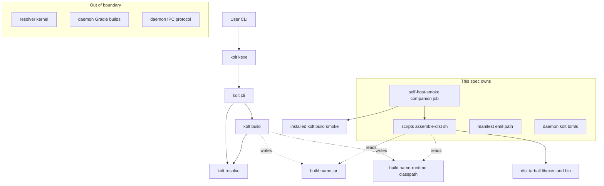
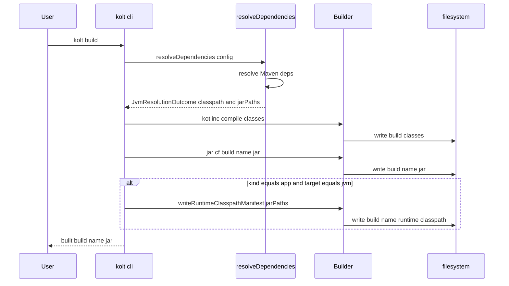
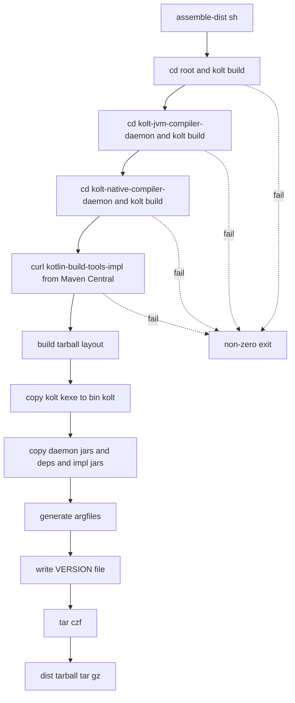
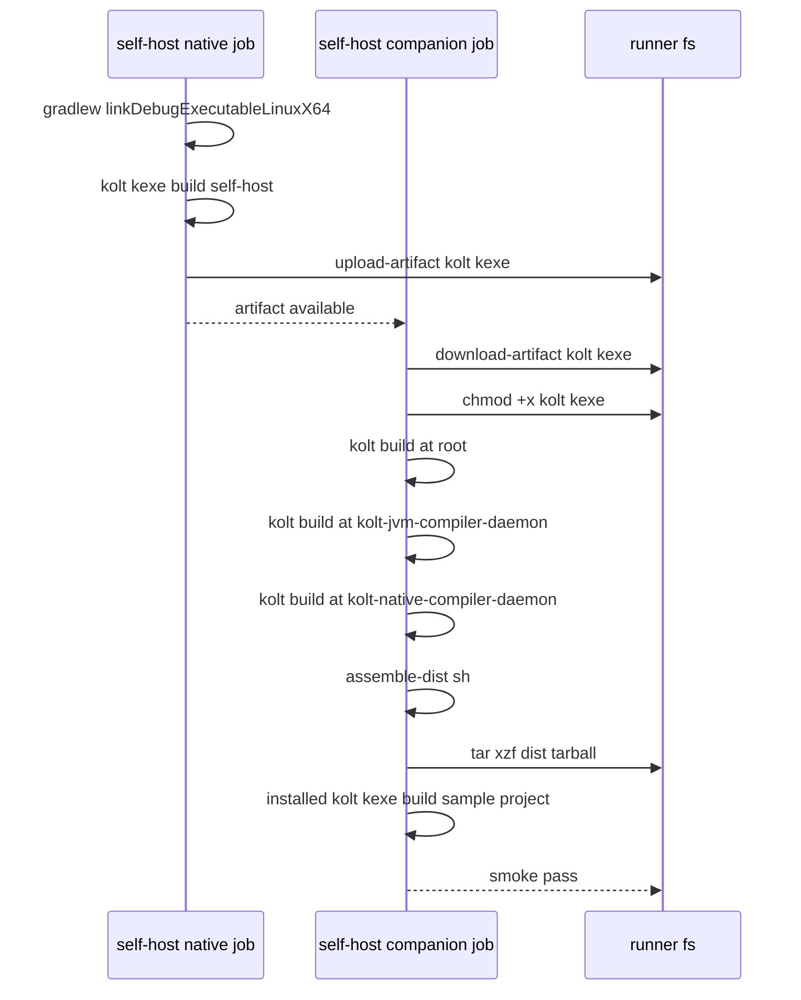

# Technical Design: daemon-self-host

## Overview

**Purpose**: kolt が自身の 2 JVM daemon を build できる self-host ループを
閉じ、`scripts/assemble-dist.sh` が release tarball layout を組み立てられる
ようにすることで Issue #97 の DoD を満たす。

**Users**: kolt のメンテナ (self-host 経路の保守)、リリース担当 (tarball
生成)、CI 運用者 (self-host-smoke workflow)。

**Impact**: 既存の JVM `kind = "app"` build path に runtime classpath
manifest の emit 1 ステップを足し、2 daemon に `kolt.toml` を追加し、
`scripts/assemble-dist.sh` と CI companion job を新規作成する。新規の設計
選択は含まない (ADR 0018 / 0025 / 0027 / 0026 で pin 済み)。

### Goals

- ADR 0027 に準拠した runtime classpath manifest を JVM `kind = "app"`
  build で emit する。
- 2 daemon の `kolt.toml` を追加し、`./bin/kolt build` (既存 `kolt.kexe`)
  で両 daemon の thin jar を生成できる。
- `scripts/assemble-dist.sh` が 3 プロジェクトを stitch し、ADR 0018 §1 の
  tarball layout を生成する。
- `self-host-smoke.yml` に companion job を追加し、self-host path を
  PR 毎に検証する。

### Non-Goals

- `install.sh` / `curl | sh` / GitHub Release への tarball upload
  (ADR 0018 §4 別トラック)。
- `shadowJar` / `verifyShadowJar` / `stageBtaImplJars` の除去 (段階的撤去
  作業は別 issue)。
- daemon unit tests の kolt 移行 (`:ic` の fixture classpath 3 本、
  `BtaImplJarResolver` 経路含む)。
- Multi-module `kolt.toml` schema (#4、ADR 0018 §5 で off)。
- macOS / Windows support (linuxX64 のみ)。
- `kolt daemon ping` のような新 CLI サブコマンド (後述 Simplification
  参照)。

## Boundary Commitments

### This Spec Owns

- JVM `kind = "app"` build における `build/<name>-runtime.classpath` の
  生成 (ADR 0027 準拠の format / sort / tiebreak / self 除外)。
- Artifact path helper `outputRuntimeClasspathPath` の新規追加。
- `kolt.cli.DependencyResolution.resolveDependencies` の戻り値を拡張
  (classpath 文字列に加え解決済み jar list を公開)。
- 2 daemon プロジェクトの `kolt.toml` ファイル (source 配列、依存、
  plugin 設定)。
- `scripts/assemble-dist.sh` 本体 (3 × `kolt build` stitcher、`-impl` の
  Maven 直取得、tarball layout の組立て、argfile 生成)。
- `.github/workflows/self-host-smoke.yml` への companion job 追加。

### Out of Boundary

- Resolver kernel (`kolt.resolve.*`) の動作変更。stdlib skip policy
  (ADR 0011)、transitive closure 計算、lockfile schema (ADR 0003) はすべて
  現状維持。
- `shadowJar` / `verifyShadowJar` / `stageBtaImplJars` の削除または修正。
  2 daemon の Gradle build は完全に並走維持する。
- `DaemonJarResolver.DevFallback` / `BtaImplJarResolver.DevFallback` の
  解決経路。既存の `build/libs/*.jar` / `build/bta-impl-jars/*.jar` 参照
  をそのまま使い続ける。
- `kolt.toml` の schema 拡張。新フィールドは追加しない
  (`BuildSection.jdk` 等は既存)。
- daemon IPC protocol (`Message` / `Ping` / `Pong` / `Compile` 等) の
  変更。

### Allowed Dependencies

- Upstream (読み取り可):
  - `kolt.resolve.Resolver.resolve` の戻り値 (`List<ResolvedDep>`)。
    既存の `resolveDependencies` 関数経由でアクセス。
  - `kolt.config.KoltConfig`、`BuildSection`、`kind` フィールド。
- Shared infrastructure:
  - `kolt.build.Builder.kt` の既存 helper (`outputJarPath` など) と同じ
    層 (`kolt.build`) に新 helper を追加。
  - `kolt.infra.writeFileAsString` 等のファイル I/O プリミティブ。
- Constraints:
  - `kolt.cli` → `kolt.build` → `kolt.resolve` の下向き依存方向を遵守
    (steering `structure.md`)。
  - kotlin-result `Result<V, E>` による error handling (ADR 0001)。
  - 例外 throw は禁止。

### Revalidation Triggers

以下の変更が入った場合、本スペックの consumer (assemble-dist.sh、CI
companion、将来の `kolt publish` / `kolt package`) は再検証が必要:

- Manifest file 名 (`<name>-runtime.classpath`) または path 規約の変更。
- Manifest 内のフォーマット変更 (sort / separator / self 含有など)。
- 依存 jar の実体 cache layout (`~/.kolt/cache`) の変更。manifest に
  絶対パスを書き込むため、cache layout が変わると manifest も変わる。
- `BuildSection` の `target` / `kind` vocabulary の変更 (ADR 0023 領域)。
- `resolveDependencies` の戻り値形状のさらなる変更。

## Architecture

### Existing Architecture Analysis

- **Package layout** (steering `structure.md`): `cli → build → resolve`
  の下向き依存、各層は概念単位で分離。新規 manifest emit は build 層に
  収まる。
- **既存 helper**: `Builder.kt:15-23` に `outputJarPath` /
  `outputNativeKlibPath` 等の path helper 集約。`outputRuntimeClasspathPath`
  も同ファイルに並置。
- **既存 resolver フロー**: `DependencyResolution.kt:36-93`
  `resolveDependencies` が `Result<String?, Int>` (classpath 文字列 or
  null) を返す。内部で `resolveResult.deps.map { it.cachePath }` が既に
  絶対パスリストを持つ。
- **既存 daemon Gradle builds**: `includeBuild` で 2 daemon を独立 build
  として扱う (ADR 0018 §3)。本スペック実装期間中は並走。

### Architecture Pattern & Boundary Map



**Architecture Integration**:

- Pattern: 既存の `cli → build → resolve` 下向き依存直線を維持。新規 I/O
  ポイントを build 層の書き出し 1 箇所に集約。
- Boundary: 「build output を書き出す」責務は build 層、「tarball を
  組み立てる」責務はシェルスクリプト、「IPC が通るか検証する」責務は CI
  job。各境界は 1 つの artifact (manifest / tarball / CI log) で接続
  される。
- 新規 component の理由: `Builder.kt` への helper 追加は既存 naming
  convention、`scripts/assemble-dist.sh` は ADR 0018 §4 が要求、CI
  companion は Req 4。
- Steering compliance: `structure.md` の「responsibility split」、
  `tech.md` の `Result<V, E>`、ADR 0001 / 0003 / 0011 / 0018 / 0025 /
  0027 を全部維持。

### Technology Stack

| Layer | Choice / Version | Role in Feature | Notes |
|-------|------------------|-----------------|-------|
| CLI (native) | Kotlin/Native 2.3.20 (既存) | `outputRuntimeClasspathPath` helper、JVM kind=app 経路での manifest emit | 新規コードは `kolt.build` / `kolt.cli` 内 |
| Build pipeline | kotlinc + `jar cf` (既存) | JVM compile + thin jar は変更なし。manifest 書き出しを追加 | Main-Class 属性は引き続き付与しない |
| Resolver | kolt 既存 `Resolver.resolve` | jar 絶対パスリスト供給 | 変更範囲は `resolveDependencies` 戻り値拡張のみ |
| Release scripting | POSIX shell (bash) | `scripts/assemble-dist.sh` の 2 モード | separator `:` 固定 (linuxX64 only)、`tar czf` で tarball 生成 |
| CI runner | GitHub Actions (ubuntu-latest) | companion job | 既存 `self-host-smoke.yml` に追加 |

新規依存なし。

## File Structure Plan

### Directory Structure

```
src/nativeMain/kotlin/kolt/
├── build/
│   └── Builder.kt                          # +outputRuntimeClasspathPath helper and +writeRuntimeClasspathManifest
├── cli/
│   ├── BuildCommands.kt                    # +manifest emit call on JVM kind=app tail
│   └── DependencyResolution.kt             # resolveDependencies returns JvmResolutionOutcome
src/nativeTest/kotlin/kolt/
├── build/
│   └── RuntimeClasspathManifestTest.kt     # NEW: emit format / sort / tiebreak
└── cli/
    ├── JvmAppBuildTest.kt                  # NEW: emit matrix (app=yes, lib/native=no)
    └── KoltRunManifestIndependenceTest.kt  # NEW: kolt run works after manifest delete

kolt-jvm-compiler-daemon/
└── kolt.toml                               # NEW: :ic sources merged in

kolt-native-compiler-daemon/
└── kolt.toml                               # NEW

scripts/
└── assemble-dist.sh                        # NEW: 3-project stitcher

.github/workflows/
└── self-host-smoke.yml                     # +companion job
```

### Modified Files

- `src/nativeMain/kotlin/kolt/build/Builder.kt` — `outputRuntimeClasspathPath(config)` helper と `writeRuntimeClasspathManifest(config, jarPaths)` emit 関数を追加 (既存 `outputJarPath` 等と同じ internal visibility)。
- `src/nativeMain/kotlin/kolt/cli/DependencyResolution.kt` — `resolveDependencies` の戻り値型を `Result<String?, Int>` から `Result<JvmResolutionOutcome, Int>` に変更 (classpath 文字列と jar list を同時に返す)。callers を追従修正。
- `src/nativeMain/kotlin/kolt/cli/BuildCommands.kt` — JVM `kind = "app"` の build 完了後に manifest を書き出す分岐を追加。既存の JVM 経路最終ステップ (jar 生成直後) に 1 ブロック。`kolt run` / `kind = "lib"` / native 経路には変更なし。
- `.github/workflows/self-host-smoke.yml` — 既存 native job の下に companion job を追加。native job の kexe artifact を upload して companion job で download する step を挟む。
- `docs/adr/0027-runtime-classpath-manifest.md` — §1 末尾の helper 参照先を `kolt/config/Config.kt` から `kolt/build/Builder.kt` に 1 行修正 (既存 `output*Path` helper 集の配置と整合)。

### New Files

- `kolt-jvm-compiler-daemon/kolt.toml` — `target = "jvm"`、`kind = "app"`、`main = "kolt.daemon.main"`、`sources = ["src/main/kotlin", "ic/src/main/kotlin"]`、`jvm_target = "21"`、`jdk = "21"`、依存: `kotlin-build-tools-api`, `kotlinx-serialization-json`, `kotlin-result`, `ktoml-core`、`[kotlin.plugins] serialization = true`。
- `kolt-native-compiler-daemon/kolt.toml` — `target = "jvm"`、`kind = "app"`、`main = "kolt.nativedaemon.main"`、`sources = ["src/main/kotlin"]`、`jvm_target = "21"`、`jdk = "21"`、依存: `kotlinx-serialization-json`, `kotlin-result`、`[kotlin.plugins] serialization = true`。
- `scripts/assemble-dist.sh` — 3 × `kolt build` を直列に呼び、`kotlin-build-tools-impl` を curl で Maven Central から取得、失敗 fail-fast、tarball layout 生成、argfile 生成。
- Tests 3 本 — 後述 Testing Strategy。

## System Flows

### Flow 1: JVM `kind = "app"` build と manifest emit



**Key decisions**:
- Manifest 書き出しは jar 生成の直後、同一 `doBuild` スコープ内で行う。失敗時は jar 成果物を残したまま非ゼロ終了 (部分的な build 成果物が残ることを許容、既存 `jar cf` の失敗時挙動と同じポリシー)。
- `kind = "lib"` / native 経路では `writeRuntimeClasspathManifest` を呼ばない。呼ばない分岐は `kind` と `target` を見て決め、既存 `NATIVE_TARGETS` gate と同じ段で処理する。

### Flow 2: `assemble-dist.sh` stitcher



**Key decisions**:
- 単一モード: 常に 3 プロジェクトを `kolt build` で直列に build する。`./gradlew build` を呼ぶ pre-self-host モードは含めない (本スペックは `kolt.toml` を 2 daemon に追加してから landing するため、そちらで build 可能な状態が前提)。
- tarball 名は `kolt-<version>-linux-x64.tar.gz` (ADR 0018 §1 命名)。`<version>` はルートの `kolt.toml` の `version` フィールドから読む。
- `kotlin-build-tools-impl:2.3.20` は kolt の resolver を経由せず、shell script 内の `curl -fsSL` で Maven Central から直接取得する。ADR 0019 §3 の classloader isolation により `-impl` は daemon の thin jar + deps には混ぜられないため、独立した取得路が必要。シェルで取得する理由は (i) 新規 kolt CLI を追加しないで済む、(ii) GAV 一式 (impl + transitive の最低限) がバージョン固定で明確、(iii) assemble-dist.sh が kolt の cache layout から独立するという Req 3.5 の制約と整合。

### Flow 3: CI companion job



**Key decisions**:
- native job と companion job は同一 `kolt.kexe` artifact を使う (重複 build 回避、Req 4.6)。
- companion job の final smoke は「展開した tarball の `bin/kolt` を使って、適当な fixture project を 1 つ build する」。このビルドが成功すれば classpath launch から daemon IPC まで含めた end-to-end が動いている証拠になる。`kolt daemon ping` のような専用コマンドは追加しない (Simplification, Req 4.4 の AC はこの smoke で cover)。
- Fixture project: 既存の `spike/lib-dogfood/` または新規の最小 JVM app を 1 つ用意 (tasks phase で決定)。

## Requirements Traceability

| Requirement | Summary | Components | Interfaces | Flows |
|-------------|---------|------------|------------|-------|
| 1.1 | `kolt-jvm-compiler-daemon/kolt.toml` で build 成功 | 新規 `kolt.toml` + 既存 JVM pipeline | `KoltConfig`, `BuildSection` | Flow 1 |
| 1.2 | `kolt-native-compiler-daemon/kolt.toml` で build 成功 | 新規 `kolt.toml` + 既存 JVM pipeline | 同上 | Flow 1 |
| 1.3 | `:ic` ソース merge | `kolt-jvm-compiler-daemon/kolt.toml` の `sources` 配列 | `BuildSection.sources` | Flow 1 |
| 1.4 | Gradle 並走維持 | 変更しない制約 (Out of Boundary) | - | - |
| 1.5 | schema 違反で停止 | 既存 `parseConfig` の `LIB_WITH_MAIN_ERROR` / `APP_WITHOUT_MAIN_ERROR` | `parseConfig` | - |
| 2.1 | manifest emit トリガ | `BuildCommands.kt` JVM app tail | `writeRuntimeClasspathManifest` | Flow 1 |
| 2.2 | UTF-8 LF plain text | `writeRuntimeClasspathManifest` | 同上 | - |
| 2.3 | self jar 除外 | 同上 | 同上 | - |
| 2.4 | file name alphabetical | 同上 (stdlib `sortedBy`) | 同上 | - |
| 2.5 | GAV tiebreak | 同上 (2 次 sort key) | 同上 | - |
| 2.6 | resolver 結果そのまま stdlib 含む | `JvmResolutionOutcome.jarPaths` | `resolveDependencies` | Flow 1 |
| 2.7 | lib / native で emit しない | `BuildCommands.kt` の kind/target 分岐 | - | Flow 1 alt branch |
| 2.8 | `kolt run` は manifest を読まない | 変更しない経路 (`runCommand` in-process classpath) | `runCommand` | - |
| 3.1 | 3 project を `kolt build` で順次実行 | `scripts/assemble-dist.sh` | - | Flow 2 |
| 3.2 | `kotlin-build-tools-impl` を curl 直ダウンロード | 同上 (`fetch_bta_impl` step) | Maven Central GAV URL | Flow 2 |
| 3.3 | fail-fast | `set -euo pipefail` + 明示 `exit 1` | - | Flow 2 |
| 3.4 | tarball layout (impl jar 配置含む) | 同上 (copy / argfile / VERSION step) | - | Flow 2 |
| 3.5 | stitcher は kolt cache layout 知らない | manifest のみ入力とする constraint、`-impl` は独立取得 | `build/<name>-runtime.classpath` | Flow 2 |
| 3.6 | manifest を deps/ 生成元として消費 | 同上 | 同上 | Flow 2 |
| 4.1 | PR 毎に companion 実行 | `self-host-smoke.yml` trigger (既存) | - | Flow 3 |
| 4.2 | 3 project build → assemble | companion job の step 列 | - | Flow 3 |
| 4.3 | tarball 展開 → classpath launch | 同上 | - | Flow 3 |
| 4.4 | IPC 健全性の検証 | installed kolt.kexe で fixture build 成功 | - | Flow 3 |
| 4.5 | fail は CI 失敗 | `set -euo pipefail` + GHA デフォルト | - | Flow 3 |
| 4.6 | kexe 共有 | `actions/upload-artifact` + `download-artifact` | - | Flow 3 |
| 5.1 | `./gradlew build` 成功維持 | 変更しない制約 (Out of Boundary) | - | - |
| 5.2 | native smoke job 維持 | 変更しない制約 | - | - |
| 5.3 | `[dependencies]` 制限 | 2 daemon の `kolt.toml` に `-impl` / fixture を書かない | 2 `kolt.toml` | - |

## Components and Interfaces

| Component | Domain/Layer | Intent | Req Coverage | Key Dependencies | Contracts |
|-----------|--------------|--------|--------------|------------------|-----------|
| `outputRuntimeClasspathPath` helper | build | `build/<name>-runtime.classpath` の絶対パスを返す | 2.1 | `KoltConfig` (P0) | Service |
| `JvmResolutionOutcome` data class | cli | classpath 文字列と jar list を同時保持 | 2.1, 2.6 | resolve (P0) | State |
| `writeRuntimeClasspathManifest` emit 関数 | build | jarPaths を sort / tiebreak / self 除外して書き出す | 2.1-2.7 | `JvmResolutionOutcome`, `writeFileAsString` (P0) | Service |
| `BuildCommands` JVM app tail branch | cli | kind/target を見て emit を呼ぶ / 呼ばない | 2.1, 2.7 | `outputRuntimeClasspathPath`, `writeRuntimeClasspathManifest` (P0) | Service |
| `kolt-jvm-compiler-daemon/kolt.toml` | 設定ファイル | JVM kind=app 仕様で daemon を記述、`:ic` を sources merge | 1.1, 1.3, 5.3 | kolt parser (P0) | State |
| `kolt-native-compiler-daemon/kolt.toml` | 設定ファイル | JVM kind=app 仕様で native daemon を記述 | 1.2, 5.3 | kolt parser (P0) | State |
| `scripts/assemble-dist.sh` | release 配管 | 3 project を stitch + `-impl` を curl 取得 + tarball を生成 | 3.1-3.6 | kolt.kexe (P0), Maven Central (P0) | Batch |
| CI companion job | CI | self-host path の regression 検知 | 4.1-4.6 | self-host-smoke.yml (P0), assemble-dist.sh (P0) | Batch |

### build

#### `outputRuntimeClasspathPath` helper

| Field | Detail |
|-------|--------|
| Intent | manifest の絶対パス (`build/<name>-runtime.classpath`) を返す |
| Requirements | 2.1 |

**Contracts**: Service [x]

##### Service Interface

```kotlin
internal fun outputRuntimeClasspathPath(config: KoltConfig): String
```

- Preconditions: `config.build.target == "jvm" && config.kind == "app"`
  (呼び出し側で kind/target 分岐済みの想定)。
- Postconditions: `"$BUILD_DIR/${config.name}-runtime.classpath"`
  を返す。副作用なし。
- Invariants: 戻り値は `outputJarPath(config)` と同じディレクトリを指す。

**Implementation Notes**
- 既存 `Builder.kt:15-23` の path helper 集と同じ形式 (internal、1 行関数)。

#### `writeRuntimeClasspathManifest` emit 関数

| Field | Detail |
|-------|--------|
| Intent | 解決済み jar list を ADR 0027 準拠の manifest として書き出す |
| Requirements | 2.1, 2.2, 2.3, 2.4, 2.5, 2.6 |

**Contracts**: Service [x]

##### Service Interface

```kotlin
internal fun writeRuntimeClasspathManifest(
    config: KoltConfig,
    jarPaths: List<ResolvedJar>
): Result<Unit, ManifestWriteError>

internal data class ResolvedJar(
    val cachePath: String,
    val groupArtifactVersion: String
)

internal sealed class ManifestWriteError {
    data class WriteFailed(val path: String, val reason: String) : ManifestWriteError()
}
```

- Preconditions: 引数 `jarPaths` は resolver が返した post-BFS /
  post-exclusion / post-version-interval リスト。self jar は含まれない
  想定 (caller の resolver API が self jar を返さないのは現行挙動)。
- Postconditions:
  - エントリを `cachePath` の最終 path segment (file name) で
    alphabetical sort。
  - ファイル名が同一の 2 エントリは `groupArtifactVersion` の辞書順で
    tiebreak。
  - UTF-8 / LF / 末尾空行なし / 1 行 1 絶対パスで
    `outputRuntimeClasspathPath(config)` に書き出す。
- Invariants: 同じ jarPaths 入力に対して byte-for-byte 同一の出力。

**Implementation Notes**
- Sort は Kotlin stdlib `sortedWith(compareBy(..., ...))`。ADR 0027 §1
  に "alphabetical by last path component、tiebreak by GAV" と一致。
- `writeFileAsString` 既存 infra を使用。
- Manifest 書き込みが失敗した場合、jar は既に emit 済みだが build 全体
  は非ゼロ終了にする (ADR 0001: 例外は投げず `Err` を伝搬)。

### cli

#### `JvmResolutionOutcome` data class

| Field | Detail |
|-------|--------|
| Intent | classpath 文字列と解決済み jar list を 1 関数で返すための容れ物 |
| Requirements | 2.1, 2.6 |

**Contracts**: State [x]

##### State Management

```kotlin
internal data class JvmResolutionOutcome(
    val classpath: String?,
    val resolvedJars: List<ResolvedJar>
)
```

- State model: immutable data class。
- Persistence: なし (関数戻り値)。
- Concurrency: resolver 呼び出し内で構築、呼び出し側で消費。共有状態なし。

**Implementation Notes**
- `resolveDependencies` の戻り値を `Result<String?, Int>` から
  `Result<JvmResolutionOutcome, Int>` に変更。callers (BuildCommands の
  JVM 経路、test 経由) は `.classpath` を参照するように追従。
- `classpath` が null のときは依存なし (既存の null 意味論を維持)。

#### `BuildCommands` JVM app tail branch

| Field | Detail |
|-------|--------|
| Intent | JVM `kind = "app"` でのみ manifest emit を呼び、それ以外は呼ばない |
| Requirements | 2.1, 2.7 |

**Contracts**: Service [x]

**Responsibilities & Constraints**
- 既存 `doBuild` (JVM 経路) の末尾、jar 生成直後に 1 ブロック追加。
- kind/target 分岐:
  - `kind == "app" && target == "jvm"` → emit する
  - それ以外 (lib、native) → emit せず、既に manifest ファイルが残って
    いれば **削除する** (stale manifest が assemble-dist.sh に拾われる事故
    を防ぐ、AC 2.7 強化)。
- 失敗時: emit の `Result.Err` を `doBuild` の戻り値に伝搬。

**Implementation Notes**
- 既存の `NATIVE_TARGETS` gate と同じ段で書く (BuildCommands.kt:92, 143,
  467, 503 付近の pattern に合わせる)。
- stale manifest の削除は「過去の kind=app build が残した manifest が、
  kind を lib に変更した後も残る」という状況をカバーする。

### 設定ファイル

#### `kolt-jvm-compiler-daemon/kolt.toml`

| Field | Detail |
|-------|--------|
| Intent | kolt が JVM compiler daemon を build するための宣言 |
| Requirements | 1.1, 1.3, 5.3 |

**Contracts**: State [x]

##### State Management

```toml
name = "kolt-jvm-compiler-daemon"
version = "<root と同期>"
kind = "app"

[kotlin]
version = "2.3.20"

[kotlin.plugins]
serialization = true

[build]
target = "jvm"
jvm_target = "21"
jdk = "21"
main = "kolt.daemon.main"
sources = ["src/main/kotlin", "ic/src/main/kotlin"]
test_sources = []

[dependencies]
"org.jetbrains.kotlin:kotlin-build-tools-api" = "2.3.20"
"org.jetbrains.kotlinx:kotlinx-serialization-json" = "1.7.3"
"com.michael-bull.kotlin-result:kotlin-result" = "2.3.1"
"com.akuleshov7:ktoml-core" = "0.7.1"
```

**Implementation Notes**
- `version` は release cut 時に root `kolt.toml` と手動同期 (v1 前は
  両者の version pin は release note レベルで運用)。
- `kotlin-build-tools-impl` は **含めない** (Req 5.3、ADR 0019 §3 の
  classloader isolation を維持)。`-impl` は `assemble-dist.sh` が別途
  Maven 解決して `libexec/kolt-bta-impl/` に配置する責務 (ADR 0018 §4
  stitcher の拡張範囲)。
- fixture classpath 3 本 (`fixtureClasspath` / `serializationPluginClasspath`
  / `serializationRuntimeClasspath`) は test 経路のみで使われるため、
  daemon unit tests の kolt 移行を行わない本スペックでは記述不要 (Gradle
  経由のテストで引き続きカバー)。

#### `kolt-native-compiler-daemon/kolt.toml`

| Field | Detail |
|-------|--------|
| Intent | kolt が native compiler daemon を build するための宣言 |
| Requirements | 1.2, 5.3 |

**Implementation Notes**
- `kolt-jvm-compiler-daemon/kolt.toml` と同形式。差分は name、main
  (`kolt.nativedaemon.main`)、sources、依存 (kotlin-build-tools-api /
  ktoml-core を含まない)。
- `kotlin-native-compiler-embeddable` は **含めない** (ADR 0024 §8)。
  runtime に `--konanc-jar` でロードするため、kolt 側は daemon jar 自身の
  dependencies として扱わない。

### release 配管

#### `scripts/assemble-dist.sh`

| Field | Detail |
|-------|--------|
| Intent | 3 project を `kolt build` で stitch し、`-impl` を Maven から取得し、ADR 0018 §1 の tarball layout を生成 |
| Requirements | 3.1-3.6 |

**Contracts**: Batch [x]

##### Batch / Job Contract

- Trigger: 手動呼び出し (`scripts/assemble-dist.sh`、引数なし)。
- Input / validation:
  - ルート `kolt.toml` と 2 daemon `kolt.toml` が揃っていること
    (Phase 2 以降の前提)。
  - `./build/bin/linuxX64/<config>/kolt.kexe` が存在するか、環境変数
    `KOLT` で絶対パス指定済みであること。
- Output / destination:
  - `dist/kolt-<version>-linux-x64/` 配下に tarball layout を展開。
  - `dist/kolt-<version>-linux-x64.tar.gz` を生成。
- Idempotency & recovery:
  - 冪等: 既存 `dist/` は事前削除してから展開 (rerun safe)。
  - Recovery: 途中失敗時は `dist/` 以下の中間物をそのまま残す (デバッグ用)。

**Implementation Notes**
- Shell: `#!/usr/bin/env bash`、`set -euo pipefail`。
- 各 project で `${KOLT:-./build/bin/linuxX64/releaseExecutable/kolt.kexe} build`
  を順次呼び、fail-fast。
- `fetch_bta_impl` step: `kotlin-build-tools-impl:2.3.20` とその最小
  runtime 依存 (例: `kotlin-build-tools-api` は既に daemon の
  `[dependencies]` 経由で `deps/` に入るので除外) を
  `https://repo1.maven.org/maven2/...` から `curl -fsSL` で取得し
  `dist/kolt-<version>-linux-x64/libexec/kolt-bta-impl/` へ配置。
  SHA-256 は `~/.kolt/cache` の lockfile 検証に依存せず、script 内に
  ハードコードされたチェックサム定数で検証する (supply chain 安全策、
  Req 3.2)。
- 取得対象 GAV はスクリプト冒頭で配列として定数定義。2.3.20 版の
  `-impl` transitive で実際に必要な jar は ADR 0019 §3 の動作確認で
  既に `kolt-jvm-compiler-daemon/build/bta-impl-jars/` に列挙されて
  いるため、そのファイル名集合をそのまま定数にする (Phase 3 タスクで
  Gradle 側 `stageBtaImplJars` の出力を参照して pin する)。
- Argfile 生成: `printf '%s\n' '-cp' "$CPATH" "$MAIN"` パターン。
  Separator は `:` 固定 (linuxX64 前提)。
- VERSION ファイル: ルート `kolt.toml` の `version = "..."` を grep で
  抜き出して単行で出力。
- 依存: `tar`, `cp`, `mkdir`, `grep`, `printf`, `curl`, `sha256sum`。
  ubuntu-latest runner と一般的な Linux distro で揃う標準ツール。

### CI

#### self-host-smoke.yml companion job

| Field | Detail |
|-------|--------|
| Intent | self-host 経路を PR 毎に検証 |
| Requirements | 4.1-4.6 |

**Contracts**: Batch [x]

##### Batch / Job Contract

- Trigger: 既存 `self-host-smoke.yml` の push/PR トリガに相乗り。
- Input / validation:
  - `self-host` job (既存) が成功し、`kolt.kexe` を artifact として upload
    している状態。
- Output / destination:
  - `dist/kolt-*.tar.gz` 生成の成功、fixture project build 成功。
  - 失敗時は該当 step の stderr を GHA ログへ。
- Idempotency & recovery:
  - 冪等: runner clean start 前提。
  - Recovery: step 失敗はその場で全体 fail。

**Implementation Notes**
- 新規 job 名: `self-host-post`。
- 依存: `needs: self-host`。
- steps:
  1. `actions/checkout`
  2. `actions/download-artifact` で `kolt.kexe` を取得
  3. `chmod +x ./build/bin/linuxX64/debugExecutable/kolt.kexe`
  4. 3 × `kolt build` (root / kolt-jvm-compiler-daemon / kolt-native-compiler-daemon)
  5. `scripts/assemble-dist.sh`
  6. `tar xzf dist/kolt-*-linux-x64.tar.gz -C /tmp/kolt-install/`
  7. Fixture project directory に移動し `/tmp/kolt-install/.../bin/kolt build`
- native job 側で `actions/upload-artifact` step を追加 (既存 job の
  末尾、`--version` 検証の後)。

## Error Handling

### Error Strategy

既存の `Result<V, E>` ポリシー (ADR 0001) をそのまま使用。本スペックで
追加される error types は以下:

- `ManifestWriteError.WriteFailed` — ファイル I/O 失敗。`doBuild` から
  `EXIT_BUILD_ERROR` (既存 exit code) に mapping。

### Error Categories and Responses

- **User errors** (schema 違反):
  - `kolt.toml` に `kind = "app"` だが `main` 欠落 → 既存
    `APP_WITHOUT_MAIN_ERROR` メッセージ。
  - `target = "jvm"` 以外で本スペックは関与しない (既存挙動のまま)。
- **System errors**:
  - Manifest 書き込み失敗 → `ManifestWriteError.WriteFailed` を emit、
    `doBuild` が `EXIT_BUILD_ERROR` で終了。
  - `assemble-dist.sh` の依存サブコマンド失敗 → `set -euo pipefail` で
    即時終了、非ゼロ exit code を返す。
- **Business logic errors**:
  - 該当なし (本スペックにビジネスロジックなし)。

### Monitoring

- kolt 側: 既存の stdout (`built build/...`) 経路で emit 行を追加 (例:
  `emitted build/<name>-runtime.classpath`)。verbose flag は既存のまま。
- CI 側: GHA の step ログのみ。追加の metric / logging は導入しない。

## Testing Strategy

### Unit Tests

1. **`outputRuntimeClasspathPath` helper の path 構築**
   (`RuntimeClasspathManifestTest.kt`、2.1): `KoltConfig(name = "foo")` →
   `build/foo-runtime.classpath`。
2. **`writeRuntimeClasspathManifest` の sort と self 除外**
   (`RuntimeClasspathManifestTest.kt`、2.3, 2.4): ランダム順の
   `ResolvedJar` 入力に対して file-name sort が働き、self jar
   (`outputJarPath(config)`) が引数に含まれていても出力から除外される。
3. **`writeRuntimeClasspathManifest` の GAV tiebreak**
   (`RuntimeClasspathManifestTest.kt`、2.5): 同一 file name で
   `groupArtifactVersion` が異なる 2 エントリの sort 順が stable。
4. **`writeRuntimeClasspathManifest` の format invariants**
   (`RuntimeClasspathManifestTest.kt`、2.2): UTF-8 / LF / 末尾空行
   なしを byte-level で検証。

### Integration Tests

1. **JVM `kind = "app"` で manifest が emit される**
   (`JvmAppBuildTest.kt`、2.1, 2.6): fixture project を build して
   `build/<name>-runtime.classpath` が存在し、行数 > 0 で stdlib が含まれる。
2. **JVM `kind = "lib"` で manifest が emit されない**
   (`JvmAppBuildTest.kt`、2.7): fixture project を build して manifest が
   存在しない (もしくは stale 削除されている)。
3. **native target で manifest が emit されない**
   (`JvmAppBuildTest.kt`、2.7): linuxX64 fixture を build しても
   manifest が生成されない。

### Smoke Tests

1. **`kolt run` が manifest 削除後も動く**
   (`KoltRunManifestIndependenceTest.kt`、2.8): `kolt build` 後に
   `rm build/*-runtime.classpath` し、`kolt run` が success する。
2. **stale manifest の自動 cleanup**
   (`KoltRunManifestIndependenceTest.kt` or `JvmAppBuildTest.kt`、2.7): 
   `kind = "app"` で build → kolt.toml を `kind = "lib"` に変更して
   再 build → manifest が削除されている。

### E2E Tests (CI companion)

1. **self-host path 全体** (Req 4 全般): companion job の step 列
   そのまま。tarball 展開から fixture build 成功までが 1 本の緑赤。

### Non-scope (defer)

- `:ic` 側の fixture classpath を伴う daemon unit tests を kolt で回す
  こと。別スペック。
- assemble-dist.sh 自身の unit 分解 (BATS 等)。手動回帰で十分。

## Migration Strategy

本スペックは breaking change を伴わない (既存コードの戻り値型変更のみ、
外部 API には影響なし)。段階的 landing:

1. **Phase 1**: `JvmResolutionOutcome` 導入 + manifest emit + tests
   (kolt 内の kolt 内部変更のみ)。
2. **Phase 2**: 2 daemon の `kolt.toml` 追加 (設定ファイル追加のみ)。
3. **Phase 3**: `scripts/assemble-dist.sh` 新規追加 (shell script のみ)。
4. **Phase 4**: CI companion job 追加 (ワークフロー変更のみ)。

各 Phase は独立 PR として landing 可能。Phase 2 以降は Phase 1 の
manifest emit が前提 (assemble-dist.sh が使用する)。Phase 1 を
landing してから Phase 2 〜 4 を順次進める。

Rollback: 各 Phase は単独でロールバック可能 (コード / ファイル単位で
revert)。`JvmResolutionOutcome` の revert は caller 2 箇所の戻り値型戻し
だけで済む。
