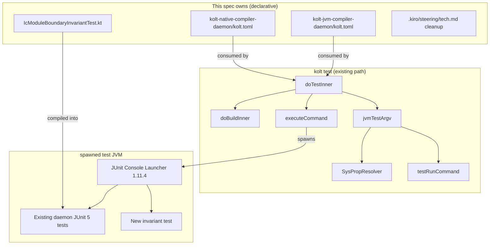
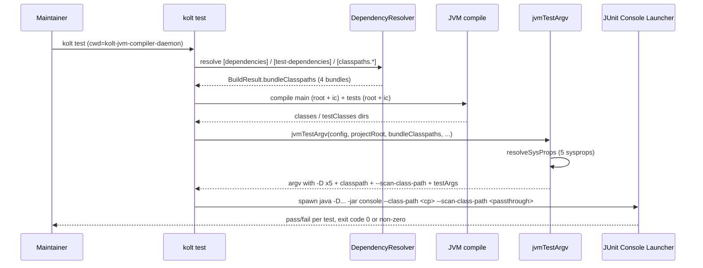

# Design Document

## Overview

**Purpose**: 本機能は kolt の daemon 副プロジェクト群 (`kolt-jvm-compiler-daemon` および root daemon の subdirectory `ic`、 `kolt-native-compiler-daemon`) の JUnit 5 テスト集合を `kolt test` で実行可能にし、 user-facing / developer-facing surface から `./gradlew check` 言及を撤去する。

**Users**: kolt-on-kolt で kolt 自身を保守するメンテナ。 daemon 改変後の動作確認を Gradle 経由ではなく `kolt test` 1 発で完結させる。

**Impact**: 統合 kolt project (root daemon + ic を 1 つの kolt.toml として運用) を採用し、 ADR 0032 で landed 済の `[classpaths.<name>]` / `[test.sys_props]` schema を消費する。 既存 `kolt test` 経路 (`doTest` → `doBuildInner` → `jvmTestArgv` → `TestRunner`) は完全に保ち、 declarative な kolt.toml 編集と invariant test 1 ファイルの追加で完結する。

### Goals

- `kolt-jvm-compiler-daemon/` directory での `kolt test` が root daemon test と ic test の union を Gradle 同等の verdict で実行できる (1.1, 1.4–1.6)
- `kolt-native-compiler-daemon/` directory での `kolt test` が native daemon test を Gradle 同等の verdict で実行できる (1.3)
- ic 単体実行は **#323 lands まで一時的に DX 劣化を許容** (1.2 deferred)。 元案の filter passthrough 案は impl phase の Pre-flight Gate で動作不能を確認 (`testRunCommand` が `--scan-class-path` を固定挿入、 JUnit Console Launcher 1.11.4 が explicit selector との併用を reject)、 修正は kolt CLI 側のため別 issue #323 に分離
- ic test が必要とする 4 classpath bundle と 5 sysprop が ADR 0032 schema で表現され、 同等の jar / path が test JVM に届く (2, 3)
- root daemon test の `kolt.daemon.coreMainSourceRoot` sysprop が `[test.sys_props]` の `project_dir` 経由で届く (4)
- `./gradlew check` 言及を user / developer surface から撤去 (5)
- 既存 daemon test 本体に手を入れず、 source-static invariant test 1 つで test classpath isolation の文化的代替を確保 (6)
- kolt CLI の JVM test compile path に `-module-name` / `-Xfriend-paths` を forward する bug fix (7)。 impl 中に発見、 Gradle parity (R1.1 / R1.4 / R1.5 / R6.4) を満たすための前提条件で本 spec の DoD と直結する

### Non-Goals

- orphan な Gradle 設定ファイル (`build.gradle.kts`、 `settings.gradle.kts`、 `gradlew`、 `gradle/wrapper/`) の物理削除 — #316 で別途対応
- `./gradlew linkDebugExecutableLinuxX64` 等価レシピの提供 — vestigial、 #316
- multi-module project 機能 (#4) への統合 — 本 spec は ic を独立 kolt project にしないため、 path-based dep schema は導入しない
- kolt CLI / schema の **新機能追加** (= 新しい API / コマンド / オプション)。 既存挙動の bug fix (R7 が代表例) は本 spec で必要に応じて含める
- daemon test 範囲拡張 — Gradle 集合と同一を保つ (新規 invariant test は ic test の import 制約 assert のみ、 source-static で flake risk なし)
- `kolt-jvm-compiler-daemon/ic/` directory 単体での `kolt test` 実行サポート — 1.2 の filter 経路で代替

## Boundary Commitments

### This Spec Owns

- `kolt-jvm-compiler-daemon/kolt.toml` の test 関連セクション (`[build] test_sources`、 `[test-dependencies]`、 `[classpaths.*]`、 `[test.sys_props]`)
- `kolt-native-compiler-daemon/kolt.toml` の test 関連セクション (`[build] test_sources`、 `[test-dependencies]`)
- 各副プロジェクトの `kolt.lock` の test / classpaths 部分 (`kolt deps install` 再生成によって更新)
- 1 個の新規 invariant test ファイル: ic test の import 制約 (`kolt.daemon.{Main,server,reaper,...}` を ic test source が import していないこと) を source-static に assert
- kolt CLI の JVM test compile bug fix (R7): `src/nativeMain/kotlin/kolt/build/TestBuilder.kt` の argv に `-module-name <project-name>` と `-Xfriend-paths=<main-classes-dir>` を追加、 `src/nativeMain/kotlin/kolt/build/SubprocessCompilerBackend.kt` の subprocess 経路で `request.moduleName` を `-module-name` として forward。 関連 native test を `src/nativeTest/kotlin/kolt/build/` に追加
- `.kiro/steering/tech.md` の `## Common Commands` にある `./gradlew check` 行とその Special-purpose 注釈の撤去
- 本 spec の design 判断 (Option B 採用 / "from its own directory" 緩和) を PR 本文と本 design.md で明示

### Out of Boundary

- kolt CLI / schema の拡張 (path-based dep、 multi-module、 CLI flag 追加など)
- Gradle 設定ファイル群の物理削除 (`build.gradle.kts`、 `settings.gradle.kts`、 `gradlew`、 `gradle/wrapper/`)
- 既存 daemon test 本体ロジック (`kolt-jvm-compiler-daemon/**/src/test/kotlin/`、 `kolt-native-compiler-daemon/src/test/kotlin/`) の改変
- daemon main / production logic の変更
- CI workflow の編集 (`./gradlew check` は CI 経路に既に存在しないため触る必要なし)
- Issue #315 本文の編集 (history value のため当時のまま保持)

### Allowed Dependencies

- ADR 0032 schema (`[classpaths.<name>]` / `[test.sys_props]` / `[run.sys_props]`) と関連実装 (`Config.kt` / `SysPropValue.kt` / `SysPropResolver.kt` / `DependencyResolution.kt` / `DependencyCommands.kt`)
- 既存 `kolt test` 経路: `doTest` / `doTestInner` / `jvmTestArgv` / `TestRunner.testRunCommand`
- `autoInjectedTestDeps` (target=jvm のとき `kotlin-test-junit5:<kotlin.version>` を auto-inject) と user-declared `[test-dependencies]` の merge
- JUnit Platform Console Standalone 1.11.4 (`ToolManager.CONSOLE_LAUNCHER_SPEC` 経由)
- daemon の既存 toolchain pin: Kotlin 2.3.20 / JDK 25 / kotlinx-serialization-json 1.7.3 / kotlin-result 2.3.1 / ktoml-core 0.7.1
- Maven Central のみ (additional repository は不要)

### Revalidation Triggers

以下の変更が発生した場合、 本 spec の consume 側 (daemon kolt.toml / invariant test) を再検証する。

- ADR 0032 schema の意味論変更 (`project_dir` の resolution 起点、 `classpath` の colon-join 順序、 sysprop key の予約)
- `[test.sys_props]` の dotted key (例 `"kolt.daemon.coreMainSourceRoot"`) の preservation 仕様変更 — 本 spec は dotted key が `KoltConfig.testSection.sysProps` の Map key としてそのまま保たれる前提
- `jvmTestArgv` / `TestRunner.testRunCommand` の argv 構造変更 (例えば `--scan-class-path` の固定挿入位置の変更、 sysprop の前置位置の変更)
- JUnit Platform Console Standalone の major version bump (1.x → 2.x)
- daemon の Kotlin / JDK pin 変更
- `autoInjectedTestDeps` の対象 dep 変更
- `currentWorkingDirectory()` を起点にする projectRoot の semantic 変更
- Kotlin compiler の `-module-name` / `-Xfriend-paths` flag の名称変更や semantics 変更 (R7 が依拠する)

## Architecture

### Existing Architecture Analysis

- `kolt test` (target=jvm) は `doTestInner` で以下の順に走る:
  1. `loadProjectConfig` で `kolt.toml` を parse
  2. `doBuildInner` で main + bundle を resolve、 main classes を compile (`build/<profile>/classes`)
  3. `testBuildCommand` で test を compile (`build/<profile>/testClasses`)
  4. `currentWorkingDirectory()` を `projectRoot` として `jvmTestArgv` を呼び出し、 sysprop を resolve しつつ JUnit Console Launcher への argv を組む
  5. `executeCommand` で `java -D... -jar console --class-path <cp> --scan-class-path <testArgs...>` を spawn
- `BuildResult.bundleClasspaths: Map<String, String>` が `[classpaths.<name>]` ごとの colon-joined absolute path を保持し、 `SysPropResolver` が `{ classpath = "<name>" }` 値の resolution に使う
- `[test-dependencies]` は `autoInjectedTestDeps` (`kotlin-test-junit5:<kotlin.version>`) と user-declared を merge して resolver に渡る
- 既存 daemon の Gradle config (`kolt-jvm-compiler-daemon/build.gradle.kts` ほか) は本 spec の対象外、 #316 で削除予定

### Architecture Pattern & Boundary Map



> `DocCleanup` は test pipeline に流れ込まない static documentation 編集のため edge を持たない。 SpecOwned 内の他 3 ノードは consumer / producer 関係で pipeline に接続している。

**Architecture Integration**:

- Selected pattern: **declarative consumption of existing kolt test pipeline** — 本 spec は新規 component を作らず、 既存 `kolt test` 経路を kolt.toml で driven する
- Domain boundaries: 本 spec は kolt.toml schema の consumer 側のみ owner。 schema 自体 (ADR 0032) や test pipeline (`kolt test` 経路) は本 spec の Out of Boundary
- Existing patterns preserved: ADR 0032 sysprop delivery、 `kolt test` 共通動作、 JUnit 5 + kotlin-test の既存 stack
- New component rationale: invariant test 1 個のみ (`IcModuleBoundaryInvariantTest`)。 統合 classpath で失われる Gradle module isolation を source-static に補完する目的
- Steering compliance: ADR 0001 (Result), ADR 0019 §3 (BTA fence) を維持。 本 spec は production code に触らないため、 既存 ADR への影響なし

### Technology Stack

| Layer | Choice / Version | Role in Feature | Notes |
|-------|------------------|-----------------|-------|
| Build runtime | kolt 0.16.x | Test invocation host | 既存 `doTest` 経路を消費。 拡張なし |
| JVM | JDK 25 | Test JVM | 既存 daemon pin。 kolt の `[build] jdk = "25"` を維持 |
| Test runner | JUnit Platform Console Standalone 1.11.4 | Test discovery + execution | 既存 `ToolManager` 経由で fetch、 `testRunCommand` が argv を組む |
| Test framework | JUnit Jupiter 5.11.3 + kotlin-test-junit5 (Kotlin 2.3.20) | Test API | Gradle 時代と同 version。 `[test-dependencies]` で明示 pin |
| Schema | ADR 0032 (`[classpaths]` / `[test.sys_props]`) | Bundle / sysprop declaration | #318 で landed 済 |

詳細な dependency rationale や transitive 確認手順は `research.md` 参照。

## File Structure Plan

### Modified Files

- `kolt-jvm-compiler-daemon/kolt.toml`
  - `[build] test_sources = ["src/test/kotlin", "ic/src/test/kotlin"]` 追加 (現状は `[]`)
  - `[test-dependencies]` を新設、 `org.junit.jupiter:junit-jupiter = "5.11.3"` と `org.junit.platform:junit-platform-launcher = "1.11.3"` を pin (Gradle と同 version)
  - `[classpaths.bta_impl]` / `[classpaths.fixture]` / `[classpaths.serialization_plugin]` / `[classpaths.serialization_runtime]` を 4 bundle 追加
  - `[test.sys_props]` 6 個を declare (詳細は Components 節)
- `kolt-native-compiler-daemon/kolt.toml`
  - `[build] test_sources = ["src/test/kotlin"]` 追加
  - `[test-dependencies]` で `org.junit.jupiter:junit-jupiter` / `org.junit.platform:junit-platform-launcher` を pin
- `kolt-jvm-compiler-daemon/kolt.lock` — `kolt deps install` 実行で再生成 (手書き編集なし、 PR diff に含めて review)
- `kolt-native-compiler-daemon/kolt.lock` — 同上 (PR diff に含めて review)
- `.kiro/steering/tech.md` — `## Common Commands` の `./gradlew check` 行と `./gradlew linkDebugExecutableLinuxX64` 行、 および周辺の "Special-purpose" 注釈を削除
- `src/nativeMain/kotlin/kolt/build/TestBuilder.kt` — `testBuildCommand` の argv に `-module-name <project-name>` と `-Xfriend-paths=<classesDir>` を追加 (R7)
- `src/nativeMain/kotlin/kolt/build/SubprocessCompilerBackend.kt` — `subprocessArgv` の argv に `-module-name <moduleName>` を forward (R7)、 line 29 の "intentionally not forwarded" コメントを更新
- `src/nativeTest/kotlin/kolt/build/TestBuilderTest.kt` (or 既存 TestRunnerTest.kt と同階層の新 file) — argv に新 flag が含まれることを assert する unit test を追加 (R7.5)
- `src/nativeTest/kotlin/kolt/build/` 内の subprocess argv 関連既存 test に `-module-name` forward を assert する case を追加 (R7.5)

### Created Files

- `kolt-jvm-compiler-daemon/src/test/kotlin/kolt/daemon/IcModuleBoundaryInvariantTest.kt`
  - 場所: 既存 `AdapterBoundaryInvariantTest` と同じ root daemon test 配下 (daemon-core の境界 invariant ファミリー)
  - 責務: ic test source (`kolt-jvm-compiler-daemon/ic/src/test/kotlin/`) を walk し、 `import kolt.daemon.Main`、 `import kolt.daemon.server.`、 `import kolt.daemon.reaper.` のいずれかを含む行があれば fail
  - 実装パターン: `AdapterBoundaryInvariantTest` の `Files.walk(sourceRoot)` パターンを踏襲、 sysprop `kolt.daemon.icTestSourceRoot` で source root を受ける

> File Structure 観点: 本 spec は kolt の production code path に新規ファイルを追加しない。 daemon 副プロジェクトの declarative file 編集と test 1 個追加のみ。

## System Flows

### Test execution flow (kolt-jvm-compiler-daemon directory)



主要決定:

- `projectRoot = currentWorkingDirectory()` のため、 `[test.sys_props]` の `project_dir` は cwd 起点で resolve される (例: maintainer が `kolt-jvm-compiler-daemon/` で実行 → `project_dir = "src/main/kotlin"` は `kolt-jvm-compiler-daemon/src/main/kotlin` の絶対パス)
- `testArgs` は argv の末尾に append され、 JUnit Console Launcher に passthrough されるので filter (`--select-class=...`) は `kolt test -- ...` 形式で利用可能 (1.2)
- `[test.sys_props]` の resolve 順は ADR 0032 の declaration order に従い、 各 sysprop が `-Dkey=value` の独立フラグとして argv に並ぶ

## Requirements Traceability

| Requirement | Summary | Components | Interfaces | Flows |
|-------------|---------|------------|------------|-------|
| 1.1 | root daemon dir で root + ic test 実行 | kolt-jvm-compiler-daemon/kolt.toml の test_sources / test-deps / classpaths / test.sys_props | 既存 jvmTestArgv | Test execution flow |
| 1.2 | filter passthrough (deferred → #323) | — | — | Pre-flight Gate 結果に基づき本 spec から外す |
| 1.3 | native daemon dir で test 実行 | kolt-native-compiler-daemon/kolt.toml の test_sources / test-deps | 既存 jvmTestArgv | Test execution flow |
| 1.4 | 失敗時 non-zero exit | 既存 doTestInner の Result 経路 | 既存 ExitCode | Test execution flow |
| 1.5 | 全 pass で zero exit | 同上 | 同上 | 同上 |
| 1.6 | Gradle と verdict 一致 | 既存 test 本体不変 + 統合 classpath が Gradle 構造と一致 | — | Migration cross-check |
| 2.1 | bta_impl bundle | `[classpaths.bta_impl]` | ADR 0032 resolver | — |
| 2.2 | fixture bundle | `[classpaths.fixture]` | 同上 | — |
| 2.3 | serialization_plugin bundle | `[classpaths.serialization_plugin]` | 同上 | — |
| 2.4 | serialization_runtime bundle | `[classpaths.serialization_runtime]` | 同上 | — |
| 2.5 | lockfile への bundle 反映 | `kolt deps install` 既存挙動 | 既存 `resolveBundleClasspaths` | — |
| 2.6 | bundle 隔離 | ADR 0032 resolver の bundle isolation | 既存挙動 | — |
| 3.1–3.4 | 4 sysprop delivery | `[test.sys_props]` 4 entries | SysPropResolver / jvmTestArgv | Test execution flow |
| 3.5 | sysprop arrival semantics | 既存 SysPropResolver | 既存挙動 | — |
| 4.1 | coreMainSourceRoot declare | `[test.sys_props.kolt.daemon.coreMainSourceRoot] project_dir = "src/main/kotlin"` | ADR 0032 ProjectDir | — |
| 4.2 | sysprop の絶対 path delivery | 既存 SysPropResolver `project_dir` 解決 | 既存挙動 | — |
| 4.3 | source root に `.kt` ファイルあり | `kolt-jvm-compiler-daemon/src/main/kotlin/` 既存 | — | — |
| 5.1 | tech.md の `./gradlew check` 撤去 | `.kiro/steering/tech.md` 編集 | — | — |
| 5.2 | 他の user / dev surface | 走査済み 0 件 (CI / scripts / CLAUDE.md / SKILL に該当なし) | — | — |
| 5.3 | historical record 保持 | `.kiro/specs/`、 `docs/adr/`、 `spike/` 内の言及は触らない | — | — |
| 5.4 | repo-wide grep 0 | 編集後の verify | — | — |
| 6.1 | 既存 test 本体不変 | `kolt-jvm-compiler-daemon/**/src/test/kotlin/`、 `kolt-native-compiler-daemon/src/test/kotlin/` 既存ファイル不変 | — | — |
| 6.2 | JUnit / kotlin-test / JDK pin 不変 | `[test-dependencies]` で 5.11.3、 `[kotlin] version = "2.3.20"`、 `[build] jdk = "25"` 維持 | — | — |
| 6.3 | useJUnitPlatform 等価 | JUnit Console Launcher の `--scan-class-path` が同等 discovery | — | — |
| 6.4 | Gradle vs kolt verdict 一致 | #316 lands 前の cross-check 期間 | manual cross-run | Migration |
| 6.5 | invariant test 追加許容 + ic test source root sysprop | `IcModuleBoundaryInvariantTest.kt` (新規 1 ファイル)、 `[test.sys_props.kolt.daemon.icTestSourceRoot] project_dir = "ic/src/test/kotlin"` | source-static walk + ADR 0032 ProjectDir delivery | — |
| 7.1 | test compile に `-module-name` forward | `TestBuilder.kt` の `testBuildCommand` 改修 | kotlinc CLI flag `-module-name <project-name>` | — |
| 7.2 | test compile に `-Xfriend-paths` forward | 同上 | kotlinc CLI flag `-Xfriend-paths=<classesDir>` | — |
| 7.3 | subprocess main compile の `-module-name` forward | `SubprocessCompilerBackend.kt` の `subprocessArgv` 改修 | kotlinc CLI flag `-module-name <moduleName>` | — |
| 7.4 | `internal` access from test source set | 7.1-7.3 の効果として実現 | — | Test execution flow |
| 7.5 | argv shape を assert する native unit test | `src/nativeTest/kotlin/kolt/build/` に新 / 拡張 test | kotlin.test | — |

## Components and Interfaces

### Configuration Layer (declarative)

#### kolt-jvm-compiler-daemon/kolt.toml

| Field | Detail |
|-------|--------|
| Intent | 統合 kolt project の test pipeline を declare する |
| Requirements | 1.1, 1.2, 2.1–2.6, 3.1–3.5, 4.1–4.3, 6.2, 6.3 |

**Responsibilities & Constraints**

- root daemon main + ic main を `sources` に統合 (現状維持)、 `test_sources` を 2 ディレクトリに展開
- 4 classpath bundle と 6 test sysprop (4 classpath ref + `coreMainSourceRoot` + `icTestSourceRoot`) を declare
- `[test-dependencies]` で JUnit Jupiter と JUnit Platform Launcher を明示 pin (auto-inject の kotlin-test-junit5 transitive に頼らず、 Gradle 時代と同じ version を直接固定)

**Dependencies**

- Inbound: `loadProjectConfig` → `KoltConfig` (P0)
- Outbound: ADR 0032 resolver / `jvmTestArgv` (P0)
- External: Maven Central — JUnit / Kotlin / kotlinx.serialization の resolution (P0)

**Contracts**: State [x]

##### State / Schema

期待される kolt.toml 抜粋 (詳細値は research.md):

```toml
[build]
target = "jvm"
jdk = "25"
sources = ["src/main/kotlin", "ic/src/main/kotlin"]
test_sources = ["src/test/kotlin", "ic/src/test/kotlin"]

[test-dependencies]
"org.junit.jupiter:junit-jupiter" = "5.11.3"
"org.junit.platform:junit-platform-launcher" = "1.11.3"

[classpaths.bta_impl]
"org.jetbrains.kotlin:kotlin-build-tools-impl" = "2.3.20"

[classpaths.fixture]
"org.jetbrains.kotlin:kotlin-stdlib" = "2.3.20"

[classpaths.serialization_plugin]
"org.jetbrains.kotlin:kotlin-serialization-compiler-plugin-embeddable" = "2.3.20"

[classpaths.serialization_runtime]
"org.jetbrains.kotlin:kotlin-stdlib" = "2.3.20"
"org.jetbrains.kotlinx:kotlinx-serialization-core-jvm" = "1.7.3"

[test.sys_props]
"kolt.ic.btaImplClasspath" = { classpath = "bta_impl" }
"kolt.ic.fixtureClasspath" = { classpath = "fixture" }
"kolt.ic.serializationPluginClasspath" = { classpath = "serialization_plugin" }
"kolt.ic.serializationRuntimeClasspath" = { classpath = "serialization_runtime" }
"kolt.daemon.coreMainSourceRoot" = { project_dir = "src/main/kotlin" }
"kolt.daemon.icTestSourceRoot" = { project_dir = "ic/src/test/kotlin" }
```

**Implementation Notes**

- Integration: ADR 0032 resolver / lockfile / sysprop delivery がすべて consume 側を変更不要に組まれているため、 declarative 編集のみで動作する
- Validation: parse OK のみでは不十分。 `kolt deps install` を回して lockfile が生成されること、 各 bundle の resolved jar が Gradle と同等であることを cross-check する (impl phase)
- Risks: Maven transitive 解決の Gradle vs kolt 差分 (特に `kotlin-build-tools-impl` の depth)。 差分発覚時は bundle 内に explicit pin を追加、 または resolver の transitive 戦略を寄せる判断 (impl phase で確認)

#### kolt-native-compiler-daemon/kolt.toml

| Field | Detail |
|-------|--------|
| Intent | native daemon の test pipeline を declare する |
| Requirements | 1.3, 1.4, 1.5, 6.2, 6.3 |

**Responsibilities & Constraints**

- `test_sources = ["src/test/kotlin"]` を追加するのみ (sources は現状の 1 ディレクトリ維持)
- `[test-dependencies]` で JUnit Jupiter / Platform Launcher を pin
- classpath bundle / sysprop は不要 (native daemon test は sysprop を読まない)

**Dependencies**

- Inbound: `loadProjectConfig` (P0)
- Outbound: 既存 `jvmTestArgv` 経路 (P0)

**Contracts**: State [x]

##### State / Schema

```toml
[build]
target = "jvm"
jdk = "25"
sources = ["src/main/kotlin"]
test_sources = ["src/test/kotlin"]

[test-dependencies]
"org.junit.jupiter:junit-jupiter" = "5.11.3"
"org.junit.platform:junit-platform-launcher" = "1.11.3"
```

**Implementation Notes**

- Integration: 副プロジェクトとして独立で完結、 cross-module 依存なし
- Validation: 既存 native daemon test 群が全 pass で kolt test 終了 code 0
- Risks: 低 (sysprop 不要、 bundle 不要、 一直線の test 構成)

### Test Layer (new)

#### IcModuleBoundaryInvariantTest

| Field | Detail |
|-------|--------|
| Intent | 統合 kolt project で失われた Gradle module isolation を、 source-static な import 制約 invariant で補完する |
| Requirements | 6.5 |
| Owner / Reviewers | (any kolt-on-kolt maintainer) |

**Responsibilities & Constraints**

- ic test source (`kolt-jvm-compiler-daemon/ic/src/test/kotlin/`) 配下の `.kt` ファイルを walk
- `import kolt.daemon.Main`、 `import kolt.daemon.server.`、 `import kolt.daemon.reaper.` のいずれかの prefix 一致行があれば fail
- 失敗時メッセージに違反ファイルと行番号を列挙する
- source root は sysprop `kolt.daemon.icTestSourceRoot` で受ける

**Dependencies**

- Inbound: JUnit Platform discovery (root daemon test compile classpath にあれば自動 pickup) (P0)
- Outbound: `java.nio.file.Files.walk` (P0)
- External: なし

**Contracts**: Service [x]

##### Service Interface

```kotlin
package kolt.daemon

class IcModuleBoundaryInvariantTest {
  @Test
  fun `ic test sources do not import root daemon production packages`() {
    // sysprop 経由で source root を受け、 walk 結果を assert
  }
}
```

- Preconditions: sysprop `kolt.daemon.icTestSourceRoot` が ic test source root の絶対パスに設定されている
- Postconditions: 該当 import が 1 件もなければ pass、 1 件以上あれば assertEquals で空リスト期待値との比較で fail
- Invariants: production code への依存ゼロ (純 source-static)、 flake risk なし

**Implementation Notes**

- Integration: 既存 `AdapterBoundaryInvariantTest` と同 package (`kolt.daemon`) に置く。 Files.walk pattern を踏襲し、 import prefix 配列を変えただけのほぼ同型コード
- Source root resolution: sysprop `kolt.daemon.icTestSourceRoot` 経由で受ける。 `AdapterBoundaryInvariantTest` が既に sysprop 経由 (`kolt.daemon.coreMainSourceRoot`) で source root を受ける pattern を採用しており、 本 invariant も同 pattern に揃える。 cwd-relative 解決 (例 `Paths.get("ic/src/test/kotlin")`) は `AdapterBoundaryInvariantTest` 側を本 spec で書き換えることになり scope 膨張のため不採用。 invariant test が `[test.sys_props]` delivery 経路に self-referentially 依存する trade-off は既存 invariant test と同じ
- Validation: 自身が新規追加されることで pass することを確認 (現状 ic test は root daemon production package を import していないことを research.md で確認済)
- Risks: prefix リストの過不足。 `kolt.daemon` 配下で ic 以外の package が増えたら invariant の prefix も追従が必要

### Foundation Layer (kolt CLI bug fix)

#### CLI Test Compile Module-Name Alignment

| Field | Detail |
|-------|--------|
| Intent | kolt CLI の JVM test compile が main と同じ Kotlin module 名で compile されるようにし、 test source set が main の `internal` symbol にアクセス可能にする (Gradle Kotlin plugin と同等の挙動) |
| Requirements | 7.1, 7.2, 7.3, 7.4, 7.5 |

**Responsibilities & Constraints**

- `testBuildCommand` の kotlinc argv に `-module-name <KoltConfig.name>` と `-Xfriend-paths=<CLASSES_DIR>` を追加 (line 9-36 の `testBuildCommand` 関数 signature には既に `config` と `classesDir` がある)
- `subprocessArgv` の kotlinc argv に `-module-name <request.moduleName>` を forward (line 29 の「moduleName intentionally not forwarded」 コメントは同時に削除)
- daemon path (`DaemonCompilerBackend.kt:277` 周辺) は既に `moduleName` を forward しているため改修不要、 subprocess path のみ修正
- 改修後、 daemon path / subprocess path のどちらでも main と test が同じ Kotlin module として compile される
- Kotlin compiler の `internal` semantics 仕様 (`-module-name` 一致 + `-Xfriend-paths` で friend module 認定) に依拠

**Dependencies**

- Inbound: 既存 `doBuildInner` / `doTestInner` 経路 (P0)
- Outbound: kotlinc CLI (Kotlin 2.3.20 など、 既存 toolchain) (P0)
- External: Kotlin compiler の `-module-name` / `-Xfriend-paths` flag 仕様 (P0)

**Contracts**: Service [x]

##### Argv Contract

`testBuildCommand` の出力 argv に以下が含まれる:

```
-module-name <config.name>
-Xfriend-paths=<classesDir>
```

`subprocessArgv` の出力 argv に以下が含まれる (target=jvm のとき):

```
-module-name <request.moduleName>
```

**Implementation Notes**

- Integration: 既存の argv builder 関数 signature を変えず、 既存 parameter (`config`、 `classesDir`、 `request.moduleName`) を消費する形で flag を追加するだけ
- Validation: native unit test (`src/nativeTest/kotlin/kolt/build/`) で argv 内に新 flag が含まれることを assert、 さらに本 spec の task 5.1 / 5.4 で daemon test compile が `internal` access error なく成功することを e2e 確認
- Risks: `-Xfriend-paths` は internal/private API 扱いだが Kotlin 1.x 系から安定して存在、 Gradle Kotlin plugin / IntelliJ で広く使われている。 値は **main classes 出力 dir** (例 `build/<profile>/classes`) で source dir ではない点に注意 (debug subagent 由来のメモ)。 `-Xfriend-paths` は internal flag なので将来 Kotlin major bump で名称が変わる可能性あり、 その時は `[Revalidation Triggers]` で検出される

### Documentation Layer

#### tech.md cleanup

| Field | Detail |
|-------|--------|
| Intent | `./gradlew check` 言及を user / developer surface から撤去する |
| Requirements | 5.1, 5.2, 5.3, 5.4 |

**Responsibilities & Constraints**

- `.kiro/steering/tech.md` の `## Common Commands` 内、 Special-purpose ブロック (3 行: `./gradlew check`、 `./gradlew linkDebugExecutableLinuxX64 \\`、 続く `&& ...kolt.kexe build`) を削除
- ブロック前後の文脈整合 (見出しや空行) を整える
- 他の user / developer surface には該当行が無いこと (走査済) を verify
- 履歴 (`.kiro/specs/`、 `docs/adr/`、 `spike/`、 orphan `build.gradle.kts`) は触らない

**Implementation Notes**

- Integration: `tech.md` のみの局所編集
- Validation: `grep -r "gradlew check" .` を user / dev surface 以外を除外して 0 件であることを cross-check
- Risks: 低 (機械的な編集)

## Data Models

該当なし。 本 spec は新規 data model を追加せず、 既存 `KoltConfig` / `kolt.lock` schema を消費するのみ。 `kolt.lock` の更新は `kolt deps install` の既存挙動に従う。

## Error Handling

### Error Strategy

- kolt.toml の parse / validation error は既存 `Config.kt` の `Result<KoltConfig, ConfigError>` 経路で表面化。 本 spec は新規 error path を追加しない
- bundle resolve 失敗、 test compile 失敗、 test JVM spawn 失敗はすべて既存 `doTestInner` の `Result<Unit, Int>` exit code 経路で扱う
- 新規 invariant test の失敗は通常の JUnit 5 failure (assertEquals が空リストを期待し、 violation list との差分で fail message を提示)

### Monitoring

- `kolt deps install` のログで bundle resolution の transitive 一覧を確認
- `kolt test` の standard output が JUnit Console Launcher の出力をそのまま流すため、 既存の Gradle 出力との比較が容易
- `BtaSerializationPluginTest` 等の reflective load failure は JVM stacktrace で表面化、 sysprop 経由の classpath が空 / 不正な場合は `Path.of("")` 系の error で fail

## Testing Strategy

### Pre-flight Gate (impl phase 実施結果: 動作不能 → #323 へ deferred)

実施結果 (2026-05-01): JUnit Platform Console Launcher 1.11.4 が `--scan-class-path` と explicit selector (`--select-class` 等) の併用を reject するため、 `kolt test -- --select-class=<FQCN>` 経由の filter は **動作不能**。 `testRunCommand` の `--scan-class-path` 固定挿入を抑止する条件分岐が必要だが、 これは kolt CLI 側の change で本 spec の Out of Boundary に該当するため、 follow-up issue **#323** に分離。

R1.2 を deferred 扱いとし、 本 spec では filter 経由の単体実行 DX を一時的に放棄する。 ic / root-only の試走は `kolt-jvm-compiler-daemon/` で全 test 実行する形で代替する。

### Smoke Tests (manual + CI)

- `cd kolt-jvm-compiler-daemon && kolt test` が root daemon test + ic test の union を全 pass で完了 (1.1, 1.4, 1.5)
- `cd kolt-native-compiler-daemon && kolt test` が native daemon test を全 pass で完了 (1.3, 1.4, 1.5)
- `cd kolt-jvm-compiler-daemon && kolt test -- --select-class=PluginTranslatorTest` が ic 単体 test に絞れる (1.2)

### Cross-check Tests (#316 lands 前の期間限定)

- 同じ source tree に対して `./gradlew :kolt-jvm-compiler-daemon:check` と `./gradlew :kolt-jvm-compiler-daemon:ic:check` の verdict union が `cd kolt-jvm-compiler-daemon && kolt test` と一致 (6.4)
- 同じく `./gradlew :kolt-native-compiler-daemon:check` と `cd kolt-native-compiler-daemon && kolt test` が一致 (6.4)

### Invariant Test (new)

- `IcModuleBoundaryInvariantTest` 自身は ic test source 配下を source-static に走査、 現状 0 件で pass。 import 違反が混入したら fail (6.5)

### Regression Guard

- 既存 daemon test 群 (root: 8 ファイル、 ic: 16 ファイル、 native: 8 ファイル) は本 spec で body 改変なし (6.1)
- JUnit / kotlin-test / JDK / Kotlin pin は維持 (6.2)
- test discovery semantics (`useJUnitPlatform()` 相当) は JUnit Console Launcher の `--scan-class-path` で等価 (6.3)

## Migration Strategy


主要決定:

- 本 spec の PR がマージされた時点では orphan Gradle config (`build.gradle.kts` / `settings.gradle.kts` / `gradlew` 等) はまだ残る (#316 待ち)
- この期間は `./gradlew check` も `kolt test` も両方走らせて verdict 一致を verify する (R6.4)
- #316 がマージされた時点で `./gradlew check` 経路は失われ、 `kolt test` が唯一の test runner になる
- 本 spec の PR 本文には Issue #315 文言緩和 (filter 経路への代替) を 1 行明示し、 design.md §Goals / Boundary Commitments を参照リンクとする

## Open Questions / Risks

1. ~~**filter passthrough の動作確認**~~ — 解決済 (動作不能と確認、 #323 で別途対応)
2. **Maven transitive 差分** (Research Item 1 from research.md)
   - Gradle と kolt resolver で transitive jar 集合が一致するか (特に `kotlin-build-tools-impl:2.3.20` の depth)
   - 差分発覚時は bundle に explicit pin を追加 (本 spec の対応範囲)
3. **JVM test argv 等価性** (Research Item 2 from research.md)
   - `jvmTestArgv` が組む argv と Gradle `tasks.test` の argv の差分 (working directory / -D 順序 / `-cp` 順序 / JDK option)
   - 既存実装は `currentWorkingDirectory()` を `projectRoot` として使うので、 maintainer が `kolt-jvm-compiler-daemon/` で実行する限り Gradle の `:kolt-jvm-compiler-daemon:test` と同 cwd
4. **`BtaSerializationPluginTest` の reflective load 安定性** (Research Item from earlier analysis)
   - serialization compiler plugin を URLClassLoader で reflective load する経路が、 統合 classpath 環境下でも Gradle 時代と同じ ordering / file 位置で動作するか
   - serialization_plugin bundle と serialization_runtime bundle の jar 位置が `[classpaths]` resolver で安定的に解決されることを確認

## Supporting References

- ADR 0032 — `[classpaths.<name>]` / `[test.sys_props]` schema (parser / resolver / lockfile / sysprop delivery)
- ADR 0019 §3 — daemon-core が `kolt.buildtools.*` を import しない invariant (既存 `AdapterBoundaryInvariantTest` の根拠)
- `research.md` — Option A vs B 判断経緯、 Maven transitive 差分のリサーチ計画、 ic sysprop / import confirmations
- `requirements.md` — 6 Requirements、 Boundary Context (in scope / out of scope / adjacent expectations)
- Issue #315 — DoD 文言と本 design の "from its own directory" 緩和判断の対比
