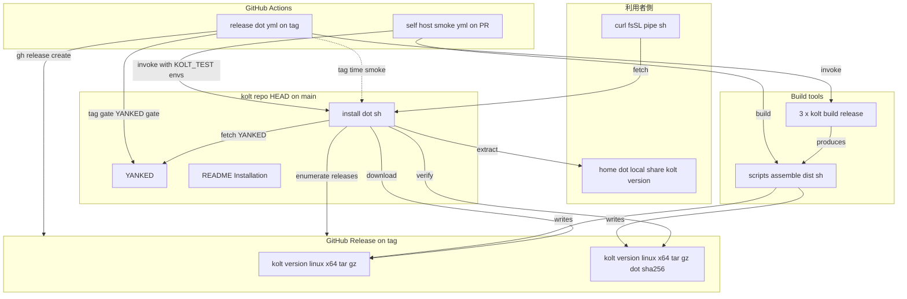
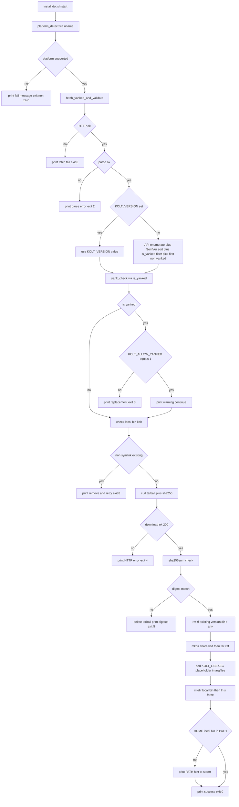
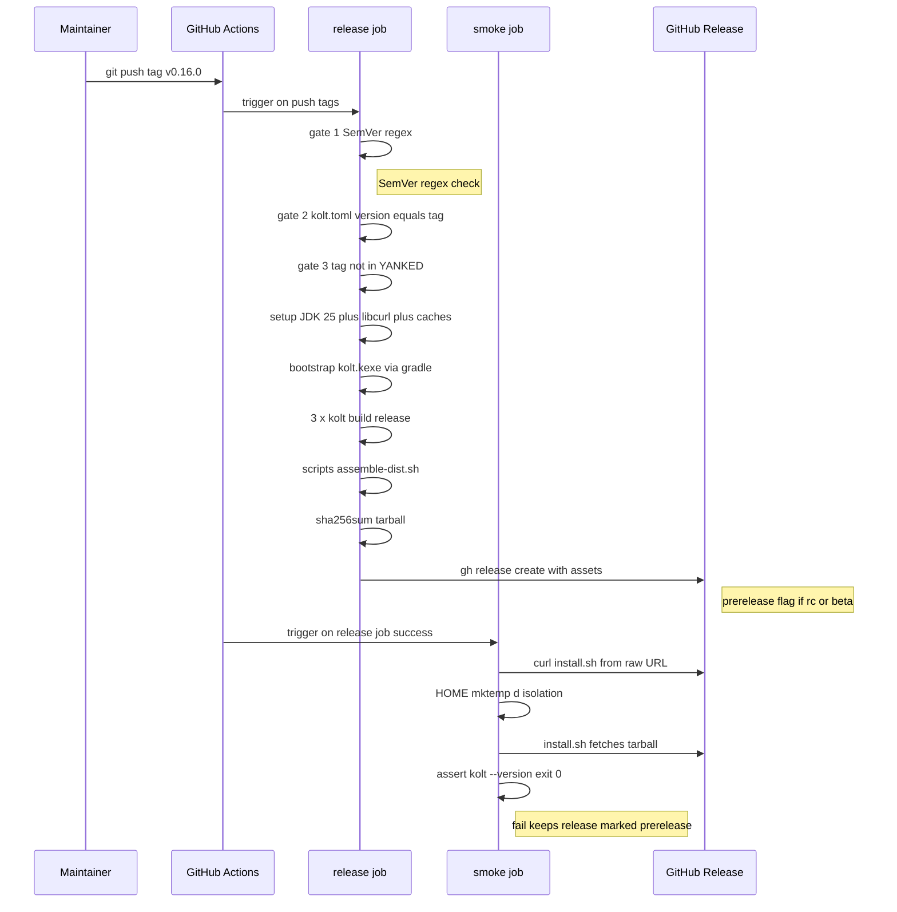

# Design Document — installer

## Overview

**Purpose**: kolt を `curl -fsSL <raw URL> | sh` の 1 コマンドで Linux x64 にインストール可能にし、ADR 0018 §4 が掲げる deno/bun/rye/uv 並みの導入 UX を実現する。

**Users**: kolt を初めて試す外部利用者 (`install.sh` 経由)、tag を push して release を出す kolt メンテナ (`release.yml` 経由)、kolt 本体に変更を加える contributor (PR-time の install.sh smoke 経由)。

**Impact**: 現状 git clone + Gradle bootstrap でしか入手できない kolt が、tag push を起点とする release pipeline + 公開 install script + repo HEAD の YANKED manifest という 3 軸で構成された配布経路を獲得する。`scripts/assemble-dist.sh` (PR #228) の tarball stitcher を消費する側として `install.sh` が立ち上がり、`self-host-smoke.yml` の `self-host-post` job 中 inline sed (lines 184-188) を `install.sh` 呼び出しに置き換えることで、PR ごとに本物の install 経路が exercise される。

### Goals

- tag push (`v*`) を起点に走り、SemVer regex / kolt.toml ↔ tag 整合 / YANKED gate を経て tarball + `.sha256` を GitHub Release に publish する `.github/workflows/release.yml` を ship する。
- repo root に POSIX sh 準拠の `install.sh` を ship し、platform 検出・version 選択・YANKED gate・SHA-256 検証・展開・symlink を 1 ファイル内で完結させる。
- repo root に空の `YANKED` ファイルを commit し、ADR 0028 §5 の format を release.yml と install.sh の双方で実装する。
- `self-host-smoke.yml` 内の inline sed を `install.sh` 呼び出しに置換し、PR ごとに install 経路を smoke test する。
- README の Installation section を curl|sh コマンドに書き換える。

### Non-Goals

- macOS / Windows / linuxArm64 binary の生成 (#82, #83)。install.sh の case 文 skeleton は多 platform 前提で書くが、tarball matrix は linux-x64 のみ。
- install.sh の upgrade / uninstall / rollback / shell rc 自動編集 (ADR 0018 §4 で defer 確定)。
- `kolt.dev` ドメイン取得・リダイレクト設定。
- cosign / GPG / Sigstore 等の署名 (SHA-256 のみ初版採用)。
- 過去 release (v0.15.0 以前) への retroactive な asset attach。
- YANKED parser を release.yml と install.sh で共有する shared library 化 (本 spec では duplicate を許容、§§Components 参照)。

## Boundary Commitments

### This Spec Owns

- `.github/workflows/release.yml` の全挙動 (tag trigger、SemVer / kolt.toml / YANKED の 3 つの pre-publish gate、`assemble-dist.sh` の起動、`.sha256` 生成、`gh release create` 経由の asset upload、tag-time install smoke)。
- `install.sh` の全挙動 (POSIX sh、platform 検出、env var contract、YANKED parser、GitHub Releases API enumerate、tarball + .sha256 download、SHA-256 検証、`~/.local/share/kolt/<version>/` 展開、`@KOLT_LIBEXEC@` sed、`~/.local/bin/kolt` symlink 作成・上書き、PATH hint)。
- repo root の `YANKED` ファイル (空ファイル commit が初期 deliverable)、ADR 0028 §5 format を実コードで運用する責務。
- `scripts/assemble-dist.sh` への `.sha256` 生成追加 (末尾 1〜2 行)。
- `.github/workflows/self-host-smoke.yml` の `self-host-post` job 中 sed step → `install.sh` 呼び出しへの置換、yank refuse smoke step の追加。
- `README.md` の Installation section を curl|sh コマンドに書き換える。

### Out of Boundary

- 多 platform binary 生成 (#82, #83)。Req 4.5 は tarball 命名規約 `kolt-<version>-<platform>.tar.gz` の `<platform>` 変数化を install.sh と assemble-dist.sh の双方に求めるが、これは **forward-compat の構造的コミットメント** であって本 spec の運用 scope ではない。本 spec の運用 scope は linux-x64 のみで、darwin / linuxArm64 は #82 / #83 で別 track。
- ADR 0018 §1 が pin する tarball layout (`bin/` + `libexec/`)、`assemble-dist.sh` の tarball 生成ロジック本体 (`.sha256` 生成 1 行追加を除く)。
- ADR 0028 §5 が pin する YANKED format 自体 (本 spec はそれを実装する側、format の改訂権は ADR 0028 にある)。
- `gh release create` の制約に起因する behavior (asset upload の rate limit、Release notes 編集の運用は scope 外)。
- pre-#230 release (v0.15.0 以前) のサポート (install.sh が叩いて 404 を返した時のメッセージ文言だけ design 側で軽く保証する、§§Error Handling)。
- daemon 起動経路 / `bin/kolt` 自身の挙動 (ADR 0018 §2 / §5 が owner)。
- 多 platform binary 生成 (#82, #83)。

### Allowed Dependencies

- `scripts/assemble-dist.sh` (PR #228 で完成、ADR 0018 §1 / §2 / §4 準拠) — tarball stitcher として消費する。本 spec は `.sha256` 生成 1 行追加のみで本体ロジックは触らない。
- `kolt.toml` の `version =` 行 — 単一の version 情報源。release.yml が tag との整合 gate でこれを参照する。
- ADR 0018 §1 の tarball layout、§4 の install 先 / symlink 先、§6 の bundle vs auto-provision 方針。
- ADR 0028 §1 の SemVer regex、§5 の YANKED format。
- `.github/workflows/self-host-smoke.yml` の既存 `self-host-post` job 構造 (キャッシュキー、JDK 25 setup、libcurl install、3 × kolt build) — caching key は流用、step ordering は変更しない。
- GitHub Actions 標準 runner (`ubuntu-latest`)、`gh` CLI (pre-installed)、`actions/checkout@v4`、`actions/setup-java@v4`、`actions/cache@v4`。
- POSIX 標準コマンド (`sh`, `curl`, `tar`, `sed`, `grep`, `awk`, `cut`, `uname`, `mkdir`, `ln`, `chmod`, `printf`, `sha256sum`)。

### Revalidation Triggers

以下のいずれかが起きたとき、本 spec の consumer (`self-host-smoke.yml`、ADR 0018、ADR 0028 を参照する後続 spec) は再検証が必要:

- tarball 命名規約 `kolt-<version>-<platform>.tar.gz` の変更 → install.sh の URL 構築、release.yml の asset 名、assemble-dist.sh の出力名すべてに波及。
- `~/.local/share/kolt/<version>/` または `~/.local/bin/kolt` の install 先 path 変更 → ADR 0018 §1 / §4 の更新と #82 / #83 の追従。
- YANKED format の変更 (ADR 0028 §5 の改訂) → release.yml と install.sh の parser 両方の更新が同 PR で必須。
- env var (`KOLT_VERSION`, `KOLT_ALLOW_YANKED`, `KOLT_TEST_BASE_URL`, `KOLT_TEST_YANKED_URL`) の追加 / 削除 / 意味変更 → README documentation と CI smoke の env 設定の同期更新。
- `gh release create` から GitHub REST API 直叩きへの切り替え → release.yml の permissions と secrets の見直し。
- `assemble-dist.sh` の version 抽出ロジック変更 → release.yml の kolt.toml ↔ tag gate の整合確認。

## Architecture

### Existing Architecture Analysis

- **`scripts/assemble-dist.sh`** (PR #228 で完成) は kolt.toml から version を読み、tarball layout (ADR 0018 §1) を構築して `dist/kolt-<version>-linux-x64.tar.gz` を出力する。`@KOLT_LIBEXEC@` placeholder を argfile に書き込む。本 spec はこれを呼び出す側、変更は末尾に `.sha256` 生成 1 行追加のみ。
- **`self-host-smoke.yml`** の `self-host-post` job は assemble-dist.sh を実行し、tarball を `/tmp/kolt-install` に展開、inline sed で `@KOLT_LIBEXEC@` を絶対パスに置換、fixture を smoke build する。本 spec はこの sed step を install.sh 呼び出しに置き換え、yank refuse smoke step を追加する。
- **CI workflow パターン**: `ubuntu-latest` + `setup-java@v4` (JDK 25 temurin) + libcurl4-openssl-dev + 3 種類の cache (`~/.gradle`, `~/.konan`, `~/.kolt`)。release.yml はこの雛形に乗る。
- **kolt.toml の version**: 手動で release PR ごとに bump (PR #271 が precedent)。release.yml の gate でこれと tag を比較する。

### Architecture Pattern & Boundary Map



**Architecture Integration**:
- **Selected pattern**: 単方向データフロー型 release pipeline。tag を上流 trigger、`install.sh` を下流 consumer、`YANKED` を双方向 gate (release.yml で publish 時 / install.sh で install 時)。
- **Domain boundaries**: 「release を作る側 (release.yml + assemble-dist.sh)」と「release を消費する側 (install.sh + YANKED)」を明確分離。CI smoke は両側のテスト harness。
- **Existing patterns preserved**: `self-host-smoke.yml` のキャッシュキー、JDK 25 setup、3 × kolt build sequence。`assemble-dist.sh` の出力ロジック。`kolt.toml` を version の単一情報源とする慣習 (PR #271 precedent)。
- **New components rationale**: install.sh は curl|sh される self-contained script の責務、release.yml は tag → asset の責務、YANKED は 2 サイドが共有する manifest の責務。それぞれ単一責任。
- **Steering compliance**: ADR 0018 §1 / §4 / §6 と ADR 0028 §1 / §5 を実装側として尊重。CLAUDE.md の "no backward compat until v1.0" に従い、format / env var の変更は migration shim 無しで行ってよい。

### Technology Stack

| Layer | Choice / Version | Role in Feature | Notes |
|-------|------------------|-----------------|-------|
| Install script shell | POSIX sh (`#!/bin/sh`) | `install.sh` の実行環境。bash-isms (`[[ ]]`、配列、`local`) は使わない | macOS の bash 3.2 対応の保険。#82 で確定対応 |
| Release workflow | GitHub Actions (`actions/*@v4`、`gh` CLI) | tag-triggered build + publish + smoke の orchestration | runner: `ubuntu-latest`、permissions: `contents: write` |
| Hash | `sha256sum` (GNU coreutils) | tarball integrity の必須検証 | macOS では `shasum -a 256` だが #82 で対応。初版は Linux only |
| HTTP | `curl -fsSL` (全 path) | release fetch / API enumerate / YANKED fetch / tarball+`.sha256` download | `-fsS` で進捗バー抑制、`-L` で redirect 追従 |
| Archive | `tar xzf` (POSIX) | tarball 展開 | `--strip-components=0` (top-level dir 維持) |
| JSON parse | `grep -oE` + `sed` | GitHub Releases API response から `tag_name` 抽出 | 限定 scope の文字列抽出のみ。`jq` 依存は避ける |
| SemVer compare | `sort -V` (GNU sort) | tag list を newest-first で並べる | Linux 限定。BSD sort は #82 で別途対応 |

## File Structure Plan

### Directory Structure

```
kolt/                                    # repo root
├── install.sh                          # NEW: POSIX sh script, the curl|sh entry
├── YANKED                               # NEW: empty file at first
├── README.md                            # MODIFIED: Installation section
├── scripts/
│   └── assemble-dist.sh                # MODIFIED: append .sha256 generation
└── .github/workflows/
    ├── release.yml                     # NEW: tag-triggered release + smoke
    └── self-host-smoke.yml             # MODIFIED: replace sed with install.sh, add yank smoke
```

### Modified Files

- **`scripts/assemble-dist.sh`** — 既存の末尾 `tar czf` の直後 (line 254 付近) に `sha256sum kolt-${VERSION}-linux-x64.tar.gz > kolt-${VERSION}-linux-x64.tar.gz.sha256` を 1 行追加 (相対パス cd 済みの dist/ 内で実行)。本体ロジックは無変更。
- **`.github/workflows/self-host-smoke.yml`** — `self-host-post` job 中の lines 181-188 (Substitute KOLT_LIBEXEC placeholder in argfiles step) を「install.sh を `KOLT_TEST_BASE_URL` + `KOLT_VERSION` 付きで呼び出す step」に置換。直後に「合成 YANKED でテスト version を yank した状態で install.sh を実行し、refuse を assert する step」を追加。
- **`README.md`** — `## Installation` section (lines 14-30) を、curl|sh の copy-paste-able code block + `KOLT_VERSION` / `KOLT_ALLOW_YANKED` の env var 解説 + linux-x64 only / #82 / #83 の note + PATH への追加が必要であり得る旨の note、に書き換える。Build-from-source 手順は contributor 向けセクションに移動して保持。

### New Files

- **`install.sh`** (~250-350 行) — repo root 直下、`#!/bin/sh` shebang。`set -eu`、後述 7 関数構成。
- **`YANKED`** — repo root 直下、size 0 bytes。`.gitignore` 対象外。
- **`.github/workflows/release.yml`** (~150-200 行) — tag trigger 専用。後述 4 段階の gate + build + publish + smoke。

## System Flows

### install.sh — 全体実行フロー



**Key decisions**:
- YANKED manifest の fetch + format validate は最初に 1 回 (`FetchValidate`)。format error はここで止め、後続経路は validated manifest だけを参照する。
- `EnumerateAndFilter` は内部で `is_yanked` を loop で呼んで「最新の non-yanked」を pick する (Req 3.1 を honor)。`YankCheckStep` は KOLT_VERSION 経路で active、auto-pick 経路では論理的 no-op だが defensive な double-check として flow 上残す。
- 全 fail path で「ファイルシステムへの改変は最後」が成立。`SymlinkCheck` は download 前 (existing non-symlink を上書きせず early refuse)、`ExtractClean` で既存 version dir を rm して残骸を残さない、symlink 作成は最後。
- `KOLT_TEST_BASE_URL` / `KOLT_TEST_YANKED_URL` が設定された場合、`FetchValidate` / `DownloadTarball` は対応 URL に向く。`KOLT_VERSION` 併用で API path を完全 bypass できる (PR-time smoke 用)。

### release.yml — tag push から smoke までのフロー



**Key decisions**:
- 3 gate は順序依存 (SemVer → kolt.toml → YANKED)。最初の cheap check で fail-fast、build に入る前に reject。
- `gh release create` が成功すれば release は publish 状態で見える。smoke が後から失敗すると Release は public のまま残る (revert 困難) — これは `gh release create --prerelease` を一度経由する運用も検討するが、初版は単純に「smoke 失敗時は人間が手動で yank する」運用とする (頻度極低)。
- tag-time smoke は別 job で、`needs: release` で順序保証。clean runner で実 raw URL を curl|sh する。

## Requirements Traceability

| Requirement | Summary | Components | Interfaces | Flows |
|-------------|---------|------------|------------|-------|
| 1.1 | SemVer tag → release.yml が tarball upload | release.yml | tag trigger + `gh release create` | release.yml flow |
| 1.2 | 不正 tag を upload 前に reject | release.yml | gate 1 (SemVer regex) | release.yml flow |
| 1.3 | tarball と `.sha256` を同時 upload | release.yml + assemble-dist.sh extension | `gh release create <files...>` | release.yml flow |
| 1.4 | YANKED 該当 tag は upload 前に reject | release.yml | gate 3 (YANKED parser) | release.yml flow |
| 1.5 | `-rc.N` / `-beta.N` は pre-release mark | release.yml | `gh release create --prerelease` | release.yml flow |
| 1.6 | tag と kolt.toml の version 整合 | release.yml | gate 2 (kolt.toml ↔ tag check) | release.yml flow |
| 2.1 | linux-x64 で fresh install 完走 | install.sh | `download_and_verify` + `extract_and_link` | install.sh flow |
| 2.2 | argfile の `@KOLT_LIBEXEC@` 置換 | install.sh | `extract_and_link` 内 sed step | install.sh flow |
| 2.3 | `~/.local/bin/kolt` symlink 作成・上書き | install.sh | `extract_and_link` 内 `ln -sf` | install.sh flow |
| 2.4 | `~/.local/{bin,share/kolt}` mkdir | install.sh | `extract_and_link` 内 `mkdir -p` | install.sh flow |
| 2.5 | `kolt --version` 通る | install.sh + smoke jobs | (post-condition assert) | release.yml + self-host-smoke.yml flows |
| 2.6 | 既存 non-symlink を上書きせず refuse | install.sh | `extract_and_link` 内 file type check | install.sh flow |
| 2.7 | PATH 未設定なら hint | install.sh | `extract_and_link` 末尾 PATH check | install.sh flow |
| 3.1 | `KOLT_VERSION` 未指定で latest non-yanked | install.sh | `select_version` (API enumerate + sort -V + filter) | install.sh flow |
| 3.2 | `KOLT_VERSION=<v>` 指定 | install.sh | `select_version` early return | install.sh flow |
| 3.3 | yank された version refuse | install.sh | `parse_yanked` + decision branch | install.sh flow |
| 3.4 | `KOLT_ALLOW_YANKED=1` で続行 + 警告 | install.sh | `parse_yanked` + decision branch | install.sh flow |
| 3.5 | YANKED fetch 失敗で fail | install.sh | `fetch_yanked` curl error handling | install.sh flow |
| 3.6 | YANKED は raw GitHub URL から fetch | install.sh | `fetch_yanked` URL constant + `KOLT_TEST_YANKED_URL` override | install.sh flow |
| 4.1 | `Linux/x86_64` → `linux-x64` 続行 | install.sh | `platform_detect` case 文 | install.sh flow |
| 4.2 | `Darwin` は #82 参照 fail | install.sh | `platform_detect` case 文 | install.sh flow |
| 4.3 | `Linux` 非 `x86_64` は #83 参照 fail | install.sh | `platform_detect` case 文 | install.sh flow |
| 4.4 | その他は generic unsupported fail | install.sh | `platform_detect` case 文 | install.sh flow |
| 4.5 | tarball 命名規約 multi-platform | install.sh + assemble-dist.sh | URL 構築の `<platform>` 変数化 | (cross-cutting) |
| 5.1 | release が `.sha256` を upload | assemble-dist.sh extension + release.yml | `sha256sum > .sha256` + `gh release create` | release.yml flow |
| 5.2 | install.sh が `.sha256` を fetch して検証 | install.sh | `download_and_verify` 内 `sha256sum -c` | install.sh flow |
| 5.3 | 検証失敗で削除 + fail | install.sh | `download_and_verify` 内 verify branch | install.sh flow |
| 5.4 | 検証は展開・sed・symlink より前 | install.sh | flow ordering invariant | install.sh flow |
| 6.1 | repo root に `YANKED` 1 ファイル | YANKED | (file 存在自体) | (cross-cutting) |
| 6.2 | yank が無い場合 0 bytes | YANKED | (initial state) | (cross-cutting) |
| 6.3 | 各非空行 3 tab-separated fields | release.yml gate + install.sh `parse_yanked` | parser strict mode | (cross-cutting) |
| 6.4 | コメント・空行不可、newest yank last | release.yml gate + install.sh `parse_yanked` | parser strict mode | (cross-cutting) |
| 6.5 | release.yml の parse error は fail | release.yml | YANKED gate parse error handling | release.yml flow |
| 6.6 | install.sh の parse error は fail | install.sh | `parse_yanked` exit code 2 path | install.sh flow |
| 6.7 | 同じ manifest を repo HEAD から fetch | release.yml + install.sh | URL constants | (cross-cutting) |
| 7.1 | PR で local tarball + install.sh smoke | self-host-smoke.yml extension | `KOLT_TEST_BASE_URL` + `KOLT_VERSION` 付き install.sh 実行 | self-host-smoke flow |
| 7.2 | PR で yank refuse smoke | self-host-smoke.yml extension | 合成 YANKED + install.sh refuse assert | self-host-smoke flow |
| 7.3 | tag-time real curl|sh smoke | release.yml smoke job | clean runner + raw URL curl|sh | release.yml flow |
| 7.4 | smoke 失敗で merge block / latest 不付与 | release.yml + self-host-smoke.yml | GHA job needs / branch protection | (cross-cutting) |
| 7.5 | PR-time smoke は実 release を不要 | self-host-smoke.yml extension | local HTTP 配信 + env override | self-host-smoke flow |
| 8.1 | README に curl|sh code block | README.md | (text content) | (cross-cutting) |
| 8.2 | README に env var 解説 | README.md | (text content) | (cross-cutting) |
| 8.3 | README に linux-x64 only note | README.md | (text content) | (cross-cutting) |
| 8.4 | README に PATH 注意 | README.md | (text content) | (cross-cutting) |

## Components and Interfaces

### Component summary

| Component | Domain/Layer | Intent | Req Coverage | Key Dependencies (P0/P1) | Contracts |
|-----------|--------------|--------|--------------|--------------------------|-----------|
| install.sh | Install script (POSIX sh) | platform 検出から symlink 作成まで一括する self-contained installer | 2.*, 3.*, 4.*, 5.2-4 | GitHub Releases API (P0), YANKED manifest (P0), `sha256sum` (P0) | Service (env var contract + exit codes) |
| release.yml | Release workflow (GHA) | tag push → asset publish + tag-time smoke を orchestrate | 1.*, 5.1, 6.5, 7.3-4 | `assemble-dist.sh` (P0), `gh release create` (P0), kolt.toml (P0), YANKED (P0) | Batch (trigger + assets) |
| assemble-dist.sh extension | Build script | tarball と並べて `.sha256` を出力する | 1.3, 5.1 | `sha256sum` (P0) | Batch (output paths) |
| self-host-smoke.yml extension | Smoke workflow (GHA) | PR ごとに install.sh の本物の経路を exercise する | 7.1-2, 7.4-5 | install.sh (P0), assemble-dist.sh (P0) | Batch (trigger + assertions) |
| YANKED file | Manifest | yank 状態の単一情報源、release.yml と install.sh の双方が parse する | 6.1-7 | ADR 0028 §5 format (P0) | Batch (file format) |
| README.md Installation | Documentation | curl|sh の入口とユーザ向け env var 解説 | 8.* | install.sh (P1) | (text) |

### Install script

#### install.sh

| Field | Detail |
|-------|--------|
| Intent | platform 検出から symlink 作成まで一括する self-contained POSIX sh installer |
| Requirements | 2.1, 2.2, 2.3, 2.4, 2.5, 2.6, 2.7, 3.1, 3.2, 3.3, 3.4, 3.5, 3.6, 4.1, 4.2, 4.3, 4.4, 4.5, 5.2, 5.3, 5.4, 6.6, 6.7 |

**Responsibilities & Constraints**
- `#!/bin/sh` + `set -eu`、bash-isms 禁止 (将来 macOS 対応のため)
- 全 fail path で「展開済み一時ファイルを残さない」「symlink を中途半端に書き換えない」を保証
- 外部依存 (`curl`, `tar`, `sed`, `grep`, `sha256sum` 等) は POSIX/coreutils 標準のみ
- 7 つの内部関数 (`platform_detect`, `fetch_yanked_and_validate`, `is_yanked`, `select_version`, `yank_check`, `download_and_verify`, `extract_and_link`, `print_path_hint`) で構成。YANKED manifest の validate (format check) は 1 回のみ、lookup (`is_yanked`) は cheap な grep ベースで複数回実行可

**Dependencies**
- External: GitHub Releases API `https://api.github.com/repos/snicmakino/kolt/releases?per_page=100` (P0) — version enumerate
- External: GitHub raw URL `https://raw.githubusercontent.com/snicmakino/kolt/main/YANKED` (P0) — yank manifest
- External: GitHub Release asset URL `https://github.com/snicmakino/kolt/releases/download/v<v>/kolt-<v>-<platform>.tar.gz{,.sha256}` (P0) — tarball + digest
- External: `sha256sum`, `tar`, `curl`, `sed`, `grep`, `awk` (P0) — POSIX/coreutils

**Contracts**: Service [x] / API [ ] / Event [ ] / Batch [ ] / State [ ]

##### Env var contract

| Variable | Default | Purpose | Audience |
|---|---|---|---|
| `KOLT_VERSION` | (auto: latest non-yanked) | install 対象 version の明示指定 | end user |
| `KOLT_ALLOW_YANKED` | `0` (refuse) | `1` 設定で yanked version も install | end user |
| `KOLT_TEST_BASE_URL` | (auto: GitHub Release URL) | tarball + `.sha256` の base URL を override | CI smoke のみ、user 向けではない |
| `KOLT_TEST_YANKED_URL` | (auto: raw GitHub URL) | YANKED manifest の URL を override | CI smoke のみ、user 向けではない |

##### Exit codes

各 exit code は単一の失敗カテゴリーに対応する。stderr に出力されるメッセージから debug 時に一意に identify できることを invariant とする。

| Code | Meaning |
|---|---|
| 0 | install 成功 |
| 1 | platform unsupported (`platform_detect` 失敗) |
| 2 | YANKED manifest parse error (format 違反) |
| 3 | yanked version refuse (`KOLT_ALLOW_YANKED` 未設定で yanked を install しようとした) |
| 4 | tarball / `.sha256` download HTTP error (404 含む) |
| 5 | SHA-256 verification mismatch |
| 6 | network error (`fetch_yanked_and_validate` の HTTP / API enumerate 失敗) |
| 7 | `KOLT_VERSION` の値が malformed (空文字 / 不正文字を含む等) |
| 8 | `~/.local/bin/kolt` が non-symlink (regular file / dir) で existing |

##### Internal function contracts

```
platform_detect() -> stdout: <platform-string>
  Reads `uname -s` and `uname -m`. Echoes "linux-x64" on Linux/x86_64.
  Exits non-zero (code 1) for Darwin (#82 reference), Linux non-x86_64 (#83
  reference), or other (generic unsupported) with explicit stderr message.

fetch_yanked_and_validate() -> stdout: <validated-tempfile-path>
  Curls KOLT_TEST_YANKED_URL or default raw URL into a tempfile.
  Validates each non-empty line as exactly 3 tab-separated non-empty
  fields (ADR 0028 §5: no comments, no blank lines, no leading or
  trailing whitespace). On HTTP error, exits with code 6. On parse
  error, exits with code 2 (stderr: "YANKED parse error at line N: ...").
  Returns local tempfile path on stdout. Called exactly ONCE per
  install.sh invocation.

is_yanked(manifest_file, target_version) -> exit code + stdout
  Cheap lookup against an already-validated manifest. Searches for a
  line whose first tab-separated field equals target_version. Returns:
    exit 0: target version is yanked, stdout: "<replacement>\t<reason>"
    exit 1: target version is NOT yanked
  Does NOT perform format validation (caller must have already run
  fetch_yanked_and_validate). Safe to call multiple times.

select_version(platform, manifest_file) -> stdout: <version-string>
  If KOLT_VERSION is set, echoes its value (no API call, no yank filter).
  Otherwise curls https://api.github.com/.../releases?per_page=100,
  extracts tag_name fields, filters out prereleases (tag containing "-"),
  sorts via `sort -V` (descending), and iterates picking the topmost
  tag for which is_yanked(manifest_file, v) returns 1 (not yanked).
  Honors Req 3.1 by skipping yanked tags during latest selection.
  Returns version without "v" prefix.

yank_check(manifest_file, version) -> may exit
  Calls is_yanked(manifest_file, version). If yanked and KOLT_ALLOW_YANKED
  is not "1", exits 3 with replacement and reason on stderr. If yanked and
  KOLT_ALLOW_YANKED=1, prints warning to stderr and returns. If not
  yanked, returns silently. For the auto-pick path this is a logical
  no-op (select_version guarantees the picked version is not yanked);
  kept in the flow as a uniform, defensive double-check that activates
  the explicit-version path.

download_and_verify(version, platform) -> stdout: <local-tarball-path>
  Curls tarball + .sha256 from KOLT_TEST_BASE_URL or default GitHub
  Release URL. Verifies via `sha256sum -c`. On HTTP error, exits 4.
  On verification failure, deletes tarball and exits 5 with both
  expected and actual digests in stderr.

extract_and_link(tarball_path, version)
  mkdir -p ~/.local/share/kolt ~/.local/bin (4)
  Check ~/.local/bin/kolt: if non-symlink, exit 8 (2.6)
  If ~/.local/share/kolt/<version>/ exists, rm -rf it before extracting
    (idempotent re-install / repair semantics, rustup-init style).
  tar xzf <tarball> -C ~/.local/share/kolt (creates kolt-<v>-linux-x64/)
  rename to ~/.local/share/kolt/<version>/ (canonical name)
  sed -i -- 's|@KOLT_LIBEXEC@|<absolute-libexec-path>|g' for each argfile (2.2)
  ln -sf ~/.local/share/kolt/<version>/bin/kolt ~/.local/bin/kolt (2.3)

print_path_hint()
  Checks if `:$PATH:` contains `:$HOME/.local/bin:` (literal $HOME
  expansion only, not tilde — PATH is stored with expanded paths).
  If not, prints stderr hint about adding it (2.7).
```

**Implementation Notes**
- Integration: `KOLT_TEST_*` env vars が設定されたとき、`select_version` は API enumerate を skip すべく `KOLT_VERSION` 必須にする (test mode の前提)。CI smoke は両方 set する。
- Validation: 全 step の入口で先行 step の post-condition を再 assert (例: `extract_and_link` 入口で tarball 存在確認)。
- Idempotency: `extract_and_link` は既存 `~/.local/share/kolt/<version>/` を `rm -rf` してから tar 展開する (rustup-init 流)。同一 version で再実行すると clean repair として機能し、過去 install の残骸 (削除されたファイル等) が漏れない。
- Risks: GitHub API rate limit (60/h unauth) は通常のユーザー単発実行では non-issue。CI smoke は test mode で API を叩かないので影響なし。
- Risks: macOS の sed は `-i` の引数 syntax が異なる (`-i ''` 必須)。初版 linux only なので Linux GNU sed のみ想定、コメントで `[future] macOS sed handling for #82` を記す。
- Implementation latitude: `fetch_yanked_and_validate` の format check と `is_yanked` の lookup は概念的に分離されているが、POSIX sh で sub-shell capture (`result=$(...)`) と `set -e` の干渉が問題化した場合は、両者を独立 step として CI yaml レベルで切り出す余地もある。本 design は contract のみ pin、内部実装の単一関数化 / 分離は impl-time 判断で許容する。

### Release workflow

#### release.yml

| Field | Detail |
|-------|--------|
| Intent | tag push を起点に SemVer / kolt.toml / YANKED の 3 gate を経て tarball + `.sha256` を publish し、tag-time smoke を実走する |
| Requirements | 1.1, 1.2, 1.3, 1.4, 1.5, 1.6, 5.1, 6.5, 7.3, 7.4 |

**Responsibilities & Constraints**
- Trigger: `push: tags: ['v*']` および `workflow_dispatch` (input `dry_run: boolean` default true)。`workflow_dispatch + dry_run=true` は first tag 前の事前検証のため、gates → build → assemble → sha256 までを実行し、`gh release create` と smoke job を skip する。`workflow_dispatch + dry_run=false` は実 publish と等価で誤発火対策に default を true にしておく。
- Permissions: `contents: write` (asset upload に必須)。`actions/checkout@v4` の default GITHUB_TOKEN で `gh release create` が動く。
- 2 jobs: `release` (gate + build + publish) と `smoke` (`needs: release`、curl|sh real-run)。`gh release create` step は `if: github.event_name == 'push' || !inputs.dry_run`、`smoke` job は同条件を job-level `if:` に持つ。

**Dependencies**
- External: `gh` CLI (P0) — pre-installed on `ubuntu-latest`
- External: `actions/checkout@v4`, `actions/setup-java@v4`, `actions/cache@v4` (P0)
- Internal: `scripts/assemble-dist.sh` (P0) — tarball stitcher
- Internal: `kolt.toml` の `version =` 行 (P0) — gate 2 の照合先
- Internal: `YANKED` (P0) — gate 3 の参照先

**Contracts**: Service [ ] / API [ ] / Event [ ] / Batch [x] / State [ ]

##### Batch / Job Contract

- **Trigger**: `on: push: tags: ['v*']` または `on: workflow_dispatch: inputs: dry_run`
- **Input**: pushed tag (`${{ github.ref_name }}`)、`workflow_dispatch` の場合は `inputs.dry_run`、kolt.toml HEAD、YANKED HEAD
- **Output (push trigger or dry_run=false)**: GitHub Release (tag に対応) に attach された 2 assets:
  - `kolt-<version>-linux-x64.tar.gz`
  - `kolt-<version>-linux-x64.tar.gz.sha256`
  - `--prerelease` flag for `-rc.N` / `-beta.N` tags
- **Output (workflow_dispatch with dry_run=true)**: GitHub Release は作成されない。gates / build / assemble / sha256 の生成までは走り、artifact は GHA log に残る。tag-time smoke job も skip。
- **Idempotency & recovery**: 既に同 tag に対応する Release が存在する場合 `gh release create` は fail する。これを「同 tag を 2 回 publish しない」safety 機能として扱う (re-trigger は手動で yank → re-tag が必要)。

##### Job structure (release job)

| Step | Purpose | Fail mode |
|---|---|---|
| Checkout | repo を取得 | (n/a) |
| Gate 1: SemVer regex | tag が ADR 0028 §1 regex に match することを assert | step fail (要件 1.2) |
| Gate 2: kolt.toml↔tag | `${GITHUB_REF#refs/tags/v}` == `kolt.toml` の version であることを assert | step fail (要件 1.6) |
| Gate 3: YANKED | tag の version が `YANKED` の最初の column に出現しないことを assert。parse error も fail | step fail (要件 1.4, 6.5) |
| Setup JDK 25 + libcurl + caches | self-host-smoke と同じ pattern | (warmup) |
| Bootstrap kolt.kexe via Gradle | `./gradlew --no-daemon linkDebugExecutableLinuxX64` | step fail |
| 3 × kolt build --release | self-host post job と同じ手順 | step fail |
| Run scripts/assemble-dist.sh | tarball + (extension で) `.sha256` 生成 | step fail |
| gh release create | `--target $SHA <tag> dist/kolt-...tar.gz dist/kolt-...tar.gz.sha256` + `--prerelease` if rc/beta。`if: github.event_name == 'push' \|\| !inputs.dry_run` で dry_run 時 skip | step fail (要件 1.3, 1.5) |

##### Job structure (smoke job)

| Step | Purpose | Fail mode |
|---|---|---|
| `needs: release` + `if: github.event_name == 'push' \|\| !inputs.dry_run` | release job 成功後のみ起動、dry_run 時 skip | (skip) |
| Setup `HOME=$(mktemp -d)` | clean state 保証 | (warmup) |
| `curl -fsSL <raw URL> \| sh` | real raw GitHub URL 経由で install.sh を起動 (要件 7.3) | step fail |
| `~/.local/bin/kolt --version` assert | exit 0 + version 文字列確認 (要件 2.5) | step fail |

**Implementation Notes**
- Integration: gate logic は inline Bash steps (10-30 行/step)。YANKED parser は `awk -F'\t'` で 3-field check + version match。
- Validation: gate 1-3 はいずれも build に入る前に走る。fail-fast で CI minutes を浪費しない。
- Risks: `gh release create` 失敗時、build 成果物は捨てられる (artifact upload してない)。再 push (force-push tag) は人間判断で行う。

### Build script extension

#### scripts/assemble-dist.sh — diff

| Field | Detail |
|-------|--------|
| Intent | 既存 tarball 出力直後に `.sha256` を併産する |
| Requirements | 1.3, 5.1 |

**Responsibilities & Constraints**
- 既存 line 254 直後に 1 行追加: `(cd dist && sha256sum "kolt-${VERSION}-linux-x64.tar.gz" > "kolt-${VERSION}-linux-x64.tar.gz.sha256")`
- 出力 format は `sha256sum` 標準 (`<hex>  <filename>`)、改行 1 つ
- subshell で `cd dist` を使い、`.sha256` 内の filename が basename になることを保証 (絶対パス埋め込みを避ける)

**Implementation Notes**
- `set -euo pipefail` 下なので sha256sum 失敗は script 全体を fail させる
- self-host-smoke.yml の self-host-post job も extension の影響を受ける (`.sha256` が dist/ 配下に出る)。これは下流の install.sh smoke が期待するもので、整合する
- cwd 整合性 verified: 既存 assemble-dist.sh は line 87 で `cd "$ROOT_DIR"`、line 254 で `tar czf "dist/kolt-${VERSION}-linux-x64.tar.gz" -C dist ...` と `dist/` を相対パスで参照する。提案の subshell `(cd dist && sha256sum ...)` は同 cwd 前提で整合し、追加 cd は不要

### Smoke workflow extension

#### .github/workflows/self-host-smoke.yml — diff

| Field | Detail |
|-------|--------|
| Intent | PR ごとに install.sh の本物の経路を exercise する |
| Requirements | 7.1, 7.2, 7.4, 7.5 |

**Responsibilities & Constraints**
- 既存 lines 181-188 (Substitute KOLT_LIBEXEC placeholder in argfiles step) を **削除**
- 代わりに「local HTTP server で `dist/` を serve + install.sh を `KOLT_TEST_BASE_URL` + `KOLT_TEST_YANKED_URL` + `KOLT_VERSION` 付きで起動 + `kolt --version` assert」step を挿入 (7.1, 7.5)。serve directory には dist/ 配下の tarball + .sha256 と、その隣に空 YANKED ファイルを配置する
- 続けて「synthetic YANKED ファイルにテスト version 行を加えた状態で install.sh を呼び、refuse exit code 3 を assert」step を追加 (7.2)。同じ HTTP server を流用し、別 path (`YANKED-with-yank`) を serve する
- fixture smoke build (lines 194-201) は無変更で残す

**Implementation Notes**
- Local HTTP serving: `python3 -m http.server 8000 --bind 127.0.0.1 --directory <serve-dir> &`、PID を trap で kill
  - serve-dir に `kolt-<v>-linux-x64.tar.gz` + `.sha256` + `YANKED` (空) + `YANKED-with-yank` (テスト entry 入り) を配置
  - install.sh から見える URL: `http://127.0.0.1:8000/kolt-<v>-linux-x64.tar.gz` 等
- 環境変数:
  - happy path: `KOLT_TEST_BASE_URL=http://127.0.0.1:8000`、`KOLT_TEST_YANKED_URL=http://127.0.0.1:8000/YANKED`、`KOLT_VERSION=<kolt.toml の version>`
  - yank refuse path: 同上 + `KOLT_TEST_YANKED_URL=http://127.0.0.1:8000/YANKED-with-yank`
- file:// scheme は使わない (curl の `--proto` 制限が distro 依存のため、tarball 経路と同じ HTTP に揃える)
- `set +e` で install.sh の exit code を `$?` で捕まえ、期待値 (0 / 3) と比較
- Job needs: 既存 `needs: self-host` を維持、PR-time も tag-time も同 job が動く

### YANKED manifest

#### YANKED (file at repo root)

| Field | Detail |
|-------|--------|
| Intent | yank 状態の単一情報源、release.yml と install.sh の双方が parse する |
| Requirements | 6.1, 6.2, 6.3, 6.4, 6.7 |

**Responsibilities & Constraints**
- 初期 commit 時点で 0 bytes (改行を含まない)
- ADR 0028 §5 完全準拠: 各行 exactly 3 tab-separated non-empty fields (`<version>\t<replacement>\t<reason>`)、コメント・空行・先頭末尾空白不許容
- newest yank last (時系列順、append)
- `.gitignore` に含めない

**Contracts**: Service [ ] / API [ ] / Event [ ] / Batch [x] / State [ ]

##### Batch / Job Contract (parse format)

- **Trigger**: release.yml の gate 3、install.sh の `parse_yanked`
- **Input**: 1 行 = 1 yank entry、各 entry は `<v>\t<r>\t<reason>` (tab 区切り、3 fields)
- **Output**: parser は (a) target version が listed か否か、(b) listed なら replacement と reason を返す
- **Idempotency & recovery**: parse error は両側で非ゼロ終了。修正は YANKED ファイル直接編集 + 通常の git commit

### README

#### README.md Installation section

| Field | Detail |
|-------|--------|
| Intent | curl|sh の入口とユーザ向け env var 解説 |
| Requirements | 8.1, 8.2, 8.3, 8.4 |

**Responsibilities & Constraints**
- 既存 lines 14-30 (Build from source 手順) を:
  - 冒頭: curl|sh コマンドを copy-paste-able code block (8.1)
  - `KOLT_VERSION=<v>` と `KOLT_ALLOW_YANKED=1` の 1 行説明 (8.2)
  - linux-x64 only 明記、macOS / linuxArm64 は #82 / #83 で track (8.3)
  - PATH に `~/.local/bin` を追加する必要があり得る note (8.4)
  - Build-from-source 手順は contributor 向け section に移動 (#97 言及は削除、self-host shipped 済み)
- Quick Start (lines 32+) は影響なし

## Error Handling

### Error Strategy

install.sh は **「展開前に失敗する」** を invariant とする:
- platform / version / YANKED / SHA-256 の各 check は順序保証され、失敗時はファイルシステムへの改変前に exit する
- `extract_and_link` 内でも、symlink 作成は最後の操作。中間 fail で `~/.local/share/kolt/<version>/` の半完成 dir が残ることはあり得るが、`~/.local/bin/kolt` が古い version を指す状態は避けられる

release.yml は **「gate 失敗で build に入らない」** を invariant とする:
- 3 gate (SemVer / kolt.toml / YANKED) は build より前
- gate 失敗時に GitHub Release は作られない (gh release create に到達しない)

### Error Categories and Responses

**install.sh User-side errors (exit 1, 3, 4, 5, 6)**:
- Platform unsupported (1) → 具体的な検出 OS/arch + 対応する issue (#82 / #83) を stderr に出力
- Yanked version refuse (3) → replacement version + reason を表示、`KOLT_ALLOW_YANKED=1` の override を案内
- HTTP 404 / network error on tarball (4) → URL と HTTP status + 「`<v>` にはバイナリが publish されていません (the installer was introduced in #230, earlier releases predate it)」を pre-#230 version 用 hint として併記
- SHA-256 mismatch (5) → expected と actual の digest 両方を出力、tarball を削除
- Network error on YANKED / API (6) → URL と curl error を出力

**install.sh System-side errors (exit 1)**:
- `~/.local/bin/kolt` が non-symlink で existing (regular file / dir) → 「remove this file manually then re-run install.sh」と案内

**release.yml errors**:
- SemVer gate fail → tag 名と regex を error message に含める
- kolt.toml ↔ tag mismatch → tag value と kolt.toml value を両方表示
- YANKED gate hit → 該当行を表示
- YANKED parse error → 違反行番号と `<reason>` (field 数 / 空行 / コメント等) を表示
- Build / assemble-dist fail → 既存の `set -e` で fail-fast、log は GHA UI に残る

### Monitoring

- install.sh: stderr に逐次 progress (curl の `-fsSL` で minimal logging)。失敗時は exit code + 1-2 行のメッセージ
- release.yml: GHA UI で job 単位の log。`gh release create` 成功 / 失敗は GitHub Releases ページに直接反映される
- 永続的な monitoring (Sentry、Datadog 等) は scope 外

## Testing Strategy

### Unit-ish tests

install.sh の関数粒度のテストは **専用テスト harness を持たず、CI smoke で end-to-end 経路 + edge case を validate する**戦略を取る。理由は (a) install.sh は POSIX sh、unit test framework が乏しい、(b) 既に self-host-smoke.yml + tag-time smoke で経路全体を回せる、(c) 個別関数の logic は短く inline で済むレベル。

ただし以下の 3 個は smoke で網羅できないため CI の Bash step として独立に exercise する:

1. **`parse_yanked` の strict format chec**k (Req 6.3, 6.4, 6.6)
   - 不正フォーマットの YANKED に対して install.sh が exit 2 することを assert
   - test 入力: 2 fields のみの行、空行入りの manifest、tab → 4 spaces に置換した行、コメント `# foo`
2. **`platform_detect` の 4 分岐** (Req 4.1-4.4)
   - `uname` を mock して各分岐の exit code とメッセージを assert
   - macOS / linuxArm64 / unknown 各分岐
3. **YANKED gate (release.yml 側)** の同等 strict format check (Req 6.5)

これらは PR-time CI で `bash -c '...'` style に追加する短い step として実装。

### Integration Tests (PR-time CI smoke)

self-host-smoke.yml extension で以下 5 経路を exercise (Req 7.1, 7.2, 7.5):

1. **happy path**: assemble-dist.sh → local HTTP serve → install.sh `KOLT_TEST_BASE_URL` + `KOLT_VERSION` → `kolt --version` 成功
2. **YANKED refuse**: synthetic YANKED に dev version を書く → install.sh `KOLT_TEST_YANKED_URL` + `KOLT_VERSION` → exit 3 を assert + replacement 文字列が stderr に出ることを assert
3. **YANKED override**: 上記 + `KOLT_ALLOW_YANKED=1` → exit 0 + warning が stderr に出ることを assert
4. **non-symlink refuse**: `touch ~/.local/bin/kolt`、install.sh 実行 → exit 1 を assert
5. **SHA-256 mismatch** (optional, 時間あれば): 故意に壊した `.sha256` で install.sh → exit 5 を assert

### E2E Tests (tag-time CI smoke)

release.yml の smoke job (Req 7.3):
- real raw GitHub URL を curl|sh
- `HOME=$(mktemp -d)` で隔離
- `~/.local/bin/kolt --version` 成功 assert

これは「first real tag (v0.16.0 想定)」までは実地検証できない (chicken-and-egg)。緩和策として、PR merge 前に手動で `v0.16.0-rc.1` 相当の test tag を 1 度発射し、release.yml が動くことを確認する運用を recommend する (本 spec の scope 外、release 実施手順として別途記録)。

### Boundary tests

- ADR 0028 §5 に未来 format 拡張があった場合、release.yml gate と install.sh `parse_yanked` の両方を更新する必要があり、CI で両方が新 format を受け入れることを確認できる経路 (= self-host-smoke の YANKED smoke step) を保つ

## Operations

### Smoke 失敗時の yank サイクル

`gh release create` が成功した後 (= GitHub Release が public になった後) に tag-time smoke が失敗した、もしくは利用者から regression が報告された場合の運用:

1. 即座に `YANKED` manifest に当該 version の entry を追加する PR を作る (`<v>\t<replacement>\t<reason>` 1 行 append)
2. 同 PR を merge し main に commit
3. 修正 fix は別 PR で進め、次 patch tag (例: `v0.16.0` の次は `v0.16.1`) で publish
4. YANKED entry が main に存在する間、install.sh は当該 version を refuse し、replacement への誘導を行う

YANKED 反映は PR merge 1 サイクル分の遅延 (CI smoke を含めて数分〜数十分) があるため、broken release を「即時 take down」はできない。本 spec は「shipped tags are immutable」(ADR 0028 §5) を尊重し、yank を advisory な mechanism として扱う。緊急時の運用詳細 (Slack 通知、利用者向け案内文の置き場所等) は follow-up issue に切り出して `docs/release-yank-runbook.md` 相当に集約する余地があるが、本 spec の deliverable には含めない。

### tag を切る前の事前検証

first real tag (v0.16.0 想定) を push する前に release.yml が通ることを確認する手段として、本 spec は `workflow_dispatch + dry_run=true` を提供する (release.yml component 参照)。GHA UI から workflow を手動起動し、gates / build / assemble / sha256 までを exercise して問題ないことを確認した上で、本番 tag を push する運用を推奨する。

## Security Considerations

- **curl | sh の信頼根拠**: install.sh が GitHub の TLS 証明書 + raw URL の repo permission に gate される。github.com / raw.githubusercontent.com / api.github.com の HTTPS は GitHub が責任を持つ範囲。
- **SHA-256 verification**: tarball の MITM / CDN 改竄に対する第一防衛線。`.sha256` も同じ TLS path で取得するため、両方を MITM される攻撃者は GitHub の証明書を破る必要がある (現実的に sha256 単独では完璧防御ではないが、平易な改竄は防げる)。
- **cosign / GPG 署名**: 本 spec の scope 外。導入時は `.sig` を `.sha256` と同列で扱う追加 contract になる。
- **`KOLT_ALLOW_YANKED=1`**: ユーザ明示同意の opt-in。silent override にしない (warning を必ず stderr に出す、Req 3.4)。
- **GitHub Actions permissions**: release.yml は `contents: write` のみ要求。secrets には触らない (default `GITHUB_TOKEN` で `gh release create` が動く範囲)。
- **install location**: `~/.local/share/kolt/<v>/` と `~/.local/bin/kolt`。system-wide の `/usr/local/` は触らない (sudo 不要、user 単位 install で完結)。
- **placeholder substitution**: `@KOLT_LIBEXEC@` の sed 置換は install 時刻に発生し、tarball 自体には絶対パスを埋め込まない (tarball を別ホストに copy しても install.sh が再 sed で動く)。
