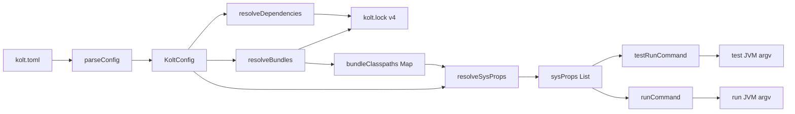
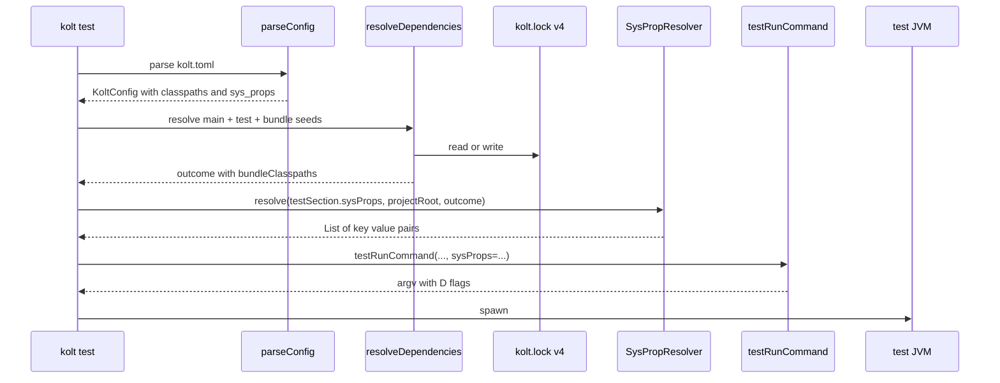
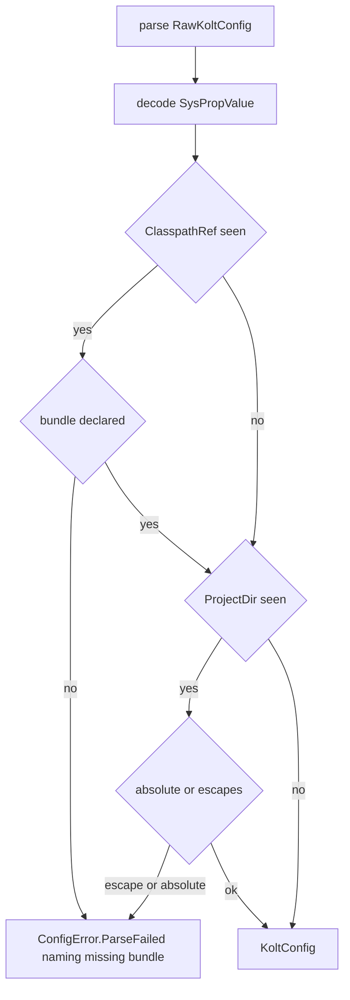
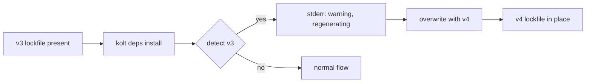

# Design Document — jvm-sys-props

## Overview

**Purpose**: kolt.toml に「named classpath bundle」と「test/run 用 JVM sysprop」の宣言能力を追加し、kolt 単体で JVM プロセスに `-D<key>=<value>` と隔離された classpath jar 集合を渡せるようにする。`./gradlew check` を撤去するための前段 (#318 → #315 のチェーン)。

**Users**: kolt 自身の daemon サブプロジェクト群、および将来コンパイラプラグイン jar / 隔離 classloader / fixture compile 用 jar 集合を declare したい全ての kolt ユーザ。

**Impact**: kolt.toml schema が拡張される。 既存 schema を持つプロジェクトの挙動は不変 (Req 7)。 lockfile schema が v3 → v4 に bump (no-backcompat-pre-v1 ポリシー適用)。

### Goals

- `[classpaths.<name>]` を top-level table として追加し、第一級の依存集合として lockfile / `kolt deps tree` / `kolt deps update` に統合する
- `[test.sys_props]` / `[run.sys_props]` を追加し、 3 形態 (literal / classpath ref / project_dir ref) の value 型をサポートする
- `kolt test` / `kolt run` の JVM 起動 argv に `-D<key>=<resolved-value>` を unfurl する
- env-agnostic 原則を ADR 0032 として成文化し、 follow-up issue 2 本 (CLI flag / per-user override file) を tracked にする

### Non-Goals

- `${env.X}` 等 kolt.toml 内 environment-variable interpolation
- CLI `-D<key>=<value>` flag 実装 (follow-up issue)
- per-user override file (`kolt.local.toml` 等) の実装 (follow-up issue)
- daemon サブプロジェクトの kolt.toml 改修と `./gradlew check` 撤去 (#315)
- native target / lib `kind` への new schema 拡張 (Req 5 で reject 側に倒している)

## Boundary Commitments

### This Spec Owns

- `kolt.toml` schema 表面の以下 3 表: `[classpaths.<name>]`, `[test.sys_props]`, `[run.sys_props]`
- sysprop value 型 `SysPropValue` の sealed class 定義と decode 規則
- 3 形態 value の resolved-value 計算 logic (literal / classpath colon-join / project_dir absolute-path)
- lockfile v4 schema での `classpathBundles` sub-map と bundle 単位の resolve / cache persistence
- `kolt deps install` / `kolt deps update` / `kolt deps tree` の bundle 対応
- `kolt test` / `kolt run` (JVM target) の argv に `-D` を append する責務
- ADR 0032 (env-agnostic 原則の成文化) と follow-up issue 2 本の発行

### Out of Boundary

- daemon サブプロジェクトの kolt.toml への new schema 適用 (#315)
- `./gradlew check` 撤去とそれに伴う Gradle ファイル orphan 化対応 (#315 / #316)
- CLI 引数経由の sysprop 上書き (follow-up)
- per-user override file (follow-up)
- native target における sysprop 等価機能 (本 spec では reject に倒し、 必要になった時点で別 spec)
- `lockfile v3 → v4` の自動マイグレーション (release note で `rm kolt.lock` 手順を案内、 自動 shim は入れない)

### Allowed Dependencies

- 既存 `parseConfig` の二段階 (Raw → validated) パターン
- 既存 resolver kernel `resolve()` (main/test 用、 触らない) — bundle 用は新 `resolveBundle()` を別関数として追加
- 既存 `fixpointResolve()` (bundle pass からも呼ぶが、 seeds は bundle 専用に限定して main/test と graph を共有しない)
- 既存 `buildClasspath()` の colon-join helper
- 既存 `absolutise()` の path 絶対化 helper
- ktoml-core 0.7.1 (custom `KSerializer<SysPropValue>` の build に必要な kotlinx.serialization API のみ依存)
- 新たな外部 dependency は導入しない

### Revalidation Triggers

- `KoltConfig` shape の追加 (`classpaths` / `testSection` / `runSection` フィールドの存在) — config の consumer (主に `BuildCommands` 系) に再確認
- `Lockfile` schema v4 — lockfile を読む全 path に対する revalidation
- `testRunCommand` / `runCommand` の引数増 (`sysProps`) — 既存 caller (`doTestInner` / `doRunInner` 以外があれば) に確認
- `SysPropValue` sealed class の variant 追加 — exhaustive `when` を持つ全 site の更新

## Architecture

### Existing Architecture Analysis

- kolt の config layer は `RawKoltConfig` (緩い shape, optional fields) → `KoltConfig` (validated, non-null) の二段階 decode が一貫したパターン。新 schema もこのパターンに沿わせる
- **依存 resolver は main / test を独立 graph として解いていない**。`fixpointResolve` は `mainSeeds` と `testSeeds` を 1 つの effective graph に投入し、 各 GA に `(fromMain, fromTest)` の origin bit を accumulate する overlay 構造である。version conflict resolution は GA 全域で global (strictPin / rejects は scope を跨いで作用)、 main classpath / test classpath への分割は materialize 後段で `Origin` 値の filter として行われる。bundle を main/test と同居させるとこの global conflict resolution に乗ってしまい、 Req 4.5 の bundle 間 transitive 隔離が成立しない
- 上記より、本 spec は **bundle ごとに独立した resolver pass を走らせる Option C** を採用する (詳細は §Components > Resolver (extended))。 既存 main+test の overlay 解決は触らず、 bundle resolver は別関数に切り出す
- `kolt test` / `kolt run` は argv builder (`testRunCommand` / `runCommand`) を介して `executeCommand` を呼ぶ。 sysprop 注入は argv builder のシグネチャ拡張で完結する
- ADR 0019 §3 / 0028 / 0023 は本 spec の design 方針 (validation 順序、 schema reject の loud-fail、 pre-v1 breaking change の自由) を支持

### Architecture Pattern & Boundary Map



> 図中の名前は §Components の型名と対応。`bundleClasspaths` は `Map<String, String>` (bundle name → colon-joined classpath)、 `sysProps` は `List<Pair<String, String>>` (declaration order)。

**Architecture Integration**:

- Selected pattern: 既存 二段階 parse → validated config → resolver → runner の流れに「sysprop 解決」を新 stage として挿入。新 module は `SysPropResolver` (pure function 1 個)
- Domain/feature boundaries: schema 定義 (`config/`) / 依存解決 (`resolve/`) / sysprop 解決 (`build/SysPropResolver.kt`) / argv 組み立て (`build/TestRunner.kt` / `build/Runner.kt`) を独立に保つ
- Existing patterns preserved: `Result<V, E>` / `RawKoltConfig` 二段 / `ConfigError.ParseFailed` / `LockEntry` 形 / argv builder の data class 返却
- New components rationale:
  - `SysPropValue` sealed class — 3 形態 value を type-safe に保つ
  - `SysPropResolver` — runner との責務分離 (test 容易性)
  - lockfile v4 — bundle persistence
- Steering compliance: ADR 0001 (no exceptions, Result), ADR 0023 (target / kind validation), ADR 0028 (pre-v1 breaking changes 自由)

### Technology Stack

| Layer | Choice / Version | Role in Feature | Notes |
|-------|------------------|-----------------|-------|
| CLI | kolt-native (linuxX64) | 入口 (`kolt test` / `kolt run` / `kolt deps *`) | 既存 |
| Config | ktoml-core 0.7.1 + kotlinx.serialization | TOML decode、 custom `KSerializer<SysPropValue>` を build | 既存 dependency に custom serializer 1 個追加 |
| Resolver | kolt 内製 + Maven Central | bundle resolve、 lockfile persistence | seeds を main/test/bundles の 3 系列に拡張 |
| Lockfile | kolt-native I/O + JSON via kotlinx.serialization | v3 → v4 schema bump | `classpathBundles` sub-map 追加 |
| Runner | kolt-native subprocess spawn | JVM argv に `-D` 追加 | `testRunCommand` / `runCommand` のシグネチャ拡張 |

## File Structure Plan

### Directory Structure

```
src/nativeMain/kotlin/kolt/
├── config/
│   ├── Config.kt                      # MODIFIED: KoltConfig に classpaths/testSection/runSection 追加、 validator 追加
│   ├── SysPropValue.kt                # NEW: sealed class + custom KSerializer
│   └── ClasspathBundle.kt             # NEW: data class for [classpaths.<name>]
├── resolve/
│   ├── Lockfile.kt                    # MODIFIED: version 3 -> 4、 classpathBundles 追加
│   ├── Resolver.kt                    # MODIFIED: bundle seeds を受ける形に拡張
│   └── DependencyResolution.kt        # MODIFIED: bundle classpath を outcome に含める
├── cli/
│   ├── DependencyCommands.kt          # MODIFIED: deps install/update/tree が bundle を扱う
│   └── BuildCommands.kt               # MODIFIED: doTestInner / doRunInner に SysPropResolver 呼び出し追加
├── build/
│   ├── SysPropResolver.kt             # NEW: SysPropValue -> 解決済み (k, v) list (declaration order を保つ)
│   ├── TestRunner.kt                  # MODIFIED: testRunCommand に sysProps 引数追加
│   └── Runner.kt                      # MODIFIED: runCommand に sysProps 引数追加
└── resolve/
    └── BundleResolver.kt              # NEW: bundle ごとの独立 resolution pass

src/nativeTest/kotlin/kolt/
├── config/
│   ├── SysPropValueDecodeTest.kt      # NEW: 3 形態 + 不正 shape の reject
│   ├── ClasspathBundleConfigTest.kt   # NEW: [classpaths.<name>] 受理 / 重複 / 空 bundle / 同 GAV 別所
│   └── ConfigSysPropValidationTest.kt # NEW: native reject / lib + run.sys_props reject / undeclared bundle ref / 絶対パス + .. 拒否
├── resolve/
│   └── LockfileV4Test.kt              # NEW: v4 read/write / bundle 隔離
├── build/
│   ├── SysPropResolverTest.kt         # NEW: 各 value 型の解決
│   ├── TestRunnerSysPropTest.kt       # NEW: testRunCommand argv に -D が並ぶ
│   └── RunnerSysPropTest.kt           # NEW: runCommand argv に -D が並ぶ
└── cli/
    └── DepsTreeBundleTest.kt          # NEW: deps tree 出力に bundle セクション

docs/adr/
└── 0032-kolt-toml-env-agnostic.md     # NEW: env-agnostic 原則の ADR
```

### Modified Files

- `src/nativeMain/kotlin/kolt/config/Config.kt` — `RawKoltConfig` に `classpaths` / `test` / `run` フィールド追加、 `KoltConfig` に同等フィールド、 新 validator (`validateNewSchemaTargetCompat`, `validateBundleReferences`, `validateProjectRelativePath`) を `parseConfig` に追加
- `src/nativeMain/kotlin/kolt/resolve/Lockfile.kt` — `LOCKFILE_VERSION = 4`、 `LockfileSchema` に `classpathBundles: Map<String, Map<String, LockEntry>>` 追加。 v3 を読んだら canonical な error message
- `src/nativeMain/kotlin/kolt/resolve/Resolver.kt` — 既存 `resolve(...)` (main/test) は **触らない**。 同じ file (or BundleResolver.kt 新設) に新関数 `resolveBundle(config, bundleName, bundleSeeds, existingLock, cacheBase, deps): Result<BundleResolution, ResolveError>` を追加。 各 bundle ごとに独立な `fixpointResolve` 呼び出し
- `src/nativeMain/kotlin/kolt/resolve/BundleResolver.kt` (NEW) — `resolveBundle()` の本体。 bundle ごとに完全に独立な graph で解き、 main / test / 他 bundle の state を一切共有しない (Req 4.5)
- `src/nativeMain/kotlin/kolt/cli/DependencyResolution.kt` — `JvmResolutionOutcome` に `bundleClasspaths: Map<String, String>` (bundle name → colon-joined classpath) と `bundleJars: Map<String, List<ResolvedJar>>` を追加。 全 bundle を順に `resolveBundle` で解き、 lockfile に書き出す
- `src/nativeMain/kotlin/kolt/cli/DependencyCommands.kt` — `doInstall` / `doUpdate` / `doTree` が bundle を扱う
- `src/nativeMain/kotlin/kolt/cli/BuildCommands.kt` — `doTestInner` / `doRunInner` で `SysPropResolver` を呼び、 結果を `testRunCommand` / `runCommand` に渡す
- `src/nativeMain/kotlin/kolt/build/TestRunner.kt` — `testRunCommand(...)` の signature に `sysProps: List<Pair<String, String>> = emptyList()` を追加、 `java` の直後に `-D<k>=<v>` を unfurl
- `src/nativeMain/kotlin/kolt/build/Runner.kt` — `runCommand(...)` に同等の引数追加

## System Flows

### Flow: kolt test 時の sysprop 注入



**Key decisions**:

- sysprop 解決は resolver 後 → runner 前の独立 stage。 lockfile / cache 状態に副作用を持たない pure transformation
- `[run.sys_props]` の流れも同型 (testRunCommand → runCommand に置き換わる)

### Flow: classpath bundle reference 解決と reject



## Requirements Traceability

| Requirement | Summary | Components | Interfaces | Flows |
|-------------|---------|------------|------------|-------|
| 1.1 | `[classpaths.<name>]` 受理 | Config, ClasspathBundle | `parseConfig` | — |
| 1.2 | 複数 bundle 受理 | Config | `parseConfig` | — |
| 1.3 | 空 bundle 受理 | Config | `parseConfig` | — |
| 1.4 | 同名 bundle 重複 reject | Config | `parseConfig` (TOML duplicate-table semantics) | — |
| 1.5 | 同 GAV 別 scope 並立 | Config | `parseConfig` | — |
| 2.1 | 3 形態 value 受理 | SysPropValue, Config | `KSerializer<SysPropValue>` | — |
| 2.2 | 不正 shape reject | SysPropValue | `KSerializer<SysPropValue>` | bundle reference flow |
| 2.3 | 未宣言 bundle ref reject | Config | `validateBundleReferences` | bundle reference flow |
| 2.4 | 絶対 project_dir reject | Config | `validateProjectRelativePath` | bundle reference flow |
| 2.5 | `..` 脱出 reject | Config | `validateProjectRelativePath` | bundle reference flow |
| 2.6 | 空 sys_props 受理 | Config | `parseConfig` | — |
| 2.7 | env 展開しない | SysPropResolver | — | sysprop injection flow |
| 3.1 | test JVM に `-D` 注入 | TestRunner, SysPropResolver | `testRunCommand`, `SysPropResolver.resolve` | sysprop injection flow |
| 3.2 | run JVM に `-D` 注入 | Runner, SysPropResolver | `runCommand`, `SysPropResolver.resolve` | sysprop injection flow |
| 3.3 | classpath value = colon-joined absolute paths | SysPropResolver | `SysPropResolver.resolve` | — |
| 3.4 | project_dir value = absolute path | SysPropResolver | `SysPropResolver.resolve` | — |
| 3.5 | literal value = verbatim | SysPropResolver | `SysPropResolver.resolve` | — |
| 3.6 | 内部 sysprop と key 衝突しない | TestRunner, Runner | argv 順序契約 | — |
| 3.7 | 既存 argv に追加 (置換でない) | TestRunner | `testRunCommand` | — |
| 4.1 | bundle が `kolt.lock` に persist | Lockfile, Resolver | `LockfileSchema.classpathBundles` | — |
| 4.2 | `kolt deps tree` で bundle 表示 | DependencyCommands | `doTree` | — |
| 4.3 | `kolt deps update` が bundle 更新 | DependencyCommands | `doUpdate` | — |
| 4.4 | bundle declaration 変更で再 resolve | Resolver | `resolve()` cache invalidation | — |
| 4.5 | bundle 間 transitive 隔離 | Resolver | `resolve()` per-bundle closure | — |
| 5.1 | native target × new schema reject | Config | `validateNewSchemaTargetCompat` | — |
| 5.2 | lib + `[run.sys_props]` reject | Config | `validateNewSchemaTargetCompat` | — |
| 5.3 | lib + `[test.sys_props]` 受理 | Config | `validateNewSchemaTargetCompat` | — |
| 5.4 | lib + `[classpaths]` JVM target 受理 | Config | `validateNewSchemaTargetCompat` | — |
| 6.1 / 6.2 / 6.3 / 6.4 | ADR 0032 + follow-up issue 2 本 | (Out-of-Code Deliverables 参照) | — | — |
| 7.1 | new schema 不在の既存プロジェクト不変 | Config | default values for new fields | — |
| 7.2 | test argv 既存維持 | TestRunner | `testRunCommand` (sysProps default emptyList) | — |
| 7.3 | run argv 既存維持 | Runner | `runCommand` (sysProps default emptyList) | — |

## Components and Interfaces

| Component | Domain/Layer | Intent | Req Coverage | Key Dependencies (P0/P1) | Contracts |
|-----------|--------------|--------|--------------|--------------------------|-----------|
| SysPropValue | Config | sysprop value の sum 型 | 2.1, 2.2 | kotlinx.serialization (P0) | State |
| ClasspathBundle | Config | `[classpaths.<name>]` の値 shape | 1.1, 1.5 | — | State |
| Config (extended) | Config | 二段階 parse + 新 validator | 1.1–1.5, 2.3–2.6, 5.1–5.4, 7.1 | ktoml (P0), SysPropValue (P0) | Service |
| Lockfile (v4) | Resolve | bundle を含む lockfile | 4.1, 4.4 | kotlinx.serialization (P0) | State |
| Resolver (extended) | Resolve | bundle seeds を扱う resolver | 4.1, 4.3, 4.4, 4.5 | Lockfile (P0), 既存 resolve kernel (P0) | Service |
| DependencyCommands (extended) | CLI | `kolt deps install/update/tree` の bundle 対応 | 4.2, 4.3 | Resolver (P0) | Service |
| SysPropResolver | Build | sysprop value -> 解決済み (k,v) list | 2.7, 3.3, 3.4, 3.5 | Config (P0), Resolver outcome (P0) | Service |
| TestRunner (extended) | Build | test JVM argv に `-D` 追加 | 3.1, 3.6, 3.7, 7.2 | SysPropResolver (P0) | Service |
| Runner (extended) | Build | run JVM argv に `-D` 追加 | 3.2, 3.6, 7.3 | SysPropResolver (P0) | Service |
| BuildCommands (extended) | CLI | doTestInner / doRunInner に SysPropResolver wiring | 3.1, 3.2 | SysPropResolver (P0), Resolver outcome (P0) | Service |
| ADR 0032 | Docs | env-agnostic 原則の成文化 + follow-up リンク | 6.1, 6.2, 6.3 | — | — |

### Config

#### SysPropValue

| Field | Detail |
|-------|--------|
| Intent | sysprop value の 3 形態を type-safe に表現 |
| Requirements | 2.1, 2.2 |

**Responsibilities & Constraints**

- 3 variant の sealed class: `Literal(value: String)`, `ClasspathRef(bundleName: String)`, `ProjectDir(relativePath: String)`
- TOML schema は uniform inline-table (Req 2.1 amended)。 各 entry は `{ literal = "..." }` / `{ classpath = "..." }` / `{ project_dir = "..." }` のいずれか
- decode は `RawSysPropValue(literal: String?, classpath: String?, projectDir: String?)` (3 nullable fields) で受け、 exactly-one-set を validate して typed variant に lift。 custom `KSerializer` は不要 (kotlinx.serialization の generated serializer で十分)
- env 展開を行わない (Req 2.7)

**Dependencies**

- Inbound: Config (P0) — `parseConfig` から sysprop value の decode 経路で呼ばれる
- Outbound: なし (sealed class + serializer)
- External: kotlinx.serialization core (P0) — custom `KSerializer` API 利用

**Contracts**: State [x]

##### State Management

- State model: 3 variant の immutable data
- Custom `KSerializer<SysPropValue>` は `Decoder` の入力 shape を probe して dispatch する。 ktoml の decoder API 制約上、 入力が string か structure かは `decoder` を `try` で structure decode → 失敗時 string decode の順で判定する (実装初期 spike で probe 確定)
- `Literal` の値は decoded 文字列の verbatim、 escape 加工なし

**Implementation Notes**

- Integration: `KoltConfig.testSection.sysProps: Map<String, SysPropValue>` 経由で消費
- Validation: 不正 shape の input は `SerializationException` → `ConfigError.ParseFailed` に翻訳
- Risks: ktoml decoder の structure/string dispatch の細部 — research §1 + §SysPropValue polymorphic decoding に記述

#### ClasspathBundle (not introduced)

実装段階 (task 1.3) で wrapper data class を入れない判断に到達。 `[classpaths.<name>]` の TOML shape は `[dependencies]` と同形 (`"group:artifact" = "version"`) のため、 `KoltConfig.classpaths: Map<String, Map<String, String>>` の plain nested Map で十分。 per-bundle excludes など将来 attribute が必要になった時点で wrapper を導入する。 Req 1.1 / 1.5 は Config (extended) が直接担う。

#### Config (extended)

| Field | Detail |
|-------|--------|
| Intent | 二段階 parse + 新 validator を従来 pattern で展開 |
| Requirements | 1.1–1.5, 2.3–2.6, 5.1–5.4, 7.1 |

**Responsibilities & Constraints**

- `RawKoltConfig` に optional フィールド追加: `classpaths: Map<String, ClasspathBundle> = emptyMap()`、 `test: RawTestSection? = null`、 `run: RawRunSection? = null`
- `RawTestSection(sysProps: Map<String, SysPropValue> = emptyMap())`、 `RawRunSection(sysProps: Map<String, SysPropValue> = emptyMap())`
- `KoltConfig` に対応フィールドを non-null で投影 (default empty)
- **Map ordering 不変条件**: `KoltConfig.testSection.sysProps` / `runSection.sysProps` / `classpaths` は **insertion-ordered (TOML declaration order を保つ)**。 ktoml の Map decode 結果が insertion order を保つかは実装初期に probe で確認、 保たない場合は `parseConfig` 内で `LinkedHashMap` に正規化する step を入れる。 この order は SysPropResolver / TestRunner / Runner の argv 順序契約 (`-D` 出現順) の根拠
- 新 validator:
  - `validateNewSchemaTargetCompat(config)`: native target × 新 table 非空 → reject (Req 5.1); lib + `[run.sys_props]` 非空 → reject (Req 5.2)
  - `validateBundleReferences(config)`: 全 sysprop の `ClasspathRef` が `[classpaths.<name>]` で declare されているか確認 (Req 2.3)
  - `validateProjectRelativePath(rel)`: 絶対パス reject (Req 2.4)、 segment 走査で `..` 脱出 reject (Req 2.5)
- validation 順序: 既存 (kind / target / main FQN) の後に → `validateNewSchemaTargetCompat` → `validateBundleReferences` → `validateProjectRelativePath`

**Dependencies**

- Inbound: CLI 全 path (`doBuild`, `doTest`, `doRun`, `doInstall`, `doUpdate`, `doTree`) — 既存
- Outbound: SysPropValue (P0), ClasspathBundle (P0), kolt.resolve (P1)
- External: ktoml-core (P0)

**Contracts**: Service [x]

##### Service Interface

```kotlin
fun parseConfig(tomlString: String): Result<KoltConfig, ConfigError>

data class KoltConfig(
  // ... 既存フィールド ...
  val classpaths: Map<String, ClasspathBundle> = emptyMap(),
  val testSection: TestSection = TestSection(),
  val runSection: RunSection = RunSection(),
)

data class TestSection(val sysProps: Map<String, SysPropValue> = emptyMap())
data class RunSection(val sysProps: Map<String, SysPropValue> = emptyMap())

internal fun validateProjectRelativePath(rel: String): Result<Unit, ConfigError>
```

- Preconditions: `tomlString` が UTF-8 文字列
- Postconditions: 成功時 `KoltConfig` の新フィールドが parsed value または default、 全 validator pass。 失敗時 `ConfigError.ParseFailed(message)` で reject 理由を message に含む
- Invariants: `parseConfig` は副作用なし (file I/O / network なし)

### Resolve

#### Lockfile (v4)

| Field | Detail |
|-------|--------|
| Intent | bundle 単位の resolution を persist |
| Requirements | 4.1, 4.4 |

**Responsibilities & Constraints**

- `LOCKFILE_VERSION = 4`
- schema: 既存 `dependencies: Map<String, LockEntry>` に加え `classpathBundles: Map<String, Map<String, LockEntry>> = emptyMap()` を追加
- v3 lockfile を読んだら `LockfileError.UnsupportedVersion(found = 3, expected = 4)` で error。release note で `rm kolt.lock && kolt deps install` を案内 (no-backcompat-pre-v1)
- 同一 GAV+version が `dependencies` と `classpathBundles[name]` の双方に出現する可能性あり (cache の jar は file 単位で 1 物理コピー)

**Contracts**: State [x]

#### Resolver (extended) — Bundle resolver

| Field | Detail |
|-------|--------|
| Intent | bundle ごとに main/test と独立した graph で transitive 解決を実行 |
| Requirements | 4.1, 4.3, 4.4, 4.5 |

**Responsibilities & Constraints**

- 既存 `resolve(...)` (main/test 用、`fromMain`/`fromTest` の overlay graph) は **そのまま**。 bundle は混ぜない
- 新関数 `resolveBundle(config, bundleName, bundleSeeds, existingLock, cacheBase, deps): Result<BundleResolution, ResolveError>` を `BundleResolver.kt` に新設
- `resolveBundle` は bundle の seeds のみで `fixpointResolve` を呼び出す (`mainSeeds = bundleSeeds, testSeeds = emptyMap()`)。 origin bit は最終 materialize 時の filter にしか使われないため、 bundle pass では結果として全 GA が `Origin.MAIN` 扱いになるが、 これは **bundle ローカルでの解釈** であり main classpath への混入は構造的に発生しない (bundle pass の戻り値は main outcome に merge されない)
- `resolveDependencies(config)` の中で main/test resolve に続けて、 各 bundle を独立に `resolveBundle` で解き、 結果を `JvmResolutionOutcome.bundleClasspaths` に格納
- bundle 間 transitive 隔離 (Req 4.5): 各 pass が独立 graph のため、 bundle A の transitive は bundle B / main / test に決して leak しない。これは型レベルの保証ではなく **「bundle pass が main/test pass の state を引数に取らない」という関数 contract** で守る
- 同じ GA+version が複数 bundle に出現しても、 cache の jar file は同一物理 path を共有 (cache key が GAV+sha のため)。 `BundleResolution.jars` には各 bundle で同じ path が含まれる
- version conflict resolution は **bundle 内ローカル**。 bundle A が `foo:1.0`、 bundle B が `foo:2.0` を要求する状況は許容され、 各 bundle の classpath にはそれぞれ自分が要求した版が並ぶ
- bundle declaration の hash (`name + Map<gav, version>`) を lockfile の bundle entry sub-map に keyed で persist。 declaration 変更時は当該 bundle のみ re-resolve (Req 4.4)

**Dependencies**

- Inbound: `resolveDependencies` (P0)
- Outbound: Lockfile v4 (P0), 既存 `fixpointResolve` (P0)
- External: Maven Central (既存)

**Contracts**: Service [x]

##### Service Interface

```kotlin
// 既存 resolve(...) は変更なし (main/test pass)

fun resolveBundle(
  config: KoltConfig,
  bundleName: String,
  bundleSeeds: Map<String, String>,
  existingLock: Lockfile?,
  cacheBase: String,
  deps: ResolverDeps,
): Result<BundleResolution, ResolveError>

data class BundleResolution(
  val jars: List<ResolvedJar>,
  val classpath: String,
)
```

- Preconditions: `bundleSeeds` は `[classpaths.<bundleName>]` の declared content
- Postconditions: 戻り値は bundle ローカルの transitive closure。 main/test の state を変更せず、 他 bundle の state も変更しない
- Invariants: `resolveBundle` の戻り値は呼び出し側の main/test outcome に絶対に merge しない (関数 contract の不変条件)

##### BundleResolution.classpath jar order

- jar 順序は **既存 main classpath の materialize 順序ポリシーと同一** (`materialize` が emit する `mainJars` の iteration order)。 declaration order は entry の declared 直接 dep について保たれ、 transitive は materialize の決定論的順序に従う
- bundle 間で順序ポリシーは一貫する (同じ resolver kernel を使うため自動的に揃う)

#### DependencyCommands (extended)

| Field | Detail |
|-------|--------|
| Intent | `kolt deps install/update/tree` の bundle 対応 |
| Requirements | 4.2, 4.3 |

**Responsibilities & Constraints**

- `doInstall`: 既存 main/test resolve 後、 bundle seeds を resolver に渡し、 lockfile 書き出しに `classpathBundles` 含める
- `doUpdate`: bundle 単位で latest 解決し lockfile 更新。policy は main/test と同一 (`kotlin.version` を respect、 `version-locked` 等の policy が将来加わったときも main/test と同じ扱い)
- `doTree`: 既存 main / test セクションの後に `Bundles` セクションを描画。 各 bundle 名 → tree

**Contracts**: Service [x]

### Build

#### SysPropResolver

| Field | Detail |
|-------|--------|
| Intent | `Map<String, SysPropValue>` を解決済みの `List<Pair<String, String>>` に変換 |
| Requirements | 2.7, 3.3, 3.4, 3.5 |

**Responsibilities & Constraints**

- pure function。 file I/O / network / subprocess なし
- 入力: `sysProps: Map<String, SysPropValue>` (insertion-ordered、 §Config 参照)、 `projectRoot: String` (absolute)、 `bundleClasspaths: Map<String, String>`
- 出力: `List<Pair<String, String>>` (key, resolved-value) — **入力 Map の declaration order を保つ**
- 解決規則:
  - `Literal(v)` → `v` verbatim (env 展開なし、 Req 2.7)
  - `ClasspathRef(name)` → `bundleClasspaths[name]` の colon-joined string
  - `ProjectDir(rel)` → `<projectRoot>/<rel>` を `absolutise` 経由で絶対化、 `..`/`.` 解決はしない (config 段階で `..` reject 済のため)
- **invariant 違反は `Result` で表現せず `error()` で fail-fast**。 具体的には `bundleClasspaths` が宣言済 bundle 名を持たない場合や `sysProps` に未 validate 値が混入した場合は parser バグであり、 `error("invariant: ...")` で例外を発生させる (ADR 0001 は fallible operation の表現として `Result` を要求しているが、 「あり得ない状態」は invariant 違反として扱う)
- `Result` 戻り値型を採用しない: 上位 caller (`BuildCommands`) は invariant violation に対して有意義な選択肢を持たない

**Dependencies**

- Inbound: BuildCommands (P0)
- Outbound: なし (pure)
- External: なし

**Contracts**: Service [x]

##### Service Interface

```kotlin
fun resolveSysProps(
  sysProps: Map<String, SysPropValue>,
  projectRoot: String,
  bundleClasspaths: Map<String, String>,
): List<Pair<String, String>>
```

- Preconditions: `projectRoot` は absolute、 `sysProps` は `parseConfig` 経由で validate 済み (全 `ClasspathRef.bundleName` が `bundleClasspaths` に存在することが parser の invariant)
- Postconditions: 各 entry が `(key, resolved)` 形で返る。 順序は `sysProps` の declaration order (insertion order)
- Invariants: 副作用なし。 invariant 違反 (上記 precondition 不満) では `error("invariant: ...")` で異常終了

##### ProjectDir 正規化規則

| 入力 `rel` | 解決後 | 備考 |
|------------|--------|------|
| `"src/main/kotlin"` | `<projectRoot>/src/main/kotlin` | 通常ケース |
| `"."` | `<projectRoot>` | project root 自体を許容 |
| `""` (空文字列) | parse-time reject | Req 2.4 / 2.5 と並ぶ validator で `validateProjectRelativePath` が reject |
| `"src/main/kotlin/"` (末尾 /) | `<projectRoot>/src/main/kotlin/` | 末尾 `/` は **保持** (削除しない、 consumer 側で必要に応じて normalize) |
| `"/etc/foo"` (絶対パス) | parse-time reject | Req 2.4 |
| `"../sibling"` (脱出) | parse-time reject | Req 2.5 |
| 解決先ディレクトリが存在しない | resolve 通す (declarative) | consumer (test fixture など) が runtime で確認 |
| symlink | 解決しない (`absolutise` の挙動に従う) | リンク解決は consumer 責任 |

#### TestRunner (extended)

| Field | Detail |
|-------|--------|
| Intent | test JVM の argv に `-D<k>=<v>` を append |
| Requirements | 3.1, 3.6, 3.7, 7.2 |

**Responsibilities & Constraints**

- 既存 `testRunCommand` のシグネチャに `sysProps: List<Pair<String, String>> = emptyList()` を追加
- `java` の直後に `-D<k>=<v>` を **`sysProps` list の iteration 順** に挿入 (= TOML declaration order、 §Config 参照)。`-jar` / `-cp` / `--class-path` 等は従来位置
- argv 順序は deterministic — 同じ kolt.toml に対して同じ argv が再現する
- `sysProps = emptyList()` のとき argv は従来と完全同一 (Req 7.2)
- kolt 内部からの built-in `-D` は今回追加しない (Req 3.6)

**Contracts**: Service [x]

##### Service Interface

```kotlin
fun testRunCommand(
  classesDir: String,
  testClassesDir: String,
  consoleLauncherPath: String,
  testResourceDirs: List<String> = emptyList(),
  classpath: String? = null,
  testArgs: List<String> = emptyList(),
  javaPath: String? = null,
  sysProps: List<Pair<String, String>> = emptyList(),
): TestRunCommand
```

#### Runner (extended)

| Field | Detail |
|-------|--------|
| Intent | run JVM の argv に `-D<k>=<v>` を append |
| Requirements | 3.2, 3.6, 7.3 |

**Responsibilities & Constraints**

- 既存 `runCommand` のシグネチャに `sysProps: List<Pair<String, String>> = emptyList()` を追加
- `java` の直後に `-D<k>=<v>` を **`sysProps` list の iteration 順** に挿入 (declaration order)
- argv 順序は deterministic

**Contracts**: Service [x]

### Docs

#### ADR 0032

| Field | Detail |
|-------|--------|
| Intent | env-agnostic 原則の成文化と follow-up リンク |
| Requirements | 6.1, 6.2, 6.3 |

**Responsibilities & Constraints**

- `docs/adr/0032-kolt-toml-env-agnostic.md`
- 構成: Status / Summary / Context / Decision / Alternatives Considered / Consequences / Follow-ups
- Decision: kolt.toml は env-agnostic、 `${env.X}` interpolation は不採用
- Alternatives Considered: Maven 流 `${env.X}` interpolation / Cargo 流 separate config file / CLI flag escape hatch
- Follow-ups: CLI `-D` flag (issue #X)、 per-user override file (issue #Y)

## Data Models

### Domain Model

- `KoltConfig` (aggregate root) → `classpaths: Map<String, ClasspathBundle>`、 `testSection.sysProps: Map<String, SysPropValue>`、 `runSection.sysProps: Map<String, SysPropValue>`
- `SysPropValue` は invariant: 3 variant のうち exactly one
- `ClasspathBundle` invariant: 全 entry が `"group:artifact" = "version"` shape

### Logical Data Model

#### Lockfile v4 schema (Modified)

```kotlin
@Serializable
data class LockfileSchema(
  val version: Int = 4,
  val kotlin: String,
  val jvmTarget: String?,
  val dependencies: Map<String, LockEntry>,
  val classpathBundles: Map<String, Map<String, LockEntry>> = emptyMap(),
)

@Serializable
data class LockEntry(
  val version: String,
  val sha256: String,
  val transitive: Boolean,
  val test: Boolean,
)
```

- `LockEntry` 自体に変更なし (`test: Boolean` の semantics は main/test 区分のまま、 bundle membership は外側 Map のキーで表す)
- 同一 GAV+version が `dependencies` と `classpathBundles["foo"]` 双方に出現可能 (Req 1.5)

### Data Contracts & Integration

- `kolt.toml` の TOML schema (`[classpaths.<name>]` / `[test.sys_props]` / `[run.sys_props]`) は user 向け contract。 `SysPropValue` の 3 形態は user-facing
- `kolt.lock` v4 は `kolt deps *` consumers 向け contract。 v3 → v4 は breaking (release note 案内)

## Error Handling

### Error Strategy

- Config parse error (`ConfigError.ParseFailed`): 既存 `Result` 経路、 message に offending key / table 名を含める
- Lockfile read error (v3 を読む等): `LockfileError.UnsupportedVersion`、 release note で `rm kolt.lock` 手順を案内
- SysProp resolution error: `SysPropResolveError`。 invariant violation (declare 済 bundle が outcome に無い等) は spec 上発生しない (parse 段階で reject) が、 runtime 防御線として error type を残す

### Error Categories and Responses

- **User Errors (config)**: 不正 schema / 未宣言 bundle 参照 / 絶対 project_dir / `..` 脱出 / native target × new schema → `kolt build` / `kolt test` / `kolt run` / `kolt deps *` が non-zero exit、 stderr に message
- **System Errors**: 既存と同じ (resolve 失敗 / lockfile I/O 失敗)
- **Business Logic Errors**: 該当なし

### Monitoring

- 既存 kolt の log 系統に乗る。新規 monitoring 追加なし

## Testing Strategy

### Unit Tests (新規) — 各テストは acceptance criterion を ID で参照

- `SysPropValueDecodeTest` — Req 2.1 / 2.2: 3 形態それぞれが正しく decode、 不正 shape (`{ classpath = "X", project_dir = "Y" }` のような両方指定) は reject
- `ClasspathBundleConfigTest` — Req 1.1–1.5: declare / 複数 / 空 / 重複 reject / 同 GAV 別 scope
- `ConfigSysPropValidationTest` — Req 2.3–2.6, 5.1–5.4: 未宣言 bundle ref reject、 絶対 project_dir reject、 `..` 脱出 reject、 空文字列 reject、 native target × new schema reject、 lib + run.sys_props reject、 lib + test.sys_props 受理、 lib + classpaths 受理
- `ConfigOrderingTest` — Req 3.7 (派生): `[test.sys_props]` を 3 entry 並びで宣言したとき、 `KoltConfig.testSection.sysProps.entries` がその declaration order で iterate することを確認 (ktoml の Map decode 結果が order を保つことの probe)
- `LockfileV4Test` — Req 4.1, 4.4: v4 read/write / bundle entry の persist / declaration hash 変更で再 resolve
- `BundleResolverIsolationTest` — **Req 4.5 専用**: bundle A が transitive で X を pull する状況で、 bundle B (X を直接も transitive にも要求しない) の `BundleResolution.jars` に X が **含まれない** ことを確認。 また同シナリオで `JvmResolutionOutcome.mainJars` / `testJars` にも X が含まれない (bundle pass の漏洩がない) ことを確認
- `BundleResolverVersionDivergenceTest` — Req 4.5 補強: bundle A が `foo:1.0`、 bundle B が `foo:2.0` を要求する状況で、 各 bundle の classpath にそれぞれ自分が要求した版が並び、 conflict にならないこと
- `SysPropResolverTest` — Req 2.7, 3.3, 3.4, 3.5: 各 value 型の解決 / env 展開しない / declaration order 保持 / ProjectDir corner case (`.` / 末尾 `/` / 存在しない dir)
- `TestRunnerSysPropTest` — Req 3.1, 3.6, 3.7, 7.2: argv 順序 (`-D` が java の直後、 declaration order) / `sysProps = emptyList()` で従来 argv と完全同一
- `RunnerSysPropTest` — Req 3.2, 3.6, 7.3: 同上 (run 用)

### Integration Tests

- `DepsTreeBundleTest` — Req 4.2: `kolt deps tree` が bundle セクションを出力
- `LockfileV3MigrationTest` — Migration: v3 lockfile fixture を置いた状態で `kolt deps install` を起動し、 stderr に warning が出て v4 に上書きされることを確認。 `kolt build` 系で v3 を読むと明確 error で停止することも確認
- `JvmTestSysPropIT` — Req 3.1, 3.3, 3.4: 実際に `kolt test` を起動し、 fixture テストが `System.getProperty(...)` で classpath / project_dir / literal を取得できることを e2e で検証 (KOLT_INTEGRATION gate 等の既存 pattern を踏襲)

### E2E / CLI Tests

- 既存 `JvmAppBuildTest` / `BuildProfileIT` の系統に乗せ、 sysprop 付 fixture を 1 個追加して `kolt build` / `kolt test` / `kolt run` の通過を確認

## Migration Strategy

採用: **Option B** (`kolt deps install` が v3 lockfile を検出して自動上書き、 stderr に warning を出す)。



- **`kolt deps install` の挙動**: v3 lockfile を読んだ場合 `parse error` で停止せず、 stderr に `warning: kolt.lock v3 detected, regenerating as v4 (one-time migration for v0.X)` を出して fresh resolve → v4 で上書き
- **`kolt build` / `kolt test` / `kolt run` の挙動**: これらは lockfile を read-only で参照する path を持つ。 v3 detection 時は明確 error (`error: kolt.lock v3 is no longer supported, run 'kolt deps install' to regenerate`) で停止し、 silent な再解決はしない。 build path で network アクセスを引き起こさない既存ポリシーを維持
- **kolt 自身の dogfood**: kolt 自身は repo 内に複数の `kolt.lock` を持つ (root + daemon サブプロジェクト)。 v3 → v4 切り替えは「全 `kolt.lock` を 1 PR で一括再生成」する dogfood オペレーションになる。 ローカルでの実行手順は `find . -name kolt.lock -delete && for d in . kolt-jvm-compiler-daemon kolt-native-compiler-daemon; do (cd $d && kolt deps install); done`、 git diff は `kolt.lock` ファイル群のみ
- **Rollback trigger**: 該当なし (pre-v1 breaking change ポリシー、 ADR 0028)
- **Validation checkpoint**: release note に Option B の挙動と上書き条件を明記、 dogfood で全 `kolt.lock` の再生成と git diff レビューを 1 度実行確認

## Out-of-Code Deliverables

code component に紐付かない artifact を以下に列挙 (Req 6 に対応):

- **ADR `docs/adr/0032-kolt-toml-env-agnostic.md`** — env-agnostic 原則を成文化 (Req 6.1, 6.2)。 Status / Summary / Context / Decision / Alternatives Considered / Consequences / Follow-ups の standard ADR shape。 Decision 節で `${env.X}` interpolation 不採用を明記、 Follow-ups 節で 2 本の issue 番号を埋める (Req 6.3)
- **GitHub issue (CLI -D flag)** — `kolt test -D<key>=<value>` / `kolt run -D<key>=<value>` の追加。 size: M、 ADR 0032 が land した直後に open (Req 6.4)
- **GitHub issue (per-user override file)** — `kolt.local.toml` (仮称) によるローカル env-specific 値の override。 `.gitignore` 推奨。 size: L、 同じく ADR 0032 直後に open (Req 6.4)

## Open Questions / Risks

- **Risk [High]: 既存 resolver の単一 graph 構造に対する bundle 隔離**
  - 現 resolver は `fromMain`/`fromTest` overlay を 1 graph で解く構造のため、 bundle を main/test と同居させると Req 4.5 が破れる。 本 design は Option C (bundle 専用 pass を独立関数として追加) を採用してこの risk を closed にしているが、 実装中に「main pass の internal state が bundle pass 経由で共有される導線」 (例: 共有 cache / 共有 lookup function) が見つかった場合は再評価する
  - 検証手段: `BundleResolverIsolationTest` (transitive が一方の bundle にしか存在しないシナリオ) を Red 段階で確認、 + `BundleResolverVersionDivergenceTest` で version conflict が bundle 内ローカルに留まることを確認
- **Resolved [was Medium risk]: ktoml decoder の string/structure dispatch**
  - Task 1.1 の probe で ktoml 0.7.1 の decoder が string/structure 判別を `TomlNode` 内部型 cast 経由でしかサポートしないと判明。 fallback (uniform inline-table 必須) を採用、 Req 2.1 を amend 済
- **Resolved [was Medium risk]: ktoml の Map decode 順序保持**
  - Task 1.1 の probe (`ConfigOrderingTest`) で ktoml 0.7.1 が TOML declaration order を保つ Map を返すことを確認済。 `parseConfig` 内の `LinkedHashMap` 正規化 step は不要
- **Open Question: bundle 名の許容文字**
  - TOML key として valid であれば全許容で良いか、 `[a-zA-Z0-9_-]+` のような制約を入れるか。 初期実装は TOML key 全許容で進め、 衝突や不便さが出たら別 issue で制約追加
- **Open Question: sysprop key の命名 reserve**
  - `kolt.*` prefix を将来の internal use のため reserve するか。 初期は reserve せず、 必要になった ADR で reserve を導入

## Supporting References

- 詳細な discovery findings と alternatives 評価は `research.md` を参照
