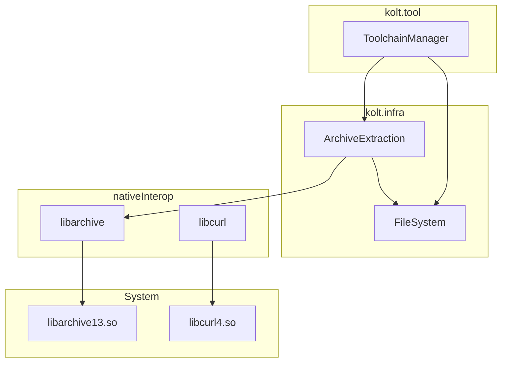
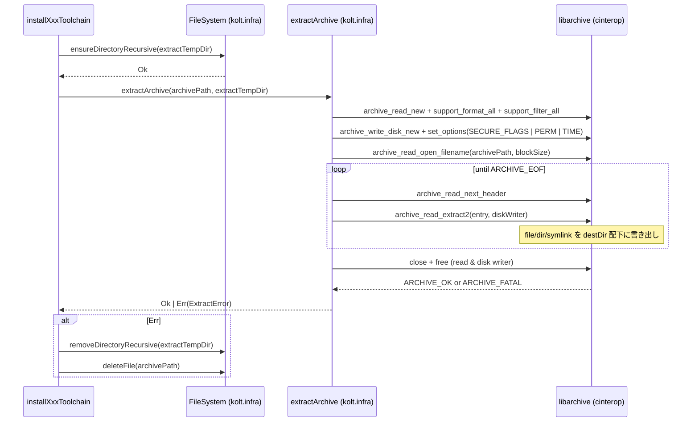

# Design Document

## Overview
**Purpose**: `ToolchainManager.kt` の 3 つのアーカイブ展開シェルアウト (`unzip` / `tar xzf` ×2) を libarchive cinterop による native 展開関数に置き換え、kolt CLI が外部アーカイブツール非依存で動作するようにする。

**Users**: kolt CLI を初回実行する全ユーザー (kotlinc / JDK / konanc 自動インストールが走る) と、kolt 開発者 (CI / 開発環境セットアップ手順が変わる)。

**Impact**: シェルアウト 3 箇所が単一の `extractArchive` 関数呼び出しに置き換わる。新規 cinterop 1 つ (`libarchive`) と新規 infra 関数 1 つ (`extractArchive`)。エンドユーザー側で `unzip` インストール要件が消え、代わりに libarchive13 ランタイムが必要になる。

### Goals
- 3 callsite (`installKotlincToolchain` / `installJdkToolchain` / `installKonancToolchain`) のシェルアウトを完全除去する
- `ARCHIVE_EXTRACT_SECURE_*` フラグでパストラバーサルを構造的に拒否する
- kotlinc / JDK / konanc の最終インストールパス (`KoltPaths` API 出力) を変更しない
- 既存 `ToolchainManagerTest` をフィクスチャ変更なしに通す

### Non-Goals
- macOS / linuxArm64 ターゲット対応 (kolt は現状 `linuxX64` のみ。`libarchive.def` には `linkerOpts.osx` を予約として書くが本 spec では検証しない)
- `mv` / `ls` シェルアウトの除去 (別 issue)
- 純 Kotlin による zip / tar / gzip 自前実装
- 展開高速化やキャッシュ最適化

## Boundary Commitments

### This Spec Owns
- `kolt.infra.ArchiveExtraction.kt` — `extractArchive(archivePath, destDir)` の振る舞いとエラー型 `ExtractError`
- `src/nativeInterop/cinterop/libarchive.def` — libarchive bindings (read API + disk writer + security flags)
- `build.gradle.kts` / `kolt.toml` への libarchive cinterop 登録
- 3 CI workflow への libarchive-dev インストールステップ追加
- ADR 0031 (libarchive 採用根拠)
- `ToolchainManager.kt` 内 3 callsite のシェルアウトから `extractArchive` への置換

### Out of Boundary
- `mv` / `ls` シェルアウトの除去 (展開後の最終配置および top-level dir 検出ロジック)
- ダウンロード処理 / checksum 検証 (libcurl + sha256 既存実装)
- macOS 向け cinterop 検証 / linker オプション
- install.sh への libarchive ランタイム依存チェック追加
- libarchive バージョン pin / 静的リンク / vendor 同梱

### Allowed Dependencies
- `kolt.infra` の既存ファイル I/O プリミティブ (`ensureDirectoryRecursive` 等) — ✅
- libarchive cinterop bindings — ✅ (本 spec で導入)
- `kotlin-result` の `Result<V, E>` — ✅ (ADR 0001)
- `executeCommand` (process spawn) — ❌ (本機能では使用しない)
- ktor / kotlinx-coroutines — ❌ (ADR 0006 と同じ理由で却下)

### Revalidation Triggers
- `ExtractError` の variant 追加 / 削除 → `ToolchainManager.kt` の `formatExtractError` 更新が必要
- libarchive 必須 flag セットの変更 → セキュリティ振る舞いが変わるため tasks 側で再検証
- `extractArchive` のシグネチャ変更 (例: progress callback 追加) → 全 3 callsite の更新が必要
- macOS ターゲット追加 → `linkerOpts.osx` の予約が実検証対象になり libarchive 採用方針の見直しが必要 (Apple 同梱 vs Homebrew)

## Architecture

### Existing Architecture Analysis
- `kolt.infra` は OS primitive 層 (FileSystem, ProcessRunner, Sha256, libcurl ベースの HTTP)。`extractArchive` も同じ層に置く。`Sha256.kt` (kotlincrypto.hash 直呼び) と並ぶ位置付け。
- `kolt.tool.ToolchainManager` は infra primitive を組み合わせて toolchain ライフサイクルを実装する。3 callsite はそれぞれ download → checksum → extract → mv の同型シーケンスを持つ (research.md §Existing toolchain install structure)。
- 既存 cinterop は `src/nativeInterop/cinterop/libcurl.def` のみ。同ディレクトリに `libarchive.def` を並置する。
- ADR 0001 (Result 型のみ) と ADR 0006 (libcurl cinterop 採用) のパターンを踏襲。

### Architecture Pattern & Boundary Map



**Architecture Integration**:
- Selected pattern: 既存の cli → tool → infra → cinterop → system 階層に新 primitive 1 つ (`ArchiveExtraction`) と新 cinterop 1 つ (`libarchive`) を追加する直線的拡張。
- 責務分離: format 判定・perm/symlink 復元・パス検証は libarchive 側、ストリーム駆動と Result 変換は `extractArchive` 側、callsite は archive path と dest path を渡すだけ。
- Steering compliance: ADR 0001 (Result), ADR 0006 (cinterop 採用パターン), tech.md (cinterop は infra 層) すべて準拠。

### Technology Stack

| Layer | Choice / Version | Role in Feature | Notes |
|-------|------------------|-----------------|-------|
| CLI | (変更なし) | — | callsite が `extractArchive` 呼び出しに変わるのみ |
| Infra (Kotlin/Native) | `kolt.infra.ArchiveExtraction.kt` (新規) | `extractArchive(archivePath, destDir): Result<Unit, ExtractError>` | 本 spec で導入 |
| cinterop | libarchive (system, version 不問: API は v3.x で安定) | zip / tar / gzip の format + filter + disk writer | Ubuntu 24.04 標準では 3.7.x 系。本 spec では特定バージョン pin はしない |
| System dependency | `libarchive13` (runtime), `libarchive-dev` (build) | 動的リンク先 | libcurl と同じ運用 |

## File Structure Plan

### Directory Structure
```
src/
├── nativeMain/kotlin/kolt/
│   ├── infra/
│   │   └── ArchiveExtraction.kt          # 新規: extractArchive() + ExtractError
│   └── tool/
│       └── ToolchainManager.kt           # 変更: 3 callsite を extractArchive に置換
├── nativeTest/kotlin/kolt/
│   └── infra/
│       └── ArchiveExtractionTest.kt      # 新規: zip / tar.gz / 異常系の単体テスト
└── nativeInterop/cinterop/
    └── libarchive.def                    # 新規: archive.h + archive_entry.h binding
```

### Modified Files
- `src/nativeMain/kotlin/kolt/tool/ToolchainManager.kt` — `executeCommand(listOf("unzip", ...))` (1 箇所) と `executeCommand(listOf("tar", "xzf", ...))` (2 箇所) を `extractArchive(archivePath, extractTempDir)` に置換。`formatProcessError(error, "unzip"|"tar")` 経由のエラー文字列化はやめ、`ExtractError` を直接 `ToolchainError` に変換する小さなローカルヘルパに置き換え。
- `build.gradle.kts` — `cinterops { val libcurl by creating }` に並べて `val libarchive by creating` を追加。
- `kolt.toml` — `[[cinterop]]` ブロックを 1 つ追加 (`name = "libarchive"`, `def = "src/nativeInterop/cinterop/libarchive.def"`)。self-host ビルドが新 cinterop を認識できるようにする。
- `.github/workflows/unit-tests.yml`, `.github/workflows/release.yml`, `.github/workflows/self-host-smoke.yml` — 既存「Install libcurl dev headers」ステップに並べて libarchive-dev install ステップを追加。
- `docs/adr/0031-use-libarchive-cinterop-for-toolchain-extraction.md` — 新規 ADR。ADR 0006 と並行する形で採用根拠と影響範囲を記録。
- `.kiro/steering/tech.md` — 「Required Tools」セクションの libcurl 行に並べて libarchive 行を追加 (build-time)、Key Libraries に libarchive cinterop を追記。

## System Flows



flow 上の判断:
- libarchive は format / filter を `_all` 系で登録するため kolt 側の format 分岐は不要。
- ループ中の途中失敗は libarchive のエラーを `ExtractError` に変換して即 return。callsite が一時ディレクトリとアーカイブを後始末する (現状コードのクリーンアップシーケンスは保持)。
- パストラバーサル拒否は `SECURE_NODOTDOT` / `SECURE_NOABSOLUTEPATHS` / `SECURE_SYMLINKS` で構造的に発生する。kolt 側で path 文字列の検査は行わない。

## Requirements Traceability

| Requirement | Summary | Components | Interfaces | Flows |
|-------------|---------|------------|------------|-------|
| 1.1 | kotlinc zip 展開で `unzip` を起動しない | `ArchiveExtraction`, `ToolchainManager` | `extractArchive(archivePath, destDir)` | System Flows |
| 1.2 | JDK tar.gz 展開で `tar` を起動しない | 同上 | 同上 | 同上 |
| 1.3 | konanc tar.gz 展開で `tar` を起動しない | 同上 | 同上 | 同上 |
| 1.4 | `unzip` / `tar` 不在環境でも install 完了 | `ArchiveExtraction`, build.gradle.kts | libarchive cinterop binding | — |
| 2.1 | 実行ビット保持 | `ArchiveExtraction` | `ARCHIVE_EXTRACT_PERM` flag | System Flows |
| 2.2 | symbolic link 復元 | `ArchiveExtraction` | libarchive disk writer | System Flows |
| 2.3 | bin パスで実行可能 | `ArchiveExtraction` (perm) + `ToolchainManager` (mv) | — | — |
| 3.1 | kotlinc tree が `paths.kotlincPath` 配下 | `ToolchainManager` (mv は不変) | — | — |
| 3.2 | JDK tree が `paths.jdkPath` 配下 | 同上 | — | — |
| 3.3 | konanc tree が `paths.konancPath` 配下 | 同上 | — | — |
| 3.4 | `KoltPaths` API パス不変 | `ToolchainManager` (callsite だけ変える) | — | — |
| 4.1 | 失敗時 `Result.Err(ToolchainError)` | `ArchiveExtraction`, `ToolchainManager` | `ExtractError` → `ToolchainError` 変換 | System Flows (Err 経路) |
| 4.2 | 失敗時 一時ディレクトリ削除 | `ToolchainManager` (既存 cleanup 維持) | `removeDirectoryRecursive` | System Flows |
| 4.3 | 失敗時 アーカイブ削除 | 同上 | `deleteFile` | 同上 |
| 4.4 | 例外を throw しない | `ArchiveExtraction` (ADR 0001 準拠) | Result 型 | — |
| 4.5 | ストリーミング処理 | `ArchiveExtraction` | libarchive `read_next_header` ループ | System Flows |
| 4.6 | パストラバーサル拒否 | `ArchiveExtraction` | `ARCHIVE_EXTRACT_SECURE_NODOTDOT` / `_NOABSOLUTEPATHS` | — |
| 4.7 | 外部 symlink 拒否 | `ArchiveExtraction` | `ARCHIVE_EXTRACT_SECURE_SYMLINKS` | — |

## Components and Interfaces

| Component | Domain/Layer | Intent | Req Coverage | Key Dependencies | Contracts |
|-----------|--------------|--------|--------------|------------------|-----------|
| `ArchiveExtraction` | `kolt.infra` | zip / tar.gz を destDir に native 展開する | 1.1, 1.2, 1.3, 1.4, 2.1, 2.2, 4.1, 4.4, 4.5, 4.6, 4.7 | libarchive cinterop (P0), `kolt.infra.FileSystem` (P0) | Service |
| `ToolchainManager` (modified) | `kolt.tool` | 3 callsite を `extractArchive` 呼び出しに置換 | 1.1, 1.2, 1.3, 2.3, 3.1, 3.2, 3.3, 3.4, 4.1, 4.2, 4.3 | `ArchiveExtraction` (P0), `kolt.infra.FileSystem` (P0) | Service |
| `libarchive.def` | `nativeInterop` | C ヘッダ binding | 1.1, 1.2, 1.3, 4.6, 4.7 | system libarchive13 (P0) | — |

### kolt.infra layer

#### ArchiveExtraction

| Field | Detail |
|-------|--------|
| Intent | アーカイブファイル 1 つを destDir 配下に展開する単一エントリ |
| Requirements | 1.1, 1.2, 1.3, 1.4, 2.1, 2.2, 4.1, 4.4, 4.5, 4.6, 4.7 |

**Responsibilities & Constraints**
- libarchive read API + disk writer の lifecycle (new → open → loop → close → free) をすべて 1 関数内で完結させる。
- format 判定は libarchive に委譲 (`support_format_all` + `support_filter_all`)。
- 失敗時はストリームを閉じて Result.Err を返す。例外は throw しない。
- destDir はあらかじめ caller 側で作成済みであることを前提とする (現状の `installXxxToolchain` パターンを維持)。

**Dependencies**
- Outbound: libarchive cinterop — format/filter の登録、disk writer の作成、エントリ走査 (External, P0)
- Outbound: `kolt.infra.FileSystem.fileExists` — 入力チェック用 (Inbound utility, P2)
- Inbound: `kolt.tool.ToolchainManager` — kotlinc / JDK / konanc 各 install から呼ばれる (P0)

**Contracts**: Service [✓] / API [ ] / Event [ ] / Batch [ ] / State [ ]

##### Service Interface
```kotlin
@OptIn(ExperimentalForeignApi::class)
internal fun extractArchive(
  archivePath: String,
  destDir: String,
): Result<Unit, ExtractError>

internal sealed class ExtractError {
  abstract val message: String
  data class ArchiveNotFound(override val message: String) : ExtractError()
  data class OpenFailed(override val message: String) : ExtractError()
  data class ReadFailed(override val message: String) : ExtractError()
  data class WriteFailed(override val message: String) : ExtractError()
  data class SecurityViolation(override val message: String) : ExtractError()
}
```
- Preconditions: `destDir` が存在する空または利用可能ディレクトリであること。`archivePath` がローカルファイルパスであること。
- Postconditions:
  - Ok の場合: アーカイブの全エントリが `destDir` 配下に書き出されている。perm bit と symlink ターゲットが保持されている。
  - Err の場合: `destDir` に部分書き出しが残る可能性がある (caller 責任で `removeDirectoryRecursive` する)。
- Invariants: 例外を throw しない (ADR 0001)。stdin / stdout / stderr に書き込まない。

**Implementation Notes**
- Integration: ADR 0031 (新規) を参照する `// ADR 0031 §N` コメントを最低 1 箇所、cinterop lifecycle ブロックに付ける (構造ステアリング §ADR citations の規約)。
- Validation: libarchive の戻り値が `ARCHIVE_OK` / `ARCHIVE_EOF` 以外なら `archive_error_string` でメッセージを取得し対応する `ExtractError` variant を返す。`SECURE_*` フラグ違反は `ARCHIVE_FAILED` として返ることを `SecurityViolation` にマップ。
- Risks: libarchive ハンドルの leak。`memScoped { ... }` または try/finally 風の `defer` パターンで `archive_read_free` / `archive_write_free` を確実に呼ぶ。

### kolt.tool layer

#### ToolchainManager (modified)

| Field | Detail |
|-------|--------|
| Intent | kotlinc / JDK / konanc 各インストールの「展開」ステップを `extractArchive` に置換 |
| Requirements | 1.1, 1.2, 1.3, 2.3, 3.1, 3.2, 3.3, 3.4, 4.1, 4.2, 4.3 |

**Responsibilities & Constraints**
- 既存の download → checksum → extract → mv のシーケンス全体を維持。
- `executeCommand(listOf("unzip", ...))` 1 箇所と `executeCommand(listOf("tar", "xzf", ...))` 2 箇所を `extractArchive(archivePath, extractTempDir)` 呼び出しに置換。
- `ExtractError` を `ToolchainError(message)` に変換するローカルヘルパ (例: `formatExtractError`) を 1 つ用意し、3 callsite で共有する。
- 失敗時の cleanup シーケンス (`deleteFile(archivePath)` + `removeDirectoryRecursive(extractTempDir)`) は不変。

**Dependencies**
- Outbound: `kolt.infra.extractArchive` — 展開本体 (P0)
- Outbound: `kolt.infra.FileSystem` — ディレクトリ操作 (P0)

**Contracts**: Service [✓] / API [ ] / Event [ ] / Batch [ ] / State [ ]

**Implementation Notes**
- Integration: 各 callsite の置換は分離されたコミットに乗せて diff を読みやすく保つ (1 callsite = 1 コミット推奨)。
- Validation: 既存 `ToolchainManagerTest` (URL / checksum / metadata 解析) が変更なしに pass することが acceptance。
- Risks: `formatProcessError(_, "unzip"|"tar")` の削除に伴う他 callsite への影響を grep で確認 (現状この関数は extract と mv で使われている。mv は本 spec の対象外なので残す)。

## Error Handling

### Error Strategy
- すべての fallible path は `Result<V, ExtractError>` または `Result<V, ToolchainError>` で表現 (ADR 0001)。`ArchiveExtraction` レイヤは `ExtractError`、`ToolchainManager` レイヤは `ToolchainError` に変換。例外は一切 throw しない。
- libarchive の C API エラーは `archive_error_string` で文字列化し、kolt 側の sealed `ExtractError` variant にマップ。

### Error Categories and Responses
- **Archive not found / open failed** → `ExtractError.OpenFailed` → `ToolchainError("could not open <archive>: <libarchive msg>")`。caller が archive と temp dir を削除して上位に伝搬。
- **Read / decode failed** → `ExtractError.ReadFailed` → 同上、message に「extracting <tool> <version>」コンテキストを caller が付加。
- **Disk write failed** → `ExtractError.WriteFailed` → 同上。
- **Security violation (path traversal / external symlink / absolute path)** → `ExtractError.SecurityViolation` → `ToolchainError("archive contained unsafe entry: <path>")`。アーカイブ全体を失敗扱いにし caller が cleanup。

### Monitoring
- 既存 `progressSink("extracting <tool> <version>...")` は維持。展開中の per-entry ログは出さない (UX 過剰、要件にもない)。
- 失敗時のエラーメッセージは現状と同等の粒度 (`could not <action> <path>: <reason>`)。

## Testing Strategy

### Unit Tests (`ArchiveExtractionTest`)
- **正常系 zip 展開**: 小さな zip フィクスチャ (実行ビット付きファイル + 通常ファイル + サブディレクトリ) を生成し、`extractArchive` が perm を保持して展開することを検証。Req 1.1, 2.1, 3.1 系。
- **正常系 tar.gz 展開**: 小さな tar.gz フィクスチャを生成し、symbolic link が正しく復元されることを検証。Req 1.2/1.3, 2.2 系。
- **失敗系: 存在しないアーカイブ**: `OpenFailed` が返ること。Req 4.1, 4.4。
- **失敗系: 破損アーカイブ (途中切り詰め)**: `ReadFailed` が返ること。
- **セキュリティ系: パストラバーサルエントリ**: `..` を含むエントリを持つ zip / tar.gz を生成し、`SecurityViolation` で展開全体が失敗すること。Req 4.6。
- **セキュリティ系: 絶対パスエントリ**: 同上 with absolute path。Req 4.6。
- **セキュリティ系: destDir 外を指す symlink**: 同上 with external symlink。Req 4.7。

フィクスチャは Kotlin/Native 側で生成すると煩雑なので、`src/nativeTest/resources/archive-fixtures/` に事前生成したバイナリを配置し、テスト側は `nativeTestFixtures` 経由で参照するパターンを取る (kolt の他のテストフィクスチャと同じ慣習)。

### Integration Tests
- 既存 `ToolchainManagerTest` (URL / checksum / metadata) が変更なしに pass。展開実装は本テストの対象外 (現状もそう)。
- 既存 `self-host-smoke.yml` が end-to-end で kotlinc / JDK / konanc 展開を駆動。本 spec はこれを変更しないが、CI に libarchive-dev install を追加することで pass し続ける。

### Performance / Load
- 展開時間は libcurl ダウンロード + sha256 検証に対して支配的でないので測定対象外。
- メモリは libarchive のストリーミング設計上 1 エントリ分のバッファ (libarchive 内部) のみ。要件 4.5 を満たす。

## Security Considerations
- パストラバーサル防御は libarchive の `ARCHIVE_EXTRACT_SECURE_*` フラグに完全委譲する (kolt 側に重複実装を持たない)。Req 4.6 / 4.7。
- 一次防御は依然として SHA-256 checksum 検証 (既存)。libarchive flag は depth-in-defense。
- libarchive 自体に脆弱性が出た場合は ADR 0006 と同様、distro パッケージ更新で追従する想定。kolt は libarchive を vendor しない。
