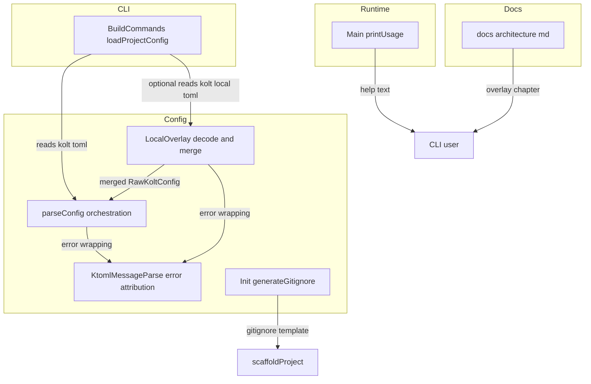
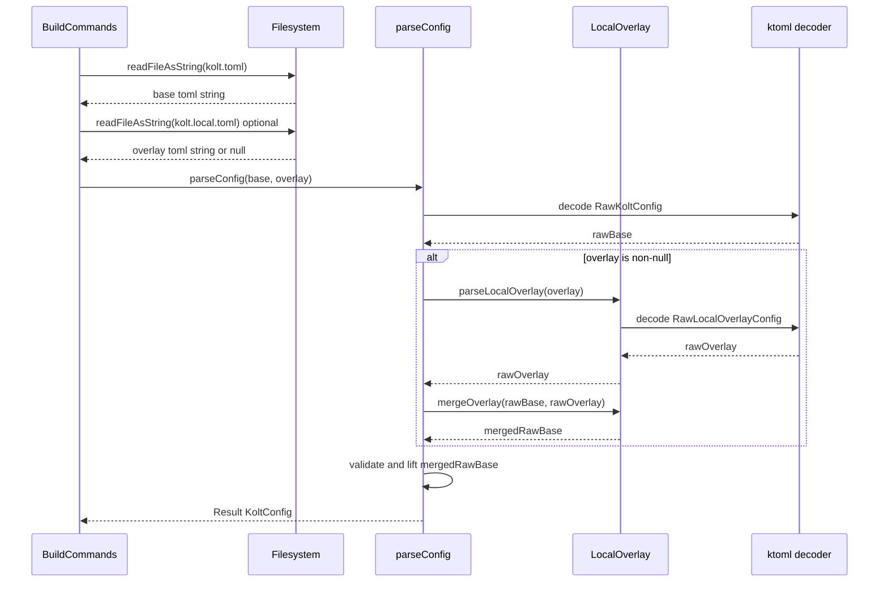
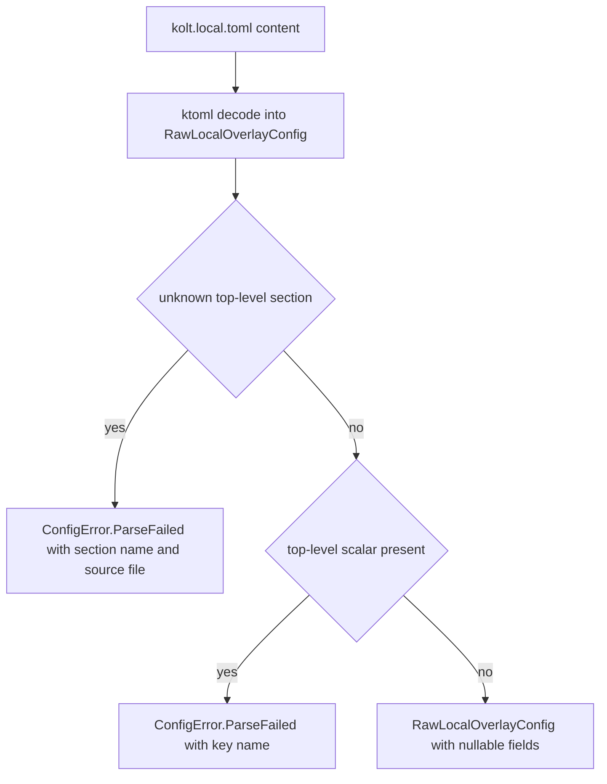
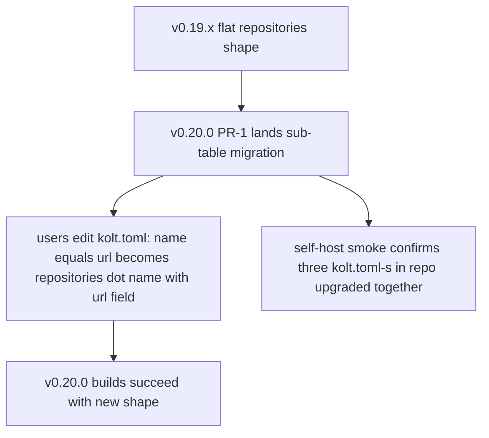

# Design: local-toml-overlay

## Overview

This design introduces `kolt.local.toml`, a per-project overlay file that supplies environment-specific values without polluting the team-shared, committed `kolt.toml`. The overlay is parsed by the same ktoml pipeline as `kolt.toml`, but is restricted to an explicit section allowlist (`[test.sys_props]`, `[run.sys_props]`, `[repositories.<name>]`) encoded by the wire type itself.

**Purpose**: Give every kolt user a built-in, persistent channel for per-machine values (local API endpoints, sandbox paths, future private-repo credentials) without forcing them onto runtime CLI flags or env-var hacks.

**Users**: kolt users with team-shared `kolt.toml` who currently rely on `-D<key>=<value>` runtime flags for env-specific values, and (downstream) `#416` consumers who need a home for private-Maven-repo credentials.

**Impact**: Changes `parseConfig`'s input contract from "one TOML string" to "one base + one optional overlay", migrates `[repositories]` from flat `name = "url"` to sub-table `[repositories.<name>] url = "..."` form (pre-v1 breaking, documented in v0.20.0 release notes), and adds `kolt.local.toml` to the generated `.gitignore` from `kolt init` / `kolt new`.

### Goals

- Per-project `kolt.local.toml` overlay parsed and merged into `kolt.toml` before the existing semantic-validation pipeline runs.
- Hard allowlist on overlay sections enforced by ktoml strict mode plus the wire-type field set; unknown sections fail loudly with file-attributed errors.
- `[repositories]` schema migration to sub-table form, with `Repository(val url: String)` as the new field-merge-friendly record.
- `kolt init` / `kolt new` `.gitignore` auto-append for `kolt.local.toml`.
- Discoverability: `kolt --help` reflects the three-layer merge order (`kolt.toml` ← `kolt.local.toml` ← `-D`), `docs/architecture.md` gains a Configuration Layers chapter.
- ADR 0034 skeleton landed in PR-2, shared with the downstream #416 Private Maven Repos work.

### Non-Goals

- Repository auth field semantics (`token` / `user` / `password`) — owned by #416.
- `${env.X}` / environment-variable interpolation in either file — deferred to v1.1+ per ADR 0032.
- Overlay support for any section outside the allowlist (`[build]`, `[dependencies]`, `[classpaths]`, `[kotlin]`, ...).
- Per-user-home overlay file locations (`$XDG_CONFIG_HOME/kolt/local.toml`, ...) — permanently out.
- Multi-file overlay chains (`kolt.local.toml` + `kolt.user.toml`, ...).
- Encryption or secret-store integration. Overlay values are plaintext on disk.

## Boundary Commitments

### This Spec Owns

- The on-disk contract for `kolt.local.toml` in the project root: file location, allowed top-level sections, allowed value shapes within those sections, and the file-attributed error format for violations.
- The `Repository` domain record (`url: String`) shape in v0.20.0; downstream extensions (auth fields) layer on this record without rewriting it.
- The merge semantics between `kolt.toml` and `kolt.local.toml` for the three allowlisted sections.
- The `.gitignore` template line for `kolt.local.toml` written by `kolt init` / `kolt new`.
- The `kolt --help` text and `docs/architecture.md` chapter that describe the overlay file to users.
- ADR 0034 skeleton: env-agnostic ↔ overlay framing; section placeholders for #416 to extend.

### Out of Boundary

- Anything happening after `parseConfig` returns: resolver behavior, lockfile contents, daemon protocol, `kolt run` / `kolt test` JVM args. This spec changes the *source* of values in `KoltConfig`; downstream consumers see no contract change beyond `Map<String, Repository>` instead of `Map<String, String>`.
- The `[test|run.sys_props]` schema, `SysPropValue` model, and runtime delivery — owned by the existing `jvm-sys-props` spec and unchanged here.
- Authentication credentials, credential mutual-exclusion, env-var indirection inside `[repositories.<name>]` — owned by #416.
- Multi-target / per-target overlays, lockfile-level repository hashing — separate work, not in this spec.

### Allowed Dependencies

- ktoml-core 0.7.1 (already in stack).
- kotlin-result 2.x (`Result<V, E>` for all fallible paths).
- Existing `Config.kt` types: `RawKoltConfig`, `KoltConfig`, `ConfigError`, `KtomlMessageParse` helpers.
- Existing `SysPropValue` / `RawSysPropValue` types (consumed as-is, not extended).
- Existing `Init.kt:generateGitignore()` template literal.
- Existing `Main.kt:printUsage()` text emitter.

This design **must not** depend on:

- Any `kolt run` / `kolt test` runtime code (`Runner.kt`, `TestBuilder.kt`) — overlay merging happens entirely inside `parseConfig`.
- Any resolver-internal code (`Resolver.kt`, `BundleResolver.kt`, `NativeResolver.kt`) — only the consumer expression `config.repositories.values.toList()` changes mechanically.
- Lockfile code (`Lockfile.kt`) — confirmed unaffected.

### Revalidation Triggers

Downstream specs and consumers should re-check integration when any of the following change:

- `Repository` data class shape (e.g., #416 adding `token` / `user` / `password` fields — already anticipated).
- The allowlist set (`[test.sys_props]`, `[run.sys_props]`, `[repositories.<name>]`) — adding a section requires updating `RawLocalOverlayConfig`, `mergeOverlay`, `docs/architecture.md`, and tests in lockstep.
- The merge ordering (currently `kolt.toml` ← `kolt.local.toml` ← `-D`); flipping precedence is a breaking change to user mental model.
- `[repositories.<name>]` field defaults — e.g., introducing a default `url` would break R4.5 (post-merge `url` non-empty check).

## Architecture

### Existing Architecture Analysis

`parseConfig` (`Config.kt:435`) follows a strict Decode → Validate → Lift → Assemble pipeline. Step 1 is `Toml.decodeFromString(RawKoltConfig.serializer(), tomlString)` producing a `RawKoltConfig`. Steps 2 through ~12 run semantic validation on that wire type and lift it into the domain `KoltConfig`. The pipeline is single-source today: one TOML string in, one `KoltConfig` out.

Two patterns in the existing code shape this design:

1. **`SysPropValue.kt` precedent**: a dedicated file housing a sealed domain type, a Raw wire type with nullable fields, and a custom KSerializer. This is the template `LocalOverlay.kt` follows.
2. **`KtomlMessageParse.kt` error attribution**: ktoml exceptions are caught at the `parseConfig` boundary, parsed by `extractKtomlLineNo` / `parseUnknownKey`, and wrapped as `ConfigError.ParseFailed(path, lineNo, message)`. The same infrastructure handles `kolt.local.toml` errors with the file path threaded through.

The `[repositories]` flat shape (`Map<String, String>`) is consumed at 9 call sites, all of which read `.values.toList()` to extract URL strings. The migration to `Map<String, Repository>` is a mechanical 1-line edit per call site (`.values.map { it.url }`).

### Architecture Pattern & Boundary Map



**Architecture Integration**:

- Selected pattern: **Decoder + Merger as a single module** (`LocalOverlay.kt`), invoked by `parseConfig` before semantic validation. Mirrors the existing `SysPropValue.kt` separation of wire model + lifting.
- Domain/feature boundaries: `LocalOverlay.kt` owns the overlay-file wire type and the merge functions; `Config.kt` owns orchestration and validation; `BuildCommands.kt` owns file I/O; downstream consumers see only the `Map<String, Repository>` shape change.
- Existing patterns preserved: Raw* wire type → semantic validation → lift to domain type; `ConfigError.ParseFailed(path, ...)` for all parse-time errors; `KtomlMessageParse` infrastructure for error wording.
- New components rationale: `LocalOverlay.kt` is the only new file; everything else is targeted edits to existing files.
- Steering compliance: kotlin-result for all fallible paths (ADR 0001); no exceptions; English code/docs (CLAUDE.md); ktoml 0.7.1 quirks respected (memory: `ktoml_decode_quirks`).

### Technology Stack

| Layer | Choice / Version | Role in Feature | Notes |
|-------|------------------|-----------------|-------|
| Frontend / CLI | `Main.kt:printUsage` text edit | Surfaces overlay file and three-layer merge order to users | No new CLI flags |
| Backend / Services | `LocalOverlay.kt` (new), `Config.kt` (edited) | Overlay decode + merge + orchestration | Pure Kotlin/Native, no new deps |
| Data / Storage | `kolt.local.toml` on disk | Per-project overlay artifact | Plaintext TOML; gitignored by default after #417 |
| Messaging / Events | n/a | — | — |
| Infrastructure / Runtime | ktoml-core 0.7.1 | Wire parse with strict-mode unknown-section rejection | Already in stack |

## File Structure Plan

### Directory Structure

```
src/nativeMain/kotlin/kolt/
└── config/
    ├── Config.kt            # MODIFIED: parseConfig accepts optional overlay; Repository record introduced; repositories type changed
    ├── LocalOverlay.kt      # NEW: RawLocalOverlayConfig + parseLocalOverlay + mergeOverlay + mergeSysProps + mergeRepositories
    ├── KtomlMessageParse.kt # MODIFIED: error wrapping accepts source-file path for kolt.local.toml attribution
    ├── Init.kt              # MODIFIED: generateGitignore appends kolt.local.toml line; generateKoltToml emits sub-table repositories
    └── KoltPaths.kt         # MODIFIED: KOLT_LOCAL_TOML constant added

src/nativeMain/kotlin/kolt/cli/
├── BuildCommands.kt         # MODIFIED: loadProjectConfig reads kolt.local.toml if present, passes both to parseConfig
└── Main.kt                  # MODIFIED: printUsage text updated for three-layer merge order

src/nativeMain/kotlin/kolt/resolve/
├── BundleResolver.kt        # MODIFIED: .values.toList() → .values.map { it.url }.toList() (1 line)
├── NativeResolver.kt        # MODIFIED: same as above (1 line)
└── TransitiveResolver.kt    # MODIFIED: same as above (1 line)

src/nativeMain/kotlin/kolt/cli/
├── DependencyCommands.kt    # MODIFIED: same mechanical replacement, 4 call sites
├── OutdatedCommand.kt       # MODIFIED: same, 1 call site
└── ToolCommands.kt          # MODIFIED: same, 1 call site

src/nativeTest/kotlin/kolt/config/
├── LocalTomlOverlayDecodeTest.kt   # NEW: RawLocalOverlayConfig decode + allowlist enforcement (top-level + nested)
├── LocalTomlOverlayMergeTest.kt    # NEW: mergeSysProps + mergeRepositories unit tests + parseConfig orchestration integration
├── RepositorySchemaMigrationTest.kt# NEW: rejects legacy flat form; accepts sub-table form; preserves declaration order; ktoml-error-shape probe pin (see parseConfig investigation gate)
├── ConfigTest.kt                   # MODIFIED: 4 [repositories] heredocs at lines 812/837/870/896 flipped to sub-table form
├── ChangeMatrixTest.kt             # MODIFIED: line 215 `mapOf("central" to "...")` → `mapOf("central" to Repository("..."))`
└── ConfigParseMessageFormatTest.kt # MODIFIED: add pinned message-shape case for "expected table got string in Map<String, RawRepository>" probe result

src/nativeTest/kotlin/kolt/cli/
├── InitGitignoreTest.kt            # NEW or MODIFIED: kolt init writes kolt.local.toml to .gitignore
├── DoAddAtomicWriteTest.kt         # MODIFIED: line 82 [repositories] heredoc flipped to sub-table form
└── BundleResolutionIntegrationTest.kt # MODIFIED: line 399 Kotlin Map construction updated

src/nativeTest/kotlin/kolt/resolve/
├── BundleResolverProgressTest.kt   # MODIFIED: line 98 Kotlin Map construction updated
└── NativeResolverJvmOnlyFallbackTest.kt # MODIFIED: line 39 Kotlin Map construction updated

docs/
├── architecture.md          # MODIFIED: new "## Configuration layers" section before "## Configuration change semantics"
└── adr/
    └── 0034-private-maven-repos.md # NEW (PR-2): skeleton with env-agnostic ↔ overlay framing

README.md                     # MODIFIED: 2 [repositories] code blocks at lines 127, 185 flipped to sub-table form
README.ja.md                  # MODIFIED: 2 [repositories] code blocks at lines 126, 184 flipped to sub-table form
.claude/skills/kolt-usage/SKILL.md # MODIFIED: line 157 [repositories] code block flipped to sub-table form

docs/release-notes/
└── v0.20.0.md               # NEW (release PR, not this spec): hand-written release notes including [repositories] upgrade snippet + daemon-restart-before-edit recommendation
```

### Modified Files Summary

| File | Change | PR |
|------|--------|----|
| `Config.kt` | Add `Repository` data class; `repositories: Map<String, Repository>`; `parseConfig(base, overlay?)` signature; merge call site | PR-1 |
| `LocalOverlay.kt` | NEW | PR-1 (base + sys_props), extended PR-2 (repositories merge) |
| `KtomlMessageParse.kt` | Thread source-file path through error wrapper for both top-level and nested-scope unknown-key paths | PR-1 |
| `KoltPaths.kt` | `KOLT_LOCAL_TOML = "kolt.local.toml"` constant | PR-1 |
| `BuildCommands.kt:loadProjectConfig` | Optional second-file read + pass to parseConfig | PR-1 |
| `Init.kt:generateGitignore` | Add `kolt.local.toml` line | PR-3 |
| `Init.kt:generateKoltToml` | Emit sub-table `[repositories.central] url = "..."` | PR-1 |
| `Main.kt:printUsage` | Update `-D` line for three-layer order; add `kolt.local.toml` description | PR-1 |
| 9 resolver/CLI consumers | `.values.toList()` → `.values.map { it.url }` | PR-1 |
| 4 test fixtures using `mapOf("central" to "url")` | Convert to `mapOf("central" to Repository("url"))` (ChangeMatrixTest:215, BundleResolutionIntegrationTest:399, BundleResolverProgressTest:98, NativeResolverJvmOnlyFallbackTest:39) | PR-1 |
| 4 ConfigTest.kt heredocs (lines 812, 837, 870, 896) | Flip to sub-table form | PR-1 |
| `DoAddAtomicWriteTest.kt:82` heredoc | Flip to sub-table form | PR-1 |
| `README.md` (lines 127, 185), `README.ja.md` (lines 126, 184), `kolt-usage` SKILL.md (line 157) | Doc code blocks flipped to sub-table form | PR-1 |
| `docs/architecture.md` | New Configuration layers section | PR-1 |
| `docs/adr/0034-*.md` | NEW skeleton | PR-2 |
| Test files above | NEW or MODIFIED | Per matching PR |

## System Flows

### Parse pipeline with overlay merge



Key decisions on the flow:

- Merge happens on the **`RawKoltConfig` wire type**, not on the domain `KoltConfig`. This keeps semantic validation (cross-references, project_dir containment, env-agnostic literal rule) running once on the merged result.
- If `kolt.local.toml` decode fails, `parseConfig` returns `Err` with the local file path attributed; the base may have parsed successfully but we surface the overlay error rather than silently dropping it.
- If `parseLocalOverlay` succeeds but `mergeOverlay` detects a violation (e.g., `[repositories.<name>]` for a name not in base), the error is wrapped as `ConfigError.ParseFailed(path = "kolt.local.toml", ...)` with a named-section message.

### Allowlist enforcement (ktoml strict-mode)



The strict-mode mechanism is the same one `kolt.toml` already uses. The only delta is which top-level keys are accepted: `RawLocalOverlayConfig` declares only `test?`, `run?`, `repositories?`. Anything else is `Unknown key` per ktoml's existing behavior.

## Requirements Traceability

| Requirement | Summary | Components | Interfaces / Files |
|-------------|---------|------------|---------------------|
| 1.1 | Overlay parsed when present | LocalOverlay, parseConfig, loadProjectConfig | `LocalOverlay.kt:parseLocalOverlay`, `Config.kt:parseConfig`, `BuildCommands.kt:loadProjectConfig` |
| 1.2 | No overlay file → identical merged config | parseConfig | `Config.kt:parseConfig` (overlay-null branch) |
| 1.3 | TOML syntax error in overlay → file-attributed parse error | LocalOverlay, KtomlMessageParse | `LocalOverlay.kt:parseLocalOverlay`, `KtomlMessageParse.kt` |
| 1.4 | Env-agnostic literal rule applies to overlay too | parseConfig | Validation runs once on merged result; existing rule unchanged |
| 2.1 | Allowlist accepts subset of `test.sys_props`, `run.sys_props`, `repositories` | RawLocalOverlayConfig | `LocalOverlay.kt:RawLocalOverlayConfig` field set |
| 2.2 | Non-allowlisted top-level construct (section or scalar) rejected | ktoml strict mode + RawLocalOverlayConfig | Inherited from ktoml `ignoreUnknownNames=false` at root scope |
| 2.3 | Unknown sub-key inside allowlisted section rejected | ktoml strict mode at nested scope + KtomlMessageParse | Inherited at nested scope; `parseUnknownKey` returns scope info |
| 3.1 | sys_props key-replace within `[test.sys_props]` and `[run.sys_props]` | mergeSysProps | `LocalOverlay.kt:mergeSysProps` (applied twice in mergeOverlay) |
| 3.2 | sys_props new-key union within both sections | mergeSysProps | same |
| 3.3 | Overlay `{ classpath = X }` referencing missing bundle → rejected | Existing `validateBundleReferences` | `Config.kt:validateBundleReferences` (runs post-merge) |
| 4.1 | `[repositories.<name>] url = "..."` accepted | Repository, RawRepository | `Config.kt:Repository`, `Config.kt:RawRepository` |
| 4.2 | Multiple `[repositories.<name>]` accepted | Map<String, Repository> | `Config.kt:KoltConfig.repositories` |
| 4.3 | Legacy flat form rejected with migration message | Config decode-error handler (investigation gate, see parseConfig Notes) | `Config.kt` migration message substitution or hint append; `RepositorySchemaMigrationTest.kt:reject_flat_form` |
| 4.4 | Repository with missing `url` rejected | Config validation | `Config.kt` post-merge check |
| 5.1 | Overlay repository field-merge by name | mergeRepositories | `LocalOverlay.kt:mergeRepositories` |
| 5.2 | Overlay-only repository name rejected | mergeRepositories (structural error during merge) | `LocalOverlay.kt:mergeRepositories` |
| 5.3 | Post-merge empty url rejected | Config validation | `Config.kt` post-merge check |
| 6.1 | `kolt init` writes `kolt.local.toml` to gitignore | generateGitignore | `Init.kt:generateGitignore` |
| 6.2 | Kind/target agnostic | generateGitignore | same (no conditionals on kind/target) |
| 7.1 | `kolt --help` shows three-layer order | printUsage | `Main.kt:printUsage` |
| 7.2 | `docs/architecture.md` documents overlay | Architecture doc | `docs/architecture.md:## Configuration layers` |
| 8.1 | No overlay → identical `kolt.lock` | Resolver consumers | `BundleResolver.kt`, `NativeResolver.kt`, etc. — `.values.map { it.url }` is value-identical to current `.values.toList()` |

## Components and Interfaces

| Component | Domain/Layer | Intent | Req Coverage | Key Dependencies | Contracts |
|-----------|--------------|--------|--------------|-------------------|-----------|
| `LocalOverlay` | Config | Decode `kolt.local.toml` and merge into `RawKoltConfig` | 1.1, 1.3, 2.1, 2.3, 3.1, 3.2, 5.1, 5.2 | ktoml (P0), KtomlMessageParse (P0), SysPropValue (P0) | Service |
| `Repository` | Config (model) | Repository record with `url` field | 4.1, 4.2, 4.4, 5.3 | None | State |
| `parseConfig` (extended) | Config | Orchestrate base decode → overlay decode → merge → validate → lift | 1.1, 1.2, 1.4, 3.3, 4.3, 5.3 | LocalOverlay (P0), existing validators (P0) | Service |
| `loadProjectConfig` (extended) | CLI | Read both TOML files and call parseConfig | 1.1, 1.2 | BuildCommands existing IO (P0) | Service |
| `Init.generateGitignore` (extended) | Scaffold | Append `kolt.local.toml` to generated gitignore | 6.1, 6.2 | None | State |
| `Init.generateKoltToml` (extended) | Scaffold | Emit sub-table `[repositories.central]` in templates | 4.1 | None | State |
| `Main.printUsage` (extended) | CLI text | Surface overlay file in `--help` | 7.1 | None | State |
| `docs/architecture.md` (extended) | Documentation | Describe overlay layering, allowlist, merge | 7.2 | None | State |

### Config

#### LocalOverlay

| Field | Detail |
|-------|--------|
| Intent | Decode `kolt.local.toml` into `RawLocalOverlayConfig` and merge into `RawKoltConfig` |
| Requirements | 1.1, 1.3, 2.1, 2.3, 3.1, 3.2, 5.1, 5.2 |

**Responsibilities & Constraints**

- Decode `kolt.local.toml` using the same ktoml configuration as `kolt.toml` (`Toml(TomlInputConfig(ignoreUnknownNames = false))`), so unknown-section rejection is identical.
- Define `RawLocalOverlayConfig` with all fields nullable; the field set IS the section allowlist. No separate `KNOWN_OVERLAY_SECTIONS` constant.
- Pure functions for merge — no side effects, no I/O. All file reads happen in `BuildCommands.loadProjectConfig`.
- File-attributed errors: every `Err` from this component carries `path = "kolt.local.toml"` (absolute path threaded from the caller).

**Dependencies**

- Inbound: `parseConfig` (P0) — invokes `parseLocalOverlay` and `mergeOverlay`.
- Outbound: ktoml-core 0.7.1 (P0) — decode primitive.
- Outbound: `KtomlMessageParse.kt` (P0) — error string parse for unknown-key attribution.
- External: kotlin-result 2.x (P0) — `Result<V, E>` envelope.

**Contracts**: Service ✓ / State —

##### Service Interface

```kotlin
internal data class RawLocalOverlayConfig(
  val test: RawTestSection? = null,
  val run: RawRunSection? = null,
  val repositories: Map<String, RawRepository>? = null,
)

internal fun parseLocalOverlay(
  tomlString: String,
  path: String,
): Result<RawLocalOverlayConfig, ConfigError>

internal fun mergeOverlay(
  base: RawKoltConfig,
  overlay: RawLocalOverlayConfig,
  overlayPath: String,
): Result<RawKoltConfig, ConfigError>

private fun mergeSysProps(
  base: Map<String, RawSysPropValue>,
  overlay: Map<String, RawSysPropValue>,
): Map<String, RawSysPropValue>

private fun mergeRepositories(
  base: Map<String, RawRepository>,
  overlay: Map<String, RawRepository>,
  overlayPath: String,
): Result<Map<String, RawRepository>, ConfigError>
```

- **Preconditions**: `tomlString` is the verbatim file content; `path` is the absolute path for error attribution. `base` is the result of decoding `kolt.toml` (post-decode, pre-validation).
- **Postconditions**: On `Ok`, the merged `RawKoltConfig` has overlay values applied per section semantics; the result is still subject to the full `parseConfig` validation pipeline. On `Err`, no partial merge state escapes.
- **Invariants**:
  - `mergeSysProps`: a key in both maps takes the overlay value; keys unique to either are union-merged.
  - `mergeRepositories`: an overlay name not in base produces `Err`. Field-merge is `data class .copy(...)` semantics — overlay non-null fields replace base fields.
  - Repository declaration order is the base order (overlay never inserts new entries).

**Implementation Notes**

- Integration: `parseLocalOverlay` reuses `extractKtomlLineNo` / `parseUnknownKey` from `KtomlMessageParse.kt`; the only delta vs. `parseConfig`'s existing error handling is the source-file path argument. Source-file path threading must apply to both top-level unknown-section errors and nested-scope unknown-key errors (R2.3): `parseUnknownKey` already returns scope info, the wrapper just needs to thread the overlay path through both branches.
- Validation runs in two phases:
  - **Structural errors during `mergeOverlay`**: overlay-only repository name (R5.2). These are detected during the merge call itself because they cannot be expressed as a property of the merged result. The error is wrapped with `path = "kolt.local.toml"` at the `mergeOverlay` boundary.
  - **Semantic invariants post-merge in `parseConfig`**: bundle cross-references (R3.3), project_dir containment (existing rule via `validateSysPropsProjectDirs`), empty `url` (R5.3). These are properties of the merged result and reuse the existing single validation pass.
- Risks: ktoml `Map<String, RawRepository>` decode preserves declaration order (memory: `ktoml_decode_quirks`). If a future ktoml upgrade changes this, the resolver iteration order changes silently; a regression test in `RepositorySchemaMigrationTest.kt` pins the order.

#### Repository (model)

| Field | Detail |
|-------|--------|
| Intent | Record type for a single repository in `kolt.toml` |
| Requirements | 4.1, 4.2, 4.4, 5.3 |

**Responsibilities & Constraints**

- Plain `data class Repository(val url: String)`. No auth fields in v0.20.0; #416 will extend.
- Equality is value-based (auto-generated by `data class`) — `ChangeMatrix.kt` Map equality on this record works correctly.
- `RawRepository` is a parallel wire type with `url: String? = null`; non-null after merge is enforced in validation, not at decode.

**Contracts**: State ✓

```kotlin
data class Repository(val url: String)

@Serializable
internal data class RawRepository(val url: String? = null)
```

#### parseConfig (extended)

| Field | Detail |
|-------|--------|
| Intent | Single orchestration entry point for parsing the merged `kolt.toml` + `kolt.local.toml` |
| Requirements | 1.1, 1.2, 1.4, 3.3, 4.3, 5.3 |

**Responsibilities & Constraints**

- Accepts a base TOML string and an optional overlay TOML string; backward-compatible for callers that pass only the base.
- Merge point is between decode and validation. Validation runs once on the merged `RawKoltConfig`.
- Repository schema migration: detect legacy flat form (`name = "url"` directly in `[repositories]`) at decode time. ktoml will surface this as a type mismatch (expects table, got string); the error is wrapped with the migration-guidance message.
- Post-merge: ensures every `Repository.url` is non-empty.

##### Service Interface

```kotlin
fun parseConfig(
  tomlString: String,
  path: String? = null,
  overlayString: String? = null,
  overlayPath: String? = null,
): Result<KoltConfig, ConfigError>
```

- **Preconditions**: `tomlString` is `kolt.toml` content. `overlayString` and `overlayPath` are either both null or both non-null.
- **Postconditions**: On `Ok`, the merged `KoltConfig` has overlay values applied; no overlay-specific state leaks into the domain model. On `Err`, the `ConfigError.ParseFailed.path` identifies whichever file caused the error.

**Implementation Notes**

- Integration: existing call sites in tests pass only `tomlString`; signature is backward-compatible via defaulted nulls. Only `BuildCommands.loadProjectConfig` passes the overlay arguments.
- Validation: existing validators (`validateBundleReferences`, `validateSysPropsProjectDirs`, kind/main consistency, target validation, etc.) run unchanged on the merged result.
- Risks: **schema-migration error message detection is unverified** — the design assumes ktoml emits an inspectable exception when it hits `central = "https://..."` while decoding `Map<String, RawRepository>`, but the actual exception type, message format, and presence of line-number info have not been pinned. **Investigation gate before R4.3 implementation**: write a throw-away ktoml probe (~20 LoC) against `Map<String, RawRepository>` decode of legacy flat input, pin the actual exception in `ConfigParseMessageFormatTest`, and only then design the substitution. Fallback if ktoml's error is not deterministically inspectable: surface ktoml's raw error and append a `KtomlMessageParse` hint paragraph naming the migration step, rather than substituting the message in place. The fallback still satisfies R4.3 because the hint is the user-actionable part.

### CLI

#### loadProjectConfig (extended)

| Field | Detail |
|-------|--------|
| Intent | Read `kolt.toml` and (if present) `kolt.local.toml`, call `parseConfig` with both |
| Requirements | 1.1, 1.2 |

**Service Interface**

```kotlin
internal fun loadProjectConfig(): Result<KoltConfig, Int>
```

Signature unchanged. Internal logic gains a conditional `readFileAsString(KOLT_LOCAL_TOML)`; failure to read (file does not exist) is silently treated as null overlay. Any other I/O error on the overlay file is propagated as a config error.

**Implementation Notes**

- Idempotent: re-invocations produce the same result when neither file changes.
- ChangeMatrix integration: existing `[repositories]` descriptor at `ChangeMatrix.kt:106` continues to detect changes via Map equality on `Repository`.

#### Init.generateGitignore (extended)

| Field | Detail |
|-------|--------|
| Intent | Add `kolt.local.toml` to the gitignore template |
| Requirements | 6.1, 6.2 |

**Implementation Notes**

- The current template is a hardcoded multi-line raw string. Add `kolt.local.toml` line at a deterministic position (alphabetical or after `workspace.json`).
- No conditionals on kind/target. The line is unconditional.
- The preset-flow spec (#412) does not introduce a gitignore merge step today, so duplicate-line handling is not in this spec's scope; if a future preset spec adds a merge step, deduplication is its responsibility.

#### Init.generateKoltToml (extended)

Template emits `[repositories.central]\nurl = "https://repo1.maven.org/maven2"` in place of the legacy flat form. All other template content unchanged.

#### Main.printUsage (extended)

Updates the `-D<key>=<value>` description line (`Main.kt:264`) so it reads as the third layer of a three-layer overlay (kolt.toml → kolt.local.toml → `-D`). Adds a short note describing `kolt.local.toml` as a per-project optional overlay file. No new flags.

### Documentation

#### docs/architecture.md

Adds a new `## Configuration layers` section between `## Error handling` and `## Configuration change semantics`. The section covers:

- The two on-disk files (`kolt.toml` shared, `kolt.local.toml` gitignored).
- The section allowlist (`[test.sys_props]`, `[run.sys_props]`, `[repositories.<name>]`).
- Merge semantics: key-replace for sys_props, field-merge for repositories.
- The three-layer overlay order ending at runtime `-D<key>=<value>`.
- One-paragraph reference to ADR 0034 for the env-agnostic ↔ overlay relationship.

#### docs/adr/0034-private-maven-repos.md (PR-2 skeleton)

Skeleton ADR landed in PR-2. Sections: Status (Proposed), Context (env-agnostic vs. credentials), Decision (overlay-file home for credentials, deferring env-var resolution to v1.1+), Consequences. Auth-field specifics are stubbed for #416 to fill.

## Data Models

### Domain Model

Two model deltas in v0.20.0:

1. **`Repository` introduced**: `data class Repository(val url: String)`. Replaces the previous `String` value type in `KoltConfig.repositories: Map<String, String>`. Future fields (`token` / `user` / `password`) layered on by #416 via data-class `.copy(...)`.
2. **`KoltConfig.repositories` type changes**: from `Map<String, String>` to `Map<String, Repository>`. No new fields elsewhere in `KoltConfig`.

The Raw counterparts:

- `RawRepository(val url: String? = null)` — wire type for both `kolt.toml` and `kolt.local.toml`. Non-null `url` is enforced by validation (R4.5, R5.4), not at decode.
- `RawLocalOverlayConfig(val test: RawTestSection?, val run: RawRunSection?, val repositories: Map<String, RawRepository>?)` — wire type whose field set IS the overlay allowlist.

### Data Contracts & Integration

**`kolt.toml` `[repositories]` shape (post-migration, breaking)**:

```toml
[repositories.central]
url = "https://repo1.maven.org/maven2"

[repositories.internal]
url = "https://mirror.example.com/maven2"
```

The legacy flat shape (`central = "https://..."` directly under `[repositories]`) is rejected at decode time with a migration message.

**`kolt.local.toml` shape (allowlist-only)**:

```toml
[test.sys_props]
api.endpoint = { literal = "http://localhost:8080" }

[run.sys_props]
log.level = { literal = "DEBUG" }

[repositories.internal]
url = "http://localhost:9000/maven"
```

Top-level scalars and any other top-level section produce parse errors.

## Error Handling

### Error Strategy

All overlay-related errors are wrapped as `ConfigError.ParseFailed(path, line?, message)`. The existing `renderConfigError` infrastructure handles user-facing rendering; no new error types are introduced.

### Error Categories

| Category | Trigger | Message shape | Source |
|----------|---------|---------------|--------|
| TOML syntax error in `kolt.local.toml` | ktoml decode failure | "parse error: <ktoml msg>" with file/line | R1.3 |
| Unknown top-level construct in overlay (section or scalar) | ktoml unknown-key at root scope | "unknown <section\|key> '<name>' in kolt.local.toml" | R2.2 |
| Unknown sub-key inside allowlisted section | ktoml unknown-key at nested scope | "unknown key '<name>' in scope '<run\|test>' of kolt.local.toml" (scope returned by existing `parseUnknownKey`) | R2.3 |
| Overlay `{ classpath = X }` missing bundle | Existing `validateBundleReferences` (post-merge) | "sys_prop '<key>' references missing classpath bundle '<X>'" | R3.3 |
| Legacy `[repositories]` flat form in `kolt.toml` | Decode-time exception when ktoml expects `Map<String, RawRepository>` and finds string values | Preferred: substituted "repositories schema migrated to sub-table form; expected `[repositories.<name>] url = \"...\"`, got string value at '<name>'". Fallback if ktoml exception cannot be deterministically inspected: raw ktoml error + appended migration hint. See parseConfig Implementation Notes — investigation gate. | R4.3 |
| Missing or empty `url` post-merge | New post-merge validator | "repository '<name>' has no url" | R4.4, R5.3 |
| Overlay-only `[repositories.<name>]` | `mergeRepositories` (structural error during merge) | "repository '<name>' declared in kolt.local.toml but not in kolt.toml" | R5.2 |

### Monitoring

No new observability surface. All errors flow through `renderConfigError` → `eprintDiagnostic` (existing path). No daemon logs or metrics introduced.

## Testing Strategy

### Unit Tests

1. `LocalTomlOverlayDecodeTest.kt:reject_unknown_top_level_section` — `[build]` in overlay produces `ParseFailed` with file attribution (R2.2).
2. `LocalTomlOverlayDecodeTest.kt:reject_top_level_scalar` — `name = "..."` in overlay produces `ParseFailed` (R2.2).
3. `LocalTomlOverlayDecodeTest.kt:reject_nested_unknown_subkey` — `[run.foo]` or `[test.unknown_sub]` produces `ParseFailed` with scope-attributed message (R2.3).
4. `LocalTomlOverlayDecodeTest.kt:reject_toml_syntax_error` — malformed overlay produces `ParseFailed` identifying `kolt.local.toml` (R1.3).
5. `LocalTomlOverlayMergeTest.kt:merge_sys_props_key_replace_both_sections` — overlay sys_prop replaces base same-key in both `test` and `run` (R3.1).
6. `LocalTomlOverlayMergeTest.kt:merge_sys_props_new_key_union_both_sections` — overlay sys_prop adds new key in both sections (R3.2).
7. `LocalTomlOverlayMergeTest.kt:merge_repositories_field_merge` — overlay url replaces base url for same name (R5.1).
8. `LocalTomlOverlayMergeTest.kt:reject_overlay_only_repo_name` — overlay repo not in base produces ParseFailed (R5.2).
9. `RepositorySchemaMigrationTest.kt:accept_subtable_form` — `[repositories.central] url = "..."` decodes to `Repository("...")` (R4.1, R4.2).
10. `RepositorySchemaMigrationTest.kt:reject_flat_form_with_migration_hint` — `central = "url"` produces error containing migration hint; exact message shape pinned per investigation gate outcome (R4.3).
11. `RepositorySchemaMigrationTest.kt:reject_empty_url_post_merge` — `[repositories.x]` with no `url` produces ParseFailed (R4.4, R5.3).
12. `RepositorySchemaMigrationTest.kt:preserve_declaration_order_pin` — multiple sub-tables iterated in declaration order; regression-only pin against future ktoml upgrades (no requirement; structural).

### Integration Tests

1. `LocalTomlOverlayMergeTest.kt:parse_config_with_overlay_end_to_end` — `parseConfig(base, overlay)` with realistic mixed content (sys_props + repositories); merged `KoltConfig` reflects both files (R1.1, R3.3 cross-reference).
2. `LocalTomlOverlayMergeTest.kt:parse_config_without_overlay_identical_to_base` — `parseConfig(base, null)` produces a `KoltConfig` equal to a hypothetical pre-feature parse (R1.2).
3. `LocalTomlOverlayMergeTest.kt:overlay_classpath_ref_to_base_bundle` — overlay sys_prop `{ classpath = X }` where X is declared in base — resolves correctly post-merge (R3.3).
4. `LocalTomlOverlayMergeTest.kt:env_agnostic_rule_applies_to_overlay` — `${env.X}` in overlay value produces ParseFailed via existing literal-only validation (R1.4).
5. `InitGitignoreTest.kt:kolt_init_writes_local_toml_to_gitignore` — `kolt init`-generated `.gitignore` contains `kolt.local.toml` (R6.1, R6.2).

### Self-host smoke (CI)

A self-host smoke check belongs in PR-1: build kolt itself with the migrated `[repositories.central]` schema in the three top-level `kolt.toml`s (`kolt-jvm-compiler-daemon`, `kolt-native-compiler-daemon`, root), confirm `kolt build` still works end-to-end. This validates R8.1 indirectly through the dogfood path.

### Out-of-scope tests

- Performance / throughput tests: overlay merge is O(sections), trivially fast.
- Concurrency tests: parse is single-threaded.
- Security tests: overlay is plaintext; no encryption claim to test.

## Migration Strategy



- Pre-v1, no migration shim. The legacy flat form is rejected at parse time with a clear migration message (R4.3).
- v0.20.0 release notes (`docs/release-notes/v0.20.0.md`, hand-written in the release PR per memory `release_notes_user_focused`) include the exact one-line upgrade snippet.
- Repository-internal: this PR upgrades all three `kolt.toml`s in the kolt repo (root, `kolt-jvm-compiler-daemon`, `kolt-native-compiler-daemon`) in lockstep. Self-host smoke catches a missed file.

**Daemon-across-upgrade behavior**: A running `kolt build --watch` or warm daemon may observe the `kolt.toml` edit that flips the schema. The pre-edit `KoltConfig` snapshot it holds is shape-compatible at the Kotlin level (Repository is value-equal-to-itself), but the new file content rejects at parse time with `ParseFailed` until the user completes the migration. `ChangeMatrix` surfaces this as a standard parse-error notify; no special cross-shape diff is attempted. Users who upgrade kolt and re-edit `kolt.toml` while a daemon is running should expect one or more `ParseFailed` notifications during the edit window — this is normal and recovers as soon as the file is valid. v0.20.0 release notes recommend `kolt daemon stop --all` before the migration edit to avoid the noise.

No phased rollout, no feature flag. Single-commit migration.
