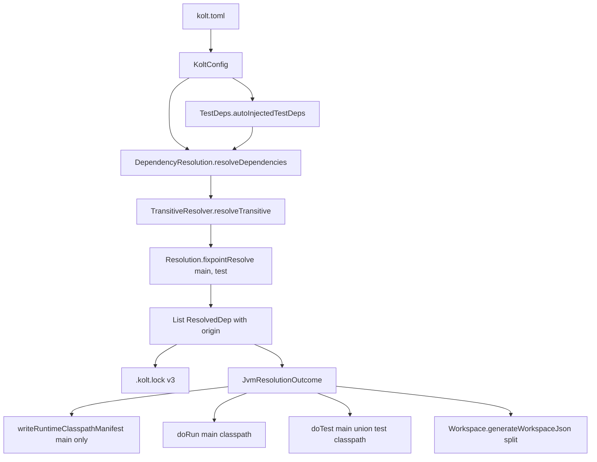
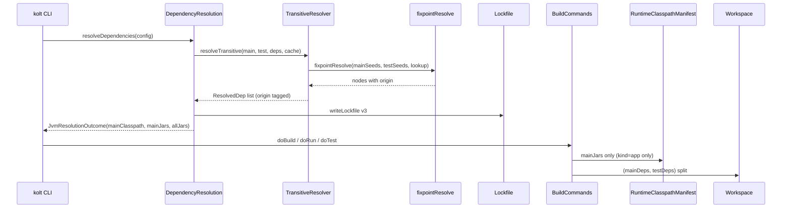

# Design Document

## Overview

kolt JVM resolver が現在 `[dependencies]` / `[test-dependencies]` / 自動注入 `kotlin-test-junit5` を単一 closure に畳み込んでいるのを、main closure と test closure を別集合として解決するよう変更する。`ResolvedDep` に `Origin` を追加して 1 回の fixpoint で両 closure を同時に算出し、caller (build / run / test / manifest / workspace.json) は origin で filter する形に揃える。`.kolt.lock` は per-entry `test: Boolean` flag を v3 schema で保持する。

**Purpose**: JVM `kind = "app"` の runtime classpath manifest (ADR 0027 §1) と `.kolt.lock` から test 専用依存を締め出し、配布成果物 (daemon self-host、`scripts/assemble-dist.sh`) を正しい shape に戻す。

**Users**: JVM `kind = "app"` を配布する開発者 (kolt 自身の daemon self-host、および `[test-dependencies]` を使う user プロジェクト全般)、IDE (workspace.json 経由)、`.kolt.lock` を手で読むレビュアー。

**Impact**: resolver 返り値の shape (+`Origin`)、lockfile schema (v2 → v3、`test: Boolean` 列追加)、`JvmResolutionOutcome` のフィールド構成、build/run/test 経路の classpath 構築コードが変わる。ADR 0027 §1 と ADR 0003 の schema 表に v3 行を追記する。

### Goals
- `.kolt.lock` / `build/<name>-runtime.classpath` / `kolt run` の classpath から test 起源の依存を除去する。
- `kolt test` の classpath は main closure と test closure の和を従来通り渡す。
- 変更後も resolver kernel の "direct wins / main wins on overlap / strict / rejects" の既存不変条件を保つ。
- daemon self-host (`kolt-jvm-compiler-daemon`) の成果物 tarball が junit 系の jar を含まなくなる。

### Non-Goals
- POM `<scope>test</scope>` フィルタ機構 (`Resolution.isIncludedScope`、既存実装済) に手を入れない。
- `provided` / `system` / `import` / `runtime` scope の細分対応は実装しない。将来導入時は schema v4 bump で対応。
- Gradle Module Metadata の `usage=test` variant 区別は別 issue。
- Kotlin/Native resolver (`resolveNative`) の動作は変えない (現状で `config.dependencies` のみ使用しており本問題の影響を受けない)。
- 旧 lockfile (v1 / v2) の自動 migration は行わない。v1/v2 は unsupported として reject し、ユーザーに再解決を促す (pre-v1 方針)。

## Boundary Commitments

### This Spec Owns
- `kolt.resolve.Resolution.fixpointResolve` の 2-seed API (`mainSeeds` / `testSeeds`) と、kernel 内での origin 伝播ルール。
- `kolt.resolve.Resolver.ResolvedDep` / `kolt.resolve.Lockfile.LockEntry` の `test: Boolean` フィールド追加と、v3 schema の parse / serialize。
- `kolt.cli.DependencyResolution.resolveDependencies` の 2 closure 返却と `JvmResolutionOutcome` の shape 変更。
- `kolt.build.Builder.writeRuntimeClasspathManifest` / `kolt.cli.BuildCommands` (doBuild / doRun / doTest) / `kolt.build.Workspace` の origin-aware 経路更新。
- ADR 0027 §1 と ADR 0003 §2 の文言補足。
- `kolt.build.TestDeps.autoInjectedTestDeps` の適用条件 (test_sources 空かつ test-dependencies 空時は skip)。

### Out of Boundary
- POM scope filter (`isIncludedScope`) の拡張 (既存実装で AC 達成済)。
- `kolt run` / `kolt test` の実行経路そのもの (classpath 入力のみ変わる、コマンド組み立て本体は触らない)。
- `PluginJarFetcher` / `BtaImplFetcher` の解決経路 (本 lockfile とは別管理、origin 概念と無関係)。
- `scripts/assemble-dist.sh` の改修 (passive consumer、manifest が変われば自動追従)。
- v1 → v3 / v2 → v3 の migration 実装。

### Allowed Dependencies
- `kotlin-result` の `Result<V, E>` (ADR 0001)。
- `kotlinx.serialization` (lockfile JSON、ADR 0003)。
- 既存 `kolt.resolve` kernel (strict / rejects / exclusions / version intervals の相互作用)。
- 既存 ADR 0027 §1 / §4 / §5 (manifest 契約)、ADR 0003 §2 (schema evolution パターン)。

### Revalidation Triggers
- `ResolvedDep` の新 `origin` フィールドを消費する caller が増えた場合 (現状 cli / build / workspace)。
- `.kolt.lock` schema を v4 に進める変更 (origin 表現を `test: Boolean` から enum に変える等)。
- `scripts/assemble-dist.sh` が manifest 以外の情報を読みたくなった場合 (例えば lockfile を直読みしたい)。
- `kolt.toml` に `[runtime-dependencies]` 等の新セクションを追加する場合 (本 spec の 2-origin 前提が 3 以上に拡張される)。

## Architecture

### Existing Architecture Analysis

- 依存方向は `cli → build → resolve / infra`、`kolt.resolve` は純粋 (ADR 0004)。本 spec は resolver kernel に origin 概念を 1 段加えるが、I/O は従来通り caller 側 (`kolt.cli.DependencyResolution` が adapter 経由で network/cache を渡す) に閉じる。
- 既存の `LockEntry.transitive: Boolean = false` が v1 → v2 で `@SerialName` + default 付きで追加されたパターンを踏襲して `test: Boolean = false` を追加する。`parseLockfile` の `version !in 1..2` 判定を `!in 1..3` に置き換えるのではなく、pre-v1 方針に従って `1..3` にせず **v3 のみ受理** する (v1/v2 は unsupported で reject)。
- 既存 `JvmResolutionOutcome(classpath, resolvedJars)` は「全依存の classpath」と「manifest 用 jar 一覧」を抱えていたが、本 spec 以降は「origin 付き jar 一覧」に集約し、classpath 文字列は caller が用途ごとに組み立てる。

### Architecture Pattern & Boundary Map



**Key decisions**:
- Kernel は main / test 両 seed を同時に BFS する (Option C)。external I/O (download / sha256) は 1 回。
- `ResolvedDep.origin: Origin` (MAIN / TEST) で伝播し、caller は filter のみ担当 (3c)。
- main / test 両 seed に同一 GA が現れた場合、main 版が採用され test 版は破棄 (main wins on overlap、R1 AC2、kernel 不変条件)。
- 結果として **main closure と test closure は GA 上で disjoint**。caller 側の重複除去ロジックは不要。

### Technology Stack

| Layer | Choice / Version | Role in Feature | Notes |
|-------|-----|-----|-----|
| Resolver kernel | Kotlin/Native (`kolt.resolve`) | 2-seed fixpoint + origin 付き解決 | ADR 0001 `Result<V, E>` 準拠、純粋 (ADR 0004) |
| Lockfile | `kotlinx-serialization-json` 1.7.3 | v3 schema の read/write | `@SerialName` + default で v2 → v3 進化、v1/v2 は reject (ADR 0003) |
| CLI orchestration | `kolt.cli`, `kolt.build` | `JvmResolutionOutcome` 再構成、doBuild/doRun/doTest/manifest の caller 側 filter | `BuildCommands.kt` L139-349 / L604-/L661-741 が touch 対象 |
| IDE 出力 | workspace.json / kls-classpath | main / test module の dep 可視範囲を origin で分離 | `Workspace.kt` L13-109 (副次的修正、6a) |

## File Structure Plan

### Modified Files

#### `kolt.resolve` — 解決 kernel と lockfile
- `src/nativeMain/kotlin/kolt/resolve/Resolution.kt` — `fixpointResolve` に `testSeeds: Map<String, String> = emptyMap()` 引数を追加。BFS state に per-GA origin bitmap を持たせる。`pomChildLookup` はそのまま流用。
- `src/nativeMain/kotlin/kolt/resolve/Resolver.kt` — `ResolvedDep` に `origin: Origin` 追加、`Origin` enum (MAIN, TEST) 新設。`resolve()` で Native ブランチは従来通り main-only で呼び、JVM ブランチは `config.dependencies` と test seeds を両方渡す。
- `src/nativeMain/kotlin/kolt/resolve/TransitiveResolver.kt` — `resolveTransitive` が test seeds を受け取り kernel へ中継、`materialize` で origin を `ResolvedDep` に転写。overlap は kernel で main に寄せ済みなので materialize 側は単純 1 回ループ。
- `src/nativeMain/kotlin/kolt/resolve/Lockfile.kt` — `LockEntry(version, sha256, transitive = false, test = false)` に `test` を追加。`LockEntryJson` に `@SerialName("test") val test: Boolean = false`。`parseLockfile` は `version != 3` を unsupported として reject。serializer は `version = 3` を出す。

#### `kolt.build` — 自動注入と manifest
- `src/nativeMain/kotlin/kolt/build/TestDeps.kt` — `autoInjectedTestDeps(config)` を `config.build.testSources.isEmpty() && config.testDependencies.isEmpty()` なら空を返すよう条件追加。`mergeAllDeps` は本 spec 後は使用されないため削除。
- `src/nativeMain/kotlin/kolt/build/Builder.kt` — `writeRuntimeClasspathManifest(config, resolvedJars)` に送る `resolvedJars` は caller 側で main filter 済み。本関数内部は変更なし。
- `src/nativeMain/kotlin/kolt/build/Workspace.kt` — `generateWorkspaceJson` の引数を `mainDeps: List<ResolvedDep>` と `testDeps: List<ResolvedDep>` の 2 つに分け、`buildMainModule` は main のみ、`buildTestModule` は main + test を列挙。`generateKlsClasspath` は main + test を受け取り従来通り `:` 結合 (IDE 側は統合 classpath を期待)。

#### `kolt.cli` — 呼び出し経路と test 経路
- `src/nativeMain/kotlin/kolt/cli/DependencyResolution.kt` — `resolveDependencies(config)` を 1 回の resolver 呼び出しで main / test 両 seed を渡すよう変更。`JvmResolutionOutcome` を `(mainClasspath, mainJars, allJars)` の 3 フィールドに再定義。`findOverlappingDependencies` の警告位置は据え置き。`writeWorkspaceFiles` は main と test の `ResolvedDep` を分離して `Workspace` に渡す。
- `src/nativeMain/kotlin/kolt/cli/BuildCommands.kt` — `doBuild` の返す `BuildResult` に `classpath` が残るが意味を main-only に変える (L139, L243, L341, L349)。`doRun` (L604-) は `classpath` をそのまま `java` subproc へ (変更なし、意味だけ main に狭まる)。`doTest` (L661-741) の classpath 組立てを `mainJars + testJars` の和で再構築 (L709 compile + L723 run 両方)。`handleRuntimeClasspathManifest` (L41-52, L329) の入力を `mainJars` に変える。
- `src/nativeMain/kotlin/kolt/cli/DependencyCommands.kt` — `doTree` / `doInstall` の `mergeAllDeps` 利用箇所 (L254, L334) を main / test 別解決に置換、tree 表示は従来の「main → test」セクション分けを維持。

#### Documentation
- `docs/adr/0027-runtime-classpath-manifest.md` — §1 の "transitive closure, post-exclusion" を「main closure の transitive closure, post-exclusion」に狭める補足を追加。§4 kind 表にも main-only 注記。
- `docs/adr/0003-toml-config-json-lockfile.md` — §2 の "Schema evolution (v1 → v2)" 節に v2 → v3 の行を追記、v1/v2 は unsupported で reject する旨を明示。

#### Regenerated artifacts
- `kolt-jvm-compiler-daemon/kolt.lock` — v3 で再生成 (regenerate は実装後の 1 コマンド、tracked 状態維持)。
- `spike/daemon-self-host-smoke/kolt.lock` — 同上。

### Created Files
新規ファイルなし (既存モジュール内に origin enum と 2-seed API を追加するのみ)。

## System Flows

### 解決 → 消費者の origin 経由データフロー



**Key decisions**:
- kernel は 1 パス / materialize 1 回 (Option C)。overlap 解消は kernel 内で完結。
- manifest と `kolt run` は `mainClasspath` / `mainJars` を使う。`doTest` は `allJars` を joinTo で string 化して compile / run に渡す。
- workspace.json への入力だけ `(mainDeps, testDeps)` で渡し、IDE の main / test module の可視範囲を正しく絞る (副次修正、6a)。

## Requirements Traceability

| Req | Summary | Components | Interfaces | Flows |
|-----|-----|-----|-----|-----|
| 1.1 | main / test closure を別集合で算出 | `Resolution.fixpointResolve`, `TransitiveResolver.resolveTransitive` | 2-seed API | Sequence (kernel) |
| 1.2 | main wins on overlap | `Resolution.fixpointResolve` | kernel state: `(version, direct, origin)` | kernel BFS 内処理 |
| 1.3 | 衝突警告 | `DependencyResolution.findOverlappingDependencies` | 既存 | 変更なし |
| 1.4 | test_sources/test-deps 空時 auto-inject skip | `TestDeps.autoInjectedTestDeps` | 条件追加 | 前段 filter |
| 1.5 | Native は対象外 | `Resolver.resolve` Native branch | 2-seed signature は default empty で通過 | 既存動作 |
| 2.1 | test-only エントリが `test: true` | `Lockfile.LockEntry`, `buildLockfileFromResolved` | `test: Boolean` 追加 | 永続化 |
| 2.2 | main エントリが `test: false` | 同上 | 同上 | 同上 |
| 2.3 | parse/serialize roundtrip で origin 保持 | `parseLockfile`, `serializeLockfile` | v3 schema | I/O |
| 2.4 | 旧 schema reject | `parseLockfile` | `version != 3` → `UnsupportedVersion` | エラーパス |
| 2.5 | 辞書順出力、origin は per-entry | `serializeLockfile` | `sortedBy { it.key }` 維持 | 永続化 |
| 3.1 | manifest は main closure のみ ADR 0027 ルール | `BuildCommands.handleRuntimeClasspathManifest`, `Builder.writeRuntimeClasspathManifest` | `mainJars` を渡す | build tail |
| 3.2 | test-only を manifest に含めない | 同上 | 同上 | 同上 |
| 3.3 | lib/native は manifest 出さない | 既存 `handleRuntimeClasspathManifest` ガード | 変更なし | 既存 |
| 3.4 | ADR 0027 §1 文言補足 | `docs/adr/0027-*.md` | doc change | — |
| 4.1 | test classpath = main ∪ test | `BuildCommands.doTest` | `allJars` を compile/run に渡す | build tail |
| 4.2 | 重複 GA は main 版 1 回のみ | kernel の disjoint 保証 | 既存不変条件 | 前段 kernel |
| 4.3 | test_sources 空時 no-op | 既存 `doTest` 早期 return | 変更なし | 既存 |
| 5.1 | run classpath は main のみ | `BuildCommands.doBuild`, `doRun` | `mainClasspath` を java へ | build tail |
| 5.2 | manifest read-back 無し | 既存経路維持 | 変更なし (ADR 0027 §5) | 既存 |
| 6.1 | daemon manifest に junit 系なし | 上記 + daemon kolt.toml の解決結果 | 統合検証 | build tail |
| 6.2 | assemble-dist.sh 側で jar copy されない | passive consumer | manifest が狭まる副次効果 | 配布 |
| 6.3 | daemon / spike lockfile 再生成 | 作業: `kolt deps install` | v3 schema で書き戻し | 実装後 |

## Components and Interfaces

### Summary

| Component | Domain | Intent | Req Coverage | Key Dependencies | Contracts |
|-----------|--------|--------|--------------|------------------|-----------|
| fixpointResolve | resolve kernel | main/test 2-seed の同時 BFS | 1.1, 1.2, 4.2 | pomChildLookup (P0) | Service |
| ResolvedDep + Origin | resolve data | 解決結果に origin を付ける | 1.1, 2.1, 2.2 | 上流 kernel (P0) | State |
| Lockfile v3 | persistence | `test: Boolean` を per-entry 記録 | 2.1–2.5 | kotlinx.serialization (P0) | State |
| TestDeps.autoInjectedTestDeps | build前処理 | 空条件で auto-inject skip | 1.4 | KoltConfig (P0) | Service |
| DependencyResolution.resolveDependencies | cli orchestration | 2-seed を resolver に渡し `JvmResolutionOutcome` を返す | 1.1, 1.3, 3.1, 4.1, 5.1 | TransitiveResolver (P0), Lockfile (P0) | Service |
| writeRuntimeClasspathManifest | build tail | caller から渡された main jar を ADR 0027 §1 で書き出す | 3.1–3.3 | Builder 既存 | Batch |
| BuildCommands.doBuild/doRun/doTest | cli | main vs all classpath を用途別に組む | 3.1, 4.1, 5.1 | `JvmResolutionOutcome` (P0) | Service |
| Workspace.generateWorkspaceJson | IDE 出力 | main / test module の dep 可視範囲を split | 副次 (6a) | ResolvedDep 列 (P1) | Batch |

### kolt.resolve — Kernel

#### fixpointResolve (2-seed)

| Field | Detail |
|-------|--------|
| Intent | main seeds と test seeds を 1 パスで解決し origin 付き `DependencyNode` を返す |
| Requirements | 1.1, 1.2, 1.5, 4.2 |

**Responsibilities & Constraints**
- main seed と test seed の両方から BFS を同時に進め、各 GA の最終 version と origin (MAIN / TEST) を確定する。
- 同一 GA が main / test 両方から到達した場合は **main を勝者**とする (R1 AC2)。test-only GA のみ `origin = TEST`。
- strict / rejects / exclusions / 版数比較の既存不変条件は変更なし。
- Native から呼ばれるときは `testSeeds = emptyMap()` default で通過し、origin は全 MAIN。

**Dependencies**
- Inbound: `TransitiveResolver.resolveTransitive` (P0)
- Outbound: `pomChildLookup` (P0)
- External: なし

**Contracts**: [x] Service  [ ] API  [ ] Event  [ ] Batch  [ ] State

##### Service Interface

```kotlin
fun fixpointResolve(
  mainSeeds: Map<String, String>,
  testSeeds: Map<String, String> = emptyMap(),
  childLookup: (groupArtifact: String, version: String) -> Result<List<Child>, ResolveError>,
): Result<List<DependencyNode>, ResolveError>

data class DependencyNode(
  val groupArtifact: String,
  val version: String,
  val direct: Boolean,
  val origin: Origin,
)

enum class Origin { MAIN, TEST }
```

- Preconditions: main/test seeds の各 `(GA, version)` は `parseCoordinate` で valid。
- Postconditions: 返却 list の GA は unique (main ∪ test 和集合だが disjoint 後)。`origin == MAIN` は「main seed から到達可能な版」、`TEST` は「test seed のみから到達した版」。
- Invariants: 同一 GA が main と test から同時に seed された場合、返却 list には main 版のみが残る (test 版は破棄)。

**Implementation Notes**
- BFS state の既存 `Map<String, Pair<String, Boolean>>` を `Map<String, Triple<String, Boolean, OriginSet>>` 相当に拡張する (data class で表現)。`OriginSet` は `(fromMain: Boolean, fromTest: Boolean)` の 2-bit bitmap。materialize 直前に `fromMain` が true なら `Origin.MAIN`、false かつ `fromTest` true なら `Origin.TEST`。
- queue entry にも origin bitmap を持たせ、child 展開時に親 origin を継承する。
- 既存 BFS の "direct wins" チェックはそのまま、main seed は direct=true、test seed も direct=true (どちらも user 宣言または kolt 自動注入の意図で入ってくる direct 扱い)。
- Risks: 既存 strict / rejects 経路との相互作用は test 側の強制版数に影響する可能性あり。テストで kernel の ResolutionTest.kt に origin 軸ケースを追加する。

### kolt.resolve — Data / Persistence

#### ResolvedDep + Origin

```kotlin
data class ResolvedDep(
  val groupArtifact: String,
  val version: String,
  val sha256: String,
  val cachePath: String,
  val transitive: Boolean = false,
  val origin: Origin = Origin.MAIN,
)
```

- `origin = MAIN` が default (Native の call 経路と後方互換のための安全値)。
- JVM resolver は kernel の結果に応じて MAIN / TEST を書き込む。

#### Lockfile v3 schema

```kotlin
data class LockEntry(
  val version: String,
  val sha256: String,
  val transitive: Boolean = false,
  val test: Boolean = false,
)

data class Lockfile(
  val version: Int,           // 3
  val kotlin: String,
  val jvmTarget: String,
  val dependencies: Map<String, LockEntry>,
)
```

- `parseLockfile`: `parsed.version != 3` → `LockfileError.UnsupportedVersion(parsed.version)`。v1 / v2 を受けた場合もこれで reject される (pre-v1、5a)。
- `serializeLockfile`: `version = 3` 固定、エントリは `group:artifact` 辞書順、各エントリに `test` フィールドを含める。default false のエントリは JSON 省略可 (kotlinx.serialization の `encodeDefaults = false` で小さく保つか、explicit に書くかは実装判断。既存 `transitive` と同じ方針に揃える)。

**Example** (daemon 再生成後の想定):

```json
{
  "version": 3,
  "kotlin": "2.3.20",
  "jvm_target": "21",
  "dependencies": {
    "org.jetbrains.kotlin:kotlin-build-tools-api": {
      "version": "2.3.20",
      "sha256": "..."
    },
    "org.jetbrains.kotlin:kotlin-test-junit5": {
      "version": "2.3.20",
      "sha256": "...",
      "test": true
    }
  }
}
```

### kolt.build — 前処理

#### TestDeps.autoInjectedTestDeps

```kotlin
fun autoInjectedTestDeps(config: KoltConfig): Map<String, String> =
  if (
    config.build.target != "jvm" ||
    (config.build.testSources.isEmpty() && config.testDependencies.isEmpty())
  ) emptyMap()
  else mapOf("org.jetbrains.kotlin:kotlin-test-junit5" to config.kotlin.version)
```

- `mergeAllDeps` は本 spec 後に呼び出し元がなくなるので削除。test tree 表示など現行 `mergeAllDeps` 利用箇所は「main / test を別 lookup して表示」に振替。

### kolt.cli — Orchestration

#### JvmResolutionOutcome (新 shape)

```kotlin
internal data class JvmResolutionOutcome(
  val mainClasspath: String?,    // 依存ゼロなら null (既存セマンティクス維持)
  val mainJars: List<ResolvedJar>,
  val allJars: List<ResolvedJar>,  // main + test (disjoint、test 部分のみ mainJars と異なる)
)
```

- `mainClasspath` は `mainJars.map { cachePath }.joinToString(":")` の再現。`allJars` から `allClasspath` を caller が必要時に組む。
- 依存ゼロの既存挙動 (classpath = null、lockfile 削除) は `mainJars.isEmpty() && allJars.isEmpty()` で判定。

#### DependencyResolution.resolveDependencies

**Responsibilities & Constraints**
- `config.dependencies` を main seeds、`autoInjectedTestDeps(config) + config.testDependencies` を test seeds として `resolve()` を 1 回呼ぶ。
- 返却 `ResolvedDep` list を origin で分割し `JvmResolutionOutcome` に詰める。
- Lockfile 書き出しは全エントリを `test` flag 付きで永続化。
- `writeWorkspaceFiles` には `(mainJars, testJars)` を渡す。

#### BuildCommands.doBuild / doRun / doTest / handleRuntimeClasspathManifest

**Responsibilities & Constraints**
- `doBuild` の `BuildResult.classpath` は main-only を保持 (既存の kotlinc compile 入力は main のみで正しい)。
- `doRun(config, classpath, ...)` はそのまま受けた classpath (= main) を `java` に渡す。意味の変化のみ、コード shape 変化なし。
- `doTest` は `doBuild` から直接 `allJars` を再取得できないので、`JvmResolutionOutcome` を `BuildResult` に持ち回るか、doTest 内で再解決を避ける経路にする (既存の `val (_, classpath, javaPath) = doBuild(...)` パターンの返り型を拡張)。
- `handleRuntimeClasspathManifest` には `mainJars` を渡す。`writeRuntimeClasspathManifest` 関数本体は変更なし (filter は caller)。

#### DependencyCommands.doTree / doInstall

- `mergeAllDeps` を使っていた (`DependencyCommands.kt:254, 334`) 箇所は `autoInjectedTestDeps(config) + config.testDependencies` を test 側、`config.dependencies` を main 側として別 tree で描画 (既存の「test dependencies:」セクション分けを維持)。
- `doInstall` は `resolveDependencies` 経由で統合。

### kolt.build — Workspace

#### generateWorkspaceJson (split)

```kotlin
fun generateWorkspaceJson(
  config: KoltConfig,
  mainDeps: List<ResolvedDep>,
  testDeps: List<ResolvedDep>,
): String
```

- `buildMainModule`: `mainDeps` のみを library 列挙。
- `buildTestModule`: `mainDeps + testDeps` を列挙 (test ソースは main も見るため)。
- `libraries` top-level: `mainDeps + testDeps` を列挙 (IDE が全 library を認識するため)。
- `generateKlsClasspath(resolvedDeps)`: 引数は `mainDeps + testDeps` を caller 側で結合して渡す。

## Data Models

### Logical Data Model

**Lockfile schema v3**:

| Field | Type | Default | Notes |
|-------|------|---------|-------|
| version | Int | 3 | v1/v2 は unsupported |
| kotlin | String | — | 既存 |
| jvm_target | String | — | 既存 |
| dependencies | Map<String, LockEntry> | — | key は `group:artifact`、辞書順 |
| LockEntry.version | String | — | 既存 |
| LockEntry.sha256 | String | — | 既存 |
| LockEntry.transitive | Boolean | false | 既存 |
| LockEntry.test | Boolean | false | 新規 |

**Kernel state** (内部):

| Field | Type | Notes |
|-------|------|-------|
| versions | Map<GA, VersionedEntry> | VersionedEntry = (version: String, direct: Boolean, origin: OriginSet) |
| OriginSet | data class | (fromMain: Boolean, fromTest: Boolean)、最終 materialize 時に `Origin.MAIN` / `Origin.TEST` に畳む |

### Consistency & Integrity
- resolver は `.kolt.lock` に書いた状態と sha256 一致を維持 (既存動作)。
- `test` flag の truth は resolver 内 origin の決定で一意 (`fromMain = true` → test=false、それ以外 → test=true)。caller は flag を信頼して filter する。

## Error Handling

### Error Categories and Responses

**旧 schema 検出** (R2 AC4): `parseLockfile` が `LockfileError.UnsupportedVersion(v)` を返す → CLI は stderr に
```
warning: unsupported lock file version <v>; run `kolt deps install` to regenerate
```
を出し、lockfile を無視して再解決する (既存 `resolveDependencies` の `parseLockfile` 失敗時 fallback 経路と同じ処理)。

**衝突警告** (R1 AC3): `findOverlappingDependencies` が main/test に同 GA 異 version を検出 → 既存の stderr 警告を維持。main 側 version が採用される旨のメッセージ変更なし。

**Resolver error** (既存): `ResolveError.*` は origin 軸で新規カテゴリを追加しない。strict/rejects/downloadFailed などは既存パスでそのまま。

### Monitoring
- 追加のメトリクスなし。lockfile schema version は `.kolt.lock` 内 `"version": 3` で直接確認可能。

## Testing Strategy

### Unit Tests (resolver kernel)
- `ResolutionTest.kt`: main/test 両 seed で origin 付き結果が得られる (1.1)。
- `ResolutionTest.kt`: main / test 両方に同一 GA が出たとき main 版が勝つ (1.2, 4.2)。
- `ResolutionTest.kt`: test seed のみから到達した GA は origin=TEST (1.1)。
- `ResolutionTest.kt`: 既存 strict / rejects / exclusions テストが 2-seed API でも回帰しない (kernel 不変条件)。

### Unit Tests (lockfile)
- `LockfileTest.kt`: v3 の parse / serialize roundtrip で `test: true` / `false` が保持される (2.1, 2.2, 2.3)。
- `LockfileTest.kt`: v2 / v1 lockfile 入力に対し `LockfileError.UnsupportedVersion` が返る (2.4)。
- `LockfileTest.kt`: 辞書順ソートと per-entry origin (2.5)。

### Unit Tests (build)
- `TestDepsTest.kt`: `test_sources` 空かつ `test-dependencies` 空で `autoInjectedTestDeps` が空 (1.4)。他条件での既存挙動維持。
- `RuntimeClasspathManifestTest.kt`: `mainJars` のみ manifest に出る、test-only jar は除外される (3.1, 3.2)。JVM lib / Native では emit されない (3.3、既存継続)。
- `WorkspaceTest.kt`: main module に testJars が現れない、test module に main と test の両方が現れる (副次 6a)。

### Integration Tests
- `JvmAppBuildTest.kt` (既存相当): JVM app build で `.kolt.lock` が v3 で出る、`build/<name>-runtime.classpath` に `kotlin-test-junit5` / `junit-jupiter-*` / `opentest4j` が含まれない (3.1, 3.2, 6.1)。
- `DependencyResolutionTest.kt`: `findOverlappingDependencies` 既存警告が新 API でも保たれる (1.3)。
- daemon self-host 経路 (existing CI `self-host-post` job): `kolt-jvm-compiler-daemon` を `kolt` 自身で build → manifest 内容を grep して junit 系ゼロを確認 (6.1, 6.2)。

### E2E / Manual Verification
- `kolt-jvm-compiler-daemon/kolt.lock` を実装後に `kolt deps install` で regenerate し、diff で v3 schema と `test: true` フィールドを確認 (6.3)。
- `spike/daemon-self-host-smoke/kolt.lock` 同上。
- `scripts/assemble-dist.sh` をローカルで走らせて `libexec/kolt-jvm-compiler-daemon/deps/` に junit 系 jar が入っていないことを確認 (6.2)。

### 回帰対象
- 既存 `TransitiveResolverTest.scopeFilteringSkipsTestAndProvided` は POM scope filter の責務なので維持、挙動変化なし。
- `LockfileTest.kt` の v1 / v2 parse ケースは `UnsupportedVersion` を期待するケースに書き換え (5a)。
- `DependencyResolutionTest.kt` / `RunLibraryRejectionTest.kt` / `BuildLibraryTest.kt` 等で `JvmResolutionOutcome` の shape を参照しているテストは新フィールドに追従。

## Migration Strategy

ADR 0003 / CLAUDE.md の pre-v1 方針に従い、**lockfile migration shim は実装しない**。

1. 実装 merge と同時に `kolt-jvm-compiler-daemon/kolt.lock` と `spike/daemon-self-host-smoke/kolt.lock` を v3 で regenerate し同 PR でコミット。
2. リリースノートに「`.kolt.lock` は v3 に進みました。既存プロジェクトは `kolt deps install` で再生成してください。」を書く。
3. v1 / v2 を検出した kolt は `warning: unsupported lock file version N` を stderr に出し、lockfile を無視して再解決する。再解決結果は v3 で書き戻され、以降は通常動作。

## Supporting References

- 背景調査 (現行コード位置、選択肢比較、効果推定) は `research.md` を参照。
- ADR 0027 §1 / §4 / §5: runtime manifest の契約。本 spec で §1 / §4 を補足する。
- ADR 0003 §2: lockfile schema evolution 手順。v2 → v3 もこのパターンに従う。
- ADR 0025 §3: JVM lib artifact shape (本 spec からは読むだけ、変更なし)。
- Issue #229: original 問題記述 (本 spec 作成時に資料の診断を訂正して再投稿済み)。
