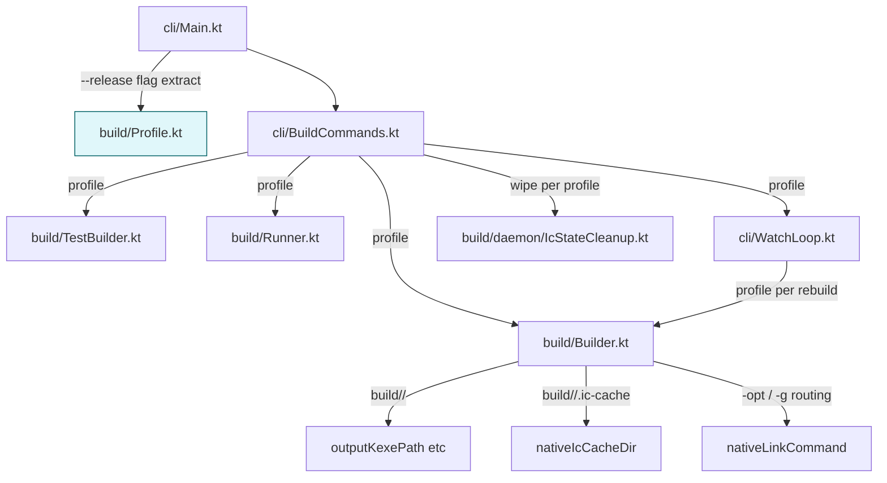
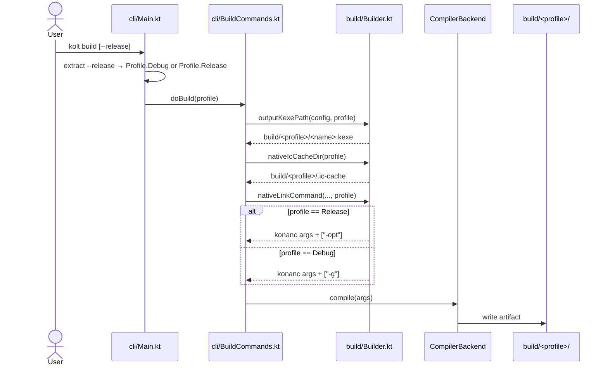

# Technical Design: release-build-profile

## Overview

This feature adds a Cargo-style `--release` opt-in build profile to kolt. The default profile is `debug`; users opt into release by adding `--release` to any of the four build-driving commands (`kolt build`, `kolt test`, `kolt run`, `kolt check`). On Native targets the profile routes optimization (`-opt`) and debug-info (`-g`) flags to konanc, partitions kolt-managed artifact output into `build/<profile>/`, and partitions the local Native incremental-compile cache into `build/<profile>/.ic-cache`. On JVM targets the flag is a declared no-op: identical kotlinc invocation, identical IC store path, identical artifact bytes. `scripts/assemble-dist.sh` is switched to release so distributed binaries are unambiguously release-built. ADR 0030 documents the policy.

**Users**: kolt users running daily Native iteration loops (debug profile) and kolt maintainers / CI cutting distribution tarballs (release profile).

**Impact**: Native build pipeline grows a `Profile` parameter threaded from CLI flag-parsing through path computation and konanc arg assembly. JVM build pipeline accepts the parameter for type-uniformity but ignores it. Existing `~/.kolt/daemon/ic/` JVM daemon IC layout is unchanged. Pre-existing `build/.ic-cache` is replaced by `build/<profile>/.ic-cache`; pre-v1 policy means no migration shim — users wipe `build/` after upgrade.

### Goals

- Cargo-style `--release` opt-in accepted by all four build-driving commands.
- Native compile differentiates release (`-opt`, no `-g`) from debug (no `-opt`, `-g`).
- Native artifact output and Native IC cache partitioned per profile.
- JVM `--release` is a typed no-op: same artifact bytes, same IC path, no warning.
- `scripts/assemble-dist.sh` produces release-built distribution artifacts.
- ADR 0030 codifies the policy and documents the JVM no-op rationale.

### Non-Goals

- `kolt.toml [profile.dev]` / `[profile.release]` configuration sections.
- JVM reproducibility profile (epoch-zero timestamps, IC bypass).
- Pass-through compiler flags (`extra_compiler_args` and similar).
- Profile-aware behavior on macOS / linuxArm64 (deferred to #82 / #83).
- Behavior of `--release` on non-build commands (`init`, `add`, `deps`, `fmt`, `toolchain`, `daemon`).
- Migration of pre-existing `build/.ic-cache` content (pre-v1 policy).

## Boundary Commitments

### This Spec Owns

- The `Profile` type and its threading through `kolt.cli` and `kolt.build` modules.
- CLI parsing of `--release` and the rule that profile is determined solely from the command line.
- Native compile-arg routing (`-opt`, `-g`) per profile.
- kolt-managed artifact path layout under `build/<profile>/`.
- Native IC cache path layout under `build/<profile>/.ic-cache`.
- JVM target's no-op contract: identical kotlinc args, identical `~/.kolt/daemon/ic/` path, identical artifact bytes regardless of `--release` presence.
- `scripts/assemble-dist.sh` profile selection.
- ADR 0030 (`docs/adr/0030-build-profiles.md`) and documentation updates in README.md, README.ja.md, CLAUDE.md, `.kiro/steering/tech.md`, `.claude/skills/kolt-usage/SKILL.md`.
- A drift-guard test asserting `Profile.Debug.dirName == "debug"` and `Profile.Release.dirName == "release"` match `assemble-dist.sh`.

### Out of Boundary

- `kolt.toml` schema (no profile sections).
- JVM daemon's `~/.kolt/daemon/ic/` layout (unchanged).
- Daemon wire protocol shape (no `Profile` field added to `Compile` / `NativeCompile` messages).
- Cleanup or migration of stale pre-feature IC caches at `build/.ic-cache`.
- Profile semantics for macOS / linuxArm64 targets.
- A `kolt clean` command (does not exist today; out of scope).

### Allowed Dependencies

- `kolt.build.daemon` and `kolt.build.nativedaemon` modules (existing): receive `Profile` only through paths and konanc args, not as wire fields.
- `kolt.config.KoltPaths` (existing): keeps JVM `daemonIcDir` shape unchanged; no profile suffix added on this property.
- `kolt.config.Config.BuildSection` (existing): no fields added; profile is CLI-only.
- `DriftGuardsTest.kt` (existing): may grow one new assertion.

### Revalidation Triggers

- A future addition of `kolt.toml [profile.*]` sections would require revalidating CLI precedence rules and `Config.BuildSection` shape.
- Adding macOS / linuxArm64 targets (#82 / #83) would force re-checking whether the `build/<profile>/` layout still applies (host triple may need to layer in: `build/<profile>/<target>/`).
- Promoting `Profile` from a CLI-only concept to a wire-protocol field would require a `kolt.daemon.wire` and `kolt.nativedaemon.protocol` review.
- Introducing a JVM reproducibility profile would invalidate the JVM no-op contract; it must land as an ADR addendum, not a quiet behavior change.

## Architecture

### Existing Architecture Analysis

The build pipeline is a linear top-down chain: `kolt.cli.Main` extracts kolt-level flags → dispatches to `BuildCommands.do{Build,Test,Run,Check}` → calls `kolt.build.Builder` for path computation and command assembly → invokes `CompilerBackend` (daemon or subprocess) with the assembled args.

- `Builder.kt` holds path consts (`BUILD_DIR = "build"`, `NATIVE_IC_CACHE_DIR = "$BUILD_DIR/.ic-cache"`) and stateless command-builder functions.
- Wire protocols are path-agnostic: `NativeCompile(args: List<String>)` ferries konanc argv; JVM `Compile(workingDir, classpath, sources, outputPath, ...)` carries client-computed paths.
- Watch loop (`WatchLoop.kt`) does not cache paths; each rebuild re-evaluates path-computation functions.
- JVM IC layout in `~/.kolt/daemon/ic/<kotlinVersion>/<projectIdHash>/` is owned by the JVM daemon (`IcStateLayout.workingDirFor`) and reached client-side via `KoltPaths.daemonIcDir`.

### Architecture Pattern & Boundary Map

Pattern: **parameter threading**. A new closed enum `Profile` is added at the CLI boundary and threaded down through every function that currently consumes `BUILD_DIR` or `NATIVE_IC_CACHE_DIR`. No new abstractions, adapters, or wire fields. Type system enforces complete coverage at compile time.



**Architecture integration**:
- Pattern: parameter threading on a closed enum (smallest change satisfying all 7 requirements).
- Boundary: `Profile` lives in `kolt.build`; `kolt.cli` constructs it from flags and passes through; `kolt.build.daemon` / `kolt.build.nativedaemon` consume it only via paths and args.
- Existing patterns preserved: cli → build dependency direction, sealed-ADT-over-flags style not applicable (only two states); enum is sufficient and Cargo-aligned.
- New components rationale: only one new file (`Profile.kt`); everything else extends in place.
- Steering compliance: `Result<V, E>` does not apply (profile parsing is total — `--release` either present or absent); ADR 0001 unchanged.

### Technology Stack

| Layer | Choice / Version | Role in Feature | Notes |
|-------|------------------|-----------------|-------|
| CLI | Kotlin/Native (linuxX64) | `--release` parsing, profile dispatch | No new dep; reuses `koltLevel.contains(...)` style |
| Build orchestration | Kotlin/Native | Path computation, command assembly with `Profile` arg | Functions extended in `Builder.kt`, `TestBuilder.kt`, `Runner.kt` |
| Native compiler driver | konanc (Kotlin 2.3.x) | Receives `-opt` and `-g` per profile | Both flags are stable konanc CLI options |
| JVM compiler driver | kotlinc (Kotlin 2.3.x) | Unchanged; `Profile` ignored on JVM path | Required to satisfy JVM no-op contract |
| Distribution script | Bash (`scripts/assemble-dist.sh`) | Invokes `kolt build --release` for self-host JARs and the root native binary | Single source of truth for distribution profile |
| Documentation | Markdown (ADR 0030 + 5 user-facing files) | Codifies the policy | New file: `docs/adr/0030-build-profiles.md` |

## File Structure Plan

### New files

```
src/nativeMain/kotlin/kolt/build/
└── Profile.kt                          # enum class Profile { Debug, Release } + dirName

src/nativeTest/kotlin/kolt/build/
└── ProfileTest.kt                      # enum invariants, dirName mapping

docs/adr/
└── 0030-build-profiles.md              # NEW ADR
```

### Modified files

- `src/nativeMain/kotlin/kolt/build/Builder.kt` — `outputKexePath`, `outputJarPath`, `outputRuntimeClasspathPath`, `outputNativeTestKexePath` gain `profile: Profile`; `NATIVE_IC_CACHE_DIR` const replaced by `nativeIcCacheDir(profile: Profile)` function; `nativeLibraryCommand` and `nativeLinkCommand` gain `profile: Profile` (link stage routes `-opt` and `-g`). `checkCommand` does not need a `profile` parameter — its kotlinc args are profile-independent and Req 3.1 (JVM same bytes) holds trivially without threading.
- `src/nativeMain/kotlin/kolt/build/TestBuilder.kt` — `testBuildCommand` gains `profile: Profile` (JVM no-op).
- `src/nativeMain/kotlin/kolt/build/Runner.kt` — `nativeRunCommand` and `runCommand` gain `profile: Profile` so they reach the profile-aware path functions.
- `src/nativeMain/kotlin/kolt/build/daemon/IcStateCleanup.kt` — `wipeNativeIcCache` and any cleanup helper that touches `BUILD_DIR/.ic-cache` gain `profile: Profile`. Note: this file's existing `daemonIcDir` traversal (JVM IC) is **unchanged**.
- `src/nativeMain/kotlin/kolt/cli/Main.kt` — adds `RELEASE_FLAG = "--release"` constant; extracts profile from kolt-level args; passes `Profile` to each entry function.
- `src/nativeMain/kotlin/kolt/cli/BuildCommands.kt` — `doBuild`, `doCheck`, `doTest`, `doRun` gain `profile: Profile` parameter; `wipeNativeIcCache` call site updated.
- `src/nativeMain/kotlin/kolt/cli/WatchLoop.kt` — threads `profile` through rebuild calls (Native and JVM paths).
- `src/nativeTest/kotlin/kolt/build/BuilderTest.kt` — existing assertions on `-Xic-cache-dir=build/.ic-cache` updated to `-Xic-cache-dir=build/debug/.ic-cache` (and add a release variant).
- `src/nativeTest/kotlin/kolt/build/TestBuilderTest.kt` — existing assertion on `build/classes:...` classpath updated to use the debug-profile output path; add a release-profile no-op test.
- `src/nativeTest/kotlin/kolt/build/nativedaemon/NativeDaemonBackendTest.kt` — same `-Xic-cache-dir` update.
- `src/nativeTest/kotlin/kolt/nativedaemon/wire/FrameCodecTest.kt` — same `-Xic-cache-dir` update (string fixture in wire-codec test).
- `src/nativeTest/kotlin/kolt/build/daemon/IcStateCleanupTest.kt` — confirms JVM `daemonIcDir` cleanup unchanged; adds Native cleanup test for both profiles.
- `src/nativeTest/kotlin/kolt/cli/BuildCommandsTest.kt` — adds tests for `Profile` extraction, debug/release dispatch, and JVM no-op assertion (same args + same IC path).
- `src/nativeTest/kotlin/kolt/build/DriftGuardsTest.kt` — adds the 4th drift assertion (`Profile.dirName` literals match `assemble-dist.sh` invocation).
- `scripts/assemble-dist.sh` — line 120 changes from `"$KOLT" build` to `"$KOLT" build --release`; line 218 changes `ROOT_KEXE="$ROOT_DIR/build/kolt.kexe"` to `ROOT_KEXE="$ROOT_DIR/build/release/kolt.kexe"`; daemon JAR paths at lines 228-229 unchanged (JVM daemon `kolt.toml`s do not need `--release`; design decision below).
- `kolt-jvm-compiler-daemon/kolt.toml`, `kolt-native-compiler-daemon/kolt.toml` — kept unchanged for now. The daemon `kolt.toml`s are JVM apps and JVM is no-op; their `kolt build` invocation in `assemble-dist.sh` does not need `--release` to satisfy Req 6 (release tarball semantics). However, for consistency and future-proofing (if any of these gain a Native target), `assemble-dist.sh` will pass `--release` to all three sub-builds. **Design decision**: pass `--release` uniformly to keep the script's intent explicit.
- `README.md`, `README.ja.md` — update build command examples to mention `--release` and the `build/<profile>/` layout.
- `CLAUDE.md` — add a one-line "Profiles" entry under Key Rules pointing at ADR 0030.
- `.kiro/steering/tech.md` — add `--release` to the User-facing CLI snippet.
- `.claude/skills/kolt-usage/SKILL.md` — update build/test/run/check command examples; add a brief profile section.

## System Flows



Key flow decisions:
- Profile is computed once at the CLI boundary; downstream code never re-derives it.
- Watch loop (`WatchLoop.kt`) inherits the profile of the initial invocation; profile cannot change mid-loop (no `--release` toggle while watching). Cancel and re-invoke to switch.
- JVM target paths (when applicable; library targets land via #21) thread the profile through but the JVM-side computations ignore it: the same `~/.kolt/daemon/ic/...` and same kotlinc args result.

## Requirements Traceability

| Requirement | Summary | Components | Interfaces | Flows |
|-------------|---------|------------|------------|-------|
| 1.1 | debug default | `Main.kt`, `Profile` | profile extraction returns `Profile.Debug` when `--release` absent | top sequence |
| 1.2 | release on `--release` | `Main.kt`, `Profile` | profile extraction returns `Profile.Release` when present | top sequence |
| 1.3 | flag positioning | `Main.kt` | extracted by `koltLevel.contains(RELEASE_FLAG)` like `--no-daemon` | — |
| 1.4 | CLI-only profile | no `Config` change | `BuildSection` schema unchanged | — |
| 2.1 | debug omits `-opt` | `Builder.nativeLinkCommand` | conditional arg append | sequence (Debug branch) |
| 2.2 | release adds `-opt` | `Builder.nativeLinkCommand` | conditional arg append | sequence (Release branch) |
| 2.3 | debug includes `-g` | `Builder.nativeLinkCommand` | conditional arg append | sequence (Debug branch) |
| 2.4 | release omits `-g` | `Builder.nativeLinkCommand` | conditional arg append | sequence (Release branch) |
| 3.1 | JVM same bytes | `Builder.checkCommand`, `TestBuilder.testBuildCommand` | `checkCommand` is profile-independent by signature; `testBuildCommand` accepts profile and ignores it | — |
| 3.2 | JVM no warning | (negative requirement; verified by test) | — | — |
| 3.3 | JVM same IC path | `KoltPaths.daemonIcDir` unchanged; `IcStateLayout` unchanged | — | — |
| 4.1 | debug under `build/debug/` | `outputKexePath(config, Debug)`, `outputJarPath(config, Debug)`, `outputRuntimeClasspathPath`, `outputNativeTestKexePath` | path string composition | sequence |
| 4.2 | release under `build/release/` | same as 4.1 with `Profile.Release` | path string composition | sequence |
| 4.3 | both coexist | emergent; integration test | — | — |
| 4.4 | no precondition | `ensureDirectoryRecursive` (already idempotent post-#272) | — | — |
| 5.1 | debug IC under `build/debug/.ic-cache` | `nativeIcCacheDir(Debug)` | path composition | sequence |
| 5.2 | release IC under `build/release/.ic-cache` | `nativeIcCacheDir(Release)` | path composition | sequence |
| 5.3 | alternation preserves IC | emergent; integration test | — | — |
| 5.4 | recreate idempotent | `ensureDirectoryRecursive` | — | — |
| 6.1 | dist defaults to release | `assemble-dist.sh` line 120 | invokes `kolt build --release` | — |
| 6.2 | single source of truth | `assemble-dist.sh` only profile knob | — | — |
| 6.3 | tarball is release-built | tarball assembly reads from `build/release/` | — | — |
| 7.1 | README updates | `README.md`, `README.ja.md` | doc | — |
| 7.2 | CLAUDE/steering updates | `CLAUDE.md`, `.kiro/steering/tech.md` | doc | — |
| 7.3 | `kolt-usage` skill update | `.claude/skills/kolt-usage/SKILL.md` | doc | — |
| 7.4 | ADR 0030 published | `docs/adr/0030-build-profiles.md` | doc | — |

## Components and Interfaces

### kolt.build

#### Profile (NEW)

| Field | Detail |
|-------|--------|
| Intent | Closed enum representing the two build profiles, with a single `dirName` member used in path composition. |
| Requirements | 1.1, 1.2, 4.1, 4.2, 5.1, 5.2 |

**Responsibilities & Constraints**

- Provide exactly two values (`Debug`, `Release`) and a stable `dirName` per value (`"debug"`, `"release"`).
- Be the single source of truth for profile literals; `assemble-dist.sh` and any future drift guard read these names.
- No I/O, no fallible construction.

**Dependencies**: none.

**Contracts**: State [x]

**State Management**

- Stateless. Acts as a typed token.

```kotlin
internal enum class Profile(val dirName: String) {
  Debug(dirName = "debug"),
  Release(dirName = "release"),
}
```

**Implementation Notes**

- Integration: imported by every modified file that currently uses `BUILD_DIR` or `NATIVE_IC_CACHE_DIR`.
- Risks: enum exhaustiveness in `when` blocks is a compile-time guarantee; no runtime fallback path needed.

#### Builder (MODIFIED)

| Field | Detail |
|-------|--------|
| Intent | Compute profile-aware artifact paths and konanc/kotlinc command lines. |
| Requirements | 2.1, 2.2, 2.3, 2.4, 3.1, 4.1, 4.2, 5.1, 5.2 |

**Responsibilities & Constraints**

- All path-producing functions take `profile: Profile`; the const `BUILD_DIR` remains as a base, and per-profile paths are composed as `"$BUILD_DIR/${profile.dirName}/..."`.
- `NATIVE_IC_CACHE_DIR` const is removed; replaced by `nativeIcCacheDir(profile: Profile): String`.
- Native link stage emits `-opt` if and only if `profile == Release`; emits `-g` if and only if `profile == Debug`. Native library stage stays profile-agnostic (klibs are intermediate, no opt/debug-info impact).
- `outputJarPath` accepts `profile` for path composition. `checkCommand` is profile-independent by signature (no path computation, no IC, no compiler-arg branching). On the JVM compile path the byte-equality contract (Req 3.1) holds trivially because the active profile never reaches the kotlinc arg builder.

**Dependencies**: `kolt.build.Profile` (Inbound, P0).

**Contracts**: Service [x]

```kotlin
internal fun outputKexePath(config: KoltConfig, profile: Profile): String
internal fun outputJarPath(config: KoltConfig, profile: Profile): String
internal fun outputRuntimeClasspathPath(config: KoltConfig, profile: Profile): String
internal fun outputNativeTestKexePath(config: KoltConfig, profile: Profile): String
internal fun nativeIcCacheDir(profile: Profile): String
internal fun nativeLibraryCommand(..., profile: Profile): Command
internal fun nativeLinkCommand(..., profile: Profile): Command
internal fun checkCommand(...): Command  // profile-independent, no parameter
```

**Implementation Notes**

- The `-opt` / `-g` routing is a single `when (profile)` branch in `nativeLinkCommand`. Add ADR 0030 reference comment per the project's "ADR citations in code" convention.
- Risks: existing tests assert `build/.ic-cache` and `build/<name>.kexe` literals; they all need profile suffix updates.

### kolt.cli

#### Main (MODIFIED)

| Field | Detail |
|-------|--------|
| Intent | Parse `--release` from kolt-level args, construct `Profile`, dispatch to entry functions. |
| Requirements | 1.1, 1.2, 1.3 |

**Responsibilities & Constraints**

- Add `private const val RELEASE_FLAG = "--release"`.
- Extract via `val profile = if (koltLevel.contains(RELEASE_FLAG)) Profile.Release else Profile.Debug`.
- Filter `RELEASE_FLAG` out of `filteredArgs` so it does not leak into subcommand args.
- Pass `profile` to every entry function in the dispatcher.

**Dependencies**: `kolt.build.Profile` (Inbound, P0); `kolt.cli.BuildCommands` (Outbound, P0).

**Contracts**: Service [x]

#### BuildCommands (MODIFIED)

| Field | Detail |
|-------|--------|
| Intent | Orchestrate the four build-driving commands with profile awareness. |
| Requirements | 1.1, 1.2, 5.1, 5.2 (via `wipeNativeIcCache`) |

**Responsibilities & Constraints**

- `doBuild`, `doCheck`, `doTest`, `doRun` each take `profile: Profile` as their first added parameter (after the existing required arguments).
- All call sites of `outputKexePath`, `outputJarPath`, `nativeIcCacheDir`, `wipeNativeIcCache`, `nativeLinkCommand`, `nativeLibraryCommand`, `testBuildCommand` pass `profile` through. `checkCommand` is exempt (profile-independent by signature).
- Native IC retry-on-failure path (`wipeNativeIcCache`) wipes the **active profile's** IC dir only; the inactive profile's IC is preserved.

**Dependencies**: `kolt.build.Builder`, `kolt.build.daemon.IcStateCleanup` (Outbound, P0).

**Contracts**: Service [x]

#### WatchLoop (MODIFIED)

| Field | Detail |
|-------|--------|
| Intent | Re-run builds on file changes with the profile fixed at watch-loop start. |
| Requirements | 1.1, 1.2 (extension) |

**Responsibilities & Constraints**

- Thread `profile` through the rebuild closure. Profile cannot change mid-loop; users cancel and re-invoke to switch.
- No new branches; existing rebuild path delegates to `BuildCommands.doBuild` etc. with the captured `profile`.

**Dependencies**: `kolt.cli.BuildCommands` (Outbound, P0).

**Contracts**: Service [x]

### kolt.build.daemon

#### IcStateCleanup (MODIFIED)

| Field | Detail |
|-------|--------|
| Intent | Wipe Native IC cache on retry; unchanged for JVM `~/.kolt/daemon/ic/` cleanup. |
| Requirements | 5.1, 5.2, 5.3, 5.4 |

**Responsibilities & Constraints**

- `wipeNativeIcCache(profile: Profile)` removes `build/<profile>/.ic-cache/` only.
- Existing JVM IC reaper logic (`~/.kolt/daemon/ic/<v>/<id>/` traversal) is **untouched** — Req 3.3 demands JVM stays on the same path.

**Dependencies**: `kolt.build.Profile`, `kolt.config.KoltPaths` (Inbound, P0).

**Contracts**: Service [x]

## Data Models

No data model changes. `Config.BuildSection` schema is unchanged. Wire protocols (`Compile`, `NativeCompile`) are unchanged. The only new "data" is the `Profile` enum, which is a typed token.

## Error Handling

- `--release` is a presence/absence flag. Parsing cannot fail.
- Unknown flags after extraction (e.g., a misspelled `--realease`) are passed to subcommands and surface their existing unknown-flag errors. No new error envelope is introduced.
- Native compile failures continue to flow through `Result<V, NativeCompileFailure>`. The retry path that wipes IC cache (`BuildCommands.kt:577`) operates on the active profile only; if the wipe also fails, the existing error path returns to the caller.
- ADR 0030 documents that `-Xkonan-data-dir` and other konanc flags are unchanged.

## Testing Strategy

### Unit Tests (mirrored against requirements)

- `ProfileTest.kt` — enum invariants: exactly two values, stable `dirName` strings (`"debug"`, `"release"`).
- `BuilderTest.kt` (extended) — `outputKexePath(_, Debug)` returns `build/debug/<name>.kexe`; `outputKexePath(_, Release)` returns `build/release/<name>.kexe`. Same matrix for `outputJarPath`, `outputRuntimeClasspathPath`, `outputNativeTestKexePath`, `nativeIcCacheDir`. Covers Req 4.1, 4.2, 5.1, 5.2.
- `BuilderTest.kt` (extended) — `nativeLinkCommand(_, Debug).args` contains `"-g"` and does not contain `"-opt"`. `nativeLinkCommand(_, Release).args` contains `"-opt"` and does not contain `"-g"`. Covers Req 2.1, 2.2, 2.3, 2.4.
- `BuilderTest.kt` (extended) — `checkCommand` args are profile-independent by signature, verified by the absence of profile branching in the function body. The JVM end-to-end byte equality is covered separately by `BuildProfileIT.jvmReleaseBuildProducesIdenticalCompileOutputBytes`.
- `TestBuilderTest.kt` (extended) — `testBuildCommand(_, Debug)` and `testBuildCommand(_, Release)` produce identical args. Covers Req 3.1.
- `BuildCommandsTest.kt` (extended) — verifies `Main.kt`'s `--release` extraction routes through to `doBuild(Profile.Release)`; absence routes to `doBuild(Profile.Debug)`. Covers Req 1.1, 1.2.
- `DriftGuardsTest.kt` (extended) — asserts `Profile.Debug.dirName == "debug"` and `Profile.Release.dirName == "release"` and that `assemble-dist.sh` contains `kolt build --release`. Covers indirect drift coverage.

### Integration Tests

- New: `BuildProfileIT.kt` (or similar in `src/nativeTest/kotlin/kolt/cli/`) — runs `kolt build` and `kolt build --release` against a fixture project; asserts both produce a `.kexe` under their respective `build/<profile>/` directories. Covers Req 4.3.
- New: profile-alternation IC test — runs debug, then release, then debug again; asserts no IC invalidation across profile switches. Covers Req 5.3.
- Existing JVM tests (`BuildCommandsTest.kt`, integration paths) extended with one assertion: `--release` on JVM produces identical compile args and identical `~/.kolt/daemon/ic/` working dir as the same invocation without `--release`. Covers Req 3.3.

### E2E Tests

- `self-host-post` CI job (existing) re-runs against the new `assemble-dist.sh`. Verifies tarball assembly succeeds with `kolt build --release` and that the resulting binary launches. Covers Req 6.1, 6.3.

### Performance / regression tests

- Out of scope for this design. Issue #261's debug-default rationale (faster iteration) is observable but not benchmarked here; #88 / #90 own performance tracking.

## Migration Strategy

Pre-v1 policy applies: no migration shims, no compatibility probes.

- Stale `build/.ic-cache` directories from pre-feature kolt versions are abandoned. The release note for the version shipping this feature instructs users to `rm -rf build/` if mixed-profile artifacts cause confusion.
- `~/.kolt/daemon/ic/` JVM IC store is unchanged.
- `assemble-dist.sh` switching from default to `--release` may briefly leave dual artifact roots (`build/` and `build/release/`) in dev workspaces; harmless.

## Supporting References

- `research.md` — gap analysis findings, design synthesis, and resolution of issue #261's `~/.kolt/daemon/ic/` schema misattribution.
- `docs/adr/0030-build-profiles.md` (to be authored as part of this feature) — codifies the policy, captures the JVM no-op rationale verbatim from Req 7.4, and records the discrepancy resolution.
- ADR 0019 (incremental compile), ADR 0027 (runtime classpath manifest) — load-bearing prior decisions; both verified compatible with profile partition.
