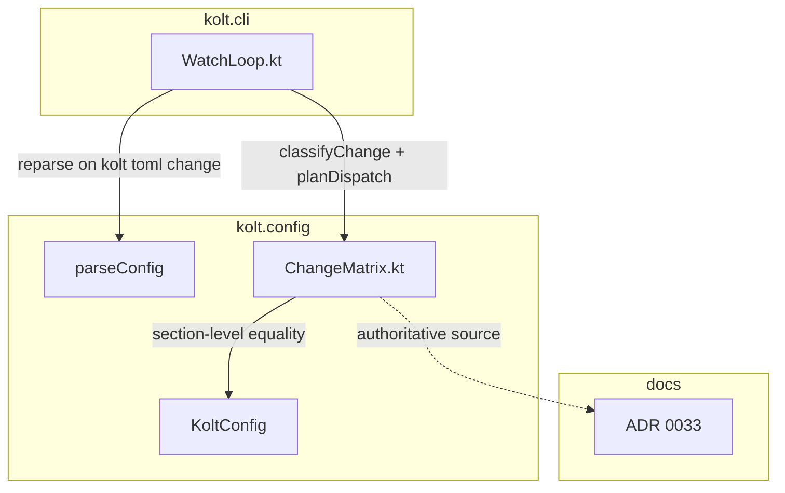
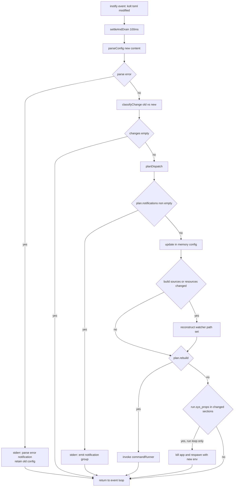
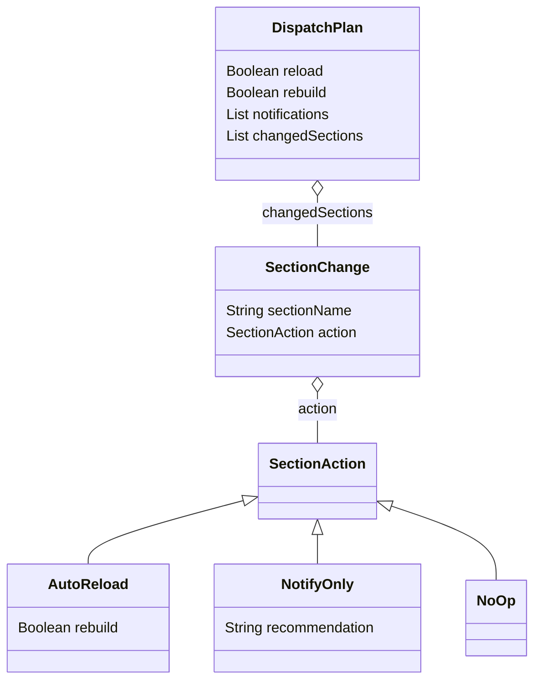

# Design Document: toml-change-handling

## Overview

**Purpose**: kolt.toml の編集を section 単位で観測可能・予測可能な action にマッピングする mechanism を導入する。 watch 経路の silent failure (stale config での rebuild、 通知なしの無視) を解消し、 per-invocation 経路の現状挙動を ADR で公式化する。

**Users**: kolt の contributor (主) と将来の kolt user。 watch 中の kolt.toml 編集が即時に「auto reload / 通知のみ / no-op」 のいずれかに分類されることで、 「いま何が反映されたか」が予測できる。

**Impact**: 既存 `WatchLoop.kt` の event handler を拡張し、 純粋関数モジュール `kolt.config.ChangeMatrix` を新規追加。 daemon protocol、 非 watch コマンド、 既存の watch (kolt.toml を編集しない) には影響なし。

### Goals
- 9 Requirement を satisfy
- ChangeMatrix を pure function に切り出し、 matrix セル単位 test を unit test 範囲で実現 (Req 8.13)
- ADR 0033 を発行し matrix を docs として authoritative にする
- 通知 marker を既存 rebuild status と区別

### Non-Goals
- daemon protocol への config-changed message 追加 (α1)
- IDE/LSP 連携 auto-resync
- `kolt deps remove` 実装 (γ2)
- watch loop の inotify integration test 基盤 (defer)
- 暗黙の Maven Central / daemon restart (β3)

## Boundary Commitments

### This Spec Owns
- ADR 0033 "kolt.toml change-handling model" — per-invocation matrix と watch matrix の authoritative document
- `kolt.config.ChangeMatrix` module — SectionAction taxonomy、 section diff、 dispatch plan の pure function
- WatchLoop.kt の change-handling 部分 — kolt.toml 変更検知後の reparse → classify → dispatch (通知 / reload / rebuild / app respawn) のフロー
- per-invocation matrix の docs 化 — `docs/architecture.md` への参照節追加

### Out of Boundary
- daemon protocol 変更 (恒久 out, α1)
- 非 watch コマンドのコード変更 (現状追認のみ、 ADR で文書化)
- `kolt deps remove` 実装 (γ2 follow-up)
- watch 中の暗黙 Maven Central アクセス (β3)
- inotify-driven integration test 基盤 (本 spec scope 外、 ChangeMatrix unit test + 手動 smoke で覆う)

### Allowed Dependencies
- `kolt.config.KoltConfig` data class とその section data classes (auto-generated equality を使用)
- `kolt.config.parseConfig()` 関数 (既存 entry point、 `Result<KoltConfig, ConfigError>`)
- `kotlin-result` 2.3.x (既存 stack、 ADR 0001)
- 依存方向は **kolt.cli → kolt.config** (既存方向に整合)、 ChangeMatrix から cli への逆依存は禁止

### Revalidation Triggers
- kolt.toml schema 拡張 (新 section 追加) → ChangeMatrix の matrix table 更新が必須 (Req 8.11 maintenance clause)
- `KoltConfig` data class 構造変更 → `classifyChange` の section diff logic の整合性確認
- ADR 0019 (BTA-driven IC) の方針変更 → α1 (daemon stateless) 前提が崩れる場合に再検討
- WatchLoop の event handler を非同期化 → 構造的 build-serialization 前提が崩れるため explicit in-flight flag を再検討

## Architecture

### Existing Architecture Analysis

`WatchLoop.kt` (line 164: `watchCommandLoop`、 line 278: `watchRunLoop`) は inotify event を polling し、 kolt.toml 変更を line 111 で検知すると `commandRunner` lambda を **synchronous** に call する。 event handler は blocking で、 OS が inotify event を serialize、 `commandRunner` 中の event は kernel inotify buffer に保留される。 既存 `settleAndDrain` (line 150) が 100ms debounce window を提供。

`KoltConfig` (Config.kt:92) は `@Serializable data class` で、 Kotlin の auto-generated equality がそのまま section diff に使える。 `parseConfig()` (Config.kt:388) は副作用なしの pure function で `Result<KoltConfig, ConfigError>` を返す。

非 watch 経路は `loadProjectConfig()` (BuildCommands.kt:242-256) を 11+ 箇所から呼び出し、 invocation 毎に fresh load。 Req 1 (per-invocation matrix) は構造的に既に成立済で、 本 spec は ADR 文書化のみ。

### Architecture Pattern & Boundary Map



**Architecture Integration**:
- Selected pattern: **Pure-function classifier + thin event handler integration**。 既存 WatchLoop.kt の handler を拡張し、 section 分類 logic は kolt.config.ChangeMatrix に切り出す
- Domain boundaries: ChangeMatrix は KoltConfig のみに依存し、 watch / build / cli の可変状態に依存しない pure function
- Existing patterns preserved: `Result<V, E>`、 sealed class for ADTs (SectionAction)、 data class equality、 stderr via `eprintln`、 既存 `--- text ---` rebuild marker は変更せず通知のみ新 marker (`[watch] ⚠`) を使用
- New components rationale: ChangeMatrix を kolt.config 配下にすることで (1) section 分類は config の知識として整合、 (2) WatchLoop 責務肥大化を回避、 (3) matrix セル単位 test を unit test 範囲で実現、 (4) 将来 IDE/LSP 統合等での reuse に対応
- Steering compliance: ADR 0001 (Result)、 product.md "predictable / fewer features"、 tech.md kolt.config パッケージ責務

### Technology Stack

| Layer | Choice / Version | Role | Notes |
|---|---|---|---|
| CLI | Kotlin/Native (linuxX64) | watch loop event handler 拡張 | 既存 WatchLoop.kt |
| Config | ktoml-core | kolt.toml parsing | 既存 parseConfig、 変更なし |
| Domain | Kotlin sealed class + data class | SectionAction taxonomy + diff | 新規 kolt.config.ChangeMatrix |
| Error | kotlin-result 2.3.x | parse failure handling | 既存 stack |
| Output | stdlib `eprintln` | stderr 通知出力 | 既存 helper |

新規 dependency なし。 既存 stack で完結。

## File Structure Plan

### New Files
```
src/nativeMain/kotlin/kolt/config/
└── ChangeMatrix.kt
    # SectionAction sealed class (AutoReload/NotifyOnly/NoOp)
    # SectionChange data class
    # DispatchPlan data class
    # classifyChange(old, new) function
    # planDispatch(changes) function
    # internal section→action matrix table
    # NOTIFICATION_MARKER constant ("[watch] ⚠")

src/nativeTest/kotlin/kolt/config/
└── ChangeMatrixTest.kt
    # table-driven test per matrix cell (Req 8.13)
    # tests for: classifyChange idempotency, NoOp short-circuit,
    #   notify-only-prevails in mixed window, formatted notification lines

docs/adr/
└── 0033-kolt-toml-change-handling-model.md
    # Status / Date / Summary / Context / Decision / Matrices / Rationale /
    # Alternatives / Related — follows ADR 0032 structure
```

### Modified Files
- `src/nativeMain/kotlin/kolt/cli/WatchLoop.kt` — event handler 拡張: kolt.toml 変更検知時に `parseConfig` で reparse、 失敗時は通知 + retain old config; 成功時は `classifyChange` + `planDispatch` を呼び、 plan に従って (a) 通知出力、 (b) in-memory `KoltConfig` 更新、 (c) `[build.sources]` / `[build.resources]` 変化時に watcher path 再構築、 (d) `commandRunner` 起動 を実行。 `watchRunLoop` は追加で `[run.sys_props]` 変更時の running app respawn を行う。 既存 `--- change detected, rebuilding ---` は auto-reload + rebuild ケースのみ流す
- `docs/architecture.md` — "Configuration change semantics" 節を追加し ADR 0033 を参照

### Test File Updates
- `src/nativeTest/kotlin/kolt/cli/WatchLoopTest.kt` — 既存 `CollectWatchPathsTest` / `ShouldTriggerRebuildTest` は変更なし。 新規 integration-level test は本 spec scope 外 (Boundary 参照)。 主たる test カバレッジは ChangeMatrixTest.kt 側

## System Flows

### Watch loop change-handling pipeline



**Key decisions** (ダイアグラム外の補足):
- **Mixed-window prevails**: `HasNotify` ブランチが yes になると、 同時変更された AutoReload sections は **skip** される。 reload も rebuild も走らない。 user が notify-only sections の推奨アクションを取って watch を再起動した時点で、 fresh process の startup load で auto-reload sections も反映される (Req 4.6)
- **Build serialization**: handler が synchronous で `Invoke` から戻るまで次の inotify event は kernel buffer 保留。 explicit in-flight flag は不要 (Req 7.1〜7.3 が構造的に成立)
- **`[run.sys_props]` respawn (D-8 確定)**: `watchRunLoop` 専用の post-AutoReload step。 `plan.rebuild = false` かつ `plan.changedSections` に `run.sys_props` が含まれる時、 running app を kill して新 sysprops で respawn。 `watchCommandLoop` (build/test/check) ではこの step は no-op
- **Empty changes (Req 2.3)**: `classifyChange` が空 list を返すケース (file が touch されたが内容同一) は plan を組み立てる前に early return

## Requirements Traceability

| Req | Summary | Components | Interfaces / Behaviors | Flows |
|---|---|---|---|---|
| 1.1〜1.5 | Per-invocation matrix | (既存 `loadProjectConfig` 11+ 箇所) | ADR 0033 §per-invocation matrix で文書化 | (現状挙動) |
| 2.1〜2.5 | Watch detection + classification | WatchLoop event handler, `classifyChange`, `parseConfig` | reparse on event、 section-level diff、 parse 失敗時の retain | Watch pipeline |
| 3.1〜3.6 | Auto-reload dispatch | WatchLoop, `SectionAction.AutoReload(rebuild)`, `planDispatch` | rebuild flag による分岐、 watcher path reconstruct | Watch pipeline |
| 4.1〜4.6 | Notify-only dispatch + mixed-window prevail | WatchLoop, `SectionAction.NotifyOnly`, `planDispatch` | recommendation string、 mixed-window で reload/rebuild skip | Watch pipeline |
| 5.1〜5.2 | No-op dispatch | `SectionAction.NoOp` | reload/rebuild/通知 すべて skip | Watch pipeline |
| 6.1〜6.7 | Notification contract | WatchLoop 通知出力部, `planDispatch` の `notifications` field | 1 group / debounce window、 1 line / section、 stderr、 marker prefix `[watch] ⚠` | Watch pipeline |
| 7.1〜7.4 | Build serialization | WatchLoop event handler (synchronous) | 構造的に成立、 explicit flag なし | (handler が暗黙 serialize) |
| 8.1〜8.13 | ADR 0033 + taxonomy + matrices + tests | `docs/adr/0033-*`, ChangeMatrix, ChangeMatrixTest | matrix tables、 SectionAction 3-value、 cell-level acceptance test | (docs / test) |
| 9.1〜9.3 | Backward compatibility | 既存 watch (kolt.toml 不変ケース)、 非 watch コマンド、 daemon | code 変更なし、 regression test のみ | (touch しない) |

## Components and Interfaces

### kolt.config.ChangeMatrix

| Field | Detail |
|---|---|
| Intent | 2 つの `KoltConfig` の section-level diff を SectionAction (AutoReload/NotifyOnly/NoOp) に分類し、 dispatch plan を返す pure-function module |
| Requirements | 2.3, 2.4, 3.1〜3.6, 4.1〜4.6, 5.1〜5.2, 6.2, 8.2〜8.6, 8.13 |

**Responsibilities & Constraints**
- 2 つの `KoltConfig` を受け取って (a) 変更 section、 (b) 各 section の SectionAction、 (c) 全体 DispatchPlan を返す
- Domain boundary: kolt.config パッケージに閉じる pure function。 watch / build / cli / daemon に依存しない
- Data ownership: matrix table (section name → SectionAction) は本 module 内に encode、 ADR 0033 が docs 側のソース・オブ・トゥルース、 両者は手動同期 (maintenance clause で担保)
- Invariants: `classifyChange(c, c)` は空 list を返す (idempotency); `planDispatch(changes)` は changes に NotifyOnly が 1 つでもあれば `reload=false ∧ rebuild=false ∧ notifications.isNotEmpty()` を返す (mixed-window prevails)

**Dependencies**
- Inbound: `kolt.cli.WatchLoop` (P0, 唯一の consumer)
- Outbound: `kolt.config.KoltConfig` data classes (P0)
- External: なし

**Contracts**: Service [x] / API [ ] / Event [ ] / Batch [ ] / State [ ]

##### Service Interface

```kotlin
package kolt.config

sealed class SectionAction {
    data class AutoReload(val rebuild: Boolean) : SectionAction()
    data class NotifyOnly(val recommendation: String) : SectionAction()
    data object NoOp : SectionAction()
}

data class SectionChange(
    val sectionName: String,
    val action: SectionAction,
)

data class DispatchPlan(
    val reload: Boolean,
    val rebuild: Boolean,
    val notifications: List<String>,
    val changedSections: List<SectionChange>,
)

fun classifyChange(old: KoltConfig, new: KoltConfig): List<SectionChange>

fun planDispatch(changes: List<SectionChange>): DispatchPlan

const val NOTIFICATION_MARKER: String = "[watch] ⚠"
```

`classifyChange`:
- **Preconditions**: `old`, `new` ともに `parseConfig` を経た有効な `KoltConfig`
- **Postconditions**: 変更のあった section ごとに 1 つの `SectionChange` を返す。 `old == new` (data-class equality) の場合は空 list (Req 2.3)。 schema 上未知の section が出現した場合 (将来の schema 拡張で ChangeMatrix が未追従の場合) は `SectionAction.NotifyOnly("This section is not yet classified; please file an issue or update ChangeMatrix.kt")` の defensive fallback で 1 行返す (Req 2.4 silent ignore 禁止)
- **Invariants**: section 分類は ADR 0033 matrix table と 1:1 整合する

`planDispatch`:
- **Preconditions**: `changes` は `classifyChange` の出力 (空 list を含む)
- **Postconditions**:
  | 入力 | reload | rebuild | notifications | changedSections |
  |---|---|---|---|---|
  | 空 list | false | false | empty | empty |
  | 全 NoOp | false | false | empty | (NoOp sections) |
  | NotifyOnly を 1 つ以上含む | false | false | 非空 (notify-only sections の各 1 行) | (全 changes) |
  | NotifyOnly なし、 全 NoOp 以外で AutoReload(rebuild=true) を含む | true | true | empty | (全 changes) |
  | NotifyOnly なし、 全 NoOp 以外で AutoReload(rebuild=true) を含まない (e.g. `[run.sys_props]` のみ) | true | false | empty | (全 changes) |
- **Invariants**: `notifications.isNotEmpty()` ⇔ `reload=false ∧ rebuild=false` (notification は notify-only 経路の専有)

**Implementation Notes**
- Integration: `WatchLoop` が唯一の consumer。 ChangeMatrix から cli への逆依存禁止
- Validation: matrix table と section 分類の対応は table-driven `ChangeMatrixTest.kt` で網羅 (Req 8.13)
- Risks: 将来 kolt.toml schema が拡張された際、 matrix table 更新漏れ → defensive fallback で silent failure は回避するが notify-only 通知は実装 bug シグナル。 Req 8.11 の maintenance clause + ChangeMatrixTest の "schema-vs-matrix-coverage" assertion (matrix が `KoltConfig` の全 reflectable property をカバーしているかを test で assert する) で防御する

### kolt.cli.WatchLoop (拡張)

| Field | Detail |
|---|---|
| Intent | 既存の inotify event handler に kolt.toml change pipeline を組み込む |
| Requirements | 2.1〜2.5, 3.1〜3.6, 4.1〜4.6, 5.1〜5.2, 6.1〜6.7, 7.1〜7.4, 9.1 |

**Responsibilities & Constraints**
- kolt.toml 変更検知 → `parseConfig` → `classifyChange` → `planDispatch` のフロー駆動
- DispatchPlan に従った副作用実行 (通知出力、 in-memory config 更新、 watcher path 再構築、 `commandRunner` 起動、 run loop での app respawn)
- `commandRunner` の signature は変更しない (R-5 確認: rebuild skip は handler 側で `commandRunner` を call しないことで表現、 lambda 拡張は不要)
- 既存 `--- change detected, rebuilding ---` marker は auto-reload + rebuild ケースのみで出力。 notify-only / no-op では出さない
- event handler は **synchronous** を維持 (Req 7.1〜7.3 の構造的前提)

**Contracts**: Service [ ] / API [ ] / Event [ ] / Batch [ ] / State [x]

##### State Management
- **State model**: `currentConfig: KoltConfig` を loop 内 mutable variable として保持。 startup 時に 1 回 load、 AutoReload 経路で更新。 NotifyOnly 経路では更新せず retain
- **Persistence**: なし (in-memory のみ)
- **Concurrency**: handler synchronous により 1 シーケンシャル実行。 inotify event は kernel buffer に直列化される

**Implementation Notes**
- Integration: `kolt.config.ChangeMatrix` を import。 既存 `parseConfig` / `loadProjectConfig` も継続使用
- Validation: 通知出力フォーマットは `NOTIFICATION_MARKER` + section name + recommendation の 1 行。 既存 rebuild marker と区別される
- Risks: handler 同期実行を将来非同期化する場合は本 spec の構造的前提が崩れる → Revalidation Triggers に明記
- **Watcher 再構築は full rebuild**: AutoReload で `[build.sources]` / `[build.resources]` が変化した場合、 `collectWatchPaths(currentConfig)` を再実行 → 既存 `wdKinds` の全 wd を unregister (`inotify_rm_watch`) → 新 path 集合で `inotify_add_watch` し直して `wdKinds` を再構築する。 差分追加・差分削除の最適化は本 spec scope 外 (kolt の現実的な watch path 数では full rebuild が単純で安全、 race window で取りこぼす event の懸念も rebuild 自体が走るため fresh state に収束)
- **Run loop respawn 条件 (D-8 確定)**: `watchRunLoop` のみ、 以下 3 条件すべてを満たす場合に running app を kill + spawn:
  1. `plan.reload == true` (mixed-window prevail で reload=false のケースを除外)
  2. `plan.rebuild == false`
  3. `plan.changedSections.any { it.sectionName == "[run.sys_props]" }`
  
  この guard により、 `[run.sys_props]` + `[dependencies]` 同時変更 (mixed-window prevail で reload=false, rebuild=false) のケースでは respawn が走らない (β3 整合)。 一方 `[run.sys_props]` + `[build.sources]` 同時変更 (rebuild=true) では本 step は no-op となり、 通常の rebuild → app spawn フロー内で sysprops が反映される
- **rebuild 同時ケースの sysprops 引き継ぎ確認 (実装時 todo)**: `commandRunner` lambda が毎回 `currentConfig.run.sysProps` を fresh に参照しているか確認する。 startup 時 capture してそのまま使い回している場合は、 lambda signature を `commandRunner: (config: KoltConfig) -> Result<...>` 等に拡張するか、 mutable `currentConfig` reference を closure で参照する形に修正する

### docs/adr/0033-kolt-toml-change-handling-model.md (ADR)

| Field | Detail |
|---|---|
| Intent | matrix を docs として authoritative にする ADR。 ChangeMatrix.kt のソース・オブ・トゥルースは code、 ADR は人間可読版 |
| Requirements | 8.1〜8.12 |

**構成** (ADR 0032 を template):
- Status: `accepted`、 Date
- Summary: 5〜7 bullet (3-value taxonomy / per-invocation matrix / watch matrix / mixed-window prevail / build-serialize / α1 reaffirmation / `kolt deps remove` follow-up reference)
- Context: 現状の暗黙ルール混在、 #297 動機、 entry point 拡大前の matrix 確定の必要性
- Decision: SectionAction 3-value 定義、 per-invocation matrix table、 watch matrix table、 mixed-window prevail policy、 build-serialize policy、 daemon-stateless reaffirmation
- Rationale: 各 design call (α1 / β3 / Q1=B / γ2 / build-serialize / `[kotlin]` notify-only / mixed-window prevail) の理由を明記
- Maintenance clause: schema 拡張時の matrix 追記必須を明記 (Req 8.11)
- Alternatives: β1 (auto-resync) と α2 (daemon observation) の却下理由
- Related: #297, ADR 0019 (BTA-driven IC), ADR 0024 (Native daemon), spec design 文書

## Data Models

### Domain Model: SectionAction taxonomy



**Invariants**:
- `SectionAction` は 3 variant のみ (Req 8.2)
- `AutoReload(rebuild=true)` と `AutoReload(rebuild=false)` は data class equality で等価判定可能 (test fixture で利用)
- `NotifyOnly` の `recommendation` は user-facing 文字列、 `Run kolt deps install` / `Run kolt daemon stop --all and restart watch` / `Restart watch` のいずれか (matrix table 内で section ごとに定義)
- `DispatchPlan.notifications` の各文字列は `"${NOTIFICATION_MARKER} ${sectionName} changed; ${recommendation}"` の形。 `sectionName` は `SECTION_ACTIONS` キーをそのまま使い (例: `"name"`, `"[dependencies]"`, `"[kotlin] compiler"`)、 既に TOML-canonical な括弧を含むものは追加 wrap しない (二重括弧回避)

### Section → Action Matrix (draft for ADR 0033)

| Section | watch action | per-invocation 効果 |
|---|---|---|
| `name` | AutoReload(rebuild=true) | artifact 名変更; 次の build で適用 |
| `version` | AutoReload(rebuild=true) | artifact version 変更; 次の build で適用 |
| `kind` | NotifyOnly("Restart watch — kind change alters build pipeline") | build pipeline 変更; CLI 再起動で適用 |
| `[kotlin] compiler` | NotifyOnly("Run kolt daemon stop --all and restart watch") | daemon socket path 変更 |
| `[kotlin] version` | NotifyOnly("Run kolt daemon stop --all and restart watch") | language version 変更 |
| `[kotlin.plugins]` | NotifyOnly("Run kolt daemon stop --all and restart watch") | plugin set 変更 |
| `[build] target` | NotifyOnly("Restart watch — target change alters build pipeline") | jvm/native 切替 |
| `[build] jdk` | NotifyOnly("Restart watch — JDK pin change alters daemon process") | daemon JDK 変更 |
| `[build] main` | AutoReload(rebuild=true) | エントリポイント変更 |
| `[build] sources` | AutoReload(rebuild=true, watcher 再構築) | 監視 path 変更 |
| `[build] resources` | AutoReload(rebuild=true, watcher 再構築) | 監視 path 変更 |
| `[build.targets.<target>]` (含む全 sub-field) | NotifyOnly("Restart watch — per-target override changes are not yet auto-reloaded") | per-target override |
| `[fmt]` | NoOp | `kolt fmt` のみが consume、 watch では効果なし |
| `[dependencies]` | NotifyOnly("Run kolt deps install") | resolve 必要 |
| `[test-dependencies]` | NotifyOnly("Run kolt deps install") | resolve 必要 |
| `[repositories]` | NotifyOnly("Run kolt deps install") | resolve 必要 |
| `[[cinterop]]` | NotifyOnly("Restart watch — cinterop binding regeneration required") | binding 再生成 |
| `[classpaths.<name>]` | NotifyOnly("Run kolt deps install") | resolve 必要 |
| `[test.sys_props]` | AutoReload(rebuild=false) | 次の `kolt test` invocation で反映 |
| `[run.sys_props]` | AutoReload(rebuild=false) | run loop 専用: app respawn |

**Notes**:
- 上表は ADR 0033 への draft。 implementation 時に ChangeMatrix.kt の matrix table と 1:1 で確定する。 D-9 (未ピン section の分類) は本表で確定
- `[build.targets.<target>]` の per-sub-field 分類継承 (e.g. per-target `sources` が AutoReload に倒れる挙動) は **本 spec scope 外として defer**。 KMP / multi-target はまだ first-class 機能ではない (v1.1 reserved)。 全 sub-field を NotifyOnly("Restart watch") として扱い、 将来 KMP を本格的に取り込む際に matrix を細分化する。 現時点で「per-target override の change handling が未完成」 を明示的に表現する選択
- ADR 0033 の matrix table 描画では `[kotlin]` family (`compiler` / `version` / `plugins`) のような sub-section は **インデントまたは visual グルーピング** で親子関係を示す。 design.md は flat table で記述しているが、 ADR 側で読みやすさを優先した layout を採る

## Error Handling

### Error Strategy

| エラー種別 | 検出箇所 | 応答 |
|---|---|---|
| kolt.toml parse 失敗 | `parseConfig` が `Err(ConfigError)` 返却 | stderr に `[watch] ⚠ kolt.toml parse error: <msg>; retaining previous configuration` を出力、 in-memory config retain、 rebuild skip (Req 2.5) |
| schema-未知 section の出現 | `classifyChange` が matrix table 未収録の section name を検知 | defensive fallback の `NotifyOnly("This section is not yet classified; please file an issue or update ChangeMatrix.kt")` を 1 行返す。 watch loop は通常の notify-only 経路で出力 |
| `commandRunner` の rebuild 失敗 | `commandRunner` が non-zero return | 既存挙動を踏襲 (`error: ...` を eprintln、 watch を継続) |
| in-memory config 更新後の watcher 再構築失敗 | (inotify add 失敗等) | 既存挙動を踏襲 (error log、 ループ継続) |

`Result<V, E>` を経由するパスは ADR 0001 に従って throw 禁止。 既存 watch loop 内の `getOrElse { ... }` 慣用句を踏襲。

### Monitoring

新規の logging 構造は導入しない。 既存 stderr 出力 (`eprintln`) のみ。 通知 marker `[watch] ⚠` で grep / log filter 可能。

## Testing Strategy

### Unit Tests (`ChangeMatrixTest.kt`)
1. **classifyChange idempotency** (Req 2.3): `classifyChange(c, c)` が空 list を返す
2. **Section diff per matrix cell** (Req 8.13): 各 section について old vs new で field を 1 つだけ変えた fixture を組み、 `classifyChange` が期待通りの 1 element list を返し、 action が matrix table と一致することを assert (matrix の全 section を網羅)
3. **planDispatch — empty changes**: 空 list を渡すと `reload=false, rebuild=false, notifications=empty`
4. **planDispatch — all NoOp**: NoOp のみの changes で全 false / 空 notifications
5. **planDispatch — AutoReload(rebuild=true)**: rebuild=true を 1 つ含むと `reload=true, rebuild=true`
6. **planDispatch — AutoReload(rebuild=false) only**: rebuild=false のみで `reload=true, rebuild=false`
7. **planDispatch — NotifyOnly prevails (mixed window, Req 4.6)**: AutoReload + NotifyOnly 混在で `reload=false, rebuild=false, notifications` に NotifyOnly section の行のみ
8. **planDispatch — multi-section notification group (Req 6.4)**: 複数 NotifyOnly で notifications に各 section が 1 行ずつ列挙
9. **defensive fallback**: 偽の "unknown" section name を含む changes は NotifyOnly fallback で 1 行通知
10. **schema coverage cross-validation**: 第一防衛線として、 `KoltConfig` の section property name set と matrix table の section name set を **別々に hardcode** し、 両者が等しい集合であることを assert する。 同じ list を 2 箇所に分けて書くことで、 schema 拡張時に片方だけ更新した場合に test が落ちる。 双方の更新を忘れた場合のみ pass するが、 これは ADR 0033 maintenance clause + CONTRIBUTING.md / kolt.toml schema 定義近辺の docs 記述による第二防衛線で防ぐ。 Kotlin/Native の reflection 制限を回避し、 schema/matrix の双方向更新漏れをキャッチする設計

### Integration / Manual Tests
- WatchLoop の inotify-driven integration test 基盤は本 spec scope 外 (defer)
- Manual smoke (release 前): `kolt build --watch` 実行中に kolt.toml の各 section を順次編集し、 期待通り auto-reload / notify / no-op が起きることを目視確認
- per-invocation 経路の regression: 既存の `DependencyCommands` test が引き続き pass することを確認 (Req 9.2)

## Migration Strategy

新規 schema や data 変更はない。 ADR 0033 と code の追加・既存 file の修正のみ。 既存 user の watch 利用 (kolt.toml を編集しないケース) は変化なし (Req 9.1)。 ロールバックは PR revert で完結。

## Open Questions / Risks

- **`[run.sys_props]` respawn が UX 上煩わしい場合の出口**: 想定外に頻繁な respawn が問題化したら、 `--no-runtime-respawn` 等の opt-out flag を follow-up issue で検討。 本 spec / ADR 0033 では default respawn のみを採用し、 opt-out flag への言及は ADR に入れない (決まっていないものは ADR に書かない原則)
- **手動 smoke の負担**: matrix セルが 20+ あるため、 release 前の手動確認は時間がかかる。 follow-up issue で inotify integration test 基盤を導入する候補。 follow-up issue 起票時に「smoke check list」 (本 design の matrix を check item に展開したもの) を含めると即時の自動化対象が明確になる
- **schema-coverage assertion の二重 hardcode 設計**: KoltConfig 側の section name list と matrix table 側の section name list を別々に hardcode して相互 assert する (Testing Strategy item 10)。 両者の同時更新漏れは test では検知不可、 ADR 0033 maintenance clause + CONTRIBUTING.md 記述で防ぐ。 Kotlin/Native の reflection 制限を回避するための実装選択
- **`[build.targets.<target>]` defer 範囲**: 本 spec では全 sub-field を NotifyOnly に倒した。 KMP / multi-target を本格化する将来の spec で matrix を細分化する際、 sub-field ごとに base section の SectionAction を継承する規則を design 段階で確定させる必要あり (本 spec で先取りしない)
